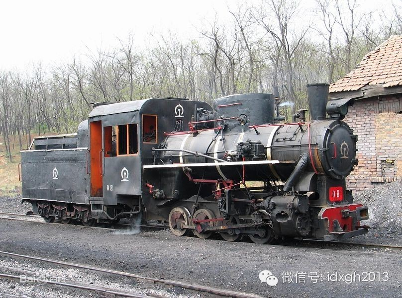

**在很多人的职务作品之外，都有一个自由的无疆之国。“大象专栏”特为此设。所有文章，编辑部不曾改动一字，它将以最自然本真的状态面见读者。这是新增栏目，每周五篇的日常更新维持不变。也很希望有朝一日，您能成为大象的专栏作者。**

  

文/黄章晋

    

如果将来我有钱了，我要在人烟稀少的地方自建一个大宅院，院子中央停一台不朽的蒸汽机车。

  

我四岁时第一次见到火车，那是在乌鲁木齐郊外，当时我只知道回内地探亲要坐火车，但对火车毫无概念，我正和父母跨越铁道，火车就地动山摇而来。我现在仍能清晰记得它洪
亮的汽笛、哐哐做响的金属碰撞声和留在空气中的大片水雾——这让我无比享受的刺激，虽然转瞬即逝，但重放记忆，它或许会有一部电影那么长。我记得我恐惧、激动、兴奋地
对着火车的身影喷了很多脏话。

  

在那之前，我见过的最大机器，是农场里75马力的东方红拖拉机，当它从身边驶过，我会屏住呼吸，无限敬畏崇拜地盯着它，它是机械和力量的象征——全连的人畜加一块儿也
没有一台拖拉机的力气大，而全团所有的拖拉机加一块儿，也没有一台火车的力气大。

  

我无法不崇拜火车。

  

我迷恋一切带有齿轮、连杆、螺栓的机械装置。那时农场里很少有机械车辆，每有汽车停在农场连队，它都会像肉骨头吸引蚂蚁一样招来全连男孩的围观，我无法凑近车窗看驾驶
室，只能蹲下来看汽车底盘，好奇它为什么能走动。

  

拖拉机、汽车的机械传动部分都被铁皮和金属铸件包裹得严严实实，后来我翻看父亲手中彩色的汽车维修手册，才明白它是怎么回事。但蒸汽机车不同，它巨大的传动连杆全部裸
露在外，就像一个后盖被打开的钟表，不但如何运转让人一目了然，更能直观地展现机械运转之美。

_前进型蒸汽机车曾是中国铁路的主力蒸汽机车_

    

那年探亲，几个月时间满眼都是火车，我努力记下每一个细节，一直享用到8年后我再次见到火车。我迷恋与火车有关的一切，那时我有不差的绘画天赋，笔下除了动物，便是记
忆中的火车，我甚至因此对辽宁省有特殊的好感，在分省中国地图册上，辽宁的铁路线密集如爆炸的球形闪电。

  

在我看来，一个完美的省份，铁路线要像辽宁一样；而一个完美的城市，要像武汉一样，至少有两座公路铁路共用跨江大桥，火车站最少要四个。后来某一天，少年宅男看到《人
民铁道报》介绍，中国铁路里程居然比印度还少，立即有了成为党和国家领导人的宏伟理想。如果愿望实现，我会下令在北京刨出一条宽度为三公里的人工河，——没有跨江铁路
大桥的城市是没有资格成为首都的。

  

我们家迁到湖南后，鬼使神差地落户一条地方铁路。但我第一次见到“自己”的火车时，失望到了伤心的程度，它是762毫米的窄轨，蒸汽机车是石家庄产的，它不是准轨蒸汽
机车的等比例缩小，驱动车轮直径不超过40公分，功率仅300马力，完全是个拙劣的玩具。

_石家庄生产的C2型762MM窄轨蒸汽机车_

  

好在，我中学离火车站很近，中午课休时间和晚上自习之前的空余时间，我会长时间蹲坐在车站看火车，仔细触摸它巨大而粗燥的肌肤。我能记得每一种车头的细节，比如绘制东
风4型内燃机车时，车身侧面每个散热窗的叶片数目，我是绝对不会弄错的。

  

真正让我着迷的，还是蒸汽机车，它体现的是第一次工业革命时代的大机械美感，甚至是这个时代机械之美的极致。而内燃机车和电力机车，体现的都是电气时代的工业之美。后
者的极致，是日本新干线上跑的机车，我从来不曾对它着迷过。

  

但到了1980年代，京广线上的蒸汽机车已经非常少见，我虽然知道它的功率远不及各式内燃机车，但依然认为它才是机械力量的象征，每次听到蒸汽机车特有的汽笛声，就如
冷兵器时代的退伍骑兵被远方动地而来的战鼓召唤，周身热血奔流。

  

再然后，我忘记什么时候开始，蒸汽机车在我的世界里消失了。

  

2008年，我曾因为采访任务有机会在沈阳短暂停留，但在我规划的行程中，参观蒸汽机博物馆被排在采访任务之前，只可惜到了沈阳我才得知，老的机车博物馆正好拆迁，那
些机车不知道在什么地方。

  

痴迷蒸汽机车之美的人远不止我。我相信俄罗斯电影《边疆》的编剧、导演是更狂热的蒸汽机车爱好者。辽远荒芜的西伯利亚、坚毅的退伍老兵、流亡的德国姑娘、蒸汽机车的追
逐……我心中那些过时的审美口味，都在这部电影中被极致阐释。

  

那部片子中的男主角，在我见过的所有荧幕硬汉中，是最合我心意的一个。他不是肌肉男，也不够酷，但他是那种将来有一天老了，即使行动蹒跚，肢体僵硬，也会像蒸汽机一样
，依然有骨头是骨头、肌肉是肌肉的力量。

  

从第一次见到火车起，我就无数次想象过自己穿着蓝布工装、油腻腻的双手紧握工具的光辉形象，从来没想过我会如今天这般沦落，每天对着电脑屏幕打字度过余生。

  

如果将来我有钱了，我要在人烟稀少的地方自建一个大宅院，院子中央停一台不朽的蒸汽机车。

  

  

  

大象公会：最好的饭桌谈资，知道分子的进修基地。

[大象公会所有文章均为原创，版权归大象公会所有。如希望转载，请事前联系我们：idaxiang@idaxiang.org ]

[阅读原文](http://mp.weixin.qq.com/s?__biz=MjM5NzQwNjcyMQ==&mid=10231231&idx=1&sn=
e3f5e8a932f3bd041e7ee2d3dcd36a0f&scene=1#rd)

