**“屙屎巷”曾遍布香港的华人区。工业革命前，东亚地区大城市的人口规模远超同期的欧洲，但易通过粪便大规模传播的疾病却很少出现。1949年后，拾粪曾被拔到难以想象的高度。时至今日，在中国乃至发达国家内部，“厕所文明”的落差仍然存在。**  

文/杜修琪

让孩子在香港当街小便的大陆夫妇或许没想过，150年前，英帝国主义政府曾针对香港华人下令，禁止随地便溺。不过，当时港人并无今天的卫生习惯，“屙屎巷”遍布华人区
。

  

1881年，英国工程师奥斯瓦尔德**查德威克在对太平山等华人居住地的考察报告中写道：“在香港，通行的粪便处理方法采用中国传统的运粪桶，掏粪工用手处理粪便，没
有消毒，没有除臭”。而此时，香港的欧洲人住宅区已配备了冲水厕所和下水系统。

  

糟糕的卫生条件和拥挤的住宅，为流行病提供了土壤。1894年，太平山区域爆发黑死病，3000人因此死亡。港政府废弃了太平山的全部住宅，将华人迁入卜花公园修建新
的街区，并在此处修建了香港第一个现代公共厕所和浴室。

  

不过，当欧洲人掩鼻走过香港街头时，也许忘记了他们习以为常的卫生条件，也不过才实施几十年。19世纪前，巴黎从窗户直接泼出粪便的现象久治不绝，架在泰晤士河堤的厕
所让低处行人和船只饱受“天女散花”之苦。

  

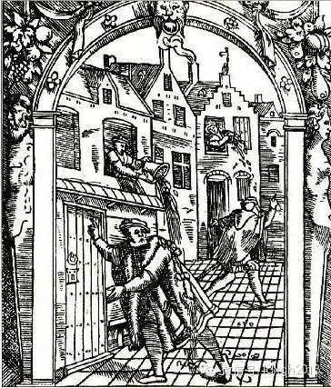_一幅中世纪的绘画，讽刺欧洲人窗口倾倒便壶的行为_

【昙花一现的文明】

人类最早的厕所出现在美索不达米亚平原。那是个相当简单的设施：地面上的一个孔洞，通向地下放置的可移动的罐子。相对野外随地解决，这种简易设施完成了一个飞跃：将排
泄物置于可操作的范围，改善了定居点的环境。

  

更复杂的设备在公元前2000年左右的克里特岛出现。克诺索斯宫殿里，米诺斯文明留下了古代的冲水坐式厕所——将木制座位修在排水渠之上，由仆人担水倒入沟渠，冲走秽
物。这种设备产生了厕所思路的第二次飞跃：通过水，而不是人工，来运走排泄物。不过，这种设施在当时相当昂贵，仅仅是王室能够享用。

  

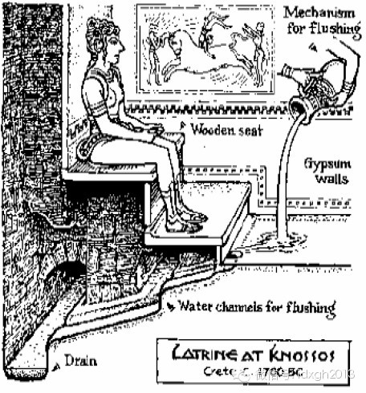

_克诺索斯时期带排水渠的坐式厕所的还原图_

罗马人比米诺斯的宫殿更进了一步。厕所建在剧院或者会场附近，通常座位在十个以上。与我们现在重视隐私等观念不同，罗马厕所是社交的场所，它没有隔间，不分男女，市民
们在座位上相互交谈，策划活动，完事儿后用一端裹着海绵的木棍沾着一条小水渠的水清洗私处。当然，对于友好而爱好交往的罗马人民，这根木棍肯定是分享公用的。

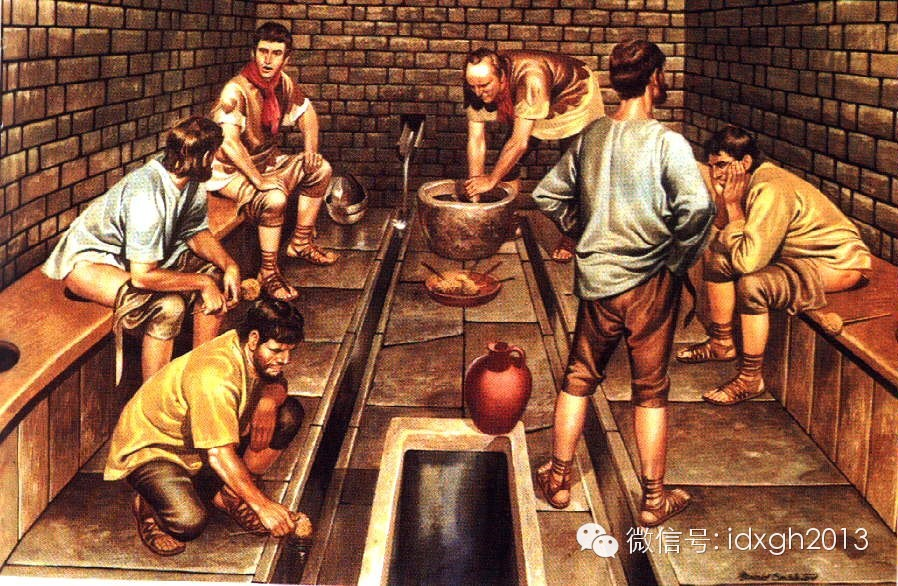

_普通民众更多使用壶和罐。_

  

不过，这种水渠耗费巨大，只有公共场所和达官显要才能接通。普通民众更多使用壶和罐，然后再倒出。这与同一时期的中国城市是类似的。

  

罗马人创新的公厕传统被北方日耳曼蛮族入侵打断。蛮族没有领会沟渠的作用，厕所再次变得粗糙。但是他们提供了关于厕所的一些新点子，英格兰约克郡的一幅画显示，海盗如
厕后用一片苔藓擦拭臀部。而其后发展起来的修道院中，僧侣们选用粗布毛料。

  

中世纪时，人们在城墙突出处搭建厕所，供公共使用，粪便从高处坠落下去，再有耙粪工在夜间运走。城内的排水沟为明沟，设计上有问题，垃圾秽物常将其堵塞，污水四溢。人
们虽然没学会罗马人的供水技术，却沿袭了他们的恶习：从窗口倾倒夜壶。17世纪时，凡尔赛市长颁布了一项严肃的法令：

“禁止所有人将人体排泄物及其他垃圾直接扔出窗外”。

【东亚式的绿色文明】

人口密集的东亚地区则是另外一种情形。

  

由于粪便被视为恢复土地肥力的重要来源，东亚地区的厕所文明是绿色环保的，从未出现过西式水冲厕所这种浪费的发明。

  

人的粪便除了用于土地，还曾做为猪的食物。中国古代曾将厕所建在猪圈之上。这种绿色环保观念，甚至在早期的帝王那里亦有体现。汉初，皇室厕所下的粪坑依然是与猪圈连在
一起的，汉景帝刘启（前188年-
前141年）陪爱妃贾姬如厕时，野猪居然冲进厕所惊动御驾。而悲剧的是公元前581年，病重的晋景公姬獳如厕，不慎失足掉进粪坑，淹死后才被手下发现。

  

到了汉末，帝王失足粪坑里的不幸就不再会出现。帝王们多用封闭的马桶，其形制和礼仪不断登峰造极，帝王权贵如厕，要更衣、焚香，旁边要有多人陪侍。马桶底下多铺设香木
制成的炭灰，为除臭、无声穷尽了想象力。史料中偶尔出现的蹲坑式厕所，往往是用来描述其极尽奢华的，譬如下铺羽毛，甚至是蝴蝶翅膀。

  

中国历史上马桶最讲究的是后蜀亡国之君孟昶（919年―965）。他的便盆是镶有七彩宝石的黄金制成，宋太祖赵匡胤缴获孟昶的战利品后，曾感概这种皇帝如何不亡国。

  

清末，西方的冲水马桶传入中国，但最早接受它的不是皇室，而是华洋杂处的上海富商。袁世凯称帝后，对西式马桶相当不感冒，认为有气味，还是觉得中国式木桶更享受。

  

古代中国人口较密集的城市，有专门收集粪溺的人力车或牛车，定时沿着街巷挨家挨户转一圈，接过妇人们手中桶形或盆形的木质便器后，将之转运郊外，再转卖给需要粪肥的农
民。

  

早在北宋时期，汴梁等大都市就出现了公共厕所，这种由专人管理的公共厕所，几百年后才在欧洲出现。这类公共厕所很多是收费的，为招徕顾客，有些甚至会在墙壁上张贴字画
。粪肥的收入加上厕所门票，使得投资建厕所是门有利可图的生意。

  

日本的情形与中国相似。18世纪中期，大阪已产生了粪便的产权，出租，转卖等权利。住在居民大便的所有权属于房东，小便属于租户。

  

在工业革命前，东亚地区大城市的人口规模远远超过同时期的欧洲，因为粪便被收集用于施肥的缘故，虽没有下水系统，但大城市依然能管好旱厕，在欧洲易通过粪便大规模传播
的疾病，很少在东亚的大城市出现。

  

不过，到了清代，在缺水且人口规模巨大的北京等城市，粪便问题开始变成灾难。由于厕所皆收费，从达官贵人到贩夫走卒，都习惯了随地便溺。官方虽有整风运动，但北京事实
上成了一个巨大的露天厕所。

  

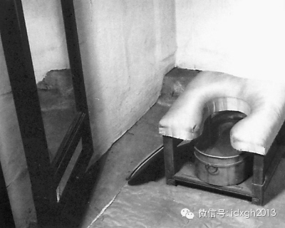

_故宮收藏的清代马桶_

_  
_

在农村，这从来不是一个问题，家家户户都有简易的茅房。对田产较多的家庭来说，自家的粪便甚至不够用，所以专以拾粪为业的人，只能收集狗粪、牛粪。东亚精耕细作社会，
粪便很难带来大面积的环境灾难。毛泽东的“千村霹雳人遗矢”，从来不是东亚的常态。

【把全城的厕所连起来】

欧洲城市规模长期不大的局面被工业革命打破，大批人口涌进城市，人畜粪便开始成为环境灾难。拥挤与肮脏为疾病传播提供了土壤。

  

这个时期，抽水马桶出现了。和米诺斯宫殿的冲水设施一样，抽水马桶最初也是贵族玩物。

  

16世纪末期，英格兰的约翰**哈灵顿爵士制造了两个抽水马桶，一个给自己，一个送给了伊丽莎白女王。他的设计由水箱放水清空便池，但没有水阀，没有阻隔下水气味的设
计，没有配套的管线。当时的贵族更喜欢封闭式马桶——将夜壶置于木盒内，盖上盖子。法王路易十四就喜欢坐在豪华的封闭马桶上，接见大臣。

  

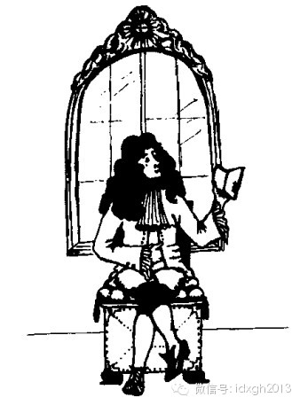_坐在封闭式马桶上的路易十四_

__

1775年，第一项现代意义的抽水马桶专利才由亚历山大**卡明斯发明。经过其后杰宁斯，克拉普尔，杜爱福等人的不断改进，抽水马桶变得方便而便宜。这时，经历了黑死
病，霍乱等疾病的伦敦意识到卫生的重要性。有识之士不断呼吁改善城市卫生条件，地下管道不断拓展，抽水马桶替代了脏臭的便壶，粪坑，走入平常市民家中。

  

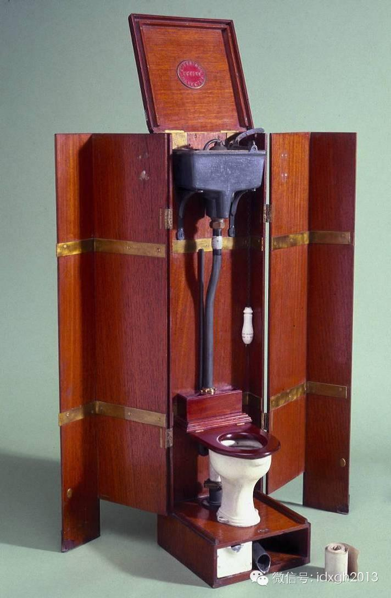

_亚历山大**卡明斯1775年发明的抽水马桶_

__

但历史和人们开了一个不小的玩笑。人们用更新的技术将脏物清出室内，却不加处理全部排到了泰晤士河中，同时，而泰晤士河依然是市民饮用水源，这给霍乱病菌跨区域“扩大
再生产”提供了机会，反而促进了疫病流行。

  

直到19世纪后期，欧洲的流行病学发展起来，人们才意识到病菌与饮用水之间的联系。英国人开始将排污管线加以处理，布置在饮用水管线下游，抽水马桶被这些看不见的管线
连接起来。

  

正是有了城市一体化的排污系统工程，才使得抽水马桶有了革命性的意义，成为西方现代文明的象征。

  

1870年后，抽水马桶迅速在美国流行起来。之后的一个世纪，随着欧洲国家和美国在全球的强势地位，抽水马桶与下水系统作为现代公共卫生的标准设施，扩展到全球的城市
中，而东亚农耕式的“自然肥”处理法也因为化肥的出现、农业的变革而萎缩，最终统一于欧洲的卫生习惯中。

  

解决粪便问题的现代公共系统肇始于欧洲，牲畜数量也是一个特殊原因。人口密集的东亚地区很少有牛马等大型牲畜，而在欧洲，牛马的粪便才是土地施肥的主角。

  

由于拥有数量极为庞大的马匹，它对欧洲城市造成的粪便压力远远大于人口规模相当的东亚城市。十九世纪末的纽约，大约有20万匹马，它们每年排泄的粪便数量高达40万吨
。

__

【到哪里找厕所】

中国城市四处便溺的现象在1949年后得到极大改观。它或许得自中共领导人注重卫生的习惯。延安时代，毛泽东外出散步时，卫士李银桥会扛着铁锹走在身后。但中国解决之
道与众不同，采取的是公共厕所和全民拾粪相结合。从官方宣传看，后者似乎曾起过更大作用。

  

1949年后，拾粪长期被拔到难以想象的高度。1959年10月，刘少奇不但称掏粪工时传祥和他同为“人民勤务员”，还把13岁的女儿送到时传祥的队伍体验生活，北京
副市长万里更亲自背粪。

  

在上海，1952年前，市区的环卫工人推着木轮粪车，幺喝着到里弄收倒马桶。1958年开始，干部、群众积极参加积肥活动，支援农业生产。环卫专业队伍为收集流失肥料
(即倒入阴沟内的人粪尿)，避免新的污染，动员居民的痰盂粪尿上车，或在小便池旁建造蓄尿池和小倒粪口，让居民倒痰盂粪尿。1960年，上海市静安区环卫部门在梅家桥
建造一座综合厕所，既可大小便，也可让居民倒马桶。

  

就在这一时期，雷锋曾创造了不可思议的拾粪奇迹，在抚顺、营口每天拾粪300斤。1970年代末以前，大部分中小城市的学生，每年寒假都有拾粪的任务。

  

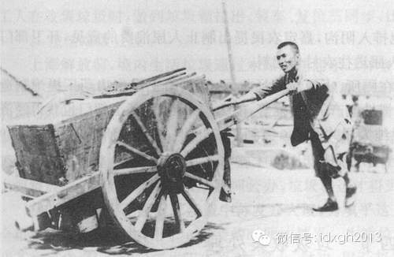

_工人手推木轮粪车上码头卸粪（图片来源：上海市地方志办公室）_

_ 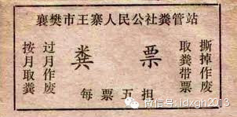_

_曾经的粪票。_

  

由于当时中国流动人口被抑制，加之全民狂热的拾粪热情。城市的公共厕所并不多，它主要集中在有围墙的单位。中国城市大部分家庭都没有厕所，单位的公厕成为企事业单位社
会化的标准配置。

  

除了办公区和居住区很容易找到厕所外，单位内部招待所附近也必有厕所。在1970年代，有些小城镇的单位招待所门前，甚至会有一口大缸，供晚上不愿打着电筒找厕所的住
客小便之用。

  

当时的中国城市，虽然沿着街道很难看到厕所，但在城市陌生地段找厕所却有诀窍：先找到附近最近的单位大门，再找办公楼或招待所，厕所必在附近。

  

只有在体育场馆、广场等经常出现大型集会的场所附近才容易找到公共厕所。但在特殊时期并不敷用。北京在举行各种庆祝集会时，长安街和天安门附近可以魔术般长出很多临时
厕所——有些人行道下面是为此考虑而特制的沟槽，在上面很容易搭建不起眼的临时厕所。必要时，临时厕所可多达123座以上。

  

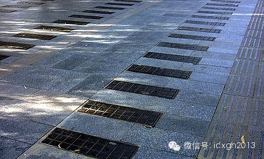_天安门广场东侧的沟槽设计，必要时可做临时厕所。_

_ 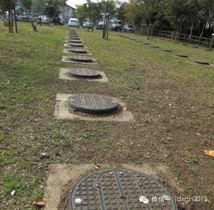_

_日本灾后应急方案：下水道井盖可迅速变为公共厕所_

_  
_

1980年代前，中国大部分城市的公共厕所依然是旱厕，虽然它们早已不再承担集中农田肥料的功能。1980年代末，中国城市居民住房条件突然改善，厕所开始进入家庭，
它导致单位在扩建居民楼时，大量拆除了公共厕所。  

  

残存的公共厕所这时开始才普遍改为水冲式。其典型设计，是一条可人力控制冲水或自动定时放水的水槽替代了粪坑。到了1990年代，它才开始被蹲式马桶替代。

  

在城市公共厕所大幅减少的同时，流动人口却剧烈增长，公共厕所短缺成为频繁出现的公共议题。于是第一批收费公共厕所应运而生。不过，在大都市人群密集的地段，依然难以
看到它们的踪影。

  

‍‍1995年1月，《中国青年报》曾在《北京最后的粪桶》中介绍过北京掏粪工。几年后，北京公布兴建公厕计划，天文数字的造价曾引起外地广泛愤懑。‍‍初次从小地方
来北京的人，亲眼见到的“厕所文明”，与如何找厕所一样，都大大超出了他们的经验。

  

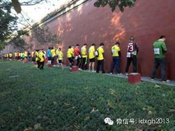

_2013__年北京马拉松比赛中，因流动厕所不足，不少选手“尿红墙”。_

“厕所文明”的落差在发达国家同样存在。英国《金融时报》记者吉莲**泰德曾对比过她工作过的东京与纽约的“厕所文明”：日本写字楼中的公共厕所干净整洁且对所有人开
放，而在纽约，很多写字楼的公共厕所位置是被人租下来上锁的。

  

她的解释是，日本是个高度均质化的单一民族社会，人们有高度相似的行为习惯，无须担心有人不懂规矩破坏卫生，而纽约则是个习惯差异极大的多元社会，讲究卫生的人，永远
要面对不懂规矩的陌生人。

  

纽约的“厕所文明”落差，自然远远不及今天的中国。大都市有些公共厕所已进化到有免费手纸、擦手纸、烘干机，而多数中国人依然需要提醒“便后冲水”。中国社会的“厕所
文明”落差之大，也许只有多数国民尚未养成进厕所习惯的印度略胜一筹。

  

硬件上，香港也许是今天世界“厕所文明”的最高级。

  

列宁曾在《论黄金在目前和在社会主义完全胜利后的作用》这样畅想过：“我们将来在全世界范围内取得胜利以后，我想我们会在世界几个最大城市的街道上用黄金修建一些公共
厕所。”黄金厕所没有在莫斯科、平壤或北京出现，而是2001年在香港诞生，出资建造者林世荣特意在黄金厕所摆放了一套《列宁全集》。

  

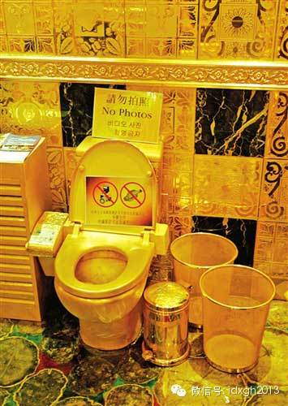

_香港金厕所内景。_

在开放“港澳自由行”之后，每天从内地汹涌而来的人流进入拥有黄金厕所的香港，将香港境内“厕所文明”的落差，迅速放大到超过北京、上海、广州的程度——就像东京的“
厕所文明”瞬间降到了纽约。

  

大陆客让小孩当街便溺事件后不久，有人用google地图证明，在便溺现场，500米内其实有很多个厕所，并不需要排队。但是，对大多数今天的中国人来说，在旺角西洋
菜南街找到500米内的其他厕所，并不比找到直线距离只有2200米的那家黄金厕所更容易。

  

[大象公会所有文章均为原创，版权归大象公会所有。如希望转载，请事前联系我们：bd@idaxiang.org ]

———————————————  

**大象公会订阅号的自定义菜单上线了，左边是官网文章精选，右边是大象公会官方微社区，点击进入来吐槽发帖吧！**

**  
**

  

[阅读原文](http://mp.weixin.qq.com/s?__biz=MjM5NzQwNjcyMQ==&mid=201809266&idx=1&sn
=67c0c6dd85eccd11537a587eb35dde00&scene=1#rd)

