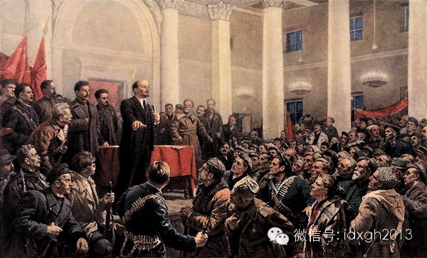
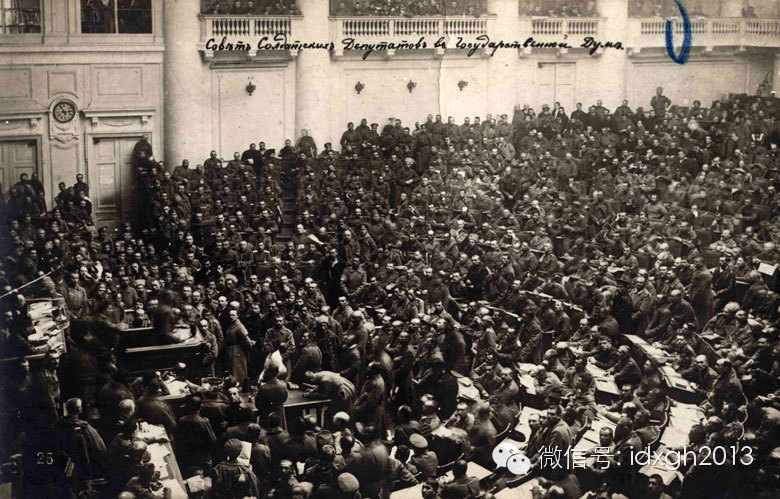
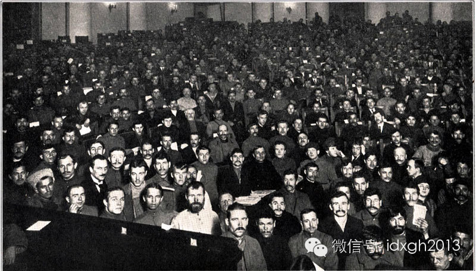
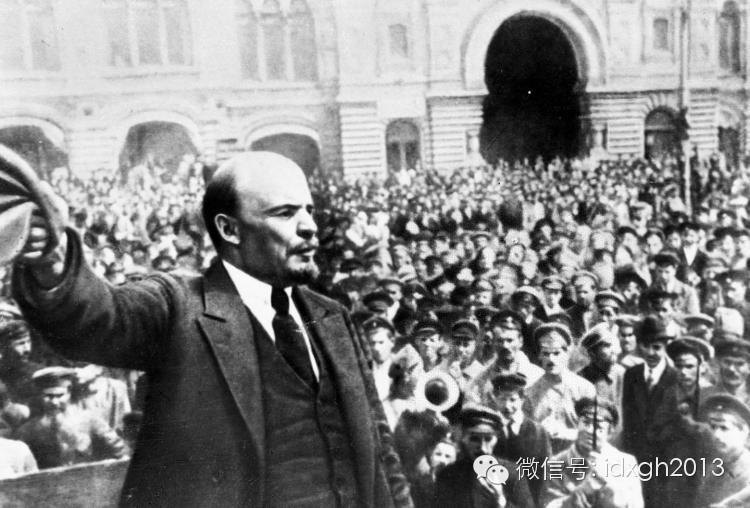
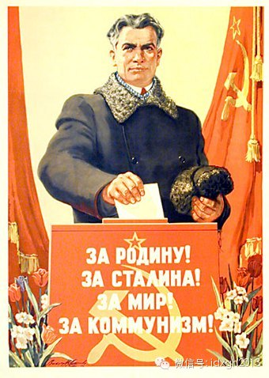
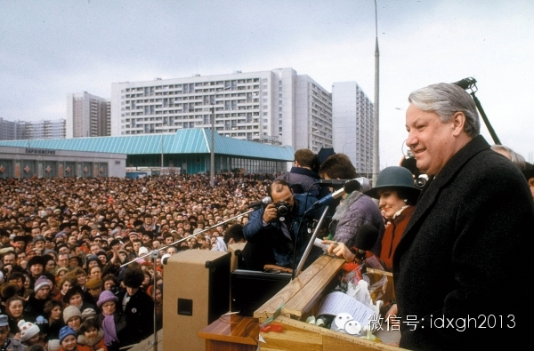
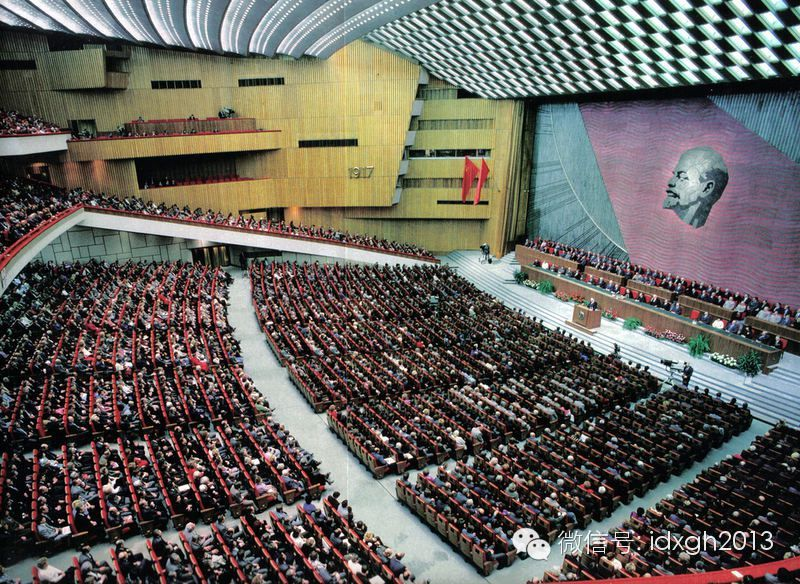

**苏联红色政权的建立始于“一切权力归苏维埃”。为体现苏维埃选举过程中的民主，苏联政府甚至一度联系美国公司，打算进口大批秘密投票设备。但苏维埃制度的民主监督最终仍有名无实。**

文/方亮 黄章晋

叶利钦也许是社会主义国家中第一个为争取全国人大代表选举资格而放弃部长职位的高级官员。

  

1987年11月，叶利钦被免除莫斯科市委第一书记，改任苏联国家建设委员会第一副主席（相当于建设部副部长）。1988年12月，叶利钦突然宣布辞职，以普通公民身
份参选苏联人大代表——此前它还叫苏维埃代表。

  

列宁曾有过“一切权力归苏维埃”的口号，它传遍半个地球，只不过，在漫长的苏联时代，无论是苏维埃代表还是人大代表，实际只是人肉投票机，连当时中国官方都挖苦这种人
民代表是政治花瓶。

  

只不过，叶利钦踩准了历史时点，他顺利当选人大代表，并继之成为俄联邦最高苏维埃主席后，实现了政治大翻身，最终亲手埋葬了苏维埃制度。

【三权分立的反动】

苏维埃即俄文COBET的译音，有“代表会议”或“会议”之意。

  

第一个苏维埃在1905年3月8日成立于斯维尔德洛夫州阿拉巴耶夫斯克市，但弗拉基米尔省的伊万诺沃-沃兹涅先科被视为苏维埃的真正诞生地。1905年5月15日，当
地3万纺织工人罢工，提出实行八小时工作制、提高工资、成立议会、增加民主权利等要求。为便于谈判，工人们选出了自己的代表苏维埃。

  

纺织工苏维埃成功的示范效应，让更多工厂、村镇、部队甚至哥萨克群体中出现了苏维埃。尤其是女性、少数民族、各党派等在沙俄不享有选举权的群体，也在苏维埃中拥有表达
意见甚至被选拔的机会。

  

在俄文材料中，苏维埃诞生方式普遍用“избирать”这个动词来描述，意为“选择、选拔”，既非严格意义的选举，但又带有直接民主的特征，而严格意义上的“选举（
выборы)”则要等到1937年在斯大林的授意下才出现。苏维埃的选拔特色，是特殊情景下为短时间找到工人代言领袖的权益之计，带有“议行合一”特征，并无权力监
督等选举层面的内涵。

  

1917年推翻罗曼诺夫王朝的“二月革命”爆发时，全俄境内已出现800个苏维埃组织，推翻沙皇后，这些苏维埃又通过第一次全俄大会建成了全国性的工人士兵苏维埃组织
，它掌控了大量要害部门。由于苏维埃“议行合一”的特征，它不但与“国家杜马”（议会）形成两个议会并存，还与临时政府形成两个权力中心并存的局面。

  

苏维埃的“议行合一”特征，颇符合马克思的想法。马克思在总结巴黎公社经验时，提出了无产阶级国家形式的设想：“公社不应当是议会式的，而应当是同时兼管立法和行政的
工作机关。”在革命导师看来，“三权分立”是虚伪的，议会的专职化必然导致官僚化且不利于人民监督。

  

列宁对苏维埃制度更是大为推崇，认为这是俄国人独创的社会主义国家形态，苏维埃将“把立法职能和执行法律的职能在选出来的人民代表身上结合起来”，优于西方议会制千百
倍。尤其是苏维埃代表能亲自制定和通过法律，亲自执行法律，亲自检查执行结果，亲自对选民直接负责——它是“工作机构”而不是“清谈馆”。

  

1917年4月，列宁提出“全部政权归苏维埃”的口号。不过，当时俄国人普遍期待制宪会议以合法程序产生新政权，更重要的是布尔什维克还未掌控苏维埃。第一次全俄苏维
埃1090名参会代表中，布尔什维克只有105人，大会最高领导机构——320人的全俄执委会中，布尔什维克也只有58人，列宁英明地没有贸然反对制宪会议，而是等待
其暴露反动和虚伪本质。

  

俄历1917年11月7日夜，即全国第二次苏维埃大会开幕前一天，列宁巧妙发动推翻临时政府的武装革命，因为这天是俄历10月25日，故称“十月革命”。当晚，列宁在
大会上当选苏维埃人民委员会主席，布尔什维克成功控制了苏维埃，建立“工农临时政府”，随后宣告各地全部政权一律归转工人农民士兵代表苏维埃。

  

_1917年，彼得格勒的一次集会。_

_第二次全俄苏维埃会议。_

_  
_

新政权立即要求召开制宪会议，11月12-15日全俄选举投票，但投票结果充分显示了民主制的反动虚伪本质，布尔什维克在707个席位中只得到175席，占24.7%
，而社会革命党得到410席，占据了压倒优势。

  

“一切权力归苏维埃！”1918年1月5日制宪会议当天，列宁下令彼得格勒戒严，解散制宪会议，镇压了不明真相的游行群众，俄罗斯陷入全面内战。

  

_1919年5月25日，列宁在莫斯科红场向部队讲话。_

  

战争结束后的1922年12月30日，苏维埃社会主义共和国联盟首次苏维埃代表大会在莫斯科召开，俄罗斯、南高加索、乌克兰和白俄罗斯四个苏维埃国家宣布组成新国家：
苏维埃社会主义共和国联盟，苏俄由此改称苏联。苏维埃不但是红色政权的组织方式，也是未来全球无产阶级国家的理想——每诞生一个新的苏维埃政权都可加入苏联。

  

1927年11月21日，彭湃领导的广东海陆丰起义建立了“海陆丰苏维埃政府”，苏维埃制度进入中国。但早期最著名的苏维埃政权是苏兆征领导建立的“广州苏维埃政府”
。张国焘在回忆录中提到，由于这个缘故，无法理解“苏维埃”的农民，对它有各种奇怪的解释，比如按皇帝死了儿子接班的逻辑，认为苏维埃是苏兆征的儿子。

【至高无上的投票机】

十月革命后，苏维埃制度的基本构架定型。苏维埃分为两个机构，一个是国家最高权力机关——苏维埃代表大会，闭会期间，由中央执行委员会代行其行使立法、执行和指挥权，
一个是由苏维埃代表大会选举产生的人民委员会，相当于政府，其下各部称为XX人民委员部，负责人称为人民委员。

  

1936年，中央执行委员会改名为最高苏维埃，1946年，人民委员会改名部长会议，人民委员改称部长。

  

至于苏维埃本身，1918年的宪法中，它叫全俄工农红军及哥萨克代表苏维埃，1936年叫劳动者苏维埃，1977年又叫人民代表苏维埃，都被宪法明确为国家最高权力机
关（苏联时代最高苏维埃分联盟院和民族院两部分），所不同的是前者为4年一选，后者为5年一选。苏维埃名称的修改充分显示了苏维埃制度对社会主义不同阶段的适应性。

  

不过，苏维埃制度自红色政权建立之日起就已名存实亡。除了党代会代表和各级苏维埃代表外，干部并非选举或选拔产生，而是由党掌控的人民委员会任命、委派。列宁指出，选
举和非党的会议有被资产阶级利用的可能，并批判主张选举产生干部的人有工团主义倾向。

  

对苏维埃这一实质性的变化，列宁解释道，由于俄国文化落后，所以苏维埃是“先进阶层对劳动群众实行管理，而不是劳动群众来实现管理的机关”。但相比资产阶级的议会民主
制，“苏维埃政权在原则上实行了高得无比的无产阶级民主。”

  

对苏维埃的改造，是列宁通过改革苏维埃代表产生的组织和程序来完成的。

  

首先是代表制，列宁认为，地域代表制是议会民主制的弊端，苏维埃代表被改为生产单位代表制，它使得代表人选完全由基层党组织决定。另外，城市工人与农村的代表名额比例
不同，前者是后者的5倍。

  

其次，人民代表都是兼职的，每年只有几天会议，实际权力牢牢掌握在中央执行委员会。苏维埃彻底变为人民委员会的表决机器。斯大林当政后，各级苏维埃相当于常委会的机构
本身也成了闲职，权力完全集中于苏共各级党委。

  

1936年斯大林主导修改宪法，大幅改变了苏维埃制度——人民委员会即不再行使立法权，立法权与行政权分离，这与列宁的主张已有很大分别。

  

苏维埃代表产生的单位制被改为选区制：联盟院按人口产生代表，超过30万即为一个选区，产生一名苏维埃代表。而民族院的选举则以每个联盟共和国25名代表，每个自治共
和国11名代表的原则选举。

  

这次宪法体现了更高的民主性，秘密投票、普遍的选举权和被选举权重新成为苏维埃选举的基本特征，斯大林曾说，“我们要做彻底改革，要将公开投票变更为秘密投票，要将原
先苏维埃多层次的间接选举变成直选。”

  

为体现苏维埃选举过程中的民主，苏联政府甚至一度联系美国公司，打算进口大批秘密投票设备。为每个公民都行使投票权，工作人员甚至将投票箱亲自送到行动不便的选民家中
。

  

_苏联投票宣传画。_

  

只是，苏维埃代表的选举是没有预选的等额选举，候选人由各地党组织和社会团体协商产生，也即各级党委书记指定，选民没有候选人的提名权。

  

1936年12月12日的这次全国苏维埃代表选举，其投票率之高，甚至朝鲜和萨达姆时代的伊拉克也无法打破。为确保为每个公民都“投好庄严一票”，投票房间的门外都有
人民内务委员会的特工，苏联公民从此养成了填写好选票后才进房间，而非在房间内独自填写选票的独特习惯。

【一切权利归苏维埃】  
  

斯大林身后，苏维埃制度不断完善，增加了各种常设委员会和临时委员会，也借鉴了不少西方经验，譬如质询制度，它大大优于西方议会——不设质询提出权限，不得以任何理由
拒绝回答质询，三天内必须答复，答复后，两院联席会议要讨论决议——只是由于苏维埃全国代表大会每次会期只有三天，代表们没时间质询。

  
1977年以后，苏维埃代表候选人提名，每个选区可有多个代表名额，可实行差额选举。苏联宣传机器从此不再宣传等额选举对西方的优越性。

  
但最大的变革来自戈尔巴乔夫。1988年6月，苏共宣布放弃对权力的垄断。提出以成立苏联人民代表大会方式，改革苏维埃这个名义上的最高国家权力机构。

  
在这次会议上，71年前列宁“一切权力归苏维埃”的口号再次重提。只不过，列宁时代，其目的在于一切权力要集中在党的手中，而今的目的是使苏维埃摆脱苏共控制，成为真
正的权力机关。

  

1988年12月，最高苏维埃通过宪法修正案，第六条中苏共领导地位的规定被取消，党禁消除。苏联人民代表大会成为苏联最高国家权力机关，原最高苏维埃改为常设立法、
发布命令和监督机关。

  
为苏维埃重新赋权，不在宪法如何规定——新宪法中，无论全国人大还是最高苏维埃，其权限与原来并无差别，关键在于其运行程序，其程序上向西方议会看齐后，橡皮图章才会
变成最高权力中心。

  
新的全国人大代表2250人，按人口比例选出750人，由民族地区按固定名额选出750人，由全国性社会团体中选出750人，其中共产党占100人。候选人不再由地方
党委指定，而是西方式的竞选产生。

  
最高苏维埃代表则由全国人大从人民代表中选举产生。代表由过去每年到莫斯科开两次会，每次三天的兼职代表，变成专职代表，每年春、秋召开两次例会，会期通常持续三四个
月，使其依照宪法行使代表权力成为可能。

  

正在国家建设委员会第一副主席岗位上“冷藏”的叶利钦，敏锐捕捉到苏维埃制度这项技术变革的巨大机会。由于选举规定部长级官员不得担任全国人大代表和最高苏维埃代表，
叶利钦在通过宪法修正案后，立即宣布辞职参选。

  
1989年3月，擅长宣传竞选的叶利钦以89.4%的得票率当选苏联人民代表，实现政治大翻身，叶利钦后来回忆：“获得胜利这天，是我的第三次诞生。”

  

_1989年3月18日，俄罗斯议会选举期间，叶利钦出席由他的支持者举行的一场大型竞选集会。_

  

苏共当然知道叶利钦会在新舞台上制造巨大麻烦，为此，忠实的党员代表在苏联最高苏维埃代表选举时联合起来，在无记名投票中“干掉”了叶利钦。但叶利钦在场外拥有巨大人
气，媒体集体发难，市民发动大规模游行。最后，法学教授阿列克西•卡扎尼科主动“让出”代表资格，使叶利钦有机会补选进入最高苏维埃。

  

_1990年苏维埃代表大会。___

  

叶利钦在俄联邦苏维埃的舞台上斩获更多。1990年5月，俄罗斯联邦举行第一次人民代表大会，叶利钦以57.4%的得票率击败俄共候选人，当选俄联邦最高苏维埃主席。
利用这个舞台，叶利钦很快通过了俄联邦设置总统的全民公决，并在1991年6月12日获得这一宝座，同年12月21日，他终结了苏联，苏维埃体制随之消亡。

  

[大象公会所有文章均为原创，版权归大象公会所有。如希望转载，请事前联系我们：bd@idaxiang.org ]

———————————————  

**大象公会订阅号的自定义菜单上线了，左边是官网文章精选，右边是大象公会官方微社区，点击进入来吐槽发帖吧！**

  

[阅读原文](http://mp.weixin.qq.com/s?__biz=MjM5NzQwNjcyMQ==&mid=201710821&idx=1&sn
=1bbe101095a4462c51c77a17cdc9e2be&scene=1#rd)

