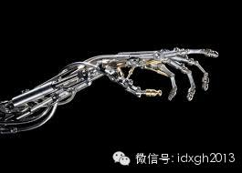

**《权力的游戏》第四季中，失去右手的詹姆换上了一只金属的假手。从罗马时代到11世纪，假肢工艺在很长时间里都没有太大变化。不过，战争成了假肢技术进步的最大推动因素。**

文/刘大可

2013年4月15日的波士顿马拉松爆炸袭击案中，年轻的舞蹈老师阿黛莲娜失去了左脚，这意味着舞台生命的终结，但一年后的今天，麻省理工学院媒体实验室为她定制的假
肢，让阿黛莲娜得以重返舞台。

  

_ 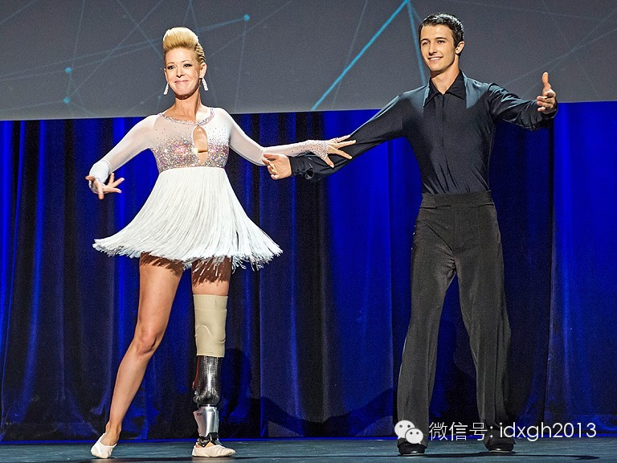__重返舞台的阿黛莲娜，在TED讲台上介绍自己的经历_

【**几千年才学会了打弯】**

世界已知最早的假肢出现在埃及。这个由木头和皮革制成的大脚趾，并非为了弥补外观缺陷——大脚趾是人体站立时重要的支点，穿上它要比不穿它站的更加稳当。有人猜测，假
肢的主人，很可能是晚期糖尿病导致的肢体末端坏死丢失了脚趾。

  

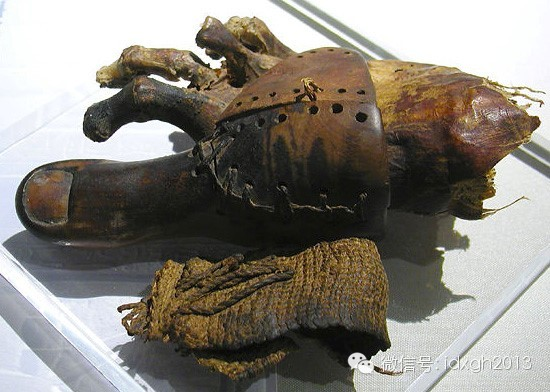_3000__年前古埃及木乃伊上假脚趾_

稍晚，在印度出现了关于假腿的记载。在《梨俱吠陀》中，记载了一个名叫“Vishpala”的女战士在战斗中失去一条腿后，神灵送给了她一条铁腿，使她能够重新奔跑。
这或许意味着在公元前10世纪写就这段文字的年代，古印度就已有过全腿假肢。而古希腊历史学家希罗多德则记载过一个失去一条腿后，给自己安上木制假腿的故事。

  

美剧《权力的游戏》第四季首集中，失去右手的詹姆换上了一只金属的假手。它与故事背景设定的中世纪基本吻合。从罗马时代直到11世纪，假肢工艺在很长时间里都没有太大
变化，通常都只是某个姿势的模型。

  

对失去肢体的战士来说，假肢往往是一个抓握状的假手以便将盾牌别在胸前；或者一个绷紧的假腿用来钩紧马镫。至于赤贫的平民和农奴，即便一个模型也太过奢侈了，他们的假
肢通常就像下面这张图这样：

  

_低地文艺复兴画家老彼得**勃鲁盖尔1568年所绘《乞丐》，现藏卢浮宫。_

画面上失去双腿的乞丐，用木棍和绳子做成高跷式的假肢拄着行走，用扮演国王、主教、士兵、商人或农民的方式，向路过的行人卖艺乞讨——高跷和拐杖，是那个时代最常见的
肢体替代品。

  

人们真正开始尝试用假肢恢复人体机能是在15世纪以后。文艺复兴以来手工艺和锻造技术的不断提高，一些运用机械结构的假肢开始出现，其中不乏惊人的巧妙设计。

  

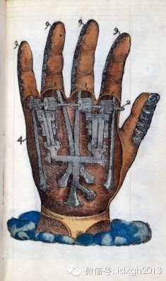

_一份1500年的假肢设计草图。_

这份金属和皮革制成的假手图纸向我们展示了文艺复兴时代最顶级的假肢工艺——那些齿轮、杠杆和铰链显然是钟表工艺发展的结果——假肢可以被调整成各种姿势。它的设计者
是著名的法国宫廷医生安布鲁瓦兹**帕雷，他服务了几代国王，在枪伤、截肢、骨折以及妇产科等方面都是奠基者，因而被称作现代外科与病理学之父。

  

不得不提到的是，15世纪到17世纪正是欧洲的大航海时代，活跃在各片海域上的海盗是当时最容易缺胳膊少腿的一群人——今天大众艺术作品中凡以海盗为主题的，往往都会
有一个戴着铁钩子假手的海盗。

  

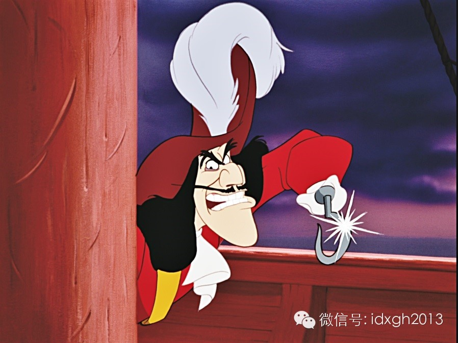_迪士尼动画《彼得潘》里的胡克船长，左手是一枚铁钩。_

然而从史料中很难找到这样的原型——事实上，铁钩子假手、独眼龙假眼罩、凳子腿假腿和肩膀上的鹦鹉，这些海盗经典形象，都只是19世纪《金银岛》等海盗冒险小说成功流
行的结果。当然，这并不意味铁钩子和凳子腿这两种假肢是杜撰，它们在历史上真的存在，或许真在海盗身上出现过也说不定。

  

木腿假肢僵硬地发展了几千年，到了波兰将领约瑟夫**萨维斯基（1777–1831）那里，才第一次可以弯曲——萨维斯基的假肢在膝盖位置上有个半活动的轴，以便腿部
弯曲。

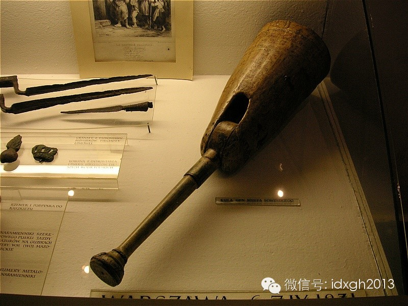

_约瑟夫**萨维斯基的假肢。_

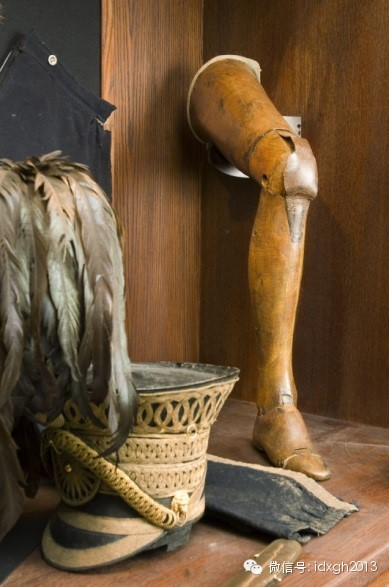_第一条安格尔西假腿，脚腕处按了一个弹簧用来辅助运动_

1800年，伦敦人James Potts设计的木制假腿又更进一步——脚踝处有个钢制的弯头结合，同时有根暗线连接着膝盖和足部，这可让使用者适应迈步，而不仅仅是
提起来踩下去。它后来的改进版因为装在安格尔西侯爵的腿上，成为世界上第一条铰接式假腿，它因之被称为“安格尔西假腿”（Anglesey Leg）。

  

工业革命后，假肢制作水准有了显著提升，尤其是在维多利亚时代的英国。有些制作精良的假肢每个关节都能活动，并通过铰链控制活动幅度，尖锐的指尖甚至可以完成某些细微
的动作，胳膊里装有弹簧，模仿肌肉的功能（下图）。

  

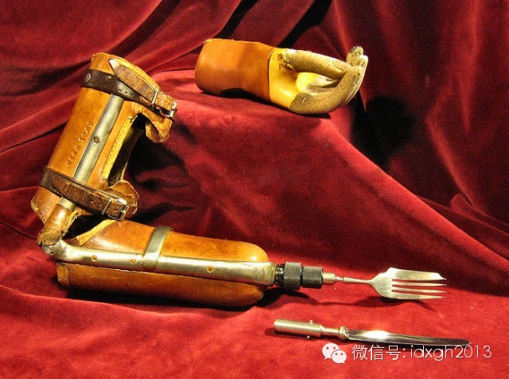_一件维多利亚时代的可更换部件假肢。_

从古埃及最早的假肢算起，经五千年的发展，假肢技术到了这一步才算是聊胜于无，但当时能用得起这些高档假肢的人大都是家世显赫的贵族。无怪乎除欧洲外，历史上大部分地
区关于假肢的记载都鲜有所闻。

  

【制造者与推动者】

从19世纪初开始，西方世界接连爆发大规模战争，从拿破仑到美国内战，乃至第一次世界大战，武器的进步和战争规模的扩大，制造了前所未有的伤员。尤其是第一次世界大战
中，武器毁伤效能和创口感染因素，往往外伤也会造成截肢。1920年《泰晤士报》报道称；“除了生命，肢体是一个人能为祖国做出的最大牺牲”。

  

如何让大批战伤截肢者回归社会，至少不至于太过累赘，成了欧洲各国亟待解决的问题。战争成了假肢技术进步的最大推动因素。

  

_ _

_沃尔特里德陆军医院正在护理的一战伤员_

在一些慈善家的支持下，伦敦的玛丽医院开始研究退伍军人的肢体残疾问题，英国很快成为当时世界的假肢设计和维护中心，到1918年已经出现了几百项专利申请，假肢生产
的重点从数量转移到质量上。

  

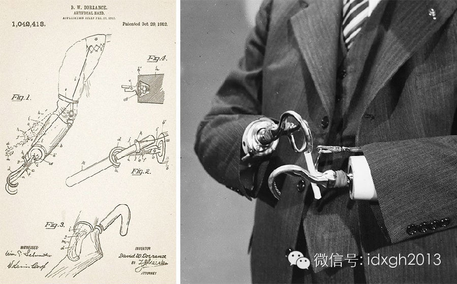_一套“Dorrance-Style”钩形假肢，上世纪20年代推出。_

上图这套钩子手假肢，早已不是海盗船长们原始的钩子手。这套1912年设计完成的钩子上劈有缝隙，足以完成许多日常工作，比如图上这位先生就在用钩子手整理香烟，他还
能将其点燃并且稳定的钳住。

  

同样的事情也发生在德国——如何让这些战争中失去手脚的人重回工厂？工业巨头西门子走在了最前面，他们制造了很多外表并不美观，但能胜任简单工业劳动的假肢。假肢材料
也由笨重的木头、金属改为轻便的塑料。

  

_ 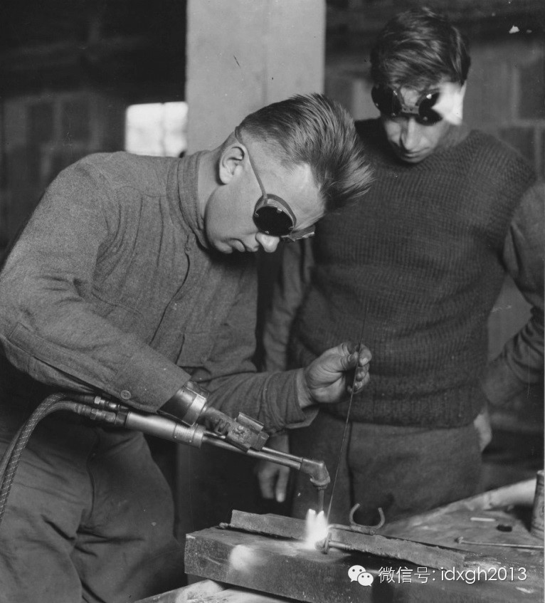_

_可以固定焊枪的金属钳口替代了这位退伍兵失去的右手。_

20世纪上半叶的两次世界大战，强化了假肢在西方社会的重要性，以至于著名美国导演汉考克曾说：“让一个残疾人重返工作岗位的意义仅次于拯救一条生命”。

  

【没有不可替换】

二战后，西方世界迎来了第三次技术革命，集成电路、合成材料、生物医学等相关领域的飞速进展让假肢技术产生了质的飞跃，幻想中的情形开始变成现实。

  

最著名的例子是2013年因枪杀女友而闻名的南非短跑运动员——“刀锋战士”奥斯卡**皮斯托利斯。他的小腿先天没有腓骨，11个月大就从膝盖以下截肢。然而凭着一双
碳纤维假肢，他不但能正常运动，甚至能以惊人的速度奔跑，是残奥会百米、二百米与四百米的纪录保持者，以至于当他想申请2008年夏季奥运会时，国际田联认为他的假肢
比健全者的双腿更有优势，取消了他的资格。

  

_ 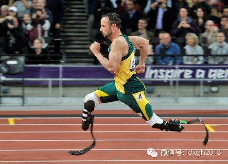_

_奥斯卡**皮斯托利斯在残奥会赛场上_

假肢比真腿还好用，难道科幻电影中的情景已经不远了吗？

  

_ 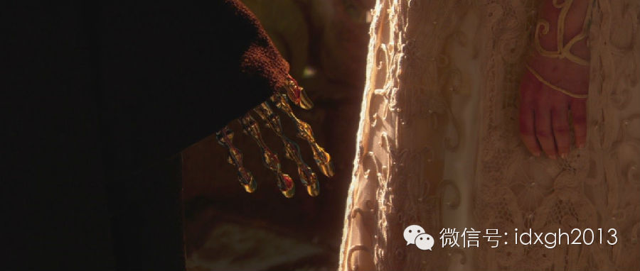_

_电影《星球大战 II：克隆人的进攻》中安纳金带着他新换的机械右手和帕米举行秘密婚礼。_

不少科幻电影中出现了能受大脑控制的机械假肢，可让人重获完整的运动机能。这需要为假肢提供神经接口以便连接中枢神经，并在假肢内的集成处理器执行神经系统发出的指令
——这看似科幻的假肢，今天已经研发成功并投向应用。

  

_ 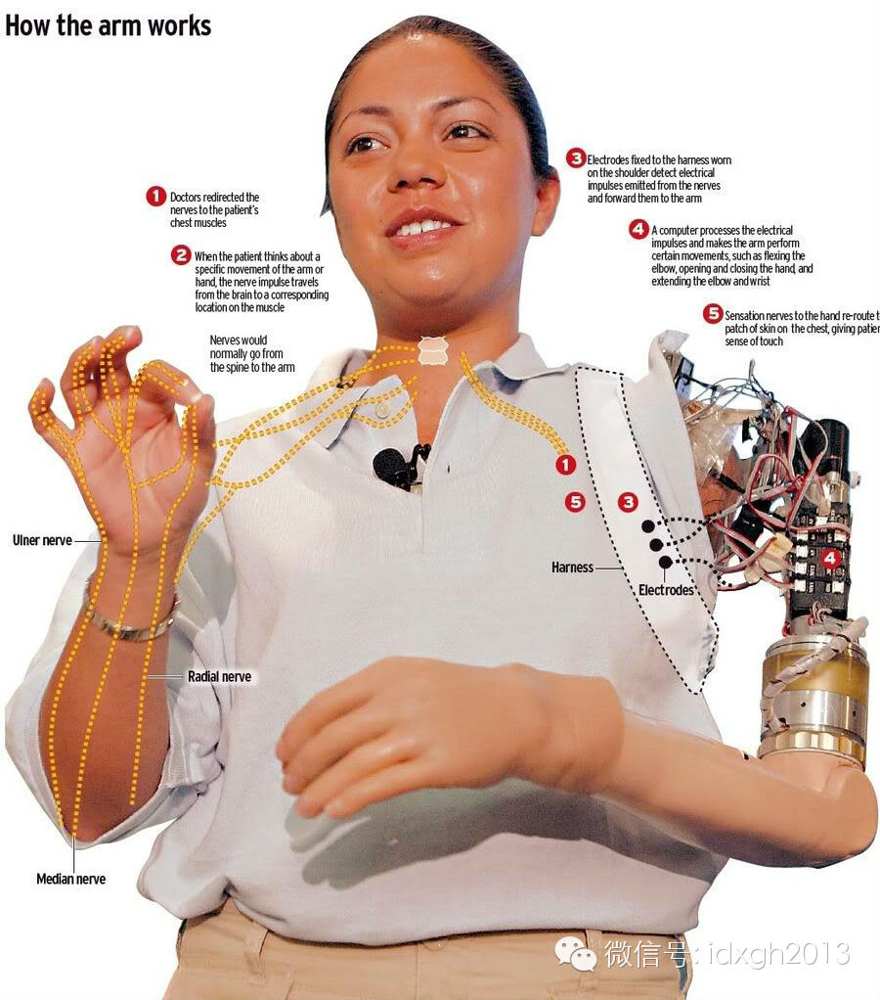_

_Claudia Mitchell__展示目标肌肉神经重建假肢（TMR）的结构。_

Claudia Mitchell女士在一起交通事故后失去了肩部以下的左臂，然而芝加哥康复研究中心开发出了一款能够与残肢中神经纤维榫接，从而接受大脑指令的新式
假肢TMR。如今她可以用假肢平稳地剥去香蕉皮。

  

与神经系统连接起来的新技术是假肢研究重点。到今年为止，最优秀的假肢已经有了触觉，能让佩戴者重新抚摸这个世界。

  

假肢的种类也有了极大扩充，过去人们只能制作不需要感觉和主动运动的体表器官，如今人类不但能制作灵活的假肢代替手脚，人工膀胱、人工心脏，甚至最精巧的人工听觉器官
和视觉器官也相继出现。

  

譬如人工耳蜗被植入颅骨深处的耳蜗内，外置麦克风收集到的声音被它传递给听神经，患者能重新听到声音。而视网膜损坏但视神经健全的盲人，今天可通过工视网膜重新看到世
界。它将一小片接收器插入眼球，连接到视网膜背后的视神经上，然后用眼睛向其中投影，亮度信号将会被接收器送给视神经，从而产生视觉，分辨率可以达到百万像素。

  

_ 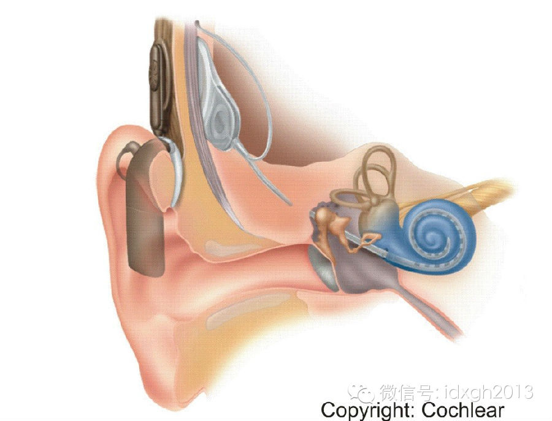_

_能让失聪者恢复听力的植入式人耳蜗。_

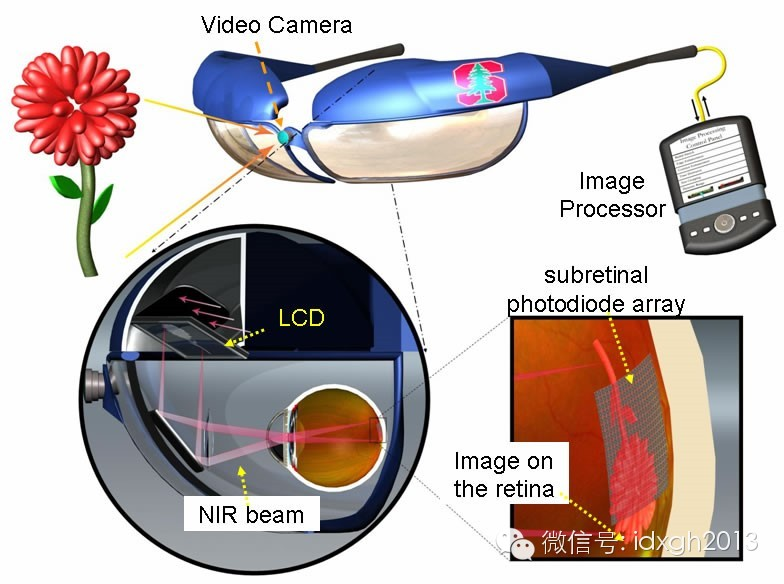

_一套人工视网膜，包括带摄像头的眼睛、处理器、插入眼球的接收器等部件。_

虽然这些技术才刚刚诞生，距大规模应用仍有相当距离，但技术的进步，尤其是电子技术和生物技术的结合，揭开了人工器官的新篇章。对那些不幸失去肢体，或肢体失去正常功
能的人，不断进步的假肢将使他们更为“完整”。

  

阿黛莲娜重返舞台只是一个开端，在或许并不久远的未来，人造肢体或许会让人具备更加强大的力量，胜任更具挑战的工作——就像《蜘蛛侠》里的章鱼博士那样。

  

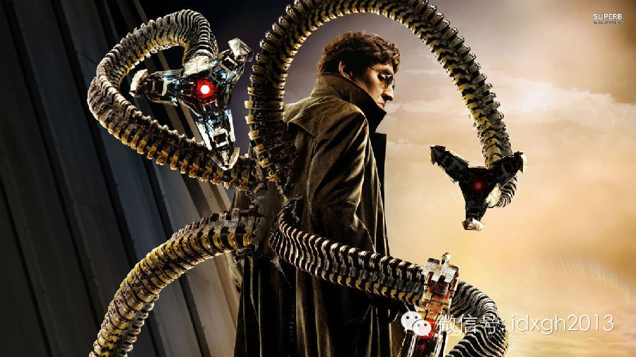

_章鱼博士：“是在说我吗？”_

  

[大象公会所有文章均为原创，版权归大象公会所有。如希望转载，请事前联系我们：bd@idaxiang.org ]

———————————————  

**大象公会订阅号的自定义菜单上线了，左边是官网文章精选，右边是大象公会官方微社区，点击进入来吐槽发帖吧！**

**  
**

  

[阅读原文](http://mp.weixin.qq.com/s?__biz=MjM5NzQwNjcyMQ==&amp;mid=201782664&amp;
idx=1&amp;sn=e338dd7a6a8615e72546fe7bfc92ae43&scene=1#rd)

