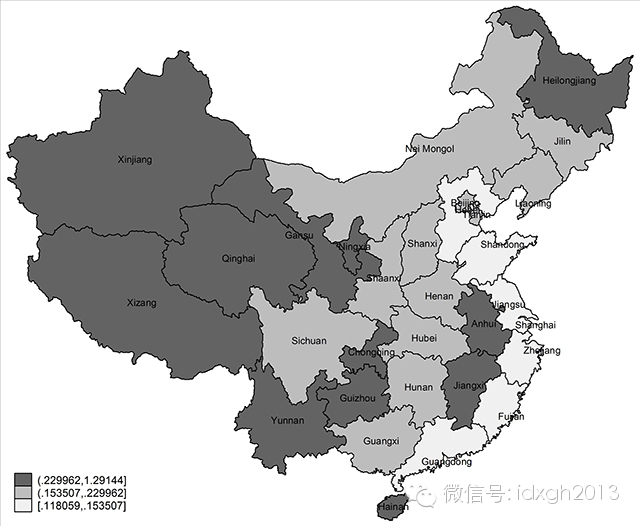
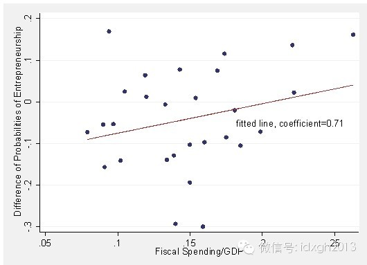
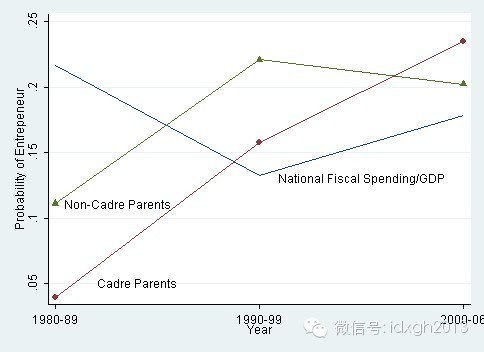

**改革开放初期，中国创业的多为普通人。而今天官二代创业意愿上升，普通子弟的创业热情却在退潮。政府规模与创业机会、创业意愿有何关系？**

文/兰小欢

我们先从一个真实故事讲起：有位在美国留学的中国年轻人想回国创业，把女性内衣品牌“维多利亚的秘密”引入中国。他家里生意做得不错，颇富有。内衣公司打听了他的家庭
背景，得知他父亲不是高官，就呵呵着没了下文。

  

我们当然不知道人家拒绝和他合作的真实原因。但这位同学阐释这段经历的方式，说明他知道在中国做生意，没有政府背景是个劣势。不仅他知道，外国公司也知道，地球人都知
道。

  

早年中国刚开放，天真的外商不少，想想十几亿消费者买东西的波澜壮阔，就搓手顿脚辗转反侧。可几十年下来，真靠把自己产品卖给几亿人赚钱的公司也不多。真赚大钱的，还
是那些和政府或央企联手的公司。

【裙带资本主义】

其实这算不上中国特色。政府占有的经济资源越多，有政府关系的企业赚钱越容易。大政府兴起的时代，官商联手的“裙带资本主义”是世界性现象。

  

最近英国《经济学人》杂志搞了个“裙带资本主义指数”，挑出和政府密切联系的福布斯排行榜上的富翁，算他们的财富占GDP的比重。所谓“和政府密切联系”，是说他们的
生意所在的行业被政府高度管制甚至直接控制，比如房地产，金融，国防，矿产，输油管道等等。

  

按这个指数排名，香港是天下第一裙带，紧随其后的是俄罗斯、马来西亚和乌克兰。在23个国家中，中国只排到了19，还在第17的美国之后。

  

做生意的人都知道，竞争对手多了，赚钱就辛苦。所以有些赚大钱的人会寻求政府支持，限制竞争对手，搞垄断。上述这些政府高度管制的行业，大都是垄断行业。美国《反垄断
法》的主要理由就是垄断造成了经济效率的损失，经济学教科书也这么教。这些年反思该法案的研究很多，批评这些理论上的损失在逻辑上站不住脚，现实中也观察不到。这么说
的人多了，听众往往容易忘了《反垄断法》的另一重要初衷：反垄断，反的是官商勾结。

  

“裙带资本主义指数”很片面。福布斯排行榜上的亿万富翁虽然吸引眼球，但算不上是一国经济的主体。那些千千万万的中小企业，没有政府背景，怎么发展？那些千千万万的普
通人，没有政府关系，有没有机会创业？有想法的人有机会创业，才谈得上竞争和效率。早年弄个IP电话都会因为侵占电话公司利益被抓，今天弄个余额宝也是限制重重，不仅
限制了竞争的效率，更有失公平。

  

早些年在美国宣扬自由市场经济的政治家和经济学家，大都强调市场的效率，批评政府干预带来的扭曲和效率损失。而近些年在对大政府的批评中，越来越多的人关注公平。大政
府的高税收、管制、以及各种裙带关系，会不可避免的挤压普通人的创业空间，造成起点上的不公平。

【政府规模与创业机会】

中国的北上广有无数的外地年轻人在打拼，生活再艰难也咬着牙不愿回到家乡。并不只是因为家乡贫困，也因为家乡的机会相对更不均等。家乡的政府权力更大、资源更多，没有
政府关系寸步难行。若按2012年政府财政支出占GDP的比例由小到大对中国的省份进行排序，会发现政府规模大小和经济发展水平负相关。“小政府”（浅色）集中在东部
，而“大政府”（深色）集中在西部。

  

地方政府手中的经济资源越多，有政府关系的人越容易做生意。政府搞基建，他们拿合同，政府搞采购，他们给回扣。就算再不济，政府官员出来吃喝，他们也能开个饭馆。而最
强的关系纽带莫过于亲情。这些年落马的高官，子女或配偶做生意的比比皆是，见怪不怪了。

  

政府规模越大的地方，相对于普通人，父母有政府背景的人越倾向于自己创业。和普通创业者相比，他们的生意上也更赚钱。这是我和朋友贾瑞雪最近记录的现象。

  

我们分析了中国三千多户城市居民详细的就业情况和家庭背景。数据来自2006年度的《中国社会综合调查》，问卷设计和数据采集由香港和大陆的社会学家完成。样本包含中
国大陆的28个省、自治区和直辖市，未包括宁夏、青海和西藏。

  

下图的每个点都代表2005年中国的一个省，越右边的省，政府规模越大。而越往上，则代表相对于普通人，那些父母有政府背景的人从商的概率越大。不难看出，政府掌控经
济资源越多的省，这概率就越大。反过来讲，在政府掌控经济资源越多的省，相对于那些父母有政府关系的人，普通人从商的概率就越小。

  

个人创业是市场经济的核心。创业环境宽松，竞争就激烈，市场经济也就活跃。普通人要想在一代人的时间内脱贫致富，要么受高等教育成为技术人才，要么自己创业，很难有其
它渠道。

  

改革开放刚开始的时候，政府退出计划经济，掌控的资源不断减少，鼓励私营企业发展，激发了个体创业的热潮。各种人，无论父母背景，都开始做生意。而刚刚过去的十年，随
着政府掌控的资源重新变大，这些创业者的成份也悄然起了变化。

  

下图把1980年到2006年分成了三个时期。蓝线描述了中国政府规模的变化，绿线描述了普通人创业的概率，而红线是父母有政府背景的人创业的概率。在经历了最初十几
年的共同发展之后，近年来“官家子弟”已经从早年不愿做生意也瞧不起个体户和生意人，变成了商海排头兵。而与他们相比，普通子弟的创业热情似乎在退潮。

  

【拿什么拯救资本主义】

在世界范围内，尤其是在以南美和前苏东系国家组成的发展中国家中，我们也记录了类似的现象。那些政府掌控经济资源越多的国家，相对于普通百姓，官家子弟创业的概率越大
。虽然说“龙生龙，凤生凤”，父母是企业家的人自主创业的概率一般也大。但是在政府规模越大的国家，父母是企业家的人创业的概率反而越小，其中理由耐人寻味。

  

名满天下的自由市场经济旗手米尔顿.弗里德曼谢世之后，芝加哥大学里仍然热衷向大众宣扬自由市场的人，所剩无几。意大利裔的Luigi
Zingales是其中之一。十多年前他写了本书，叫《从资本家手中拯救资本主义》，讲美国大资本家如何游说政府，寻求优待，压制中小企业，遏制竞争。

  

Luigi曾经看好很多金融创新，认为这能让资金流入到有能力有想法而不仅仅是有关系的人手中，给他们一个创业的机会。十多年后，创新的金融市场山崩海啸似的出了大事
儿，他又写了本书，叫《把资本主义给人民》, 这一轮的批判对象里又加入了更多的和政府打成一片的金融家，还有为之摇旗呐喊的知识分子。

  

中国大陆这边不讲资本主义，但政府说要把梦想还给人民，要让政府权力退出来。政府权力太大、资源太多，竞争就总是要“拼爹”，不好。必须让百姓子弟有机会拼点儿别的，
不能断了希望。

  

满清末年废除科举，就断了寒门子弟出人头地的希望。最近有研究者试图从辛亥革命中梳理出年轻人的发展机会与革命的关系。他们翻出同盟会等诸多革命党的名册，研究了革命
党人的籍贯。发现受废除科举影响越大的地区，出产的革命党越多。一般都是受过教育有上进心的青年，努力了却爬不上去，要个说法。

  

给全国各地的普通人更多的创业机会，不要让社会真的成为少数人掌控的机器。也许十年以后，领导就不用再“希望大家看一下《旧制度与大革命》”了。

  

[大象公会所有文章均为原创，版权归大象公会所有。如希望转载，请事前联系我们：bd@idaxiang.org ]

———————————————  

**大象公会订阅号的自定义菜单上线了，左边是官网文章精选，右边是大象公会官方微社区，点击进入来吐槽发帖吧！**

**  
**

  

[阅读原文](http://mp.weixin.qq.com/s?__biz=MjM5NzQwNjcyMQ==&mid=201882215&idx=1&sn
=1aa6eadda6289aca7b51560d812927fa&scene=1#rd)

