**为什么德国总理默克尔送给习近平的中国地图中，新疆、西藏、青海、内外蒙甚至东北不在中国国界之内，为什么鸦片战争前古代中国地图上往往没有国界？**

文/王楚宁

中国国家主席习近平在访问德国期间，德国总理默克尔赠送了一幅于1735年绘制的中国地图。这幅默克尔称之为“德国人绘制的第一幅精确的中国地图”中，中国的北界不过
长城，西界不过川陕，中国人认为“自古以来就是中国固有领土”的新疆、西藏、青海、内外蒙古、甚至绝大部分的东北地区，都没有划在中国国界之内。

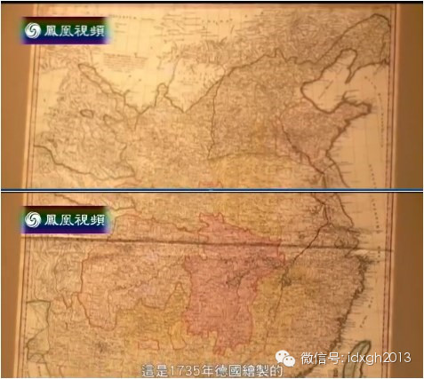

_默克尔赠送的地图_

1735年是雍正皇帝驾崩、乾隆皇帝登基那一年。乾隆中后期才真正平定的新疆与外蒙古不在这幅地图之内，倒还情有可原。但受清廷册封活佛与派驻管辖官员的西藏和青海、
自后金时代起就受满洲控制的内蒙古、甚至作为龙兴之地的“满洲”（东北地区）都不在中国国界内，就非常说不过去了。不单是这幅德国绘制的地图如此，同时代其他西方绘制
的地图也是如此。

  

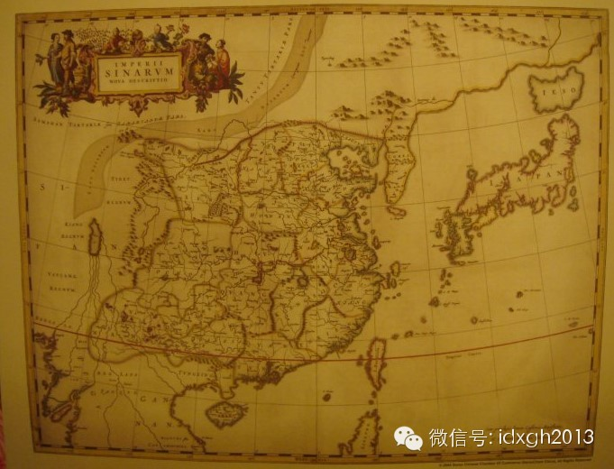_明末清初（17世纪）意大利传教士卫匡国在《中国新地图集》里绘制的中国地图_

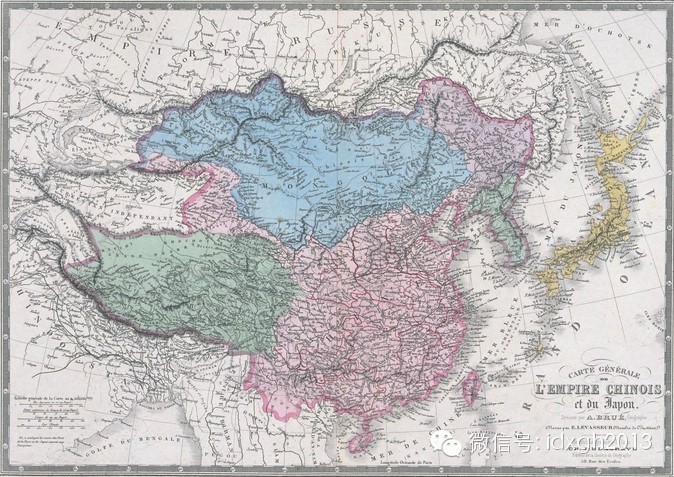_1882__年法国人绘制的中国地图_

现代的国界概念来源于西方。在西方政治文化体系中，国界有人为和天然两种，人为的如界碑、界墙、运河等，天然则有山脉河川等，但即使有了天然国界，也还需要划定人为界
线。简而言之，就是只有拥有法律效力的条约规定的国界才受国际法的承认与保护。

  

而在中国古代的政治文化体系中，“天下”的中心即是中国，整个世界依照着“中国本部——中国疆部——中国藩属——化外蛮夷”的概念区分，这是对《禹贡》之中五服制度的
延续。汉人与其他民族、中国人与外国人，都是因为对中华文化的向往而被联系在一起，很少论及“国家”或“民族”概念，故而无需用法律性文件来规定边界，甚至无需确定明
确的国界。

  

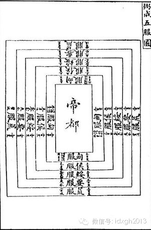

_清《钦定书经图说**弼成五服图》_

东北地区是清朝龙兴之地，由于当地以旗人为主，所以一直实行有别于关内各省的军政一体的八旗驻防制度，黑龙江、吉林、盛京的驻防将军拥有区别于关内各驻防将军的行政权
力。

  

天命九年(1624)，清廷对归附的蒙古部落实行盟旗制，从此蒙古各部落的首领一般都会受清廷册封而成为蒙古王爷；雍正二年（1724年），清廷置青海办事大臣，雍正
五年（1727），又设立驻藏大臣，但并没有剥夺西藏高级僧侣参政的权力，以致驻藏大臣时常沦为“熬茶大臣”（熬茶是藏传佛教一种布施之称。驻藏大臣的职责之一是在宗
教庆典时代表大清皇帝向西藏僧众发放布施。此称意指驻藏大臣除熬茶布施外别无他事）。

  

乾隆二十四年（1759年），在未实行盟旗制的新疆其他地区实行伯克制度，“伯克”即汉语的“首领”，担任伯克的，也多是当地旧有的贵族。可见，清廷对这些地方的实际
管辖能力极其有限，地方事务其实更多是由地方领袖自行处理，与其将这样的制度称为“行政制度”，倒还不如将其视作一种中央对边远地方的羁縻。

  

这些事实恰恰说明了新疆、西藏、蒙古等地在近代以来的特殊地位。它们既非完全意义上的中国主权所在地、又非中国宗主权所在地，而是一种权力形式模糊、保持内部行政独立
而外交不独立的特殊的中国领土。故而在喜欢纠结于法律及法律性文件的西方人眼中，不将这些地方看做中国领土而划在国界之外的举动就不足为奇了。

  

近代以前，除了《尼布楚条约》，中国再没有与邻国签订过边界条约，而代表主权行使的《大清律例》显然只适用于关内诸省，关外的法律事务由当地领袖自行解决。故而来华的
西方人会将边界并不明确的新疆、西藏、蒙古等地与关内诸省进行区分，不将这些地方标注在中国地图之内。

  

而同时期的中国人，显然依旧相信“普天之下，莫非王土”的理论。这种理论最直观的表现就是：在同时期由中国人绘制的地图中，都没有标注国界。

  

_ 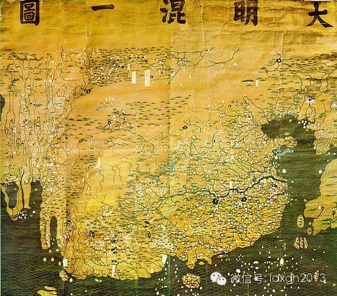_

_大明洪武二十二年（1389），《大明混一图》___

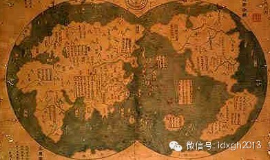_大明永乐十六年（1418年）《天下全舆总图》（《天下诸番识贡图》）_

_ 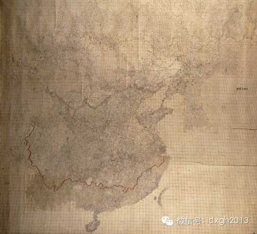_

_大清__康熙__五十六年（1717年)《__皇舆全览图》_

中国古代对国界的概念一直停留在传统边界的认知上，从来没有法律性文件对国界做过勘定。《西游记》虽然写的是唐代取经故事，但却表现了明朝人对国界概念的认知状况。在
《西游记》中，大唐的疆域其实并不十分广大，唐僧在启程取经后不久就已经越过了国界。

  

如第十三回《陷虎穴金星解厄 双叉岭伯钦留僧》中就提到了大唐的边界：“此山唤做两界山,东半边属我大唐所管,西半边乃是鞑靼的地界。”第十四回《心猿归正
六贼无踪》中又写道：“这山旧名五行山，因我大唐王征西定国，改名两界山。”小说中唐朝的国界就是压住孙悟空的五行山（两界山）。而乌斯藏与鞑靼，都不属于大唐疆土。

  

有明一朝、甚至直到鸦片战争前，中国人对国界的概念都只限于自然边界——例如以戈壁沙漠为界区分内外蒙古或以喜马拉雅山、鸭绿江一类的大江大河为界区分中外，而从没有
建立过明确的边界线，更没有设立过界碑。

  

中国古代对国界的概念一直不甚敏感。唯一比较接近现代国界意义的中外边境只有长城，唯一有界碑性质的分界标志只有东汉伏波将军马援南征后设立在交趾地区的铜柱。以至于
中华人民共和国成立之初，面临的最艰巨任务就是与各邻国划清国界，而欧洲国家早在拿破仑时代就已基本完成。1814年和1815年两次《巴黎条约》和1815年维也纳
会议的重要内容就是确立拿破仑帝国覆灭后欧洲各国的边界。

  

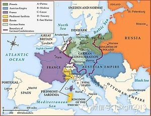

_1815__年维也纳会议规定的欧洲国家边界_

鸦片战争前后，中国人绘制的地图中也逐渐有了国界，这时的国界多是模仿欧洲传教士绘制的地图标注的。直到甲午战争后，随着西方政治文化的渗入，中国才真正明确了国界的
概念，将新疆、西藏、蒙古等地明确划入了国界。大名鼎鼎的《时局图》就是这一变化最好的例证。

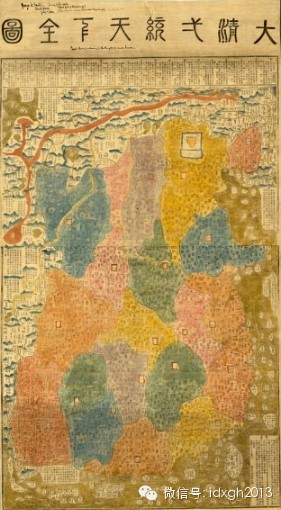

_十九世纪初《大清一统天下全图》中标注了国界_

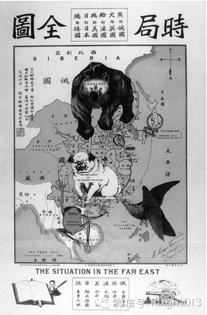

_19__世纪末__《__时局图》中将新疆、西藏、蒙古等地纳入了国界_

近代以来，随着西方对中国侵略的加深，中国不得不放弃传统的政治文化转而接受西方的政治文化，这就是中国近代政治文化的转型。起初，清廷对现代国界的概念懵懵懂懂，因
而在对外事务上屡受欺凌，被迫割去大片国土，吃尽了不懂法的亏（比如割让领土最多的《瑷珲条约》，就是由黑龙江将军奕山自作主张与沙俄签订的，奕山并没有得到朝廷的授
权，故而在《中俄北京条约》对其确认之前，都是不符合国际法的，奕山本人也因签约而被革职）。清廷后来开始变被动为主动，将传统的“宗主权”逐渐替换为“主权”，并学
会用法律性文件来确定国界、在边境线上竖立界碑。

  

清廷在签订了大量不平等条约后，也学会了用条约去约束他国，中朝之间签订的《中朝商民水陆贸易通商章程》就是对朝鲜来说不平等的条约。清代俞樾在《春在堂随笔》中也曾
提到竖立界碑之事：“光绪十二年，吴清卿副宪大澂奉命勘定中俄边界，立铜柱识之……厘定其地。壤土既定，无有华夷，中外咸利。立此铜柱，刻此铭词，昭示万世。’”中俄
边界上的铜柱现已难觅踪迹，但清廷在南方国界上树立的一系列界碑都表明其对实地划界的重视。

  

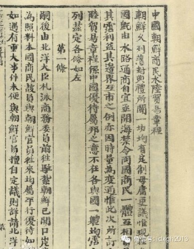

_中朝签订的对朝鲜不平等的《中朝商民水陆贸易通商章程》_

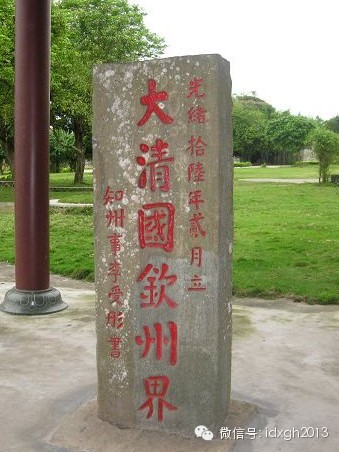_光绪十六年（1890年）树立的大清国钦州界碑_

在确定国界的过程中，清廷不得不面对中国疆部与中国藩属的不理解甚至反对。在异议面前，清政府采取了它能够做到的、也是最为有效的办法——军事出击。在清政府实力稍有
恢复的同治、光绪年间，朝廷不仅在新疆、西藏、满洲（东北）、台湾等边远地区大量建省，还四面用兵。

  

西面由左宗棠远征新疆；东面由袁世凯进军朝鲜；北面逐渐削弱以致废除蒙古贵族的传统权力；南面则是派遣赵尔丰率军入藏。军事出击的方法虽然简单有效，但势必会造成当地
人的不理解与反抗。

  

左宗棠虽然平定了同治回乱与阿古柏叛乱，但也造成了新疆人心难以恢复的局面；袁世凯虽然加强了对朝鲜的控制，但也造成了以大院君为首的朝鲜贵族对清廷的不满，以致朝鲜
两班贵族倒向日本；对内蒙古贵族权力的收回虽然顺利，但在历来离心力较大的外蒙，却为日后哲布尊丹巴呼图克图的独立建国埋下了伏笔；在赵尔丰进藏的过程中，就发生了清
军与藏军的战争，最后导致十三世达赖出走印度。

  

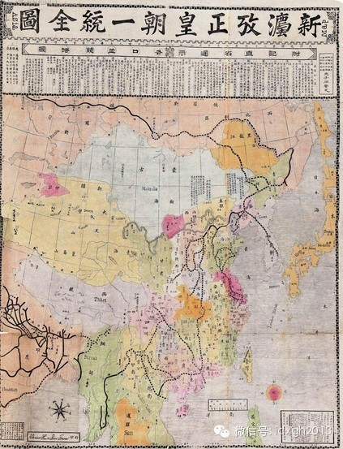_大清光绪二十六年（1900）《新法考证皇朝一统全图》_

民国之时，中国对国界概念的理解与运用就更加炉火纯青。甚至超越了国界本身的概念局限，创造并提出了南海十一段线（即今天南海九段线的前身）一类的权利线，着实是“青
出于蓝而胜于蓝”。而对于麦克马洪线一类未获得中央批准的非法国界线，虽然接壤的印度、缅甸都单方面认为是既定的历史疆界，但无论是民国政府还是日后的人民政府，都坚
决表明反对立场，绝不承认条约的合法性，没有再犯《瑷珲条约》的错误。

  

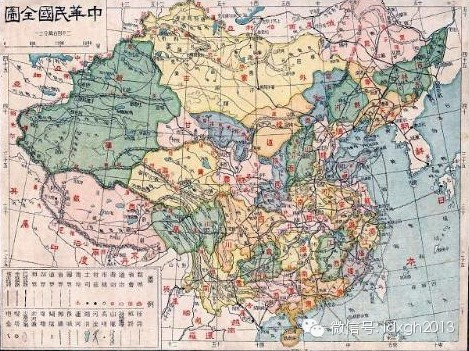

_1926__年中华民国绘制的地图_

  

[大象公会所有文章均为原创，版权归大象公会所有。如希望转载，请事前联系我们：bd@idaxiang.org ]

———————————————  

**大象公会订阅号的自定义菜单上线了，左边是官网文章精选，右边是大象公会官方微社区，点击进入来吐槽发帖吧！**

**  
**

  

[阅读原文](http://mp.weixin.qq.com/s?__biz=MjM5NzQwNjcyMQ==&mid=201645875&idx=1&sn
=8b5de07b4c03d9c9d575b3996e9360be&scene=1#rd)

