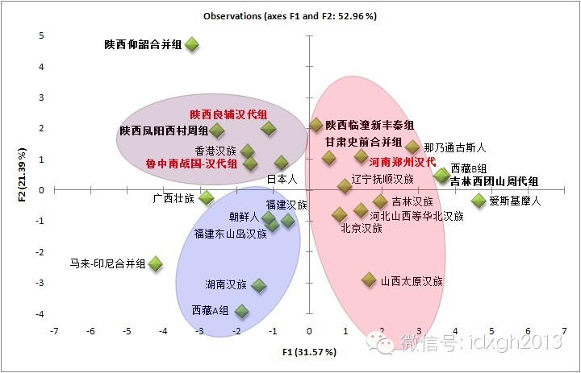
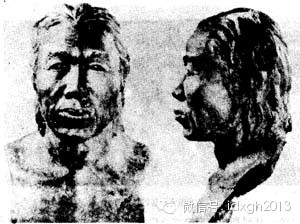
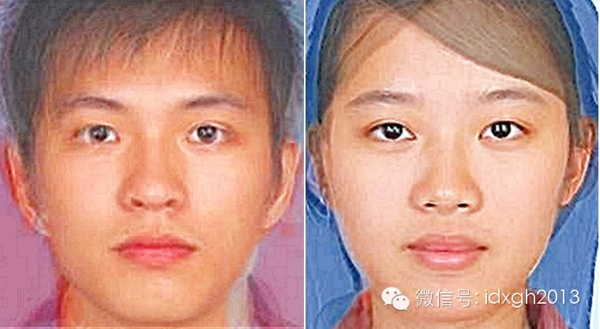
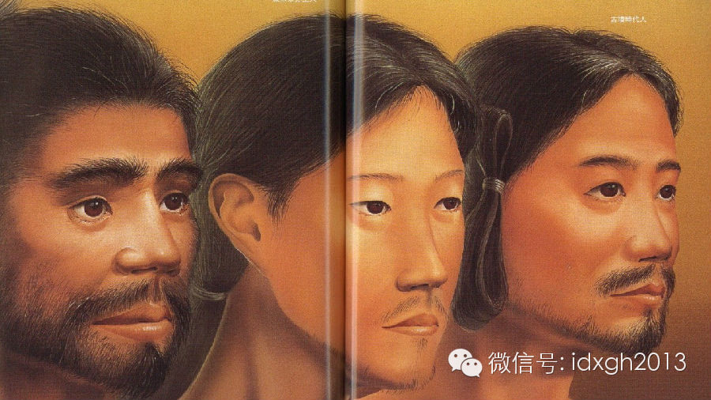
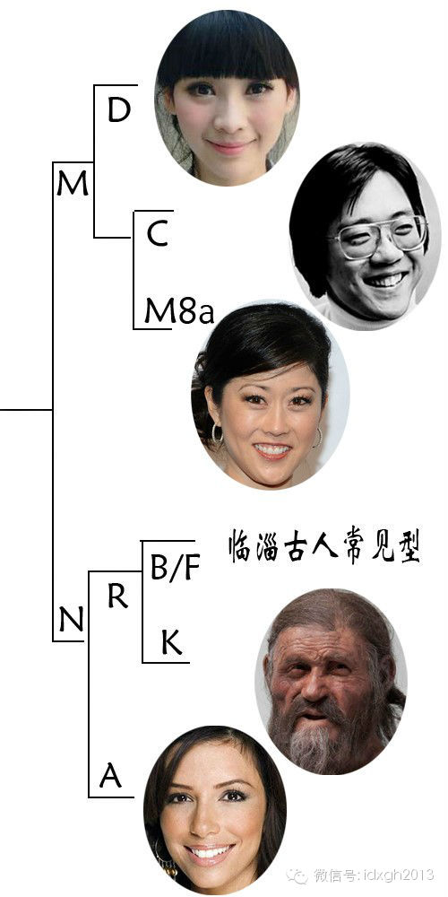

**如果分析的样本足够多，我们很容易回答，今天什么地方的中国人最像汉朝的中原人。那么，日本人比大部分华南汉族和全部北方汉族更接近汉朝中原人，又是怎么回事？**

****

文/王冰

  

前一篇文章谈到，2013年，吉林大学《郑州汉唐宋墓葬出土人骨研究》的报道第一次系统分析了汉代河南人的种系特征，用体质人类学的方法比较颅面骨骼特征，与汉朝中原
人最接近的，是今天的华南近代组（福建）。

  

不过，上述研究报告的现代样本，只有华南和华北组（河北山西两地汉族为主）两个近代组，从样本数量看，它反应汉朝中原人与今天中国各地域人群的种系亲缘关系并不够精确
。若试图回答今天谁更像汉朝的中原人，就需要更多的样本。

  

但我们可汇总目前报道的近代人骨数据资料，加入更多样本做更细致比对分析。

  

现代华南汉族比对样本：加入福建东山岛汉族、香港汉族和湖南汉族；现代华北汉族比对样本：加入辽宁抚顺汉族、吉林汉族、北京汉族、山西太原汉族。

  

另外，加入广西壮族、印尼和马来合并组、山南地区藏族（西藏A组）、藏族主体类型样本（西藏B组），作为南方少数民族和东南亚民族的比对样本；加入俄远东阿穆尔河流域
的那乃人（通古斯语系民族，满族近亲）、北极滨海地区爱斯基摩人、东北亚地区的日本人和朝鲜人作为北方比对样本。

  

在古代样本中，除汉代中原地区三组样本外，还可加入陕西关中地区新石器时代仰韶文化合并组、陕西凤阳西村周人、陕西临潼新丰秦人、以及西北地区的甘肃史前合并组、东北
地区的西团山文化合并组作为古代比对样本。

  

得到如下比对图谱：

  

_汉代中原人与现代东亚诸民族种系比对分析图谱（男性）_

  

用主成分分析方法比对研究可以首先发现，在近现代对比组中，东南亚的马来-
印尼合并组与爱斯基摩人种系差异最为明显，而东亚诸民族大体介于二者之间。在古代对比组中，陕西关中地区的仰韶文化合并组和山西太原现代汉族之间的种系差异最为明显。

  

另外，陕西汉朝人相对秦人，更接近山东汉朝人。这个问题比较复杂，有个史料线索值得注意：秦王朝被推翻后，关中地区人口由于战乱，损失十分严重，汉朝曾经迁大量外省居
民移居陕西，其中，在秦始皇统一中国过程中损失较小的齐国人是移民大军中的主力。

  

在所有可比对近现代人群中，香港汉族比福建汉族更接近汉代山东和陕西的中原人，当然也包括陕西周人。同时，尽管与关中地区最古老的土著居民仰韶文化古人有一定差异，但
香港汉族还是相对更接近这些关中古人。

  

河南郑州汉朝汉族在此分析中属于现代华北人群的聚类群，与辽宁抚顺汉族很接近。但值得一提的是，因为现代样本的颅骨数据普遍缺少一些重要指标，比如反应面部突出程度和
齿槽突出程度的数据，而颌骨较突出是中原地区自石器时代至汉代普遍的种系特征，这些数据缺失的前提下，让河南郑州汉朝人相对陕西和山东同时代古人显得有些特别。不过，
郑州汉朝人较高（长）的面部使他们与普遍低（短）面特征的古中原人存在一定差异。

  

_仰韶文化古人专业复原图___

  

_广东汉族平均容貌图，略低（短）略偏狭的面型，较低（短）阔的鼻型与仰韶文化古人接近程度较高。但仰韶文化古人颅骨尺寸较大等特征还是与华南汉族存在较大差异。_

  

**【日本人是徐福东渡的童男童女吗？】**

  

通过上述分析，我们还会发现一个有趣现象：日本人比除香港汉族以外的华南汉族和华北汉族更接近汉朝中原人。很多读者可能一下会想到“徐福东渡”。

  

据《史记》记载，秦始皇希望长生不老，西元前219年，秦始皇派徐福率领童男童女数千人、以及够用三年的粮食、衣履、药品和耕具入海求仙。但并未找到神山。西元前21
0年，秦始皇东巡至琅岈，再度派徐福率众出海，徐福到达“平原广泽”未再返回。民间一直有种比较传奇的说法认为：日本人就是这些一去不复返的童男童女后裔。

  

其实这个问题并不简单，从现代基因学研究的角度，日本人是绳纹人（10000年前-公元前一世纪）和弥生人（公元前三世纪—公元三世纪）的混血后裔，绳纹人种系特征最
为复杂，同时表现出与阿穆尔河流域诸民族和东南亚民族的类似特征。弥生人则更可能与某些东北亚地区的史前移民相关，其父系血统与朝鲜人和部分满族人相近。

  

在弥生时代之后，日本似乎还出现了一批“骑马民族”，日本进入古坟时代（公元300年-
600年），或称大和时代，至此日本主要的移民潮才算终结。日本人在经历复杂混合后，体质人类学特征恰好接近汉朝的中原人，很可能存在很大的偶然性。

  

另外，还有类似的情况，很多朋友会问，朝鲜人与福建人最为接近时怎么回事？朝鲜族和福建汉族的容貌差异很明显啊，朝鲜族的脸很大，常有人用“大饼脸”来描述。这主要因
为：一方面，福建汉族类似古代中原人，面部比较短（低面），这样在比例上，面部就相对北方汉族偏圆阔；另一方面是因为朝鲜族和福建汉族的颅骨特征接近程度更高，这些特
征不太容易在肉眼可见的容貌特征上体现。

  

_绳纹人、弥生人、古坟人（从左至右）专业复原图_

  

【**汉朝山东人不是白种人吗？】**

  

在分子人类学刚刚兴起之时，曾有一份结论颇为惊人的学术新闻称，中国古生物分子遗传学研究室的专家发现2500年前的山东临淄人线粒体DNA（反应母系血统源流）遗传
特征接近高加索人种。

  

研究者指出：他们与日本的有关研究机构合作，以山东临淄地区古墓群中古人类DNA为标本，提取并纯化了该地区2500年前、2000年前的古人骨DNA和现代人的DN
A，并分别与从国际基因数据库中筛选的1300多个标本进行了DNA特征的比较。

  

结果发现，2500年前的山东临淄人与现代欧洲人的基因特征非常近似，2000年前的临淄人又与现在的哈萨克斯坦、阿尔泰人的基因特征非常近似，而当代的临淄人与现代
的东亚人基因特征非常接近。

  

为什么会出现这样的测试结果？其实，这与早期研究认识的局限性有很大关系。东方人母系血统主要分为三大系统，即M，N和R。而临淄古人以R系统的分支B和F居多（这些
类型在今天的南方各民族比例相对更高），现代山东人和其他北方民族而则以M系统居多。在另一方面，高加索人种则主要是R系统的其它分支。也就是说，在大的谱系树上，两
个以R系统为主的族群的亲缘关系确实比以M系统为主的族群高，但R系统的东西各个分支早在人类始祖走出非洲之后就分离开来，那时，蒙古人种和高加索人种还尚未分化。

  

同时，我们也要注意2500年前的临淄古DNA样本确实有少数几例非常独特的样本，通过共享序列分析，会发现它们与欧洲样本匹配，很可能确实是西方人的类型（因为早期
文献未作完整的基因测序，无法得出完全肯定的结论）。

  

而另有研究者报道，他们在4例6500年前的山东长岛古人DNA样本中测到一例西方类型。这样看来，2500年前的山东古人尽管并不是高加索人种，但却很可能已经出现
了部分的高加索人种混血成分。

  

_线粒体DNA__发育树。华北地区M__系较为常见，其中，柳岩所属的D__型最为常见；美籍华人大提琴演奏家马友友所属的C__和美籍日裔花样滑冰选手克丽斯蒂*
*山口所属的M8a__相对少见。N__系包含R__系，R__系又分东方支系和西方支系，临淄古人B__和F__两个东方支系较多，高加索人种则主要是R__的西方
支系，如意大利冰人奥兹属于K__支系。N__系还包括另一系统，包括东北亚和美洲印第安人常见的A__，美国影星伊娃**朗格利亚属于这个类型。_

_  
_

[大象公会所有文章均为原创，版权归大象公会所有。如希望转载，请事前联系我们：bd@idaxiang.org ]

———————————————  

**大象公会订阅号的自定义菜单上线了，左边是官网文章精选，右边是大象公会官方微社区，点击进入来吐槽发帖吧！**

**  
**

  

[阅读原文](http://mp.weixin.qq.com/s?__biz=MjM5NzQwNjcyMQ==&mid=201762887&idx=1&sn
=e0d92b557ac3abe4840da9d648a53c51&scene=1#rd)

