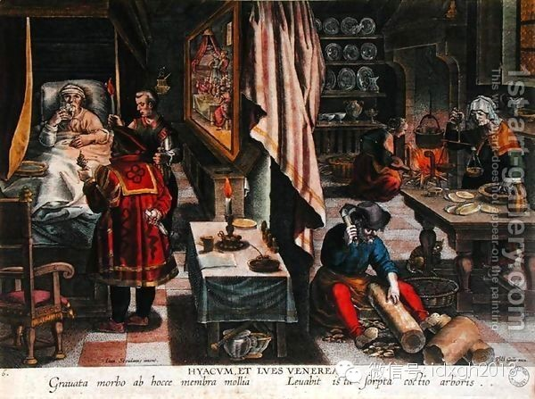

**梅毒肆虐了四个世纪才被征服，它不仅迫使人类的医学进步，更因感染了许多重要人物，间接影响了更多人的命运。**

**  
**

文/刘大可

  

1495年，法兰西国王查理八世的大军占领了那不勒斯王国。这个伸入地中海心脏的王国是阿拉伯世界与基督教世界的贸易窗口，不仅因商业日渐富庶，还成为了意大利文艺复
兴的中心。而6年前刚刚成立的新兴帝国西班牙，也对其垂涎已久。

  

于是，一连串激烈的外交和军事争夺拉开了序幕，舞台上却偷偷出现了一位不速之客。

  

【突然的出现与大流行】

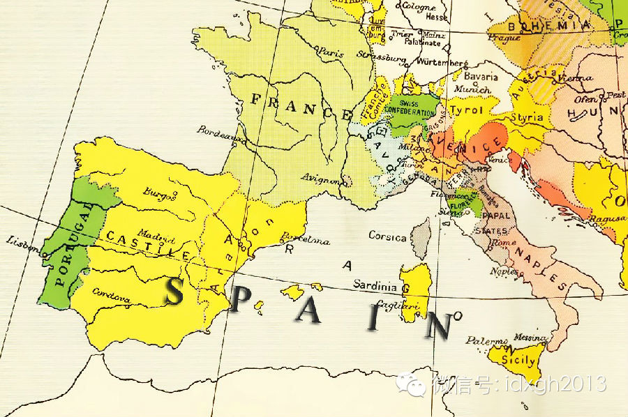  

_1495__年前后的西南欧。西班牙王国（图上表示为黄色）已经将撒丁岛和西西里纳入囊中；意大利南部的那不勒斯王国（Naples__，淡橙色），是西班牙东进的
下一个目标_

  

法国人凯旋后，部队中就爆发了一场前所未见的恐怖瘟疫：患者身体表面从头到膝突发脓包，不久崩破溃烂，脸上的肉渐渐剥落，几个月之内就会死亡。疾病很快就传遍了欧洲，
并向东方传播开去，只用3年就传到印度加尔各答；大约1505年（大明弘治十八年），又借道东南亚从岭南进入中国。25年内，整个欧亚大陆连同周围岛屿，凡有人处无一
幸免。

  

这种病的传播路线，可从各种称呼就能看出一二：法国人叫它“那不勒斯病”，德国人和波兰人叫它“法国病”，俄罗斯人叫它“波兰病”，土耳其人和阿拉伯人叫它“基督徒病
”，印度人叫他“葡萄牙病”，岭南以北的中国人叫他“广东疮”，日本人则叫它“中国疮”。而到了1530年，它获得了今天通用的拉丁语名字“Syphilis”，汉语
则以病症特点叫它“梅毒”。

  

相互栽赃的混乱称呼意味着人们并不知道其源自哪里。直到2011年，人类体质学和流行病学家比对诸多考古遗骸后，才确定当年那个新成立的西班牙从美洲大陆引进了这位瘟
神。

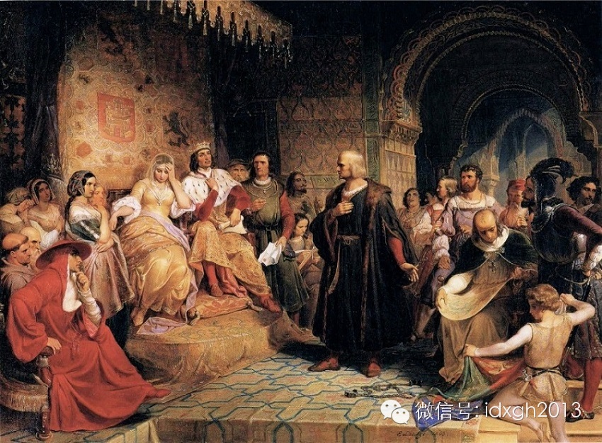

_19__世纪美国历史画家埃玛纽埃尔**洛伊茨1843__年所绘《哥伦布陈情女王》，画面中央是哥伦布，宝座上扶额的是女王——刚刚打完仗，女王觉得这个要赞助的
家伙很让人头疼_  

  

事情还得从1492年讲起。当年1月，西班牙王国攻陷了摩尔人的最后一座王城格拉纳达，终于从异教徒手中彻底夺回了伊比利亚半岛，完成了“收复失地运动”的八百年大业
。夏天，克里斯托弗**哥伦布终于说服了两位国王（当时的西班牙刚刚通过政治联姻合并而成，王后伊莎贝拉同时是半壁江山的女王），在8月份扬帆远航，两个月后发现了美
洲。哥伦布和后来者带来了天花和暴力甚至灭绝，却从原住民手中带走了黄金和年幼的性奴。同时，还有梅毒。

  

就像地图里标识的那样，西西里岛已经被西班牙控制，而西西里和那不勒斯向来交好，这种性病随即从西班牙人身上传到了那不勒斯的妓女那里；而当法国攻破那不勒斯后，这种
病也就馈赠给法国人。

  

【疾病的进化】

  

1495年在那不勒斯的爆发，让刚刚从黑死病的狂飙中缓过劲来的欧洲人恐慌不已。

_  
_

_ 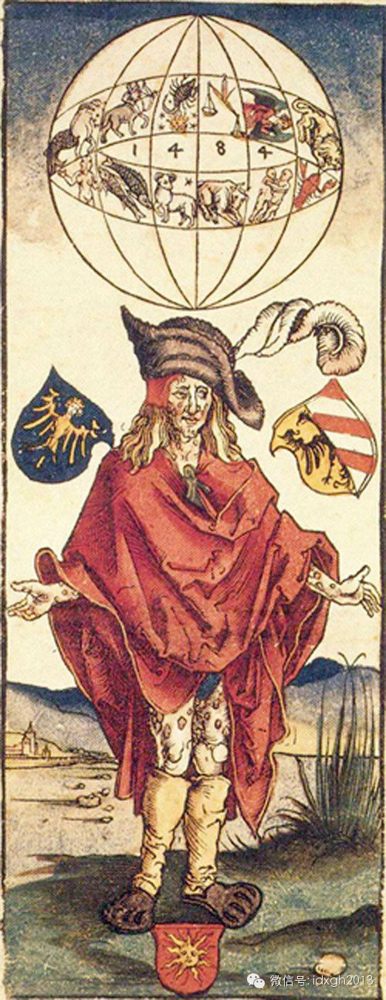_

_这幅图是已知最早的关于梅毒的艺术作品，德国文艺复兴领军者丢勒1496__年的彩色版画作品——《身患法国病的人》。这是一幅典型的占星术绘画——头顶是黄道十二
宫的天球，1484__是行星位置，并非创作年代；天蝎座上有一颗亮星，表示这种疾病是星座不利；患者是德国长枪雇佣兵的打扮，当时的梅毒尚在军中流行，病人的症状也
恰是梅毒刚出现时的烈性症状，从头到脚生满脓包；另外两面文章标明了发生的地点，神圣罗马帝国的纽伦堡——仅仅过去一年，这种疾病就已经扩散到了中欧，可见其传染性之
高，也从侧面反映了军队内的性行为。神圣罗马帝国皇帝马克西米立安一世在1495__年感慨，这种前所未有的疾病一定是上帝对渎神行为的天谴_

  

国境不能阻挡瘟疫，疾病也不能逃过进化。只经过了半个世纪的流传，到了1546年，梅毒就演变出了三期发病的特点：

  

初次性接触感染后的3天到3个月为一期，接触部位出现底部坚硬、边缘清晰，不痛不痒但愈合缓慢的溃疡，经过一段时间后会自愈；

  

再经过4到10周发展为二期，症状多样，但通常会在躯干和四肢出现对称而不瘙痒的粉红色皮疹，随后演变成斑丘疹以及溃疡。其中有一类独有的斑疹，中央愈合而周围扩散，
形成梅花状，故中文称呼此病为“梅毒”，而口腔和咽喉黏膜上也会形成泛白的疣状病灶，接触传染性极强。患者还会伴随虚弱、消瘦、脱发及浑身疼痛等症状。不过全部症状会
在两个月内消失，之后进入3—15年，最长可达46年的潜伏期。

  

潜伏期过后就是毁灭性的三期梅毒，有三种类型：梅毒瘤性梅毒患者因全身皮肤和脏器上的树胶样肿瘤而毁容；神经性梅毒患者会癫痫、瘫痪乃至痴呆；心血管梅毒则会患上主动
脉炎、动脉瘤、动脉瓣关闭不全，直至心力衰竭而死亡。

  

对于流行病学来说，这样的演化对传染病非常有利：迅速致命的传染病会在短时间内损失大量宿主，失去传播机会；而潜伏期长或者症状温和的传染病才有足够的时间和机会传播
给下一个宿主。梅毒更胜一筹的是在病程中多次出现的皮肤溃疡和粘膜扁平疣，都因没有痛感，而使宿主继续发生性接触，大幅提高了传染率。

  

同时，梅毒的性传播身份让它在发病缓慢之外获得了另外的庇护，即人们除了性交大都不愿暴露患病部位，甚至羞于启齿，这让疾病更加隐蔽；而因为当时的观念影响，人们会倾
向认为得梅毒的人都是活该遭报应，根本就不该为他们治疗——虽然也没什么像样的治疗方法。

  

【疯狂与天才的疾病】

  

在缺乏疾病控制的中世纪晚期社会里，传染性很强的梅毒很快蔓延。当人们意识到梅毒是性传播疾病后，这仿佛是对文艺复兴以来反禁欲主义的一次讽刺，人们重新在性的问题上
变得保守。

  

比如疯狂娶妻又疯狂杀死她们的英王亨利八世，就曾试图关闭妓院阻挡梅毒的蔓延，但更加讽刺的是，亨利八世死前的种种症状就像极了一个梅毒患者，虽然也有历史学家争辩说
那是糖尿病和脑外伤。

命运类似的帝王将相还有很多。16世纪后半叶的俄罗斯沙皇伊凡雷帝，他的8个老婆3个出家5个死于非命，往往都是婚后不久便被他玩死——这种不受控制的反复癫狂，被认
为是梅毒侵犯神经中枢的表现之一。1580年，他连自己的长子也一杖打死，4年后自己也中风丧命。  

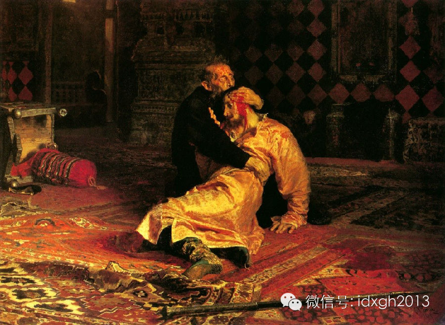_俄国现实主义画家列宾最著名的作品之一，1885__年所绘《伊凡雷帝和他的儿子》，
描绘的就是伊凡雷帝一怒之下打死长子后大梦初醒时的悔恨与恐惧_

  

除了帝王，还有数不清的天才艺术家罹患梅毒。美国精神病学者和作家，德博拉**海登在他的作品《天才、狂人的梅毒之谜》中写道：“贝多芬谱写《欢乐颂》时，正因为梅毒
末期引起心理亢奋；美国总统林肯于1835年左右因为嫖妓染上这可怕的疾病；王尔德的《格雷的画像》说的就是自己被性病折磨的痛苦……这些历史上的天才、狂人，本来风
牛马不相及，但他们却共同遭受一种疾病的罪与罚——他们都是梅毒患者。”此外，哲学家如尼采、叔本华，文学和剧作家如莫泊桑、波特莱尔、福楼拜，画家如马奈、梵高，音
乐家如舒伯特、舒曼……甚至瞎子阿炳，都在著名梅毒患者的列表里。

  

梅毒有时候也是一种政治手段，例如人们常常渲染拿破仑、希特勒、墨索里尼等敌对人物的梅毒史，而无论真实与否，这都将对敌人的声誉造成强烈的中伤——不过希特勒确实恨
透了梅毒，以至于花了13页笔墨在自传《我的奋斗》中阐述在德国根除梅毒的重要性。

  

【推动医学进步】

  

梅毒若不经治疗，死亡率可达58%，因此在艾滋病出现以前，是最可怕的性传播疾病。为了找到有效的治疗手段，人们用了400多年。

  

梅毒最早出现的时候，名叫弗朗西斯科**德里加多的西班牙神父兼梅毒患者，宣称梅毒可以被俞创木分泌的树胶治愈，尤其是俞创木属中的药用俞创木（_Guaiacum
officinale_）。而这些美丽的植物恰恰分布在哥伦布当年抵达南美时踏上的土地上。如今，神圣愈创木还是巴哈马的国花。

_ _

_药用俞创树_

  

虽然很多欧洲人都期盼得到俞创木治好梅毒，然而俞创木生长缓慢且效果并不出众——欧洲人并未找到更好的草药治疗，中国的《本草纲目》虽然记载了梅毒流行情况，同样也没
能找到治疗方案。但中国人和欧洲人不约而同地将目光投向了炼金术的常用药物：水银和砒霜。

  

配合高温蒸汽浴，用水银清洗梅毒患者溃烂的伤口，并且取一定量的水银制剂让患者口服——效果真有，病痛确实得到了缓解。然而是引虎驱狼，即便没有死在梅毒上，也要死在
水银对神经系统的毒害上，唯一落实的好处就是生前千疮百孔的肉体在死后不易腐烂，因为水银有很强的防腐效用。19世纪人们发现碘化钾也有不错的治疗效果，然而副作用并
不比水银少多少，碘中毒同样能毁掉全身代谢。

  

另外，除了缓解病痛，梅毒造成的大面积毁容也不可小觑。多数梅毒患者经过数年的潜伏期后，终将发展为梅毒瘤性梅毒，如前所述，这意味着头面部也会出现许多大小不一的树
胶样肿瘤，之后又会形成骨骼塌陷而导致面部变形，这些外形变化让“天谴”的效果一目了然，也让患者遭到社会抛弃——为了多少挽回尊严，早期的外科整形手术就这样得到了
发展。

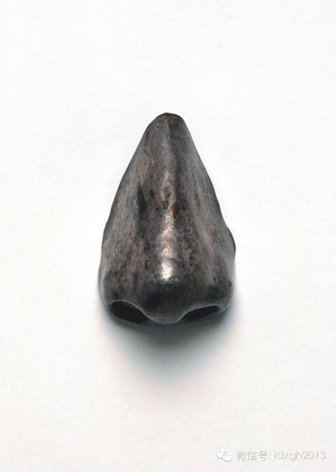

比如上面这张图，是一枚17世纪到18世纪青铜鼻子模型，用来给梅毒患者制作蜡或者石膏的假鼻子勉强应付，这是一种“别开生面”的假肢。然而早在16世纪，欧洲人就已
不满足于消极伪装，而开始采取一些激进的整形尝试。

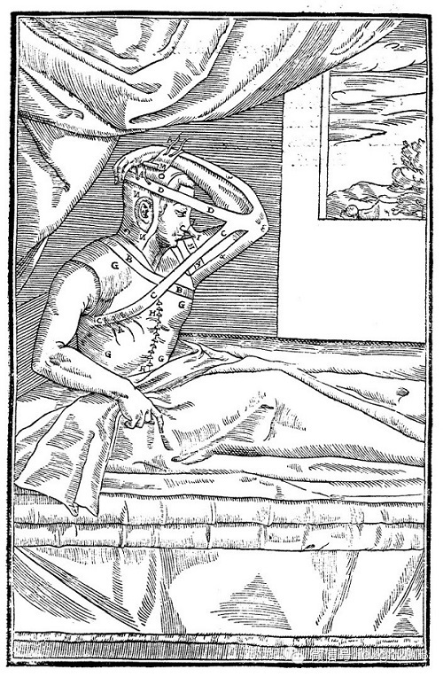

这是一张医学手册的版画，制作于16世纪，描述的是意大利外科医生塔利亚科齐和他的儿子发明的自体鼻子重建法。即从自体组织上，挖下一条皮肉来，一端仍然连在胳膊上，
一端缝在鼻子上，保持这个姿势数月，待这条组织在鼻子上长牢，再将其与胳膊分离——这对没有消毒和抗排异反应的早期外科手术来说是极大的进步，那条切下来的半游离组织
称为“自由皮瓣”，一直到第一次世界大战之后都是极其重要的外科移植方式，包括今天我们常看到有严重外伤患者失去了手，也会将其寄养在自己的腿上复原功能再行移植，也
是这种方式的进化版本。

  

同时为了预防梅毒，早期的安全套也开始变得流行起来，通常是用羊肠和丝带做成的袜子似的东西，聊胜于无。

_ 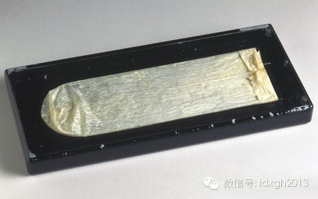_

_一具17__世纪的安全套，用羊的盲肠制成，尺寸很大，所以要用丝带固定_

_  
_

【最终的征服】

  

与梅毒不懈斗争的400年时间里，梅毒的病源一直不为人所知，直到20世纪初，梅毒的历史才发生了质的变化。

  

1905年，德国动物学家埃里克**霍夫曼和外科学家弗里兹**萧丁发现了梅毒的病原体：苍白密螺旋体的一个亚种“苍白球”，学名_Treponema
pallidum pallidum_

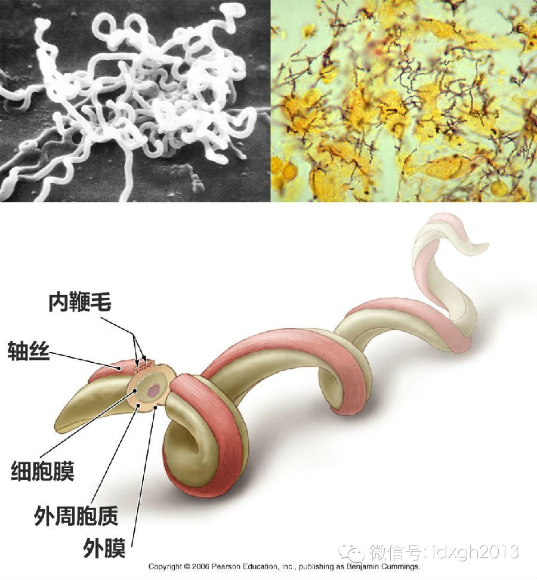

_左上是电子显微镜下的苍白螺旋体，右上是光学显微镜暗场照明下的梅毒组织样本，下面是苍白螺旋体的结构示意图。螺旋体这类细菌独有一根组贯穿全长的卷曲内鞭毛构成的
轴丝，可以推动菌体在组织内游走_  

  

而到了1910年，德国化学家保罗**埃尔利希与他的助手秦佐八郎在传统的砒霜治疗基础上发明了一种有机砷制剂“砷凡纳明”，商品名“洒尔佛散”，成为了第一种梅毒特
效药，也是人类第一种现代化学治疗药剂。1912年又改进发明了新砷凡纳明，梅毒终于有了适当的疗程，埃尔利希也因此得到了诺贝尔奖——1923年，伟大的革命导师列
宁同志在临终前就被医生开出这种特效药配合传统的碘化钾来治病。根据他血管损害、瘫痪无力、恐惧小提琴声等症状来看，正好类似神经性梅毒的症状。

  

人们同时发现，苍白密螺旋体非常脆弱，高烧就能烧死它们——于是一种旁门左道的治疗手段出现了：故意让患者得上疟疾，然后用疟疾的持续高烧烧死梅毒，最后再用奎宁治疗
疟疾。因有奇效，其发现者朱利叶斯**瓦格纳同样获得了诺贝尔奖。

  

后印象主义巨擘保罗**高更在天之灵得知此事恐怕会魂魄不宁了：1889年开始，保罗**高更搬到法国殖民地塔西提岛从事艺术创作。高更是如此热爱这片土地，以至于频
繁地与塔西提原住民性交，终于染上了早期英国殖民者带来的“英国病”，饱受折磨4年后终于死在梅毒手上——然而就在他动身前往塔西提岛之前，刚刚治好了自己的疟疾。

_ 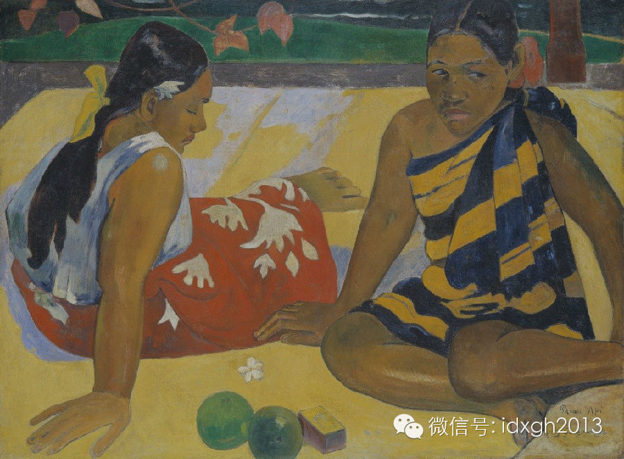_

_保罗**高更1891__年所绘《在沙滩上的塔西提女人》，西方艺术史上最著名的作品之一_

  

而到了1928年，弗莱明发现了青霉素，它不但在治疗外伤感染方面有奇效，而且对梅毒也有一击必杀的强大威力。1943年，人们发现早期梅毒只要用青霉素肌肉注射几针
就好，晚期梅毒，哪怕是神经梅毒，也只需静脉输液就能治愈；而除了过敏患者以外，青霉素几乎没什么毒副作用。而且不仅梅毒，许许多多细菌造成的顽疾，也被青霉素一招毙
命，人类医学史翻开了崭新的篇章。

_ 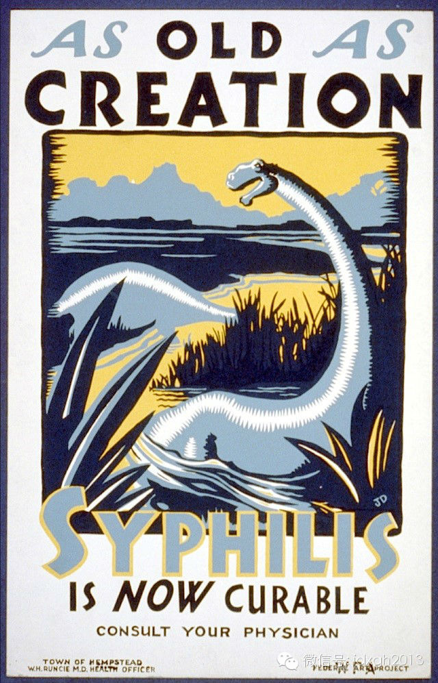_

_美国战后的梅毒治疗招贴画《像创世一样古老的梅毒现在可以治疗了！》_

  

待到二战结束，人类的硝烟散去，高产青霉菌菌株选育成功了，原本昂贵的青霉素价格直线下降，人类第一次开始了对梅毒的大清剿。凡是有能力生产青霉素，或者医疗机构能够
提供青霉素的国家，梅毒发病率飞流直下。虽然因为性解放运动，梅毒有过反弹，但是人类的现代医学水平依旧保护着数不清的披头士和文青。

  

[大象公会所有文章均为原创，版权归大象公会所有。如希望转载，请事前联系我们：bd@idaxiang.org ]

———————————————  

**大象公会订阅号的自定义菜单上线了，左边是官网文章精选，右边是大象公会官方微社区，点击进入来吐槽发帖吧！**

  

[阅读原文](http://mp.weixin.qq.com/s?__biz=MjM5NzQwNjcyMQ==&mid=201584149&idx=1&sn
=663c7f548eb09c6a5bd621caddbb5f77&scene=1#rd)

