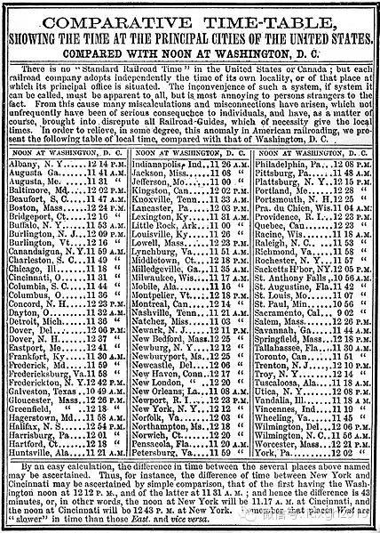
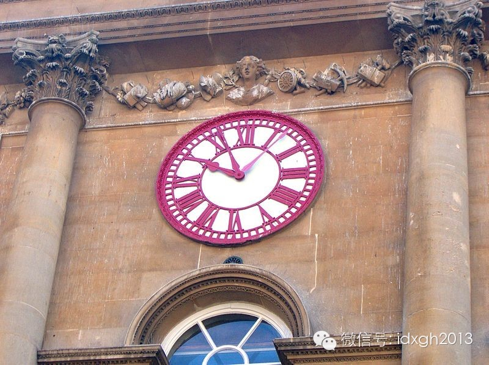
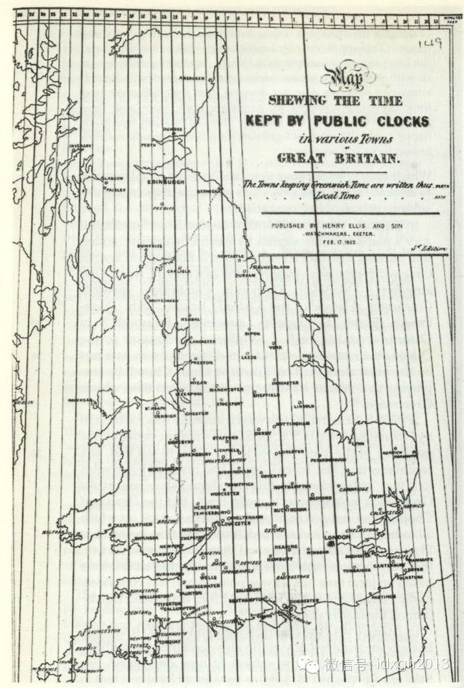
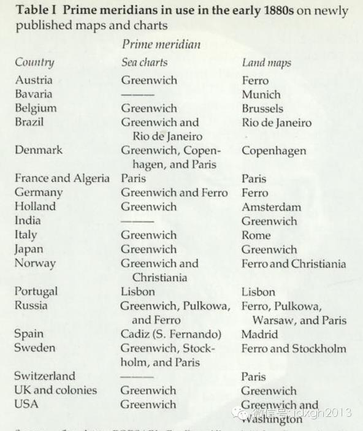
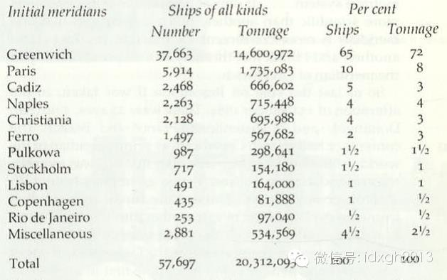
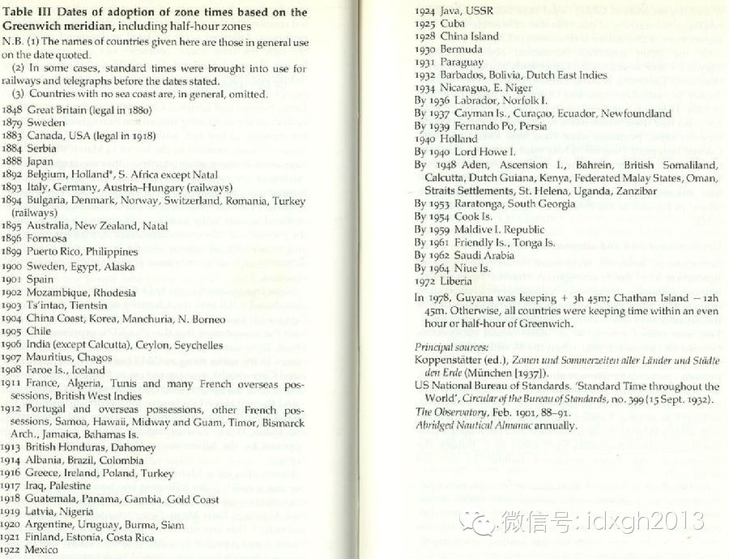
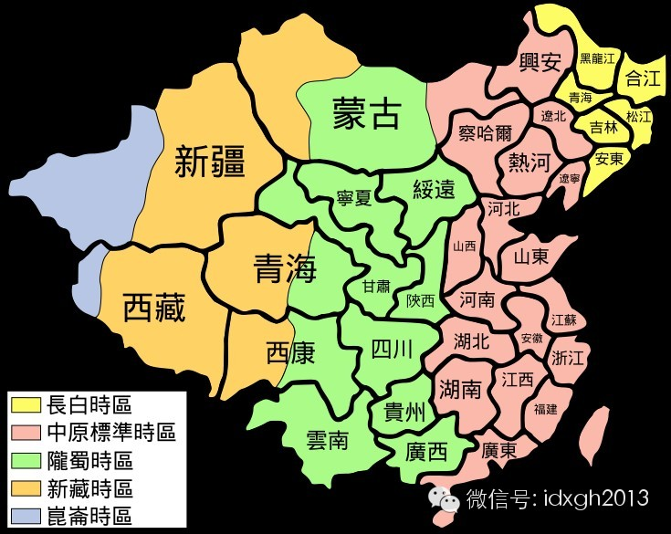

**工业革命初期，世界各地时间没有统一标准，导致火车刮蹭与相撞事故时有发生。在铁路与航海大发展的背景下，格林威治时间统一全球，用了一百年。**

****

文/杜修琪

1853年8月12日，美国东部罗德岛州，两辆火车迎头相撞，14人因此死亡。事故的原因在今天看来难以置信——两车工程师的手表差了2分钟。

  

在此之前，类似原因的刮蹭已发生多次。那时，工业革命进展迅速，但时间测量还沿用中世纪的方法：以日晷等测量的太阳时作地方标准。这是火车事故的重要原因：各地的时间
标准不同。

  

_19__世纪美国的主要城市时间参照表，共102个城市。_

当美国人还在为此事故震惊时，在铁路轰鸣中，伦敦时间已经完成对英国各地方的统一。1855年，不列颠岛与爱尔兰98%的公共时钟调整为格林威治时间。这是第一个将时
间统一的国家，此后，客观、精确的时间体系随着工业、贸易、殖民的发展，占据了世界的每一块土地。

【火车与电报的合谋】

现代时间标准的建立，离不开准确的钟表。最早能持续不断工作的机械钟，出现在14世纪初期欧洲的修道院，以满足僧侣们准时祈祷的需求。

  

这种钟十分笨重，只有时针，用整点报时的方式宣布时间。由于精度有限，僧侣每天至少要对时两次。机械钟楼也很快在市镇中出现，为世俗生活服务
，1335年法国北部的Aire-sur-la-Lys镇建立单独的钟楼，因为需要“让布匹市场的雇员能按照特定的时间上下班”。

  

随着技术的完善，机械钟的精确度不断提高，1475年第一次出现“分针”，但直到1665年才将时间精确到秒。这一时期的钟表产量稀少，十分昂贵——中世纪缓慢的节奏
，也没有出现对精密时间的需求。1851年钟表大规模生产前，它们只是贵族的玩物。

  

中世纪的节奏还体现在地方时上。甚至工业革命初期，各地时间仍然没有统一标准，散漫随意的设置仍然普遍。工程师Henry Booth在1847年的一本小册子中写道
：“坎特伯雷，Colchester，剑桥……无数的城镇，各自有教区时钟，市场钟，每个都在宣示其独特的时间”。即使严格按照太阳时，各地与伦敦也有差异：牛津时间
慢5分2秒，利兹慢6分10秒，康福斯慢11分5秒，巴罗则要慢12分54秒……

  

_英国Bristol的钟表，有两个时针，一个为当地时间，另一个指示伦敦时间。_

这时，火车的出现改变了人们的时间观。铁路发展三十年后，1839年，出现了第一张火车时刻表。这是一种全新的管理方法，它把时间作为客观的控制对象，将运输的效率与
时间的分割联系在一起，整个流程精确到分钟。这与中世纪散漫、差异的时间观迥然不同。

  

这一时期，另一件重要的发明也诞生了：电报。电报能跨越遥远的距离即时通讯，使得与格林威治标准时间的校对变得准确可行。1854年，通过电报线路，格林威治天文台与
东南铁路站台相连，能准确的传递天文台时间信号。1860年，英国的主要城市都能由电报线接收格林威治的报时信号，一年后，印度，澳大利亚，加拿大都能由电报线与格林
威治时间随时保持一致。

  

_1852__年，一幅标注出仍使用地方时间市镇的地图。_

在铁轨和电报大规模建设的帮助下，交通与通信网密集的相连，变得越来越复杂，对时间误差的容忍度越来越低。铁路公司开始强硬的要求经过的城镇，都修改为伦敦（格林威治
）标准时。一些城市的居民为了交通和电报的方便，发起了“与伦敦时间一致”的请愿活动。社会的普遍要求下，虽然没有法律规定，英国大部分的市镇都调整为伦敦时间。

  

这种调整也改变着生活方式。“我准备就寝，却随时都想起火车时刻表，随时想着早晨必须在特定的时间起床，这让我无法安稳睡觉”，著名的外科医生Dr Forbes
Winslow在《柳叶刀》杂志写道。

  

甚至有赶火车过于兴奋猝死的案例。1854年，《协和医学期刊》的一篇文章写道：“兴奋，焦虑，紧张，为了登上那准时的可怕的列车，产生了严重的健康问题，多起猝死记
录都与急迫赶上火车相关”。1868年，外科医生Alfred Haviland出版了专著，书名表达了他的忧虑：《急迫致死：特别写给火车乘客》。

  

法国人想出来一个折中的办法：火车站的时钟显示正常时间，但是火车运行的时刻则调慢五分钟，以便为法国人的懒惰留出余地。这种双轨制时间一直运行到1911年3月。

  

但是这些问题不能阻碍火车的发展，人们只有适应铁路前所未有的管控。这种管控直接反映在时间上，催生了近代的标准时间。

  

1868年，新西兰殖民政府委托Dr.Hector，以东经172°°30’为准，制定新西兰全境的标准时。通过电报线路，新西兰标准时与格林威治标准时相协调，这是
世界上第一个用经度设定标准时的地区。而这，只是一个开始。

【经度与时区】

陆地标准时间离不开铁路，全球时区的建立，则离不开航海业。与铁路为了提高运输效率不同，航海对标准时间的需求，是为了确定船舶的地理位置。

  

在海上，纬度的测量很简单，只要量出正午的太阳高度就能知道。但是经度测量则比较困难，先测量出当地时间，再参照一个标准时间，才能计算出结果。麻烦在于，传统的时钟
都经不起海洋的颠簸，失去了测量准度；而不同的轮船选用标准时不同，增加了海洋上的混乱。

  

1707年，因为在暴风中无法测量经纬度，四艘英国军舰在锡利群岛沉没，1400余士兵死亡，极大地刺激了英国人对精准经度的需求。1714年，他们设立“经度奖”，
为“能够将精度确定在30海里、40海里、60海里”分别悬赏20000、15000、10000英镑，相当于现在的百万美元。

  

无数的钟表专家开始了海洋钟的研究。经过四次改进，1761年约克郡工匠约翰**哈里森提交了十周内误差不超过10秒的海洋钟——“Sea
Watch”。不过，由于几十年间规则的变动，哈里森最终累计收获15000余英镑。

此后，西方的船舶揣着哈里森钟表，开始了全世界的航行，1807年“克莱蒙特”蒸汽船诞生，让长距离的跨洋航行更加便利。

  

不过，经度的另一个问题，确定标准时间，在此时变得突出：要以哪个天文台观测的时间为标准时间？哪个地方受得起本初子午线这一殊荣？

  

_1693__年，一幅法国人绘制的地图，上面标出了不同标准经线混合的状况。_

最早讨论这个问题的，是1871年安特卫普的第一届国际地理学会议。学者们最终推荐格林威治标准时间。但是，这个结论却无法推行，1875年的第二次国际地理学会议，
法国代表提出，只有英国接受公尺制长度单位，他们才同意以格林威治为本初子午线。会议僵在这里。

  

_19__世纪80年代不同国家的地图中所采用的本初子午线。_

但是轮船不会等待会议结束再航行。由于英国的海洋霸主地位，如图所示，越来越多的轮船采用格林威治标准时间。1876年，一个更为大胆的计划被加拿大工程师桑福德**
弗莱明提出：以格林威治时间为标准，建立东西半球协调一致的24个时区，这是时区制第一次系统的表述，这也是如今通行时区的雏形。它将全球纳入统一的标准时间系统，各
地区将抛弃地方时，而归入格林威治为中心的各个时区。

  

_桑福德**弗莱明在国际经度会议上展示的数据，说明国际上大部分船只采用了格林威治标准时。_

这个提议逐渐被人们接受。最终在1883年，经美国提议，41个国家参加了华盛顿的国际经度会议，通过了格林威治所在经线为本初子午线，180°°经线为国际日期变更
线，格林威治天文台时间为标准时，称为GMT（Greenwich Mean Time，），建立全球时区的方案。

  

此后天文学，物理学的发展，增加了时间测量的精确度，1937年，国际天文学会议提出了格林威治时间的精确版——世界标准时（UniversalTime，简称UT）
。

  

1958年以原子共振频率标准计算、保持时间的铯原子钟，比天文观测更稳定、准确。1967年，国际度量衡会议正式采用铯-
133原子钟作为秒的基准依据，世界标准时也修改为协调世界时（Coordinated Universal
Time，简称UTC）。上世纪末，美国研制成功了GPS全球卫星定位系统，铯原子喷泉钟是该系统的基础支撑技术。

  

——以上的变化都是1884年决议基础上的改进，进化的格林威治时间在20世纪完成了世界时间的统一。

【时间与政治】

  

_各国家接受格林威治为世界时区标准的时间_

全球时区制在会议上虽然通过，但施行过程仍有阻碍。这些阻碍与政治因素、民族自尊心相关，法国便是很有趣的例子。

  

1891年，法国人以巴黎为标准，将法国全境统一为一个时区。巴黎位于东经2°°左右，其太阳时比格林威治早9分11秒。1911年3月，法国突然宣布将巴黎标准时向
后拨9分11秒，仍称为巴黎标准时间，丝毫不提及已经完全对应的格林威治标准时。《纽约时报》在第二天报道中说：“一些法国科学家曾提出，为了挽回政府的面子，应该选
用海边与格林威治经度一致的城市，而不是巴黎，来作为标准时”。这次调整还改掉了火车站内站外五分钟的时差——就是前文提到的法国人为了应对迟到做出的创举。

  

1890年后，欧洲中部德国、意大利、波兰、立陶宛等国以东经15°°为标准时间，统一归入东一时区。这下法国人坐不住了，1940年，法国人抛弃了修改版的巴黎标准
时，加入到东一时区，即使巴黎与东经15°°的实际时差达到50分钟49秒。

  

同样的例子还有西班牙，1940年，佛朗哥宣布调整为欧洲中央时间。在此之前，自1900年起，西班牙一直使用格林威治时间。西班牙经度范围偏离格林威治时区（零时区
），但离欧洲中央时间更远。实际上，这是佛朗哥为了与德国，意大利保持一致的措施，沿用至今。

  

印度的时间则以1947年独立为标志，显现混乱和统一的两极形态：1802年，东印度公司的Goldingham决定设立单独的马德拉斯时间，比格林威治快5小时21
分（UTC+5:21）——在孟买与加尔各答之间，新设一个时区，造成了铁路运输上的麻烦。

  

1884年，英国政府以孟买与加尔各答为标准，设立了两个时区，但是铁路公司则将马德拉斯时间作为中间时区，印度的标准时间变得混乱。直到1945年，加尔各答仍保持
着特殊的时间。1947年印度宣布独立，新政府将全国统一为一个地方时，虽然从东到西，它整整跨越了东五、东六时区。

  

除了印度，另一个跨越多时区而只采用一个标准时间的，是中国。这是共产党统一大陆后推行的时间制度。

现代化的新时间标准的推广，离不开其他现代要素的传播，尤其是交通。近代国门打开之前，农业生产是最重要的时间尺度，时间制度也带有节奏缓慢、周期性的特点。

  

清末的工厂引入严格的时间管理，引发工人的普遍焦虑，此时钟表尚未普及，工人很少买得起，迟到又要非常严厉的惩罚。一些人根据公鸡打鸣，启明星的位置提醒上班，阴雨天
则会失效，偶尔有工人在后半夜气喘吁吁跑到工厂，发现远未到上班时间，再瑟瑟离去。

  

随着国门打开，各式运动兴起，铁路和电报铺设更引发社会上时间制度、观念的变化，上海等地“自轮船、火车通行，往来有一定时刻，钟表始盛行”。钟楼也进入内地，交通工
具对时间标准化的作用，同样开始在中国发生。

  

不过，要在全国范围接受和维持新标准时间，行政权力的运作必不可少。1928年，南京国民政府建立，形式上统一了全国。南京宣布中国分为五个时区，中原时区，陇蜀时区
，回藏时区，昆仑时区，长白时区，分别比格林威治时间快八、七、六、五个半、八个半小时，第一次与国际标准时区相协调。同时，不再使用北平地方时，重要节庆时间以接近
南京的东经120°°经线为准。五时区制历经修补，一直运行到1949年。

  

  

_南京政府颁布的五时区示意图_

  

由于战时的指挥需要，共产党各军队均使用中原时间。1949年，新政权成立，旧称呼“中原时间”变得不合时宜。很快，北京新华广播开始播放“北京时间”，在各省市广泛
传播。1950年后，除了新疆、西藏外，各省份陆续采用北京时间，其含义等同于原民国时期的“中原时间”，为东经120°°的东八区区时。  

  

至于西藏、新疆时间的统一，贯穿了政治因素的影响。1959年，达赖喇嘛出境，国务院解散原西藏政府，原来的拉萨时间被北京时间取代。1969年，新疆军区发布通告，
全疆统一实行北京时间，但1986年，新疆自治区政府又决定2月1日起，全疆改行乌鲁木齐时间，这种反复造成了时间的混乱。如今中国出版的所有地图中，新疆都属于东八
区，而实际上许多民众都按照乌鲁木齐时间生活。这种不协调至今仍在延续。

  

[大象公会所有文章均为原创，版权归大象公会所有。如希望转载，请事前联系我们：bd@idaxiang.org ]

———————————————  

**大象公会订阅号的自定义菜单上线了，左边是官网文章精选，右边是大象公会官方微社区，点击进入来吐槽发帖吧！**

  

[阅读原文](http://mp.weixin.qq.com/s?__biz=MjM5NzQwNjcyMQ==&mid=201564647&idx=1&sn
=552ffa94754928570880e722aff9da66&scene=1#rd)

