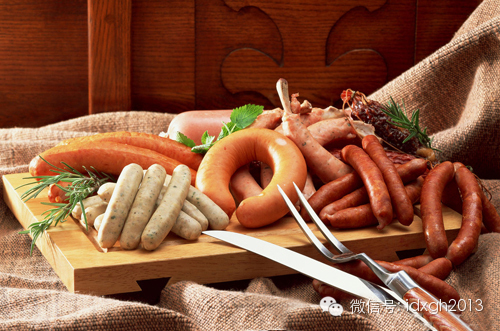
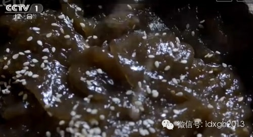
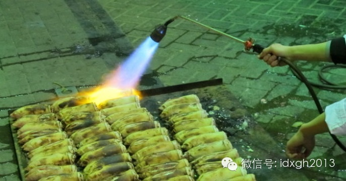
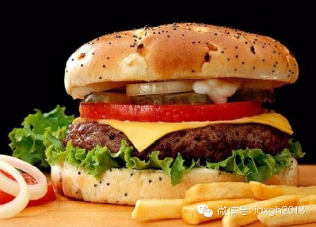
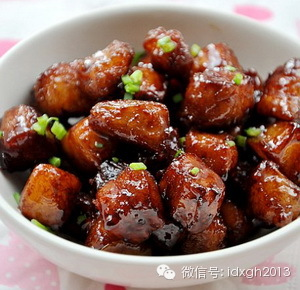

**对食材“敲骨吸髓”式的综合利用程度，真正体现出了中国饮食文化的博大——不断从生存环境中扩大食物来源，某些被中国人纳入食谱的植物，甚至有害健康。这种“博大”从何而来？**

**  
**

文/黄章晋

  

在中国人看来，祖国饮食文化与中医、武术一样，源远流长、博大精深且独步天下。

  

精深、独步全球与否，我们将在这个系列的后续文章中讨论，但中餐的博大举世无双，应当毋庸置疑。

  

博大首先体现于自然条件。中国地跨寒温带、中温带、暖温带、亚热带、热带，境内有高山、丘陵、平原、江河湖泊和海洋，因此食材类别极为多元。

  

第二个则在于中国人“物尽其用”的传统观念。国人不但对食材选择百无禁忌，并且对每个可食部分都会以专门的烹饪方式予以利用。《舌尖上的中国》第一季中第一集就以《自
然的馈赠》为题，强调了中国饮食文化的这一特征。

  

以物尽其用为典型特征之一的中国饮食文化，是如何发育出来的?

**  
**

**【“吃掉所有动物的能力”】**

  

1980年代初，哑剧《吃鸡爪》夸张展示了中国人民在利用动物蛋白上的勤劳和机智。同期，央视台某生活栏目曾介绍各地如何利用鸡爪，脱颖而出的当然是一位精致的上海人
。这位鸡爪爱好者的绝活，是把鸡脚腕后那几根细小的骨头啃咬干净后制作成牙签。

  

在多数国家会遭歧视的鸡爪，在中国至少有制作成凤爪和煲汤两大烹饪类别，对食材“敲骨吸髓”式的综合利用程度，真正体现出了中国饮食文化的博大。

  

中国人当然有理由嘲笑其他国家对食材利用率的低下和烹饪方式的单一。在中国肉类消费中占绝对比例的猪身上，猪耳、猪蹄、猪尾都能被送进肠胃。同样是爱吃猪肉的德国人，
他们除了肘子之外（肘子基本也只有一种做法），就只能做成香肠——而且猪的所有部位都可以制成香肠。

_德国各式各样的香肠_  

  

相信不少人应该能判断出来，中国人对食材，尤其是对动物性食物的充分利用方式，很大程度上是长期食物相对匮乏导致的。也因此，智慧似乎并不为中国之外的世界所欣赏。有
本叫《不足挂齿的烹调法》的书，以略带嘲讽的口气介绍中国人拥有“几乎将所有的动物当作食物来吃的能力”。

  

中国现代烹饪的形成时间并不久远，很多构成中国人重要热量来源和调味品的食材，明代才进入中国；而现代菜系的形成和分化，则始于清末。中国形成与其他文化截然不同的饮
食文化，主要是在明清两代。值得一提的是，欧洲今日饮食文化的成型也是这个时期，对应起来，大致以工业革命为分界点，向前后各拓展两个世纪。

  

欧洲饮食较中国饮食的营养更为充分，并非工业革命的结果。年鉴学派历史学家对工业革命前西欧人的食谱有详细介绍。自十四世纪黑死病之后，欧洲一直处于营养和热量改善的
上升通道，部分地区十七世纪末的人均肉类消费量已达到1990年代初中国城市人口的消费水准，个别城市甚至高于今日中国城市人均肉食消费水平。

  

中世纪后欧洲人营养的大幅改善，由英国开始，再是低地国家，然后是今天的德国、法国。工业革命后速度大大加快。十九世纪末已开始第二工业革命的国家，即使是温饱线上挣
扎的穷人，也渐渐摆脱了土豆、玉米和薯类等高热量低营养的主食。而中国人在1980年代改革开放前，始终没有脱离靠高热量低营养食物果腹的生存境地。

  

人类社会自进入农业文明后，扩大了提供热量的食物来源，可以养活更多人口，但蛋白质的摄入量却始终不足，尤其是动物蛋白。它使得农业文明时代的人在体格和发育上明显弱
于狩猎时代。相比中世纪后的欧洲，中国在营养水平上又处于更低标准。

  

周期性地达到生产力水平允许的人口极限，迫使中国人不断从生存环境中扩大食物来源，甚至植物性食物亦是如此，某些被中国人纳入食谱的植物，甚至有害健康。人类从进化中
获得了一份珍贵的礼物：不可口者多有害。

  

不那么可口的野菜——往往以苦、涩为特点——甚至被极其贫困地区当作主粮，譬如《舌尖》第二季《心传》中提到的“蕨根糍粑”，即含有大量原蕨苷。这种成分使蕨菜称为目
前人们发现的唯一一种具有致癌能力的食用植物。

_《舌尖上的中国》第二季中，撒上芝麻的甘甜蕨菜糍粑。然而蕨菜是致癌的，经过烹饪也不能完全去除致癌物_  

_  
_

**【人口密度决定怎么吃】**

  

今日欧洲饮食文化中，熏肉、香肠种类之庞杂，也许是在制冷技术发明前，肉类就占据相当比例而催生出来的。在今天看来，这种肉类加工烹饪方式与中国相比，可谓时间和人力
效率上的极端：欧洲是朝着节省人力、时间和燃料耗费的方向发展，而中国则是朝着耗费更多人力、时间和燃料的方式发展。

  

例如，由于大部分欧洲农家都有全套设备，从屠宰到制作成香肠，只需要三个成年人，四个小时就可完成全部工作，食用时只需要取出切片。而中国人以传统方式将一头猪宰杀后
变成餐桌上的食物，花费的时间和人力恐怕是其百十倍。

  

这两种不同的方式，前者是我们熟悉的注重提高效率的工业化方向，而后者，通常称为“内卷化”。“内卷化”一词存在不同定义，这里的用法取自黄宗智在《长江三角洲小农家
庭与乡村发展》一书中的解读：

  

因为中国农业技术发展较早，人口很早就达到当时经济水平所能承受的上限，故宋代达到人口高峰后，技术和生产组织不再朝着节省人力方向发展，而是朝着可让更多人“糊口”
的方向发展——劳动力相比可提高效率的机械要便宜得多。

  

历史学家们很早注意到，中国曾在机械技术上领先西欧，但自十世纪起，西欧在中国人还在依赖畜力人力生产时，就开始大量使用风力、水力机械，到了工业革命前夜，这些技术
已经较为普遍且在某些方面达到极高水平，例如钟表制造。

  

而中国的“内卷化”发展甚至出现了技术的倒退。1756年英国诞生的珍妮纺织机最初只有8个纺锭，而1316年出版的王桢的《农书》中记载和描绘的大纺车，有32个纺
锭，较工业革命标志之一的珍妮纺织机早400余年。这种可用水力驱动的机械很快就被淘汰，因为中国纺织业自明代起全部变成家庭化生产。

  

总体上，西欧的技术进步是向着节省人力的方向发展，而中国却是向着使用劳力的方向发展。其分界线即始于人口密度大大增加的南宋。

  

自汉到宋以前，中国人口始终在7千万以下，宋代中国人口超过1亿，虽然蒙元入侵造成大量人口死亡，但明代因为可提供高热量且易栽种的玉米、土豆等作物的引进，人口达到
更高峰值，有专家甚至认为在满清入侵前曾达到2亿以上。

  

而欧洲在罗马帝国灭亡到工业革命前的历史上，人口密度从来不曾达到中国水准，在黑死病造成大量人口减员前，欧洲人口密度较高的西南欧，其人口密度大约只有宋代中国南方
人口密度较低地区的三分之一。

  

人口密度会对人们吃什么、如何吃有决定性影响。在欧洲，不但农业耕作始终大量使用大型牲畜，而且留有大量土地保持半耕半牧，而中国除耕牛外，大部分地区没有其他大型牲
畜，牛如此重要，使得中国长期禁止屠宰耕牛。

  

中国人对肉食的烹饪也带有内卷化的典型特征。对肉类食物每一部分都以不同方式精细加工，其基础便是对人力极大程度的使用。猪耳、猪蹄等不易剔除表皮粗毛的部分，必须施
用特殊的工具和技术，并辅以较高的工时。

_现在去除猪蹄表面粗毛的技术已经快速升级了_

_  
_

就猪身上可食用部分的利用效率而言，德国人丝毫未见得比中国人低。比如猪血、猪内脏、猪脑髓、骨髓等等，德国人同样绝不浪费，只是，他们将之统统打碎，分类灌制，做成
各种口味香肠——德国的香肠种类之多，即源于此。

  

当然，为了吃到一口肉，对严重缺乏肉食的中国人来说，无论耗费多少人力都是值得的，人们对食物上愿意花费的人力、时间和精力，与其珍贵程度成正比。所以，只有食物尤其
是肉类匮乏的人民，才会穷尽自己的才智，为了每一点点珍贵的肉食都变得可口，单独发明出更多的烹饪技术。

  

**【当食物丰富之后】**

  

由于肉食充分，欧洲的烹饪技术带有强烈的大口吃肉风格，即便是烹饪技术精湛的法国、意大利也是如此。而缺少肉食的中国人，自然会演化出小口吃肉的烹饪方式——只要是肉
，都尽可能切分成小块，与各种配菜充分搭配，让有限的肉食提供更多肉食的美味享受。相对而言，中国的烹饪较之肉类充足的饮食文化，油盐的口味都更重。

  

随着中国人均肉类消费量的跨越式增长，传统中国式耗费人力时间的烹饪方式正在逐渐消亡。今天的中国人，越来越多地倾向于购买便于简单烹饪的肉，虽然内脏等部位依然被视
为肉食，但家庭烹饪已越来越少选择它们作为食材。

  

虽然买个猪头回家，如何用松脂甚至沥青之类拔毛火烫，再反复侍弄的技术，依然留存于一代中国人的记忆中，但实际上这种情形已至为罕见。继承中国传统复杂而琐碎烹饪技术
的任务，被交给了餐馆。

  

我们或许不免揣测，下一代中国人，将不会再视猪牛羊身上各个奇怪部分弄出来的菜为美食，而是变得像西方人一样，只接受“正经部分”口感均质、稳定的肉食。在肉类变得极
大丰富时，以“炒”为主要特征的传统烹饪方式便不太合适了。

  

或许中国人很难理解，中餐竟被美国一家名叫“公共利益科学中心”的组织指称热量过高——难道因为热量过高而被称为“垃圾食品”的不是美式快餐么？其实美式快餐在营养构
成方面尚可。西方人的普遍肥胖，惊人的糖摄入量也功不可没——有趣的是，中国人对甜味的耐受力普遍较低。

_征服世界的洋快餐_  

  

中餐的问题是由于“炒”的方式决定了油多盐重，不但热量高、盐重，并且往往营养不均衡。一盘炒蔬菜的热量很可能就接近正常人每天应摄入热量（2000卡）的一半。事实
上，今天中国餐馆中提供的中餐，热量只会比美式中餐更高。

  

今天中国人均食用油消费量达到22公斤，不但超过日韩，还超过了欧盟，虽然距世界人均消费最高的美国的32公斤尚有相当距离，但中国还有大量生活标准较低的农村人口，
根据2011年对中国农村食用油消费量的一个统计的数字计算（人均7.48公斤），以及中国城市人口占53.73%计算，中国城市人均食用油消费量是34.50公斤。

_重油家常菜代表——红烧肉_

  

而美国食用油的消耗主要是快餐店的炸煎。高温快速煎炸下，食物表面形成较为致密的外壳，令进入食物本身中的油脂并不多；而中式炒菜，烹饪油会全部出现在餐盘中，若算上
具有中国特色的食用油回收再利用技术，中国人进入口腹中的油脂更是严重超标（抽样调查的北上广油脂摄入量至少是建议量的2、3倍）。

  

基本上所有饮食文化都形成于食物匮乏的年代，而人类在生存压力下进化出了强烈的对高热量食物的偏好。所以，在食物充裕的今天，我们谈论的饮食往往显得不那么健康，很容
易摄入热量过多，中餐即为表现突出的一例。

  

_（近期大象公会将推出谈论饮食及相关故事的系列文章。接下来，有关美食中的势力与偏见、餐饮行业的政治经济学、美食之都在哪里，都是我们探究的话题。敬请留意）_

  

> 版权声明：  
大象公会所有文章均为原创，版权归大象公会所有。如希望转载，请事前联系我们： bd@idaxiang.org

大象公会：知识、见识、见闻

微信：idxgh2013

微博：@大象公会

投稿：letters@idaxiang.org

商务合作：bd@idaxiang.org

  

[阅读原文](http://mp.weixin.qq.com/s?__biz=MjM5NzQwNjcyMQ==&mid=202430397&idx=1&sn
=83769463e658bb61807f8a134f9ab63c&scene=0#rd)

