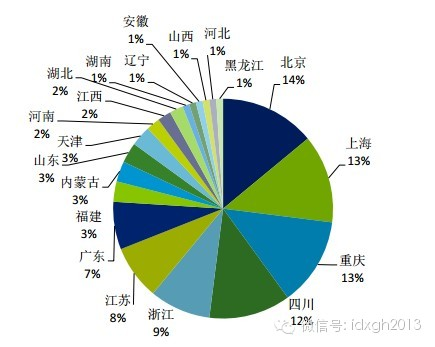
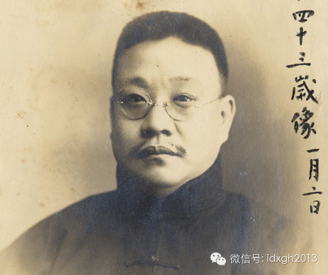
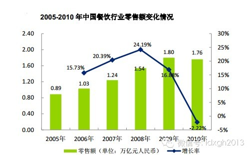
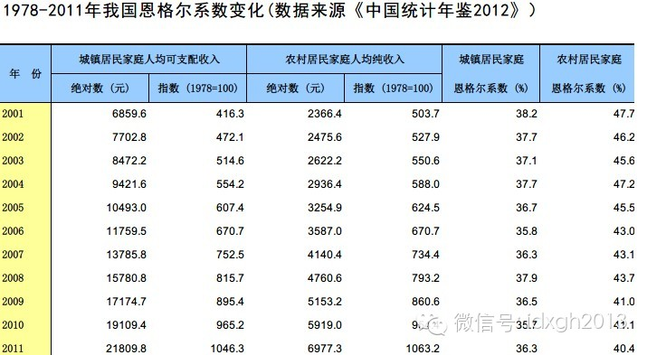

**历史上，有钱有闲的超级食客创造了中国丰富的烹饪文化，当中国人今天整体变得有钱有闲时，中国烹饪文化正在经历一次面目全非的改造。**

****

文/潘游

也许有人纳闷，为什么自己家乡的菜很不错，却没在中国著名菜系中占有一席之地。没错，中国很多地方都有值得一说的地方小吃，然而，它们却很难支撑起站得住脚的菜系——
路边大排档的师傅或许有几样特别拿手的小吃，但善做卤煮、炒肝还算不上是烹饪大师。

  

如果摊开地图，无论是鲁川粤淮的四大菜系（排名不分先后）和在此基础上加了闽浙湘徽的八大菜系（同样不分先后），可以清晰看到：列入榜单的菜系基本上多在东部和南方，
多毗邻水路。最早的四大菜系尤为明显。

  

在铁路、公路诞生之前，运河、江河、近海是中国大宗物流的主要通道。前现代社会的经济与社会发展受制于自然环境，穷乡僻壤或缺少自然水道的人口密集区，注定只能诞生本
地人津津乐道的小吃，而不会发育出被普遍认可的菜系。

【超级食客的贡献】

用省份来划分美食，或有过分粗略之嫌。因为省一级行政单位实际并不严格按照民系或共同的地理气候来划分，而民系共同体决定了风俗习惯，地理气候决定了出产，此二者对菜
系的形成格外重要。菜系虽以省命名，实际上却形成于其地方性的商业中心——它往往也是航运中心。无论是鲁之胶东、京杭运河畔的孔府、巴蜀的上河（成都）下河（重庆），
还是粤之广州、安徽的徽州。

  

经济相对发达的区域商业、物流中心，才有可能汇集更多更好的食材，才会出现能够消费美食的富裕阶层。不过，在传统农业社会，餐饮业市场规模极为有限，能消费得起像样菜
肴的，只有极少数富商、权贵。因此在中国现代菜系形成之初，论及对烹饪文化的贡献，官宦富豪家庭的宴请攀比，要比餐饮业自身的市场竞争的更大。

  

中国各地方菜系的介绍文字中，往往把自己的历史追溯到秦汉时期。但是，直到明代晚期，形成地方风味差别的辣椒、土豆、番茄等重要食材才进入中国，而各种发酵酱料、熏制
、腌制等技术的成熟稳定都是比较晚近的事。因此，清末才开始出现的菜系之说，较能反映其真实历史的演进。

  

公认较早形成独特烹饪技术和风味的，是淮扬地区、济南府、广州府。这三个地区毗邻重要运输水道，因此富商云集的特征最为明显。而四大菜系中，这个特征最不明显的，是四
川，它也是四大菜系中最后形成的一个。不过，它同样是超级食客推动烹饪技术的绝好例子。

  

在近世川菜菜品定型的过程中，餐馆“正兴园”起了相当重要的作用。清末太平天国荼毒江南，较安定的四川一举成为新的粮赋中心，聚集了一批有消费能力的富商高官。平民百
姓的“下九流”小吃显然不能满足这些超级食客的饕餮之欲，满族厨师关正兴咸丰年间在成都开办餐馆后，即为官商富豪提供上门包席服务。这个以北方菜特点为主的餐馆，因一
位官宦世家的食客周善培，在民国初年得以被重大改造。

  

清代官制规定，官员不得在家乡本地任职。“宦游”就成了为官者及其家庭的常态。同时，东部、江南等地读书人甚多，在科举中一直占据优势，因此淮扬、杭帮菜肴成了宦游者
们眷恋的家乡味道。

  

周善培本是浙江诸暨人，青年时代即跟随当营山知县的父亲周味东定居四川。他利用南方烹饪技艺，结合四川当地食材，做出的“周派”菜品，为正兴园注入了南方特点。正兴园
此后培育出了大量川菜厨师，一个菜系因此产生。

  

如今被认为是川菜代表之一的宫保鸡丁，也有类似的命运轨迹。贵州人丁宝桢任四川总督时，要求家厨用鲁菜中的爆炒方法改进本地的青椒炒鸡丁，遂产生了此菜。后来，丁宝桢
官居东宫少保，“宫保”由此得名。

_得益于荟萃南北的改造，在如今中国餐饮业百强企业的地域分布中，我们可以看
到四川、重庆占到了四分之一的比例。_

今日与川菜一同横扫中国大陆的湘菜，似乎与川菜一样，也有明显的外部引入特征。只不过川菜是外地超级食客引进烹饪技术，而湘菜引进外地烹饪技术的则是本地超级食客——
民国初期著名的谭延闿。

  

谭延闿之父谭钟麟原籍湖南茶陵，担任两广总督时镇压过孙文革命党，家厨以来自潮州的粤厨为主。儿子谭延闿生于其早年任职过的杭州。自幼吃遍大江南北的谭延闿在清廷覆亡
后，出任湖南都督。1920年，曾主导“研发”了诸多谭家菜的家厨谭奚庭单飞，在长沙经营“玉楼东”酒家。这位善做江苏菜、潮汕菜的厨子，将对清淡、鲜美的追求，带入
湘菜。

  

_谭延闿像_

通过考察近世菜系形成过程中的关键人物，我们不难得出这样的结论：四大、八大菜系都可溯源至鲁、淮扬、粤。

  

长三角、珠三角地区在烹饪文化中的强势，不仅来自权贵家族的积淀，并由其带到、影响了全国各地，即便是无产阶级革命家，也因在革命生涯中足迹遍及全国，而对各地美食有
着清晰的认识。

  

在各种传记和回忆录中，毛泽东给人留下了眷恋家乡口味的强烈印象：1949年以后，毛泽东的厨师应该都是湖南人。但事实并非如此。

  

毛的厨师大多来自上海、天津、杭州等地，甚至大多有过高级西餐馆经验。来自上海锦江饭店的厨师苏林发，在中南海的厨师界被认为擅长做粤菜。毛泽东对他做的菜肴冰糖肘子
和烙青鱼甚为喜爱，以致派人找他一起合影留念。而蒙哥马利访华时，令其赞不绝口的毛的主厨，是十三四岁就去天津惠中饭店学艺、很早就接触到西餐制作技巧的程汝明。而毛
的西餐厨师庞恩元，在1949年前就于北京饭店工作，成为了毛身边工作时间最长的厨师。

  

今天，毛氏红烧肉是多数湘菜馆重要的招牌，然而其烹饪风格显然带有强烈上海本帮菜特征，它由本帮菜而成为湘菜招牌，不知是否有毛泽东的缘故。

【中产阶级的力量】

高端烹饪有赖于食不厌精的超级食客群体，而地方小吃的水准则有赖于本地普通之家的富裕程度。虽然近世的北京作为政治中心，成为鲁菜真正发扬光大之地，但相较于南方，北
京下层居民要贫困得多。相对而言，由于存在较富裕的中间市民阶层，长三角和珠三角的地方民间小吃精细得多。

  

同情中国革命的美国作家安娜**路易斯**斯特朗在《中国人征服中国》中提到，一位生于北京的同志曾这样想象革命后的美好生活：“等咱们解放了北平，我一定请你吃一顿
炸酱面。”

  

不过，改革开放前的三十年，中国服务业的集体化改造，中间富裕阶层的消失，使得中国几乎不存在仍有创新和竞争意识的餐饮业，如果中国还存在烹饪文化的话，它也只是一种
标本意义的存在。

  

今天中国人熟悉且引以为豪的烹饪文化，实际上是最近三十年迅速富裕的结果。餐饮业迅速由饮食需求温饱型向享受型转变。空前广大的餐饮市场，使得大众餐饮第一次成为推动
烹饪技术进步的力量，而厨师“研发”新产品，不再需要富商、官宦的财力，市场本身就可以提供这种机会。

  

竞争带来烹饪技术的创新和互相融合，使得传统社会泾渭分明的地方菜系风味之别，逐渐被抹去，尤其是在人口流动程度更高的大都市。而传统社会富商官宦阶层享用的美食，今
天迅速“沦为”大众美食。

_餐饮业的销售总额在社会消费品零售总额中的占比_

也许中国人有理由认为，自己是全世界最热爱美食享受的。香港大学一份社会调查发现，香港在迅速进入富裕社会后，饮食支出占其日常消费的比重（即恩格尔系数）并没有像西
方发达国家一样显著降低。中国大陆的情况与香港相同，尤其是中国城镇居民最近十年来的恩格尔系数只有非常微小的下降。

  

而餐饮业的销售总额在社会消费品零售总额中的占比，一直在稳步上升——表中2010年的下降，是由于改变了统计口径。2009年以前，国家统计局餐饮行业零售额包括餐
饮与住宿两部分，2010 年开始，国家统计局餐饮行业零售额只包括餐饮部分，住宿部分另计。

_ _

_1978--2011，我国恩格尔系数变化_

中国城镇居民越来越多地在餐馆而非自家厨房解决吃饭问题，并非恩格尔系数中国例外论的有力解释——发达国家恩格尔系数下降时同样如此。中国与发达国家恩格尔系数表现差
异，或许最大的原因在于饮食文化的区别。

  

在中国，餐饮很大程度上扮演了社交媒介，无论是亲朋戚友感情交流，还是政商间的洽谈交流，餐桌的地位始终没有因为财富增长而动摇。自宋代高脚家具发明、中餐演变为合餐
制后，这种围坐在一起的集体进食方式，就格外适合边聊边吃。在同样是宋代才有的高度蒸馏白酒的助兴下，进餐时间更被拉长，适合交际。

  

而西方发达国家，餐桌并非重要的社交平台，无论是打发闲暇时间还是社交活动，相比中国人都有更多元的手段和方式。在酒吧、咖啡馆已经遍地的一线城市，以及有着深厚泡茶
馆文化的四川地区之外，相比西方社会，中国人打发时光、交际谈事的场所，往往在饭桌上。总之，中国人富了，但花在餐桌上的时间和金钱也更多了。

【传统菜系将会消亡？】

经济高速发展对中餐的重新塑造，有些是无法通过个案的变化察觉的。1990年代起，烹饪文化的交融，使得较大的中餐馆越来越多地向全能型方向发展，同时能涵盖多种菜系
、能做上百种菜肴，这种规模较大的全能型中餐馆，集中地体现了中餐繁复博大、随心所欲的烹饪文化特征。

  

这种全能型大酒楼，高度依赖强大的厨师团队的专业水平和创造能力。它从质量稳定到物流管理上都面临极大的难度。尤其是与同期开始悄悄在中国登录的境外餐馆相比，后者从
研发到大批量的食材采购及验收、以及仓储、加工，配送直至门店的最后一步操作，在质量的稳定和成本控制上都比全能型餐馆更具优势。

  

虽然喜欢享受型饮食的中国人并未改变自己的口味，但近十年来，中国餐饮业的格局却发生了剧烈改变，菜式更少、菜谱更薄的正餐馆和快餐的增长速度远远高于全能型餐馆，这
一点在发达城市表现得更为强烈。尤其最近两年，全能型大酒楼不但绝对占比迅速下降，越来越依赖公务消费的全能型大酒楼，过去一年甚至出现了绝对额的下降。

  

与之相对的是一批国内品牌连锁快餐的成功。标准化的快餐馆以及只做少量菜肴的正餐馆的大量出现，不仅是对中国餐饮业标准化的重塑，更是对中餐文化的巨大冲击，它在解决
了厨师师徒授受的低效传承难题之时，也正在消灭传统的中餐厨师。

  

能鲜明体现这一趋势的是火锅店和鸭货。前者因避免了复杂的技术，后者以相对单调的制作方式和取材部位，率先实现了标准化。接下来改造的对象也会不可避免的延展到复杂的
菜系上——N大菜系之说成为过去，或许我们很快就会看到。

  

除了市场化这只看不见的手之外，看得见的手在中餐标准化的过程中，甚至也发挥了巨大作用。“沙县小吃”这种并非统一集团公司运营，但口味差距相对较小的模式，便是福建
沙县官方的推动的。

  

这种基本只允许沙县本地人和外地亲戚经营、且有同业公会的培训以及相关政策文件《沙县小吃配料生产、加工和销售行为规范标准要求》的成套解决方案，克服了中餐标准化过
程中比较薄弱的地方。

  

大陆的市场化餐饮行业，恢复的时间也就只有三十年多一点，因此依然在快速的演进当中，许多我们今日常吃的菜品，如大盘鸡，其实发明只有十几年。随着城市化的推进，社会
结构、生活方式的改变，十几年后，我们见到的中餐，必定与今天大不一样，只是我们每个人都在十几年间的每顿饭中见证这个过程，以至于不会明显的察觉出来。

> 版权声明：  
大象公会所有文章均为原创，版权归大象公会所有。如希望转载，请事前联系我们： bd@idaxiang.org

大象公会：知识、见识、见闻

微信：idxgh2013

微博：@大象公会

投稿：letters@idaxiang.org

商务合作：bd@idaxiang.org

  

[阅读原文](http://mp.weixin.qq.com/s?__biz=MjM5NzQwNjcyMQ==&mid=202699478&idx=1&sn
=4ca4ab92cf62b09d0c8ee7bcb78354a3&scene=0#rd)

