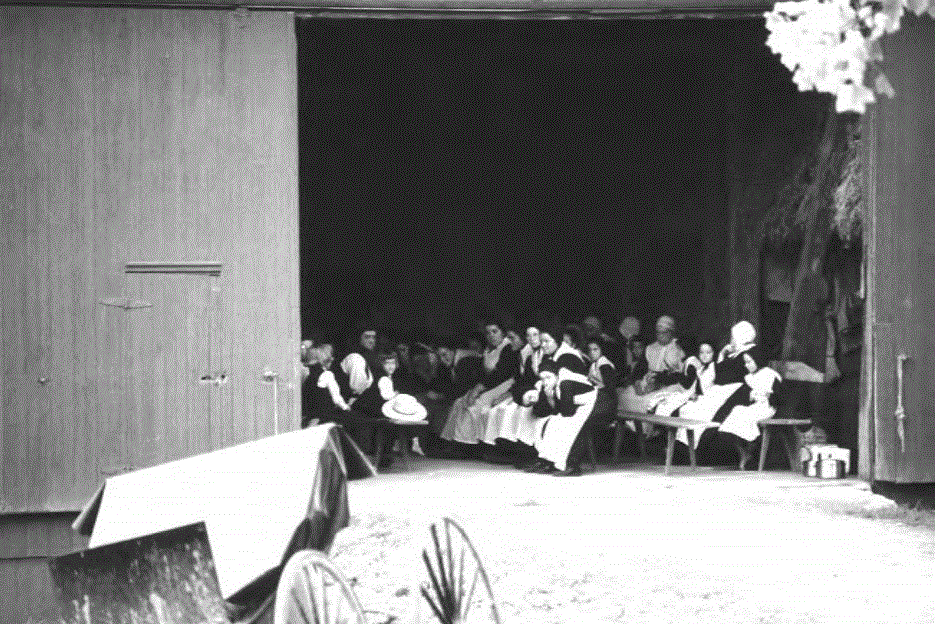
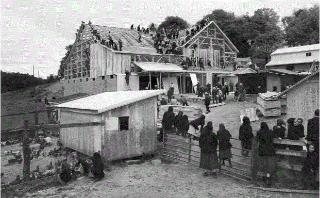

**美国的阿米绪人社会，实践的是孔子等先贤大哲梦想的德治社会，在美国这个开放而剧变的社会，不但他们的社会存续时间比孔子生活的东周时代还长，其社会规模扩张得也极为迅速。**

  

文/辉格

  

除了人治社会和法治社会模式，东西方无数哲学家还梦想过德治社会——秩序不依赖特定个人意志，同时秩序不靠强制力，而是靠教化、规诫等和平手段维持，但是，这种乌托邦
梦想收获的往往是灾难，最后总难免沦为人治社会。

  

不过，道德乌托邦的实践并非全都失败。阿米绪人在美国建立的自治社区堪称孔子式理想社会的典范。

  

阿米绪人是16世纪源自瑞士德语区的基督教再洗礼派的一个分支，17世纪始定居美国。其社会秩序近乎完美，无论社区内、社区间，还是与阿米绪社会之外的美国人，极少发
生暴力冲突，犯罪率几乎为零。和再洗礼派另一分支胡特尔人一样，北美阿米绪社会也非常兴旺，人口从1920年的5000增长到了2013年的28万，这还没算不断流失
到主流社会的人口。

  

阿米绪人至今仍以宾夕法尼亚德语为母语（高地德语的一种方言），避世索居，远离政府，极少求助司法系统，从不打官司，其秩序全赖社会成员对教规的遵守，且教规的执行并
不借助强制手段。

  

假如孔孟再世，恐怕也很难再要求更多了，他们是怎么做到的？

  

【小国寡民的道德社会】  

  

阿米绪在许多方面和胡特尔相似（见大象公会往期《美国最成功的共产社会是如何建成的》），社区（即他们的教区）规模低于150人，其互惠关系可由相互熟识而得以维系，
同时小规模也避免了等级分化，高度依赖父系家族纽带，其互惠意愿因亲缘关系而强化；牧师的非专业化和限于初中程度的教育，消除了宗教的理想主义，更多注重行为而非观念
，因而事实上成为一种道德规范而非信仰体系。  

  

不同的是，阿米绪不实行共产主义，各家庭拥有自己的土地和住宅，经营自家产业，自己抚养幼儿，自行选择学校。  

  

但同时，从衣着、器具、设施、消费和娱乐，教规对各社区都有着严格而细致的规定，比如不得装电话（只能用公共电话亭）和室内管道，不得拥有汽车（一般都用马车），不得
接通市电（可以用柴油发电机）等。

  

阿米绪有许多全社区共同参与的公共活动，比如婚礼、葬礼和建造住房和谷仓这种需要大量人手的工作，这种集体活动强化了互惠关系和共同体认同。最重要的是每两周一次的宗
教集会，轮流在各家谷仓内举行，除了例行的礼拜诵经唱诗聚餐外，该集会的主要功能是作出集体决策和执行社会规范，长老们对违规行为提出告诫，对严重违规作出处罚决定。

_正在谷仓里举行的周日教区集会_  

  

__建造房屋的阿米绪人，_参与的男人有90多位，大概包括了该社区的全部成年男性_  

  

另外，规则体系的自我完善也是集会的重要内容，比如出现新情况后，是否需要制定新规则或修改即有规则，总之，它可以随时调整规则，以应对任何可能对既有秩序造成冲击的
因素。  

  

阿米绪人建成的熟人社会也喜欢相互窥视和议论，个人生活毫无隐私可言，因为身为同教区的教友，这种做法天然具有道德合理性，被鼓励和赞许，并不会像其他社会那样被指责
为多管闲事的长舌妇。

  

所以，阿米绪人中的任何出轨行为（比如帽子款式或砧板尺寸不合规）都很快会传到长老耳中，长老则会上门劝诫训导当事人，若后者不及时悔过和纠正，问题就会被提交到下一
次宗教集会上，假如集会上的公开谴责仍未能迫使出轨者悔过改正，长老们就会逐渐增大压力，包括惩罚警告和通过家人亲友施压。

  

【无强制如何维持秩序】  

  

不过，阿米绪社会规范最有力的执行手段，是忌避制度，出轨者屡教不改，就可能被（有限期或永久性的）革除教籍。一旦被革除教籍，包括其家人在内的所有社区成员包括便立
即对他实施忌避：不同桌吃饭，不交谈，避免直接授受物品，甚至避免目光接触。  

  

这种特殊社交排斥是群体内强化互惠关系的有效策略。在两两博弈中，简单有效的策略是一报还一报，但当信息更丰富，参与者不仅能记住双方交往历史，还能从闲谈中获得对方
与他人交往历史时，更有效的策略是恶人回避，即不与有过不良记录的人发生互惠关系。

  

在通常的熟人社会中，社交排斥是分散自发进行的，但阿米绪社会中，它变成了一项集体程序。革籍和忌避一旦经由正式程序集体决定和公开宣布，就变成社区内所有人的集体行
动。

  

从社会心理学角度看，社交排斥是一种严酷惩罚，遭严格排斥者会异常痛苦和不安，除非他恰好有社会性心理障碍，否则几乎不可能继续在社区生活下去，最终要么悔改，要么离
开。

  

道德社会常面临的一个问题是亲属袒护，阿米绪人的血缘纽带一方面强化了互惠意愿，但也会给规范执行留出漏洞；以家族为组织基础的社区，常会默许容忍亲属袒护，儒家也推
崇亲亲相隐原则，这样一来，遭遇排斥者总是能在家庭和亲族中找到庇护所，这就大大削弱了社交排斥作为惩罚手段的效力。

  

阿米绪令人惊异地克服了这一困难，忌避一旦宣布，通常会得到家人亲友的严格遵守。或许宗教起了关键作用，教友的共同信仰和对规范的认同，胜过了亲缘关系的感情因素；同
时，阿米绪在随人口增长而分割社区时，会小心避免同姓单一家族的社区，这与中国华南宗族社会中大量单姓村形成鲜明对照。

  

阿米绪教规中的有些规定——诸如马车轮上可否包橡胶轮胎，草帽的平檐可否改成卷檐，厨房案板该多长多宽——看起来极为琐碎，似乎没有什么实际意义。但实际上，它有很强
的现实制度功能，穿着、仪表和器具这些看似琐碎细节上的一致，可以强化文化认同，并拉开与周围外人的距离。  

_马车是阿米绪主要交通工具_  

_  
_

更重要的是，覆盖生活每个细节的规定，让规范执行者有了深度介入私人生活的理由，也制造了社区的规范执行机制保持连续运转的机会。假如没有这些琐碎规定，规范机器就容
易因长期不运转而生锈。  

  

另外，德语民族的高不确定性规避文化或许也起了作用，荷兰社会心理学家吉尔特**霍夫斯泰德曾用4个维度量化比较各国文化特性，其中一个维度是不确定性规避，德语民族
该指数值很高，这样的人比较刻板和守规矩，喜欢有一套明文规则来规定生活的每个细节，如此才觉得安心。

  

【如何屏蔽外部诱惑】

  

道德社会时刻面临社会外部规范的竞争，假如社区成员觉得某些外部权威更有智慧、更有人格魅力，其价值体系更有吸引力，就会在争议中加以援引，这会挑战社区长老的权威，
而一旦冲突引向理念之争，阿米绪长老绝无优势，因为他们都只受过初中教育，也很少接触外部世界，讲不出多少大道理，更无智识优势。

  

但阿米绪社会巧妙地杜绝了外部权威的影响：孩子们多在只有一间教室的社区小学接受教育，教师是初中毕业不久的未婚阿米绪女孩。公立学校中通常会被宣扬的国家历史、民族
英雄、主流价值观、科学成就、创业事迹，对阿米绪儿童影响很小。  

  

因为阿米绪人不参与政治、不任公职、不诉讼，外部世界的法律权威、法官的威严、长官的权力、政治鼓动、主流政治观念、战争英雄，对阿米绪人都没什么影响；因为绝大部分
现代传媒和流行文艺娱乐活动都被禁止，他们也感受不到文体明星和流行文化的价值号召力。

  

现代社会与传统社会的一大区别是，它是向前看的，而传统社会是向后看的。在传统社会，一个人可能拥有的绝大部分知识，要么在他出生时便已存在于公共知识体系中，他在成
长过程中逐渐习得。要么是他在生活中积累的个人经验，进入公共知识体系中的新知识极少，这意味着，年长者总是比年轻人拥有更完备的知识。  

_专为阿米绪人设计的文字处理机，包括USB接口、_无线_鼠标，键盘上还有触控板_  

_  
_

工业革命后情况倒了过来，公共知识中越来越多的部分是新近出现，长者往往弄不清发生了什么新状况，而年轻人相对更易接受新知而获得知识优势，这自然会冲击长者权威。但
阿米绪限制教育、拒绝接受新事物，或至少将接纳时间推迟很久的做法，似乎成功地解决了这个问题。  

  

在变化迅猛的环境中维持一套与主流社会格格不入的古老传统，显然不是件容易的事，这要求其制度有足够的适应能力，以应对不断面临的外部挑战，阿米绪社会适应环境变化的
一个关键机制，是针对教规的派系分化。

  

每个阿米绪教区都是自治的，可按需要自行修订或增设教规，但近缘教区之间的教规差异通常不大；当差异足够细微时，不同教区就认为是相容的，但假如在某个重大问题上发生
分歧且无法弥合，便会发生派系分裂，少数派另立新支派，150多年来，这样的分裂已产生了40多个支派。

  

教规分化和派系分裂所造成的多样性，创造了一种类似于进化寻优算法的并行试错／优化机制，帮助阿米绪人在捍卫传统和适应变化之间寻找最佳平衡。

  

多样化过程也造成了一个从最保守到最开明的连续光谱，最保守的教区坚持务农以便最大程度避世索居，而较开明的教区则开始经营小企业，雇佣外人，甚至外出打工，逐渐扩大
了与外界的接触和交流，如此也为整个教派拓宽了生存空间。

  

和胡特尔一样，阿米绪社会的成功也离不开其所在大社会所提供的安全环境，任何缺乏强制性司法系统而仅以道德规范维持秩序的社会，都将面临安全问题，即便其制度成功地消
除了内部暴力和犯罪（如阿米绪所做），也难免遭受外部侵犯。

  

在欧洲时，再洗礼派社区都凭借一技之长依附于某位领主而获得庇护，这种寄人篱下的安全从未长久，屡遭迫害与驱逐，只有在迁居北美，进入宽容和法治的大环境后，才得以长
期繁荣兴旺。

  

阿米绪的故事告诉我们，在一个自由社会，你甚至可以实现儒家理想。

  

> 版权声明：  
大象公会所有文章均为原创，版权归大象公会所有。如希望转载，请事前联系我们： bd@idaxiang.org

大象公会：知识、见识、见闻

微信：idxgh2013

微博：@大象公会

投稿：letters@idaxiang.org

商务合作：bd@idaxiang.org

[阅读原文](http://mp.weixin.qq.com/s?__biz=MjM5NzQwNjcyMQ==&mid=202877900&idx=1&sn
=631504061651e1d871b67c4bff006c61&scene=0#rd)

