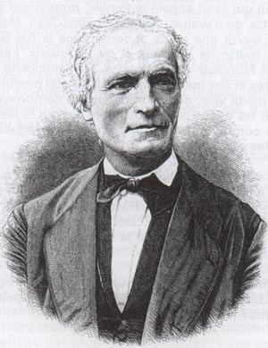
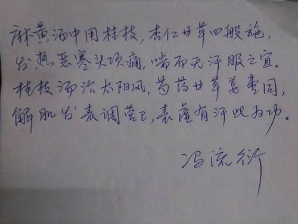
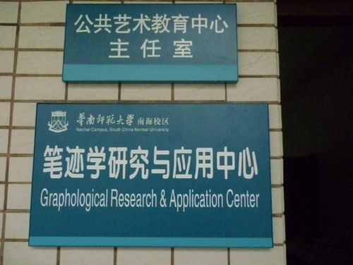
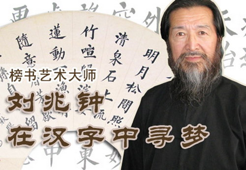
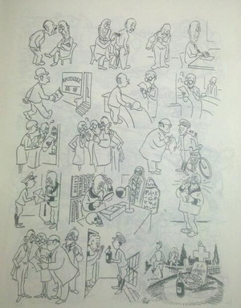
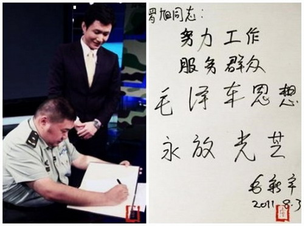
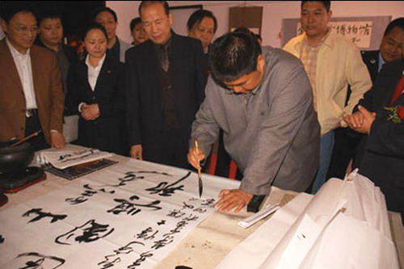
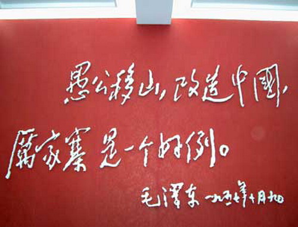

**尼克松曾以这样的开头评价毛泽东和蒋介石：“毛的书法潇洒，字写得龙飞凤舞毫无拘束；蒋的书法拘谨，字写得方方正正一丝不苟。”毛、蒋书法之别，是很多人用来解释毛泽东胜过蒋介石的重要工具。而法国的许多企业招聘时会特意考察笔迹，作为人力资源的重要指标。俗话说，字如其人，真的是这样吗？**

  

**文/胡修卓**

  

练习过书法的人，一定对“字如其人”这一说法不陌生。许多中小学教师往往也强调这一点，反复突出练字的重要性。一旦教学受挫，还可以转移批评方向，借评字旁敲侧击，规
劝学生。

  

多数人默认了类似的观点——字迹圆顺、笔调柔和的人，较亲切，适应性强；字迹工整、方方正正，则性格严谨，注重原则；草书飞扬、放荡不羁，多数情怀浪漫，富有创造力。

**香港中文大学专业进修学院开设的笔迹学分析课程**

  

汉字的独特性，给了这种观点充分的施展空间。尤其是毛笔书法，楷书、隶书、行书、草书、篆书等，流派纷杂，给人们提供了无尽的例子，也总结出了不少规律。

  

西汉杨雄在《法言•问神》卷中写道：“书，心画也；声画形，君子小人见矣”，较早的提出笔迹与人的心理有关。由此形成“书为心画”理论，影响颇深。

  

后世对此阐释并发展最完备的，非清代刘熙载莫属。《艺概•书概》中，刘熙载写道：“书，如也。如其学，如其才，如其志，总之曰：如其人而已”，自此，“书为心画”扩充
成“书如其人”，为更宽广的解释提供了国学依据。

  

但这些解释都限于抽象的哲学领域。第一次用统计方法对笔迹与性格关联的考察出现在19世纪的法国，法国也是目前笔迹学应用最多的欧洲国家。

**Jean-Hippolyte Michon，现代笔迹学研究的鼻祖**

  

1871年，法国天主教牧师Jean-Hippolyte
Michon搜集了数千份手写文件，系统比较文件笔迹与作者性格的关系。他创造性的提取了同一性格者笔迹相同的部分，归纳整理，作为判定字迹者性格的依据。

  

具体判断方法是：如果一个人的字迹中带有某项图形特点，他就应该具有某种个性。若没有，则不具备对应性格特点。

  

此外，Michon还首先提出“笔迹学”概念，并大力推广了自己的研究。

  

笔迹学很快受到刚刚兴起的心理学的注意。如20世纪初，智商测试的鼻祖Alfred
Binet对笔迹学十分有兴趣，认为虽研究条件有限，在当时尚不能支撑任何结论，但笔迹学前途远大，属于“未来的科学”。

  

另一位重要研究者是德国医生William
Preyer。他发现，战争中失去惯用手的士兵，无论是另一只手、还是嘴或脚，写出的字迹都与之前有相似之处。据此，他提出是脑部，而不是手决定了字迹。

  

这一时期，研究尚显零散和粗糙。随20世纪心理学的不断完备，研究方法更加注重实证，实验设计也更加细致。更多的研究者做了笔迹学相关的实验，但是结论却开始不利于笔
迹学学说本身。

  

1960到1980年间，心理学家做了大量的笔迹学实验，其内容大致相同：召集志愿者，完成心理测试，并留下一段字迹。接着让笔迹学家（或其他志愿者）对隐去名字的字
体评估。最后，由实验人员比对评估做出的性格描述和心理测试结果。

  

如1987年，伦敦学院大学心理学系的Adrian Furnham和Barrie
Gunter对64位志愿者所作的实验。这些人年龄各异（18到70岁），男女各半，都完成了艾森克人格问卷（Eysenck Personality Questi
onnaire），获得4个关于性格的分数——神经质倾向（neuroticism）、外向性（extraversion）、精神症状倾向（psychoticism
）以及撒谎的倾向（lie）。

  

之后，志愿者抄写了半页关于茶的描述。随后，13个字迹特征被提取出来，包括字体大小、占页篇幅、词语宽度、连笔程度、写字力度、词间距和是否书写“i”上面的那个点
等等。

  

Furnham和Gunter使用了多种统计方法，但没有发现笔迹特征和性格之间任何明显的关系。

  

冯流衍先生分析鉴定报告书

笔迹分析二十条标准

宽宏：事业卓越（75%）

力劲：创新创造（75%）

厚重：信而多友（75%）

奇异：奋力拼搏（较多）

草率：孤苦伶仃（较少）

飘摇：举步艰难（较少）

柔和：无能自立（极少）

牵飘：举步艰难（极少）

歪斜：借债度日（极少）

粗重：专横无情（极少）

均匀：筹划周全（80%）

规范：长于理事（80%）

圆润：果断利索（80%）

松散：粗心大意（极少）

涂抹：多出差错（极少）

疏朗：慷慨大度（80%）

严谨：谦虚关爱（80%）

中正：忠诚厚道（85%）

圆转：善良通达（85%）

反向：忤逆自我（极少）

  

**网络流传的笔迹分析报告之一**

  

1992年，心理学家Geoffrey Dean对来自不同国家，由多种语言写成的200多篇关于笔迹学的论文进行了元分析（meta
analysis），也就是用数学方法把这些研究的结果综合在一起。

  

Dean分别研究了笔迹学派，发现所有学派的方法都没有效果。同时，不同的专业笔迹学家分析的一致性较差，相关系数只有0.42——讽刺的是，让对笔迹学一无所知的人
作分析，相关系数也有0.3。

  

从统计学上，这几乎宣判了笔迹学的死刑。但是在西方，尤其是法国和以色列，笔迹学仍然广为信奉，人力资源部门尤其偏爱这一手段。

  

1993年，《纽约时报》一篇文章中提到，大多数法国企业定期请笔迹分析学家评估应聘者的笔迹，挑出性格特征最符合职位的候选者。高层管理人员也被要求交出字迹，由笔
迹学家鉴定。

  

根据不同的调查结果，有38%到93%的法国公司定期由笔迹鉴定者参与人力资源管理。

  

以色列是西方另一个笔迹学重镇，他们甚至以此协助国家战略制定，比如战争决策。海湾战争前夕，伊拉克在科威特边境屯军10万，各国战略家为萨达姆究竟会不会出兵争论不
休。以色列情报部门独树一帜，分析了萨达姆行文的笔压、修改等要素，得出其草率、心狠、胆大的结论，十分可能发动战争。

  

1990年8月1月，这份报告被报纸刊发，第二天，伊拉克就发动了战争。

  

当然，这算不上严格的盲测，即使不看笔记，萨达姆性格鲁莽、残暴又有几个人不知道呢？

  

实际上，书写肯定受到神经系统的调控。从这个层面上，同样一定程度上受神经系统影响的性格也许和笔迹有一定联系。但这个联系太过粗糙，以此作为科学依据显得非常荒谬。

  

笔迹受后天培训的影响比重很可能更大。长期的训练会形成一系列较稳定、独立的反应，在学习写字的初期，这种塑造作用尤其突出，所以很多人即使有一定更正意愿，也无法改
正早期的书写笔法。

  

后天的书写培训能很大幅度改变笔迹形态，无论是从字体风格、字形大小，还是笔触轻重。最典型如中国曾有些职业财会学校非常重视硬笔书法，走出来的几百上千号学生，一看
就是一个老师教出来的。

  

当然，汉字的形式与英文、法文等字母文字不同。但截至目前，并没有统计学证据能说明汉字就比字母更能体现出性格特征。

  

不过，中国毕竟特殊，往往有他人所不具备的独特研究道路。1994年，中国笔迹学研究会成立，挂靠中国发明协会之下。2010年，该研究会更名为“中国笔迹学会”（筹
），并在合肥学院召开第1届年会。

**2011年华南师范大学南海校区笔迹学研究与应用中心成立，这是高校第一个笔迹学研究中心**

  

根据2014年中国笔迹学会（筹）在华南师范大学的年会，与会者共做了如下的专业报告：《笔迹泄露你的秘密》、《一秒读心术：懂得笔迹你就赢》、《笔迹分析与人力资源
》、《一眼看透“TA”的心》。

  

由其副秘书长等人发起的“笔迹•读心网”中，中医、书法等研究方法广泛出现。其中一篇由书法家刘兆忠大师写作的《字如其人的科学依据》中，笔迹学跨越了辨别性格的狭隘
应用范围，能够指导医学治疗：

  

“人体的哪一部分有疾患，和人相向对应部位的字的笔画不是过疏就是过密，弯曲变形，长短增减笔画不合法度，甚或笔误迭生。据此，就可以根据一个人的笔迹，观察健康和疾
患状况，以书写者的思维方式、智力、气质、性格、情感、行为方式等”

  

以此理论，作者发现了判断感冒的良方：“在离位的左右，如果字头的横画短，护不住左右，或左右处空隙大，书写者好外感风寒邪气，容易感冒,或有气管炎。”

  

另一种情况是﹕“用毛笔写字，有的湮成一团，不辨笔画，只现轮廓；钢笔字单个写错后又被抹成一团，表明此人正患感冒。”

  

还有对人身体各个部位的快捷诊断方式。如脑震荡和痔疮：“中宫稍下,如果相邻笔画粘连在一起,说明此人生殖器或肛门处有疾患。”；“整个字中宫紧聚，成圆团状，说明书
写者曾由于他人或自己不慎，摔伤过，大脑受到较重的震荡。”

**榜书艺术大师，刘兆钟**

  

这些研究别具一格，或许在将来的某一天会被发扬光大，取得重大科研突破。

  

平常人并不一定能有这些专家一样的深入理解能力，大家只是朴素的认为人的性格，多少影响了字迹。端正的书写代表着严谨，潦草的字迹联系着粗心、马虎。即使没有绝对的关
联，他们至少能看出端倪。

  

但是这种印象并没有可靠证据，过多的因素干扰了字迹呈现，反倒是存在着明显反例。那就是医生的处方书。

  

医生职业向来要求认真、仔细，任何细小差错都可能造成医疗问题。但他们的字简直太潦草了，不只是中国人认不出医生的处方，丹麦漫画大师赫尔卢夫•皮德斯特鲁普曾作画，
表现了人们对医生笔迹的困惑。

  

难道，笔迹就不能够判断出人的任何特征了吗？

  

严格的说，并不如此。至少心理学研究证明，笔迹和性别存在着一定关系。但这项功能显然不如判断性格、诊断疾病来得酷，既不能预测未来，也无法指导人力资源管理。

  

如果你仍对笔迹与人生前途的关系念念不忘，毛新宇少将的例子或许会给你启发。

  

毛新宇少将外貌憨厚，网上不少人喜欢张贴他确实不怎么样的硬笔题词图片，以显示字如其人，问题是，毛少将擅长的毛笔书法水平完全不逊乃祖，他飒爽的书法，并不符合毛少
将给人留下的印象。

**2011年为北京电视台主持人罗旭题词**

  

**2006年题词：“白山黑水 建国兴邦”**

  

2012年，在第三届全国毛体书法艺术传承经验交流会上，毛新宇少将表示：“有一句话我非常赞同，叫‘字如其人’。学习研究毛泽东书法，也是通过书法学习毛泽东的伟大
思想和革命精神。”

  

不过，其祖父的书法也并非一成不变，永远洒脱。或许，“字如其人”不是一种规律，而是一种希望。

**  
**

**版权声明**

****大象公会所有文章均为原创，****  

****版权归大象公会所有。如希望转载，****

****请事前联系我们：****

bd@idaxiang.org

****知识 | 见识 | 见闻****

阅读

__ 举报

[阅读原文](http://mp.weixin.qq.com/s?__biz=MjM5NzQwNjcyMQ==&mid=208729965&idx=1&sn
=bb669d407be9d90e4b4519b12d5beb2f&scene=1#rd)

