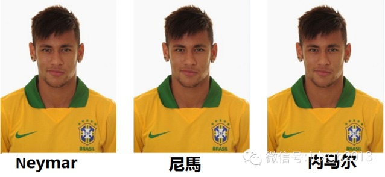

**为什么同样使用汉语，香港、台湾和大陆对体育明星的译名如此不同？为什么内地方言多，却使用相同的外文翻译？为什么南越的前领导人要被译为吴庭艳？**

**  
**

文/ Serpens

  

**“尼馬受傷各界明星送祝福”**

**“恐怖！尼馬差點癱瘓，他堅持要求與球隊在一起”**

**“巴西總統羅塞夫：此刻我與尼馬在一起。加油，尼馬！”**

  

以上新闻标题常使一些中国人困惑：这尼马是谁呢？其实，他就是巴西球星内马尔，尼马是香港通行的译名。

  

除内马尔/尼马，大陆与香港球员译名有别的例子还有很多，如罗纳尔多/朗拿度、范佩西/云佩斯、贝克汉姆/碧咸、伊瓜因/希古恩等。相比香港，台湾的译名与大陆更接近
，但仍有差别，比如罗纳尔多译为罗纳度，贝克汉姆译为贝克汉。

  

大陆和港台都使用汉语，为何译名如此不同？

  

**【粤语的影响】**

**  
**

汉字是一种意音文字，翻译拼音文字的人名、地名时有很多困难。亚历山大大帝东征时留下一串名为Αλεξάνδρεια的城市，对此，同属拼音文字的罗马人的翻译方法简
单有效：找到与希腊字母读音对应的拉丁字母一一转化，就准确地译成Alexandria。这几乎是一种机械劳动，无需思考。而转换成中文，就得揣摩读音，选择相对合适
的汉字组合。汉语的同音字增加了翻译的变化，更容易产生差别。

  

古今同样存在这类问题。前文Αλεξάνδρεια，古代中国人译为“乌弋山离”，以现代普通话读十分拗口，与原音相差更远。难道古人的耳朵出了问题？

  

其实，这是由于相同汉字读音的变化。中国幅员广阔，虽统一了书写形式，方言仍不可避免。同样，时间会改变读音，古汉语对今人来讲不啻于另一种方言。这就影响到翻译的人
。香港通行的汉语是粤语广州话，故而香港翻译以广州音对音为主。内地和台湾使用的普通话/国语都是以北京话为基础的标准语，大体上字音一致，所以中台两地翻译外语所采
用的对音都是北京音。这也就是为何香港的译名相对中台相差特别大。

  

罗纳尔多原文Ronaldo，普通话读音luo na er duo和原文相当接近，广州话为lonaap ji
do，和原文差很远，也难怪港译用朗拿度（广州音：longna dou）。内马尔原名为Neymar，港译尼马（广州音Nei
maa）相当合适，要让香港人读内马尔（广州音Noi maa ji）反而不知所云。

  

  

一般而言，港译比中译和台译更简短。这是因为广州话的韵尾发达，收尾的辅音可有-p、 –t –k、 –m、 –n
、–ng共6个，北京话则只有-n–ng两个。因此，中译需多写一个字来翻译外语辅音时，港译则不需要。如贝克汉姆英文为Beckham，中译用“克”翻译了-
ck，“姆”翻译了-m。但是港译只用“碧咸”（广州音bik haam）两字就能翻译这个名字，此时方言显露了优势。

  

但是，大陆内部的方言差别同样显著，就没有粤语这样的发挥空间。福建人聊起足球，“罗纳尔多”、“贝克汉姆”等还要用普通话读出，在顺畅的闽南语中十分突兀。

  

同时，方言的不同也无法解释陆台译名的差异。中国大陆翻译前苏联前领导人Хрущёв为赫鲁晓夫，台湾则翻译成赫鲁雪夫，两岸“晓”“雪”的读音没有什么差别。

  

**【规范性】**

**  
**

清末年间，大陆内部的译名并不统一。徐继畲在《瀛寰志略》序中写道：“外国地名，最难辨识，十人译之而十异，一人译之而前后或异……”，为解决分歧，时人呼吁：“中国
以京音为主……无论以中译西，以西译中，皆视此为本”，并指出“请旨颁行，令饬各省译局及私塾撰述，一体遵照”，无奈清政府孱弱，无力成行。

  

共产党政权建立后，这个梦想第一次得到实施。1954年，文化部部长茅盾（沈雁冰）宣布：“文学翻译必须在当合政府的领导下由主管机关和各有关方面，统一拟定计划，组
织力量，有方法、有步骤地来进行”，此前一年，中央编译局成立，集中了全国的语言人才编译社会主义著作，影响了整个大陆的翻译风格。

  

具体到人名的翻译，则由新华社译名室制定。20世纪60年代，周恩来下达指示：“译名要统一，归口于新华社”。此时中国与外界联络有限，只有从新华社、人民日报等媒体
才收获国外消息，多数是政治新闻，新华社译名室制定足以应对。

  

同样，因为政治的敏感性，译名室更倾向按照原文读音直接翻译成汉语，这也是大陆和台湾产生差别的原因之一。前文提及的赫鲁晓夫俄文写为Хрущёв，第二个音节元音实
际是o，中译用“晓”来对可谓非常恰当，台译则可能由于对俄文读音不熟，又受俄文的英文转写Khrushchev误导，认为元音读e所以翻成赫鲁雪夫。

  

改革开放前，大陆的翻译都由统一的标准指导。90年代前，新华社译名室陆续出版了英文、西班牙文、意大利文、葡萄牙文、法文、德文等姓名译名手册，1993年出版了3
753页的《世界人名翻译大词典》。这种强度的工作量保证了一个时期内大陆人名翻译的规范与统一。尤其在政治领域，时至今日，国外政要的译名都是新华社统一发布。

  

姓名译名手册

  

然而，就在这本3753页的词典出版后，译名室的权威受到挑战。90年代市场化媒体出现，人们通过多种渠道了解国外信息。虽然出版了翻译指导手册，但领导人的口信在新
时代并不具有广泛约束力，媒体和出版社并不要求强制参照。

  

体育距离政治较远，又富有吸引力，市场化媒体无不争相报道，翻译的控制力在这一领域更显薄弱。一些译名由体育记者或编辑首创，被业界认可即广泛流传。

  

**【网络时期的译名】**

**  
**

2008年，译名室接到任务，在两个星期内将参加北京奥运会的36000位外国人姓名正确翻译出来，7名译名室成员夜以继日，终于在截止日前完成。可是，以往的译名制
定方式已经跟不上需求。即便如此奋战，还是无法和互联网上字幕组们一天的工作量相比。

  

信息的产生和传播速度大大加快，不靠专家，自出机杼的事情成为惯例。比如，究竟翻译为本**拉登还是本**拉丹，人民日报和新华社之间存在差异，在人员流动性很强而又
不太讲究正式规范的体育界更是如此。前法国著名球员齐达内姓Zidane，按法语读法本应接近“席丹”，台译就用了这两个字。但大陆大概是受到某些英语人对法语读法了
解不深而产生误读的影响，让尾巴上的e也发了音，变成了齐达内，因广泛应用，也就习以为常。

  

这让曾经严格逐音节翻译的制度更加灵活。以往只有香港才会出现的中式译名也在大陆被接受，如施坚雅（G.WilliamSkinner），夏侯雅伯（北约前秘书长，原
名亚普**德霍普**斯海弗）等。而且汉语圈内的交流也逐渐增加，更多的港台翻译因为顺口贴切传入大陆，被广泛接受，如玛丽莲**梦露、波姬**小丝等。

  

但以往译名仍有很强的惯性，这也造成了大陆与港台间许多差别，尤其是政治领域。汉字本身带有意义，选择过程是一项可作文章的工作。周恩来最初命令成立新华社译名室时，
因中国与非洲等多国外交密切，自己动手，把“怯尼亚”改为“肯尼亚”，“莫三鼻给”改为“莫桑比克”。

  

与大陆交恶的对象就不那么幸运。最明显的是对前南越总统吴庭艳的翻译。“吴庭艳”乍看起来简直是个女名，安在一个男性，尤其是一国首脑头上十分诡异。越南人名多为汉字
的越南文读法，一般只要把越南文对应翻成汉字即可。难道吴庭艳的父母当初起名时为了什么特殊原因故意起了个女名？果真如此，吴庭艳步入政坛，当上一国领袖就没有因这个
香艳的名字遭遇苦恼呢？

  

实际上，吴庭艳的越南文名字是Ngoo ĐiinhDiệm，是汉字“吴廷琰”的越南读音，非“吴庭艳”，虽在越南语中可读作Ngoo Điinh Diệm，和“吴
廷琰”相同。但越南男子名中Điinh很常用，无论是从用汉字时期的写法还是越南人自我感知的意思来看，这个Điinh向来都是“廷”。而当时中国政府由于和南越属于
势不两立的敌方，颇有意味地将之刻意女性化。

  

同样的原则也适用于美国人。过去侵朝美军司令李奇微（Ridgway）原译为“李奇伟”，出于敌意，将“伟大”的“伟”改成了“微小”的“微”。
对照的是，台湾的国民党政府对南越并无敌意，因此吴庭艳在台湾则向来用本名吴廷琰翻译。

  

他真的是吴廷琰，不是吴庭艳

  

政治控制下的译名毕竟不适应愈加开放的时代，也许有一天，当嘉兴人自然而然读出“如纳尔嘟”（Ronaldo）时，尼马就不再成为我们惊讶的问题。

  

> 版权声明：  
大象公会所有文章均为原创，版权归大象公会所有。如希望转载，请事前联系我们： bd@idaxiang.org

大象公会：知识、见识、见闻

微信：idxgh2013

微博：@大象公会

投稿：letters@idaxiang.org

商务合作：bd@idaxiang.org

  

[阅读原文](http://mp.weixin.qq.com/s?__biz=MjM5NzQwNjcyMQ==&mid=203244669&idx=1&sn
=9daea301cd2691a08af084ab4bdbbd5c&scene=0#rd)

