**多数人都要感谢广播体操——贫瘠的少年时代，少有能安心观察心仪对象曼妙身姿的机会。虽然，这并不是广播体操发明者的初衷。是什么原因导致我们都做过广播体操？**  

  

**文/李清末**

  

在代沟深厚的中国人之间，广播体操是少有的共同记忆。这要感谢那些年的班主任和体育老师们，再叛逆的野马、柔弱的书虫，都曾在懵懂的年龄被教着做过广播体操。它甚至和
春晚一样重要——陌生人聊天，抛出广播体操话题，往往能起到救场的奇效。

  

然而，成年之后人们的体育活动就严重分化。野马们踢球、打篮球、橄榄球，乃至跳伞、蹦极，即使是书虫，也更多喜欢羽毛球、乒乓球、电子游戏，极少有人以广播操为锻炼方
式，使用频率甚至不如眼保健操。

  

近两年广播操重回公众视野，也多是以快闪、斗舞的形式，成为年轻人戏谑的对象。

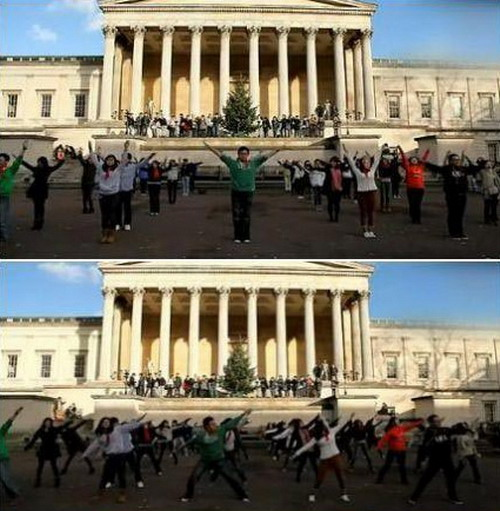

**2013年，中国留学生在白金汉宫广场做起了广播体操，英国的皇家宫殿前响彻“时代在召唤”**

  

为什么成年以后人们不再喜欢广播体操？

  

当然不是由于变得冷漠。而是从被发明开始，广播体操的性质、目标就决定了它无法在高度分化、市场经济为基础的现代社会占据主流，更无法PK足球、篮球等团体球类，以及
更个人化的滑板、跳伞等极限运动。

  

广播体操的发展历程也证明了这一点：它从战争中兴起，在工业化过程中推进，计划经济中走向巅峰，又在市场化浪潮中褪去。

  

这是一项高度同质化、组织化的运动，功能异常明确——“为 祖国/公司/领袖 健康工作五十年”。

  

**【战败，然后练体操】**

  

经普鲁士人改良之前，19世纪诞生的体操仅以增强体质、维护健康为目的，并未划分为如今的广播体操、艺术体操等类别。人们把它当做小众健身运动，体操馆内出入的多是有
闲阶层。

  

直到一场战争之后。

  

1805年，普鲁士在“三皇会战”中失利，民众受到极大刺激。屈辱感之下，体育家弗里德里希•路德维希•杨推出杨氏体操，包括一系列的军事动作，如手持器械的“战斗游
戏”，强调纪律的“队列练习”。

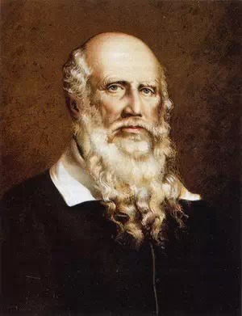

**被誉为“国民体操之父”的弗里德里希•路德维希•杨**

  

同时，杨氏非常强调精神培育，更归纳了体操的核心价值：体操永远是一种特殊形式的爱国行动，是整个民族的事业。做操者要制备统一的体操服、做操前后高唱爱国歌曲、并发
表时事评论等。这一理念马上就得到军界响应。

  

与普鲁士类似，1864年，丹麦在普丹战争中失败，已在普鲁士受重视的全民体操很快得到推广。丹麦的青少年被组织起来开展体操, 一跃成为了当时的体操大国。

  

此外，1862年，在抗击奥地利的战斗中，捷克斯洛伐克诞生了体操组织“索柯尔”，意为自由、坚强、勇敢的雄鹰。10年内,
类似的体操组织发展到130多个,会员12000多人，并于1889年建立了全国性的统一领导机构——捷克斯洛伐克雄鹰协会。

  

为什么国民体操会受到军队的推崇？

  

很明显，这种体操与军事训练类似，能够培育纪律、集体意识，消灭个体差异（参见**《齐步走，以国家的名义》**）。而这些正是近代军队的核心要求。

  

除了军队，另一个领域很快发现了体操的好处——工厂。

  

19世纪上半叶，业余体育已在资产阶级中蓬勃发展，但没有太多空闲、低收入的工人阶层并没有合适运动。

  

人们很快意识到，工人也需要“合理的消遣娱乐”，但哪项运动可以既不占太多设施、场地，又不会沉溺其中，无需高贵的品位，还能延长劳动力使用时间呢？

  

体操，满足上述所有要求，又不必带有竞争意识和创新精神。

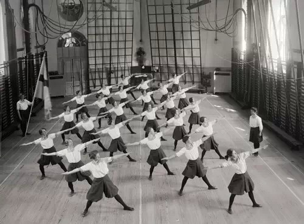

**19世纪的欧洲体操**

  

**【为了有力的殖民统治】**

  

20世纪，广播的出现大大扩展了体操的应用，使更大范围内的协调、组织成为可能。

  

这次结合的理由十分实在——增强客户体质，减少保险公司成本。1925年，美国保险公司“大都会人寿”在电台广播中设立体操栏目，很快流行起来。据统计，大约有600
万—800万人参与该节目。

  

可惜，广播体操在美国生不逢时，虽然有德国、瑞典移民建立的体操俱乐部，但1920年代正是美国自然主义教育兴盛时期，田径、球类等个性化较强的运动占据了主流。

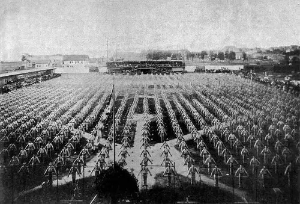

**1893年在美国密尔沃基举行的联邦体操节**

  

广播体操在另一片国土找到了用武之地——日本，它也是二十世纪上半叶的广播体操最强国，至今仍有广泛影响。

  

同样，保险业在日本扮演了引进者的角色。1923年后，日本递信省简易保险局派遣官员到世界各地考察，发现了“大都会人寿”的广播体操。考察官员大为赞赏，并将其照搬
回日本。

  

五年后，比保险公司更强大的推广者出现了。为了提振国民士气，日本政府正式推出广播体操，由体育权威人士设计的第一式广播体操诞生。

  

广播与邮电系统的强大传播力，真正达到了协调各地民众的效果，全民体操也成为可能——为了推广，日本要求每个邮递员携带广播体操的纲要、图解、伴奏乐谱等四处宣传。1
929年2月，日本建成全国转播网，广播体操遍行全国。

  

广播体操对精神的塑造作用令日本人印象深刻。很快就用于新占领的其他地区。

  

比如台湾。1930年代，日本设立台湾“国民精神总动员本部”，以期对台湾人实施彻底的精神改造，广播体操当然是重要工具之一。

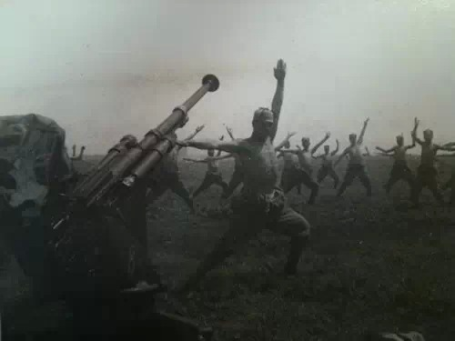

**即使在战场上，日本军人也不会忘记做广播体操。（图为1942年在印尼的日本作战军队）**

  

1933年，殖民政府在台北举行了第一届“全台北广播体操大会”，开闭幕式中都加入了遥拜天皇、高呼万岁的环节。此后，“广播体操大会”成为台湾新传统，仪式不断成熟
，包括大会前后齐唱国歌、升降日本旗、遥拜天皇、三呼万岁、感谢皇军将士、默祷等。

  

同样被日本占领的满洲也不例外。1935年，满洲铁路局、关东军和日本体协共同组成了“建国体操创案委员会”，编创了一套“建国体操”，由“文教部”发训令，强制全满
执行。

  

此外，日军在华北占领区也推行过类似的“新民体操”，作为学生每日的“必修课程”，并配合唱日满两国国歌、遥拜日本皇宫等仪式。

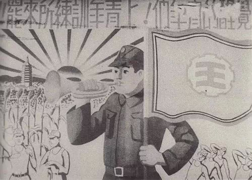

**“建国体操”宣传画**

  

1945年日本战败后，因广播操的“军国主义”意味，应战胜国要求禁止。1952年日本政府重获主权后，虽然广播体操重新放送，但也只在民间存在。

  

台湾也是如此，殖民者的撤离让广播体操失去了支持。1996年，直选胜出的国民党次年推出了“第一套新式健身操”，试图重振民众热情，但应者寥寥。

  

**【做操，每月节省3900万人民币】**

  

日本之后，广播体操哪家强？

  

答案是中国。以及中国的师父，苏联。

  

早在洋务运动时期，由体操改进而成的兵操就被引入中国。甲午战争后，西洋式、日本式的练兵操被重点学习。一时之间，各个派别的政治力量都在体操议题上达成默契。与德国
、捷克斯洛伐克、丹麦等国做操的原因类似，洋务派、维新派、革命派，乃至如蔡元培这样的教育界人士，都曾努力推广过体操，以期强壮国人。他们的热忱一度影响到军队和学
校的课程设计。

  

新文化运动之后，胡适等人提倡“自然主义”教育，开始抵制体操。更重要的是，“军事体操教父”德国在一战中战败，给拥趸们造成沉重打击。1923年的《中小学课程纲要
》中，体操正式被废除。

  

与中国的零星引进不同，苏联早在30年代就推行了系统性的体育锻炼计划：“劳卫制”。

  

“劳卫制”覆盖了全苏联7-60岁的公民，包括体操、立定跳远、扔手榴弹、铅球、滑雪、游泳等多种项目，以广播体操形式推广的“生产操”是其中之一。

  

1951年，中国体育总局派团访苏，诸多考察员对“劳卫制”印象深刻。对于当时的中国，体育设施的匮乏严重制约了项目选择。便宜、方便的广播体操于是受到瞩目，作为重
点学习对象，自此，从苏联经验中重新接回了体操的脉络。

  

这也得到了广播网建设的支持。1949年到1951年，广播收音网已普及全国28省、8个行署、1个自治区的1806个县和盟旗。

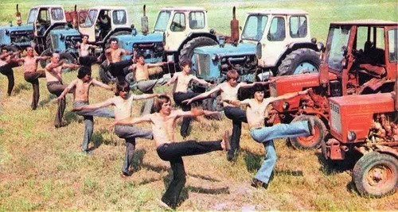

**“劳卫制”下的苏联广播体操**

  

1951年11月，第一套广播体操由教育部、总政治部、总工会等9部门联合推出。舆论也帮助推广，《人民日报》还发表社论：《推广体操运动，发展人民体育事业！》。

  

随后，中央和各地的人民广播电台邀请当地教育、卫生、工会、青年和妇女组织商讨，组织了“广播体操推行委员会”。“广播体操骨干分子训练班”、“广播体操传授站”、“
广播体操推行小组”遍地出现。

  

1952年，毛泽东提出“发展体育运动，提高人民体质。提高警惕，保卫祖国”的口号。广播体操被推向新的高潮，据不完全统计，当时仅13座大型城市，参加广播体操的就
有104.8万人。

  

1954年7月，第二套广播体操、第一套少年广播体操和儿童广播体操正式公布。同年，中国版的“劳卫制”开始试行。

  

这一年，政府、工厂等机关企业也开始每天上午和下午各抽出10分钟做工间操。还未进行公私合营的商店也自动加入做操行列，北京瑞蚨祥等老店每天开门前先来一套“开门操
”。

  

广播体操也有着“忆苦思甜”功能。当时，一位62岁的老人曾回忆道：“回想旧社会，我们当店员的生活都没有保障，哪里谈得上做操呢？”

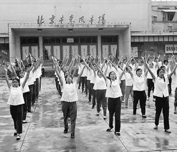

**北京东风市场的开门操**

  

1957年，为了“多、快、好、省建设社会主义”，国家体委决定大幅增进群众性体育运动，并颁布第三套广播体操。

  

当时的铁道部也有正面反馈：因为做操，铁路员工身心健康，工作效率提高，仅一个铁路段平均每月可给国家节省3900万人民币。

  

《人民日报》也在《第三套广播体操公布了》中写道：“据今年上学期中央党校220名学员填表调查，有67人体重增加，少则一公斤，多则六公斤，13个胖子的体重则有所
减轻；29人反映食欲增加；41人反映睡眠良好或好转。”

  

此时，中国终于赶超了日本和苏联，成为广播体操第一大国。一些人回忆：“在大喇叭广播的带领下，商场里的顾客和售货员一块儿做操；在火车上，列车员带着乘客站起来做操
；马路两边房顶上凡是能站人的地方，总能找到做操的人。”

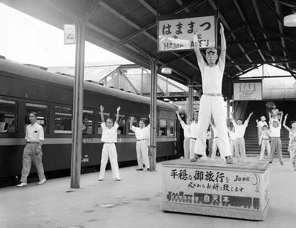

**1952年，从东京前往大阪的乘客在半途中的站点停留，做5分钟的广播体操**

  

不过，中国的广播体操很快又完成了自我超越——文革“语录操”诞生了。

  

这一体操类型带有浓厚的精神内涵。例如第一节，“领导我们事业的核心力量是中国共产党，指导我们思想的理论基础是马克思列宁主义”，动作是上肢运动，双臂上举、挺胸、
抬头，表现对中国共产党、马列主义无限信仰和崇敬，更方便了“伟大领袖”思想的传播，正如当时一名解放军所讲，“做一次操，就是上一堂生动的毛泽东思想课。”

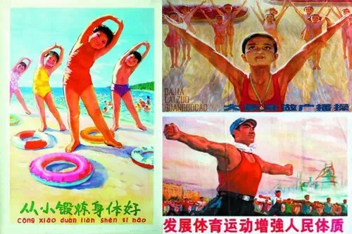

**至今，中国已陆续推出23套适合不同年龄的广播体操，其中，成人广播体操9套，少年广播体操5套，儿童广播体操7套，中小学生（系列）广播体操2套**

  

1980年代后，中国的广播体操经历了一段低谷。1981年起，广播体操不再由诸多核心部门联合发布，通常减少到只有体育总局一家。

  

1987年前后，中央人民广播电台第一次停播广播体操，各地方广播电台的广播操节目也陆续消失。到了21世纪初，广播体操多以中小学的课间操的形式存在。

  

2010年8月9日，北京市总工会要求全市职工恢复广播体操，北京电台体育广播每天两次播放八分钟的第八套广播体操音乐，总工会定下目标：2011年全市职工参与健身
活动比例60%以上，国企100%，机关事业单位至少70%。然而，一年后的调查显示，只有50%不到的职工配合这一政策，如今不了了之。

  

当然，有一个人回忆起广播体操时，大概会满怀深情：1971年，北京一名小学生因做操姿态优美，被拍摄进当时的新闻纪录片。这名孩子因此被选入什刹海体校，专门练习武
术，成了一代功夫巨星。他就是李连杰。

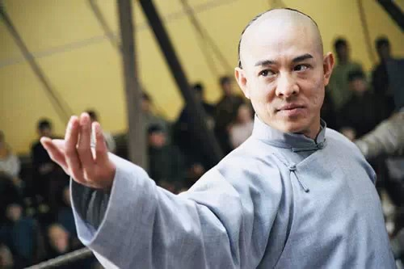

**  
**

**版权声明**

****大象公会所有文章均为原创，****  

****版权归大象公会所有。如希望转载，****

****请事前联系我们：****

bd@idaxiang.org

****知识 | 见识 | 见闻****

阅读

举报

[阅读原文](http://mp.weixin.qq.com/s?__biz=MjM5NzQwNjcyMQ==&mid=209135561&idx=1&sn
=db179a50814bb6f67e479f1478283a7b&scene=1#rd)

