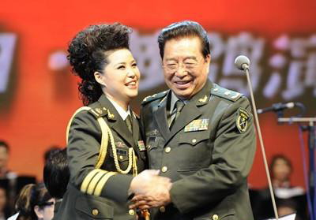
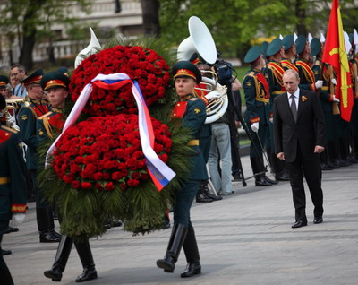
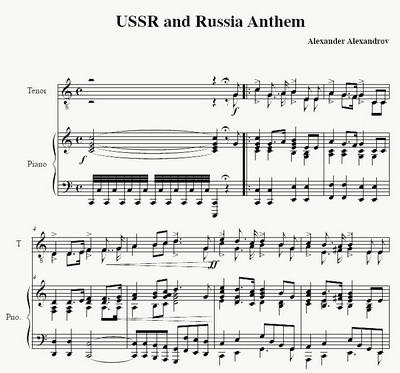
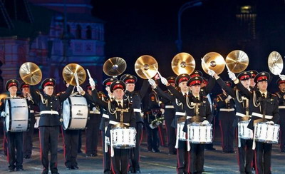

**提到军歌，中国人最容易想到的往往是苏式军歌，典型的苏式军歌不但有一种威武雄壮一往无前的压迫感，更符合现代人对军歌的印象，而且中国人熟悉的军歌，多数也是苏联（俄罗斯）人的作品。**

  

文/张宏兵

  

中国近几十年谱写的军旅歌曲多不可数，或许可以认为，除了朝鲜外，中国的军歌绝对是世界最多的，只是由于其旋律无法给人以威武雄壮之感，更缺少值得传唱的旋律之美，大
多数都无法流传开来。以至于经常有中国军迷在制作赞美我强盛军队的MV时，只好选用苏式军歌做音乐背景。

**著名军旅歌手李双江、梦鸽夫妇，不过公众仿佛更关心他们的家事**

  

苏式军歌很难谱写么？

  

其实不难，只要掌握一些基本套路，你完全可以写出很带感的苏式军歌。

  

**【如何体现军味】**

  

决定一首歌听上去是军歌还是哀乐，首先是节拍速度和节奏，我们暂且统一称为节拍，节拍系指每分钟有几拍，简单地说就是强音或较强音出现的频率，通常，每分钟有几拍被简
称为BPM（Beats Per Minute）。

  

通常，那种听上去很像部队迈着整齐有力行军步伐的军歌，大都是每分钟110～120拍，并且是规整的二拍或四拍节奏。二拍节奏的特点是“强、弱、强、弱”交替，这与优
美的三拍子如华尔兹即圆舞曲不同，三拍子节奏一般是“强、弱、弱”的节拍规律。军歌以二拍子或四拍子为多。典型如苏联军歌《红军最强大》。为什么这种节拍的曲子会让人
自然而然地联想起军队的行进？因为它的节奏恰好与军队整齐行进的脚步节奏大致吻合。

  

**《红军最强大》**

世界上第一个明确行军齐步走步速的普鲁士军队，正步行军时每分钟的速是114步，解放军是116步，苏联/俄罗斯、朝鲜、越南、台湾等则是120步。骑兵的速度比步兵
队列更快，自然描述骑兵的乐曲节拍就更快，最典型的是苏联的《草原骑兵歌》（又名《草原啊草原》），它的节拍是140 BPM左右。

  

**《草原啊草原》**

熟悉历史的人会注意到，纳粹党歌《霍斯特•威赛尔》出现时其背景画面几乎都是部队行军的画面，它的节拍恰好是120BPM。有意思的是，纳粹德国时期的国歌《德意志高
于一切》，听上去像即有庄严神圣感，同时又像是缓步行进的军歌，而战后德国国歌旋律没变，但听上去却像是教堂的颂歌，完全没有了军队行进感。

  

奥妙首先是节奏的变化，纳粹时期的德国国歌的节拍是100
BPM左右（现场指挥演奏演唱时节拍速度并不完全稳定准确，甚至会根据情绪进行微调），而今天德国国歌的节拍常常是65
BPM，它变慢之后的节拍恰好是教堂颂歌常见的节拍。如果再慢一点点，它就要变成适合仪仗兵迈着缓慢步伐敬献花圈、花篮时伴奏用的哀乐了。

  

**纳粹时期的德国国歌**

****

**  
**

**战后德国国歌人声版**

****

——如果你留意一下仪仗队在敬献花圈时或在陵墓前的行进步伐，会发现他们的步速大都是每分钟60步左右，最典型的是红场列宁墓前仪仗队的步伐。解放军规定，仪仗队在敬
献花圈或举行葬仪时的礼步，也是每分钟是60步。  

**2012年，普京来到位于红场附近的无名烈士墓，向卫国战争中牺牲的无名英雄敬献花圈**

  

音乐节拍与情感表达关系的影响，道理很简单。人们在欢快、喜悦、幸福时，动作都较平常更快，譬如《新闻联播》中重要领导或外宾出场时，人们多呈雀跃“状”；而人在悲伤
、忧郁、情绪低落时，身体动作都会慢，脚步也会慢，追悼会上人们告别遗体送行的脚步，都是慢慢走。

  

同样，在强调庄严、神圣氛围的宗教场合，无论是人的肢体语言还是队列行进速度，同样较为缓慢，而宗教赞美诗为表达恩爱、慈详、怜悯等情绪其较慢速度也恰好与之对应。

  

不过，德国国歌的前后变化，并不止是节拍的变化，还有器乐和演奏方式的变化。因为不同的乐器和演奏方式带来的力量感的强弱，会让人产生完全不同的情感、情绪。

  

比如，铜管乐器，如小号、长号等，音色嘹亮、辉煌，力量感十足，尤其长号的雄壮音色很容易使人联想到军队，而中国古代的号角，虽音色与近现代铜管长号、小号截然不同，
但其低沉、雄浑的音色同样会让人联想起军队。铜管类乐器加上鼓点，它带来的力量感非常适合用来表现军歌。

  

而木管乐器如短笛、长笛、双簧管、单簧管等等，力量感和强度要弱得多，很容易使人联想到草地、树林、鸟鸣等野外绿色景像，或对往事的回忆。而节奏舒缓的人的和声则适合
用于表现赞美诗。

  

前面的纳粹版德国国歌听上去军味十足，除了节奏，它还是用铜管乐器和鼓点来演奏的，它有一种压迫感，而后一个版本的德国国歌则用的是人的和声，所以听上去非常像宗教赞
美诗。

  

中国民乐《赛马》节拍是150 BPM 左右，它的主奏乐器是二胡，钢琴伴奏，它与节奏相似的《草原骑兵歌》相比，只有有轻快喜悦而无那种军队感。

  

**《赛马》**

不过，一首曲子要有军味，除了节奏和乐器，旋律也有讲究。因为旋律音线的方向对情绪也有重要影响。旋律总体上行，尤其是句末的音往高走，会带来积极向上、乐观进取的情
绪；反之，旋律总体下行，尤其是句末的音往低走，会带来回归平静、消极甚至忧郁的情绪。

  

要体现出军队威武雄壮一往无前，旋律总体应该总体是上行的，譬如《中国人民解放军军歌》的开头有11-3,55-6…，《义勇军进行曲》的主要动机是向上的so-
do，苏联国歌《牢不可破的联盟》除了向上的so-do, 中间有一直向上的音阶。

**《牢不可破的联盟》乐谱**

  

**【如何有苏俄味】**

各地或各民族的音乐所用的调式多有其固定风格，这就是为什么即使不懂音乐的人，也能分出不同民族或地区风格的曲子。  

  

通常，传统的民族音乐并不会全部用上我们熟悉的Do、Re、Mi、Fa、So、La,、Ti这七个音。比如汉族民乐常常只用Do、Re、Mi、So、La五个音，而日
本古乐可能只用La、Ti、Do、Mi、Fa五个音（偶尔会用Re），这叫五声调式。

  

而苏联民歌除了七个音之外，可能还会用到把So升高半音的、有更多音使用的调式。除了使用哪几个音之外，以哪个音为乐曲的结束音（常常也是开始音），也是决定调式的因
素。

  

调式除了可以显示出民族风格，不同的调式善于表达的情感也可能不同，比如听上去有的明朗、有的忧郁（例如，同是新疆风格歌曲，《掀起了你的盖头来》使用大调，且速度较
快，听上去明朗欢快，而《花儿为什么这样红》使用小调，听上去就会更抒情或忧郁）。

  

另外，不同民族乐器的音准概念还不完全一样，比如在吉他上无法完全准确地奏出热瓦甫上的音，两者相互看来对方的音不准、跑偏了。但这些不同民族乐器之间的音准不同，也
就是律制不同，往往也是构成民族音乐各自不同风格的重要来源。

  

苏俄传统民歌最常见的调式是俄罗斯旋律小调，比如《三套车》和《小路》就是这种调式，《莫斯科郊外的晚上》与《红莓花儿开》也是用类似调式。

  

另外，苏俄传统民歌很容易分辨的特征还有其自成一格的乐器，譬如德国人发明的手风琴经俄国人改良后，几乎成为俄国民乐的标配，与手风琴地位同样重要的还有俄国民族乐器
三角琴。不过，苏式军歌就用不上手风琴和三角琴这样的乐器，只能是铜管乐器和鼓。

**2010年莫斯科国际军乐节，俄罗斯军乐队在红场上演奏军乐**

  

如果谱写歌曲时，注意旋律上带有浓郁苏俄传统民歌调式，节拍在每分钟110～120拍之间，配上丰满、正规进行的和声，用上铜管乐器和军鼓演奏，它就会是一首非常典型
的苏式军歌了。

  

有意思的是，苏联历史上诞生了无数军歌，无论是通常被公认为苏军军歌的《苏军之歌》（苏联并无法定的标准军歌），还是《苏军最强大》、《勇敢的顿河青年》、《同志们，
勇敢地前进》等歌曲，俄罗斯民歌的味道都不甚浓郁，对中国人来说，有些歌曲甚至很难与二战时期的纳粹军歌区分。

  

迄今为止苏式军歌味最浓的，反而是美国人詹姆斯•汉尼根（James Hannigan）写的——2008年美国EALA公司推出《命令与征服：红色警戒3》时，推出
的主题曲《苏维埃进行曲》，这首严格遵照俄罗斯民歌调式谱曲的苏式军歌，不但比正牌苏联军歌听上去还正宗，还隐约带有一种黑暗邪恶的味道。至于中国的军歌为什么多数听
上去甚至有很娘的感觉，就不是本篇所能解释的了。

**《红色警戒》宣传海报**

  

**《苏维埃进行曲》**

  

**版权声明**

****大象公会所有文章均为原创，****  

****版权归大象公会所有。如希望转载，****

****请事前联系我们：****

bd@idaxiang.org

****知识 | 见识 | 见闻****

阅读

__ 举报

[阅读原文](http://mp.weixin.qq.com/s?__biz=MjM5NzQwNjcyMQ==&mid=207986317&idx=1&sn
=198b1d6bcb273d62e52c53c5ed6decf3&scene=0#rd)

