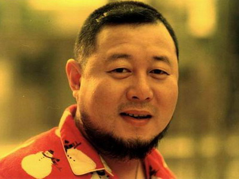
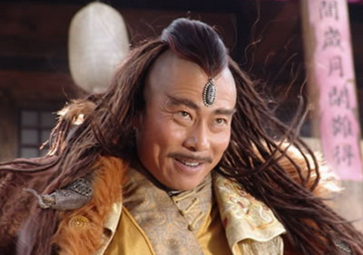
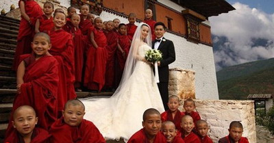
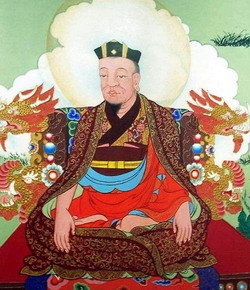
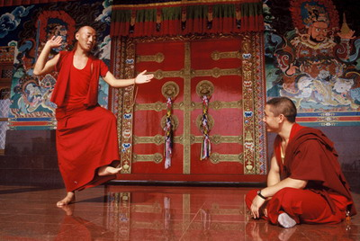
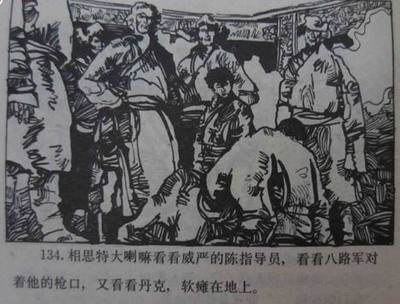
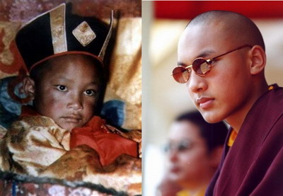
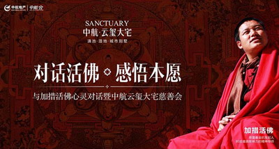
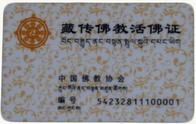
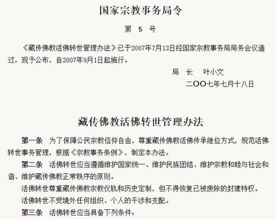

**仁波切、活佛已成为汉地中产阶级的新导师，没有供养经验，饭局上都难以开口。想要成为活佛？也许并不需要住寺、精修，出着自传唱着歌，你也可以成为仁波切。当然，别忘了办证。**

  

文/杜修琪

  

曾因《大花轿》名动一时的大陆歌手火风，在几乎已被人遗忘的今天，突然因为成了活佛而再度进入公众视野，不过，他已有了一个今天最高端大气上档次的新ID：乌金西珠丹
增仁波切，驻四川省甘孜州白玉寺。

**女士们先生们，乌金西珠丹增仁波切**

  

今天，拥有活佛、仁波切、上师之类头衔的人，在中国大陆极受尊崇，在网上，他们已经取代央视大牌主持人成为各种流行心灵鸡汤的制造者，在线下，高端成功人士如果不供养
一位活佛、仁波切、上师或成为他们的弟子，饭局上都不好意思开口。

  

一般观念中，只有信奉藏传佛教地区的孩童才有可能成为活佛的转世灵童，而且概率低到犹如中奖，火风是内地一个年已50的成年人，怎么也会成为活佛？

  

**【被误读的仁波切】**

活佛在汉语世界的无上尊崇地位，其实多少来自误读或误译。受《西游记》等作品的影响，汉族民间社会对佛教的理解，形成了金刚、罗汉、菩萨、佛——由低到高的等级排序，
而活佛这个词无意中给人以现实世界中佛的含义。

  

但在藏语语境中，并没有“活佛”这一称呼，相近的是“祖古”（藏文：སྤྲུལ་སྐུ），指转世修行者。祖古往往也被称为“仁波切”（藏文：རིན་པོ་ཆེ་）
——原义“珍宝”，用来称呼修行有为的高僧。

  

通常祖古们都会被尊称“仁波切”，但并不是所有“仁波切”都是祖古，它还包括了通过个人修行，获得广泛尊重的非转世僧人。“仁波切”并不只用于人，有时器物也会被称为
“仁波切”，比如大昭寺释迦牟尼像也被称作“觉窝仁宝哲”（Jowo Rinpoche），取其“珍宝”的含义。

  

读过金庸小说的人对“法王”一词不会陌生，“法王”在汉语中也具有转世喇嘛的含义。和“活佛”带有的佛字一样，“王”似乎格外权威，远比翻译为“转世修行者”引人注目
。

**影视剧中的法王形象**

  

在中国，活佛、法王、仁波切从未像近三十年这样流行。元朝之后，藏传佛教开始影响内地，明武宗曾迷恋密宗，《金瓶梅》中也曾出现有关藏传佛教的段落，但影响毕竟有限，
主要仍在蒙、满贵族中信奉。

  

活佛、法王、仁波切的流行，是内地宗教热的产物（见**大象公会《中国宗教为什么热》**），由于内地宗教寺庙往往成为旅游和文化招商的品牌，一些名山古刹常曝出负面
新闻，再加上传承中断，故在相对有闲有钱的中产阶级或更高阶层中，不少人更追捧藏传佛教。

**选择在藏传佛教圣地——不丹结婚的梁朝伟、刘嘉玲，两人均是虔诚的信徒**

  

另外，在佛教给人过度世俗化印象的汉地，藏地僧人的“转世”不但具有强烈的异域神秘感，其本身也增加了藏传佛教的权威、神圣和信服力。

  

**【转世制度的演化】**

“转世”并非藏传佛教创立之初就有的特色，而是特殊历史时期遗留的产物。

  

祖古（活佛）转世制产生于公元9世纪末。当时，一场大规模的奴隶起义摧毁了吐蕃世俗政权，各地方贵族势力就此崛起。出于现实策略，他们与僧侣集团联合，资助大量僧侣到
印度访学。

  

这无意中深刻改变了西藏的社会结构和政治制度，世俗王权制变成了政教合一制——各地区开始以寺庙为核心组织起来，而不是军队或官府。田地、牧场不断的捐赠给了寺庙，高
僧们对寺庙实行控制，事实上管理了一个地区。

  

但僧人毕竟不同于平民，由于出身等原因，他们在继承权上天然失去了世袭制路径。13世纪，噶举派首领通过对佛经的创造性阐释，首次创立了转世制度，解决了政教领袖巨大
权力的继承问题。

**藏传佛教第一位转世活佛——噶玛拔希**

  

转世制度很快被其余教派效仿，不同派别转世制的应用范围也有差别，如格鲁派既有转世制，也保留了升级考取的格西制。但大体上各教派都采用了转世制。

  

有了转世制度，自然就要有一套寻找转世灵童的规则和程序，高僧去世后，人们根据其生前的暗示、遗嘱等到各地寻访灵童，灵童再经选拔、经院培养等一系列程序方可成为转世
活佛。

  

由于大德高僧只要因其生前的修为和声望受信众认可，即使没有转世传统也可转世，如有需要，很多年前去世的高僧也能转世，故活佛数量会不断增长。

  

不丹也出现过活佛剧增的现象。与政权高度统一的中国不同，不丹的活佛主要由僧侣选择，在21世纪之前数量一直较少。但2000年以后，越来越多灵童的出现让民众开始怀
疑转世的可信性。2007年，不丹逐步民主化，刚成立的议会开始重视这一问题，委托部分议员制定活佛转世标准，审查新增的灵童，活佛剧增现象很快缓解。

**不丹虎穴寺，两名僧人在研习讲经**

  

由于宗教领袖享有巨大权力，各种势力都试图控制转世过程，很难避免宗教领袖总是在权贵之家轮流转世的情形。即使是很小的地方寺庙，转世也同样受干扰，若权贵争斗，往往
会发生冲突。

  

一世哲布尊丹巴（主管外蒙古藏传佛教的活佛）死后，土谢图汗和车臣汗都认为应转世到自己家族中，最后交由雍正帝裁决到土谢图汗家族。

  

之后，乾隆朝制定了《钦定藏内善后章程二十九条》等，规范转世数量、范围，其中重要的两点——不得转世到大活佛所在的亲族，以及蒙古各旗长官家族中；活佛确认的权力收
归中央，大活佛一律由皇帝册封。

  

**【仁波切也有春天】**

1959年西藏社会改革，藏传佛教教职人员的地位一落千丈，尤其是进入“文革”后，藏传佛教与剥皮、砍手、挖眼等极端残忍的行为牢牢捆绑在一起，而活佛则是剥削阶级中
比土司、头人更坏的代表。当时西藏题材的连环画中，活佛的形象往往都是阴险、诡诈、毒辣的大胖子。

**连环画《小喇嘛丹克》，剧中反派相斯特大喇嘛跪倒在八路军指导员面前**

  

在这个时期的中国大陆，由于寺庙被纷纷强制关闭，僧人或批斗或还俗，盛行了近千年的转世制度在中国境内的藏传佛教区嘎然而止。如果考虑到更早以前蒙古关闭寺院，全面停
止活佛转世，除了逃出中国境内的少数流亡者以外，活佛这种身份在传统藏传佛教地区事实上已经不存在了。

  

“文革”结束后，藏传佛教作为民间信仰获得官方承认，转世制度这才开始正式恢复。1992年9月27日，被认为是十六世噶玛巴郎俊雷培多杰转世灵童的8岁牧民之子伍金
卓堆•赤列多吉在楚布寺坐床，他也是1949年以后国务院宗教局认定批准的第一位转世活佛。

**赤列多吉**

  

转世制度虽然再度延续，但“转世修行者”们的地位远无法与1959年之前相比。因为西藏社会改造终结了政教合一制度，寺院不再是权力中心，活佛只是职业教职人员，而非
集宗教、行政、司法权于一身的权力拥有者。内部也有之前大活佛掌权、堪布管理，变为以全寺宗教人员大会等“民主管理”机构为核心。

  

活佛的收入来源主要有7个方面：1、国家给的工资、2、诵经、讲经的收益、3、在民间行医、绘画、雕塑的收益；4、调正民间纠纷时接受的布施；5、知识产权收益；6、
接受赠与的财产；7、公民享有的其他财产所有权获得途径，如遗产、存款利息等。

  

在1990年代以前，工资是活佛们重要而稳定的收入来源。由于有较高名望和社会地位的宗教上层人士（多为活佛和高僧）都在政协、宗教协会之类国家机关任职或兼职，故他
们与公务员一样，依照其行政序列中的级别，享受不同等级的固定工资和福利待遇。

  

此一阶段的活佛数量非常有限，虽然按国家宗教相关管理规定，活佛必须驻寺庙，但已经出现一些具有活佛身份的人在城市过着世俗生活。

  

1990年代开始，港台一批明星和富商兴起了供养藏传佛教的活佛、法王、仁波切、上师的热潮，随着内地宗教热，汉地有钱的布施者很快成为藏地寺庙最重要的收入来源。而
内地无数渴求心灵抚慰的信众使得越来越多的活佛进入内地都市传播佛法。

  

仁波切突然迎来了春天，活佛自然也迅速多了起来。

**某地产公司主办的活佛见面会**

  

**【怎样成为一名活佛】**

由于活佛不够用，大量已中断转世传统的中小寺庙的又纷纷恢复了转世，其中有的寺庙甚至中断了上百年。由此产生了遍地是活佛的景观。

  

不过，官方承认的活佛都有一纸地方宗教管理机关颁发的活佛证，早些年活佛证并无统一规范的样式和规格，有的像奖状，有的像结婚证。2010年后，活佛证的规格逐渐统一
，其尺寸和材质与二代身份证相同，采用了莲花及字母全息防伪图案，除了个人和教职信息外，还有统一编号。

  

另外，2011年国家宗教事务局提出建立宗教工作基础信息数据库后，宗教教职人员与宗教机关财产信息一并被纳入上网工程，活佛的相关信息是联网的。教职人员在身份认证
过程中，都需要填写宗教人员备案表，备案表会有编号，要有所在宗教活动场所的意见，宗教团体的认定意见，备案管理部门的意见。

**新一代藏传佛教活佛证**

  

据不完全统计，官方承认的活佛接近2000人，而拥有活佛头衔的人则远不止此。因为现实中存在多种并行的活佛认证途径。官方有一套活佛认可的流程，藏区寺庙也有按传统
自行确认的活佛，同样受到信众的认可。

  

经典描述中，转世灵童的寻找和认证有一套极为郑重而严肃的程序，被认证为转世灵童往往会给人像中六合彩一样难，而且只限于传统藏传佛教地区。实际上，这种情形只存在于
国家级高僧的转世过程中。处级、科级、股级以及更多不够享受国家行政待遇的活佛，其认证程序就远没有这么的郑重、严格。

  

其实，成为转世灵童，完全不需要传统藏传佛教区的藏、蒙等民族身份，而且理论上人人都有中奖的可能——只要你有缘认识可以指认你是某高僧转世的大活佛。当然，前提是你
足够有钱或者像火风一样有名才行。

**2007年，国家宗教事务局颁布并实施《藏传佛教活佛转世管理办法》**

  

因此，拥有活佛身份的人也从藏传佛教区的藏、蒙等族，扩展到了内地甚至境外。譬如一位曾在1990年代拥有“中国人民的新朋友”级别的美国人，他“中美合资”的混血儿
子也成了活佛。

  

但要拥有官方认定的活佛就很难了。由于活佛名额非常有限，有些地方活佛通常只轮流在书记和县长的亲戚家转世，如果任期内没有活佛去世，那么失传了上百年的大德高僧就要
赶紧安排转世了。

  

不过，藏传佛教大热，活佛越来越多，反而引起不少活佛、堪布（相当于汉传佛教寺院中的方丈）的忧虑。激进者甚至提出终结这一制度，若果真如此，则仁波切不出，如亿万鸡
汤苍生何。

  

**版权声明**

****大象公会所有文章均为原创，****  

****版权归大象公会所有。如希望转载，****

****请事前联系我们：****

bd@idaxiang.org

****知识 | 见识 | 见闻****

阅读

__ 举报

[阅读原文](http://mp.weixin.qq.com/s?__biz=MjM5NzQwNjcyMQ==&mid=207410722&idx=1&sn
=53c895ae204d926663d4b71f27b918b6&scene=0#rd)

