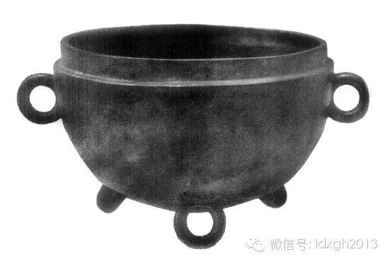
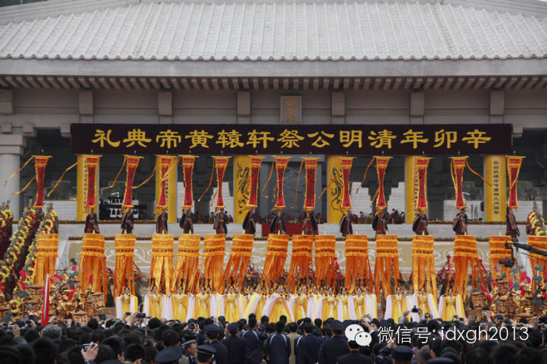
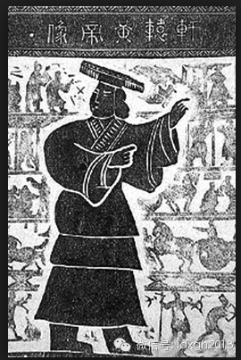

**有人认为：高等的华夏族群不但理所应当统治中国，甚至可作为黄种人的代表，和白种人共同主宰世界。数个因素几相叠加，“黄帝****”****成为再合适不过的祖先攀附对象。**

  

文/郑子宁

  

炎黄子孙在当下中国人——至少是汉族人中——接受度很高，是流传极广的代称。

  

很多地方在着力挖掘和炎黄二帝的关系。每年公祭黄帝更是热闹，传说中的黄帝陵所在地陕西黄陵县和黄帝出生地河南新郑市为争抢祭黄正统，试图力压对方。就连远在江南、和
传说中的黄帝活动范围相差甚远的浙江缙云县，也想在祭黄中分一杯羹。

  

此外，炎黄子孙一词亦为大陆外的华人所认同，大陆媒体宣传港澳台和旅居海外的华人华裔时，也尤为喜欢采用“海内外炎黄子孙”的称呼。

  

虽然“炎黄”中炎帝排名靠前，但是若论该传说的中心人物，那还是非黄帝莫属。黄帝被尊为全体华人的共祖，如今已根深蒂固。这种地位是否自古如此呢？

  

**【皇室血统】**

  

著名历史学家顾颉刚先生说过，西周人认为最古的人是禹，到孔子时有尧舜，战国时有黄帝神农，秦时有三皇，汉以后有盘古——时代愈后，传说的古史期愈长。如此说来，难道
黄帝是战国时期才出现的意淫产物？

  

翻开任何一本《现代汉语大词典》，其中的历代纪元表都会把黄帝放在距今4600年左右的前26世纪，“上下五千年”的说法更是深入人心。

  

事实上，中华文明可靠的历史远没有如此长。若以文字出现作为进入文明的标志。则中华文明有确凿证据可证的历史只能回溯到商朝中期盘庚迁殷后。而有确切纪年的信史则始于
西周共和元年（前841年）。连夏朝的真实性尚且有争议，更不用说年代更早、资料更少的黄帝了。

  

黄帝究竟是如何出现的？

  

甲骨文里并没有关于黄帝的记载，各类确证写作时间在春秋时代之前的文献，如《尚书》周初八诰、《诗经》等也没有黄帝的踪迹。“黄帝”之名最早出现于战国齐威王时代的陈
侯因齐（即齐威王）敦铭文中。

  

这篇铭文里，齐威王叙述自己身世时将黄帝说成自己远祖，以增强田氏代齐的合法性。战国时期《左传》《国语》等文献中提到黄帝的一些事迹，如《左传僖公二十五年》有“遇
黄帝战于阪泉之兆”。

  

这些记载说明当时人格化的黄帝已经开始出现，其影响力已大到把黄帝说成自家祖先可以有巩固政权作用的地步。当然，它伴随着一系列“黄帝”周边产品的逐渐完善，譬如黄帝
被说成是医学、文字、数学、音乐、军阵、舟车的发明者。

  

随着时间推移，黄帝传说的影响力和范围不断强化，汉初司马迁时已有如下言论：“余尝西至空峒，北过涿鹿，东渐于海，南浮江淮矣，至长老皆各往往称黄帝、尧、舜之处。”
充分体现黄帝传说流传之广。

  

陈侯因齐敦

  

此后，黄帝作为帝系法统的源头越来越受到统治者的重视。在各“黄帝之处”中，距离长安较近，位于今陕西黄陵县的桥山黄陵也就顺理成章地脱颖而出，成为黄帝崇拜的圣地。
汉武帝就曾率十万大军在此祭拜。

  

到唐代宗时，桥山黄陵正式立庙，此地的祭黄活动正式化。之后的历朝历代均热衷于在桥山祭黄，特别是跟皇室相关的大事如新帝改元、废立太子之类屡有祭陵之举。

  

黄帝就这样被确立为帝系法统之始，成为皇室政治意义上的祖先，身为黄帝传人赋予了他们统治中国的合法性。

  

但是，“自古以来”号称自己是黄帝后代、进行祭祀活动的主要是皇室，直到19世纪中期，平民百姓并没有“炎黄子孙”的意识。究竟黄帝是怎么从装点贵族和暴发户门楣的上
古圣君被拔高为全体华人血缘上的祖先呢？

  

**【中华民族】**

  

清朝后期，中国在列强坚船利炮下中屡屡失利，传统以天朝为中心的天下世界观受到严重冲击。西方民族国家的概念传入中国，知识分子认为中国之所以羸弱，任人宰割，正是由
于没有形成真正的民族和国家，国民缺乏凝聚力，缺乏对异种的排斥。

  

梁启超1899年写成的《爱国论》中的一段话颇有代表性：“我支那人，非无爱国之性质也。其不知爱国者，由不自知其为国也。中国自古一统，环列皆小蛮夷，无有文物，无
有政体，不成其为国，吾民亦不以平等之国视之。故吾国数千年来，常处于独立之势，吾民之称禹域也，谓之为天下，而不谓之为国。既无国矣，何爱之可云?”

  

为了能够让中国转化为一个现代民族国家，大批知识分子投入构筑中华民族的事业当中。

  

民族的形成需要有共同历史背景形成的集体心理，以凝聚全体成员。故而民族虽然是很晚近的概念，但构建民族却是把历史追溯得越久远越好。

  

在19世纪后期民族国家兴起的浪潮之中，不少国家都从故纸堆里面挖出了自认的古代本民族杰出人物，以促使全体国民形成对本族先贤的崇拜模仿，从而形成共同感情。

  

在构筑民族的过程中，为全体成员杜撰一个统一来源非常重要。共同的族源可以佐证族群内部的一体性，将族群自身和他者明确分开，对形成内部一致对外排斥的民族有不可估量
的作用。

  

热闹的公祭黄帝实际是民国以来的现象

  

各国杜撰出的共同族源有的今天看来颇为滑稽，如英国人追溯到征服者威廉和亚瑟王，但两者和作为日耳曼分支的英格兰人的祖先很大程度上是敌对关系。墨西哥寻根寻到了阿兹
特克头上，完全不顾讲西班牙语的殖民者灭了阿兹特克。法国自诩高卢雄鸡，不知当年被罗马征服者掐灭的凯尔特高卢人泉下会作何感想。

  

**【黄帝西来？】**

  

但民族构建实乃政治行为，与真实历史完全是两码事，故事是否荒诞不经无所谓，只要达成百姓认同的目标即可。

  

在众多可选历史和传说人物之中，为何黄帝最后成为中华民族始祖呢？

  

黄帝作为一个祖源符号历史极久，面貌模糊，谱系极混乱，中间留有很多接口，非常方便将民族全体成员接入。

  

黄帝神话体系当中，夏商周上三代的祖先皆可追溯到黄帝本人，甚至连匈奴鲜卑之类显然不属华夏族群的蛮夷亦具备黄帝后裔的身份，从而与华夏同源。除黄帝外，其他可选的民
族祖先由于年代较近，谱系较为清晰，难以满足成为国族共祖的要求。

  

梁启超对美洲华侨有过劝谕：“推此等联族之思想，当知我四万万人皆出于黄帝，既知同出于虞舜者当相亲，同出于周后稷者当相亲，曷为举同出于黄帝者而疏之？”正说明黄帝
比起虞舜后稷等先祖符号，具备更广的囊括能力。

  

黄帝的面貌是如此模糊，以至于有些满族知识分子甚至试图把满族先祖嫁接到黄帝身上，以便满族参与到中国国族构建，缓解当时的满汉矛盾。

  

更为讽刺的是，黄帝祖先崇拜在清末的迅速风行还与西方学说影响有关。

  

传统的黄帝神话有黄帝西来的说法。1894年法国学者拉库伯里刊行《支那太古文明西元论》一书，提出泛巴比伦说，认为华夏民族起源于两河流域，黄帝即为两河流域君主尼
克黄特。他率领巴克（“百姓”之音转）民族东迁，翻越昆仑山进入中原，征服了当地野蛮土著部落，成为汉民族前身**（注释1）**。

  

该说法传入日本后，通过在日的中国留学生和流亡人士流入中国，获得了中国知识界的青睐，华夏民族来自昆仑成为显说。乃至北洋政府1915年制定国歌时都有“华胄从来昆
仑巅”的歌词。

  

这个思路强大的“泛巴比伦说”本是当时流行的欧洲中心、白人优越学说的延伸，说明文明都是从西方起源的，华夏民族乃是衍生自西方的派生人种**（注释2）**。但传入
中国后，却被中国知识分子重新解读。该说法中黄帝和华夏族群作为征服者的形象出现，给中国知识分子提供了巨大的想象空间。

  

当时中国面对西方存在巨大的自卑感，这一重新解读有力地说明了华夏族群属于优等族群，补偿了这种自卑心理。

  

当年盛行社会达尔文主义理论，认为族群之间存在优胜劣汰，黄帝既为外来征服者，征服了中国土著，则作为黄帝后代的华夏族群自然具备统治中国的天然合法性（今天中国学者
多强调中华文化的本土起源特征，比如更多的研究者认为河南新石器时代庙底沟二期文化与黄帝文化相关）。

  

康有为的一段话颇能代表这种心理：“我南省原皆猫、猺、狪、獞之地方，今已为我黄帝子孙逼处，猫、猺、狪、獞亦将绝矣。”高等的华夏族群不但理所应当统治中国，甚至可
以作为黄种人的代表，和白种人共同主宰世界。

  

数个因素几相叠加，“黄”帝就真是再合适不过的祖先攀附对象了。

  

黄帝像

  

黄帝被扶正为民族始祖后，一系列的配套工程随之展开。1903年刘师培发表《黄帝纪年论》，力倡“黄帝纪年”。只是黄帝本就是虚无缥缈的人物，所谓黄帝纪年自然也无可
稽考，不同版本经常相差数百年之多；黄帝像也发生了变化，明清时期头戴冕旒、身着黻服的帝王形象演变为相对平民化的打扮以适应华夏共祖的新身份。

  

黄帝符号更是被多方利用，不管是清末的革命党、抗日战争时期国民政府和共产党，都以“大家都是黄帝子孙”号召全体华人团结起来对抗外侮；黄帝事迹被谱作歌乐，收入教科
书中。就这样，“炎黄子孙”、“轩辕世胄”等称谓广为散布，终成为汉族乃至中华民族的代称。

  

**注释1：1921年瑞典学者安特生发现，关中仰韶文化彩陶也的确与东南欧的特里波里、中亚安诺等遗址的彩陶文化有很强的可比性，考古学证据最早提出中国文化的西来说。**

****

**注释2：西方体质人类学家在西北地区发现的远古族群人骨几乎与现代华北人没有任何种系差异，其后，中国学者在中原地区陆续发现的远古人种则相对更偏向现代南方族群。**

  

> 版权声明：  

> 大象公会所有文章均为原创，版权归大象公会所有。如希望转载，请事前联系我们： bd@idaxiang.org

大象公会：知识、见识、见闻

微信：idxgh2013

微博：@大象公会

投稿：letters@idaxiang.org

商务合作：bd@idaxiang.org

举报

[阅读原文](http://mp.weixin.qq.com/s?__biz=MjM5NzQwNjcyMQ==&mid=204198239&idx=1&sn
=0c1eca8eb5d6328be6b2f4d29bf85b5d&scene=0#rd)

