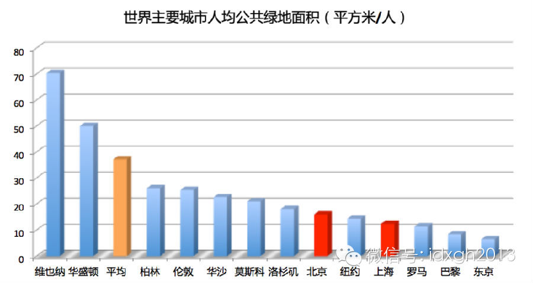
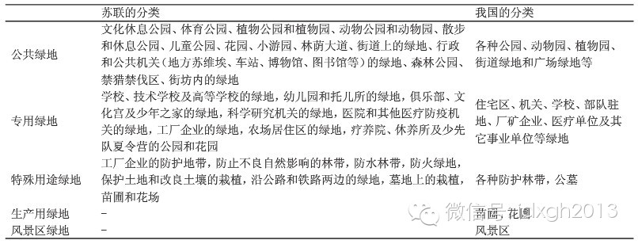
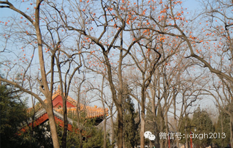
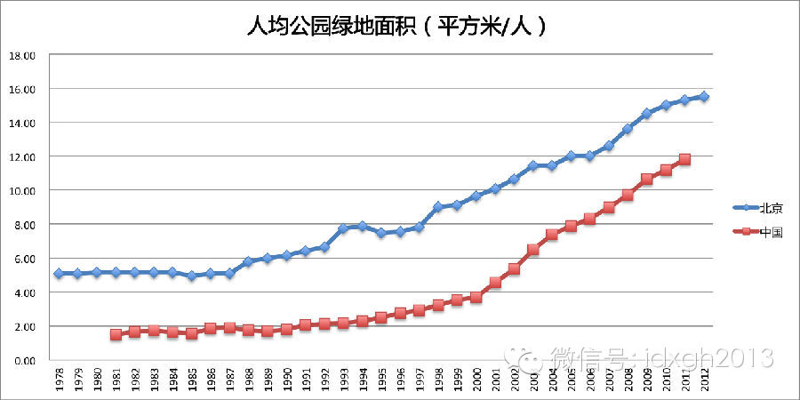
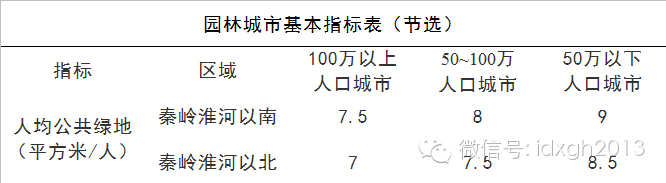
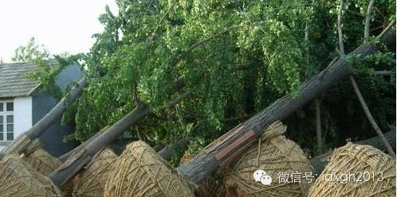

**中国的城市一直给人绿化稀少的印象，但全国城市人均绿地面积超过了罗马、巴黎。为什么会这样？**

  

文/杜之杕

  

中国城市的绿地多吗？

  

从数据上讲，还不错。《2013年中国国土绿化状况公报》中，全国城市建成区绿化覆盖面积181.2万公顷，城市人均公园绿地面积12.26平方米，全国城市建成区绿
化覆盖率、绿地率分别达39.59%和35.72%。

  

如果算人均面积，北京市人均公园绿地面积达到16.0平方米，上海市则为12.4平方米。放在世界主要城市中，虽然排名不高，也稍强于罗马、巴黎。

  

  

世界主要城市人均公共绿地面积

  

但如果身处国外的城市，哪怕仅仅观看城市的影像，都能感受到中外城市绿地的巨大差距。为什么会出现统计数字与直观感受间的偏差？是我们感觉错了，还是另有原因？

  

**【东京绿地和北京绿地】**

  

首先，各国在分析和统计绿地时所使用的标准不同。

  

绿地（green space）是一个相对的概念。西方的城市规划中，更多地使用开放空间（open
space），其内涵根据各国法律和学术规范略有不同。如杂草荒地在英国被计入开放空间，美国则不包含。

  

中国的绿地标准师承于苏联，但并非完全照搬苏联模式。

  

苏联《绿化建设》与中国《建筑工程部关于城市园林绿化工作的若干规定》对城市园林绿地的分类

  

1980年代以来，中国一直以三项指标来指导城市绿地系统建设：城市人均公共（园）绿地面积、绿化覆盖率、绿地率。虽然这三项指标指向不同又有所重叠，但在关于绿地的
认定上，最严格的则是城市人均公共（园）绿地面积，是现在的主要衡量标准。

  

鸟瞰莫斯科：成片的绿地以及浓密的宅间绿化，具有明显的苏联规划特征

  

不过，相对于另一项统计口径——“人均”，评价标准差异造成的影响着实有限。

  

中国城市人口的统计包括户籍人口与常驻人口两套口径。虽然自2006年起，“人均公共绿地面积”要求以总人口（城区人口和城区暂住人口）为分母计算，但在实际中，许多
城市仍然按照户籍人口来计算“人均公园绿地面积”。

  

比如北京，其人均公园绿地面积的计算口径仍为户籍非农业人口，对于一个暂住人口占常驻人口约1/3的城市，绿地数据优于罗马、东京也就可以理解。

  

但是，如何解释北京、上海很难看到绿地，而人均绿地很低，罗马、东京则不然？或许公园大小、数量和分布是最重要的原因。

  

东京的上野公园是全日本最大的公园，占地面积52.5公顷，但与北京的城市公园相比，只能算中小型：1200公顷的北京奥林匹克公园、350公顷的圆明园、290公顷
的颐和园、289公顷的朝阳公园、273公顷的天坛公园、136公顷的玉渊潭公园都比它大出数倍，即使较小的北海公园（71公顷）也远比上野公园大。

  

东京与西方城市一样，绿地主要是由大量3公顷以下的社区公园构成，它们均开放地分布在居民区和商业区，而中国城市几乎没有社区型公园。除上海外，城市公园占地面积多在
10公顷以上，而且中国城市越来越倾向修建大公园。

  

所以，账面上虽然北京比东京人均绿地还要多一点儿，但北京人如果不特意跑几公里去逛公园，他们很难看到平均到自己头上的那块绿地，而东京则遍布着无数社区公园，稍走几
步就可以看到一块绿地。

  

中国绿地不但远离居民社区，而且分布极不均衡。绿地多集中在开发成本低的新城区，老城区不但绿地极少，而且正在逐渐消失。住在北京南城的居民，显然比新城区的居民，人
均绿地和“绿地感受”的落差更大。

  

上海的情况更糟。市中心的静安区，2015年规划人均公共绿地面积将达到1.44平方米——不到今天上海人均绿地面积的1/8。而在2004年，浦东新区的人均公共绿
地就由1993年的0.54平方米增长到了24.5平方米，静安区的上海人要看绿地得去浦东。

  

几乎中国所有城市都是如此，即便是绿化率很高的广州，也很难看到绿地，由于广州的绿地主要集中城区北部的几座山上，人们很难相信广州的绿地率居然与城区处处皆绿地的新
加坡接近——如果不考虑统计指标和口径的区别的话。

  

**【从来就没绿过】**

  

绿地是现代城市的产物。19世纪，欧洲工业革命后，城市人口急剧增加，卫生、环境严重恶化。1833年，英国议会颁布了一系列法案，准许用税收建造城市公园和其他城市
基础设施以改善环境卫生，保障市民健康，提供休闲游憩场所。

  

1949年前，中国的城市工业非常薄弱，加之连年战争，城市绿地一直发展缓慢。其时，最为发达的上海人均绿地仅0.13平方米，约一张A3纸大小。

  

1953年后，中国的城市开始学习苏联，全面建设绿地，除了花园、公园，还关注居住区绿化，特别强调街坊绿化。

  

根据苏联专家建议，居住区绿化模仿法国古典式样，但几何图形的布局很快被“走捷径”的居民“犯禁”破坏——这在今天依然未有根本改观，宏大的景观设计，往往要靠“小草
青青，请勿踩踏”的谆谆教诲来维持。

  

但城市绿地建设很快被迭起的政治运动破坏。文革时，公园被认为是“资产阶级遗老遗少的乐园”，在“破旧立新”口号下，砸盆花、铲草坪、拔开花灌木，为了“结合生产”，
一些公园被改造成了果园，更多的公园则被企事业单位所占用。

  

据不完全统计，1975年底全国城市园林绿地总面积只及1959年的一半，1978年上海的人均公共绿地面积也只增长到0.47平方米，几乎抹平了学习苏联的成绩。中
国城市从来就没绿过。

  

北京中山公园里为响应毛主席“今后庭院里要多种树木，多种果树，还可以种点粮食、蔬菜、油料作物”而栽种的柿子树

  

今天中国城市绝大部分绿地都建于改革开放后，尤其是2000年后。以北京为例，2000年以后增长的人均数值比前二十年都多。

  

与绿地最直接相关的不是一个城市经济总量，而是其财政收入。1977年—1987年间，北京的GDP翻了3倍，但地方财政收入仅增长了26%，这严重影响了市政建设的
能力。

  

数据来源：《北京统计年鉴2013》《中国城市建设统计年鉴2011》

  

2000年这个时间点和另一项重要政策相关——住宅商品化。土地出让收益推动大规模的新城建设，激发了政府和开发商建设配套绿地的热情——由于新区建设绿地的成本远远
低于老城区，它不但利于土地增值，而且政绩考评时，新城区的绿地可以平均到老城区居民头上。  

  

**【绿地多寡看书记】**

  

由于中国各地气候差异，官方在评选“国家园林城市”时，专门根据地理气候差异制订出了不同标准。

  

园林城市基本指标表（节选）

  

然而，中国一个城市绿地面积多寡，气候因素往往来得远不及领导意志更重要。

  

在《2011年中国城市建设统计年鉴》，同属于广东的普宁、廉江的人均公园绿地面积分别为0.73㎡、36.47㎡，位列倒数第二和正数第二。而降水量较低的内蒙古，
乌兰察布、鄂尔多斯人均公园绿地面积分别为32.78㎡、26.39㎡，皆在北京、上海的两倍以上，高出包头、呼和浩特10㎡以上。

  

属于极干旱荒漠气候，年降水量不足40㎜的新疆图木舒克，人均公园绿地面积为25.80㎡。在中国，如此大跨度的数值差异只有行政力量能办到。

  

领导偏好的影响还体现在绿地的质量。由于投入成本的显著差异，城市绿化时选择何种树种，甚至是种树还是种草，都是大有讲究。

  

1990年代，大连为了快速绿起来，大力推广种草，一时间该草被称为“熙来草”，后有人撰文《薄熙来为何种草不种树》分析批评道，当时大连提出的2010年绿化覆盖率
任务，若选择种树，恐怕要2050年才能实现，“而种草则仅仅需要一天的时间把培育好的草皮铺上即可”。

  

作者显然低估了行政的力量。

  

种草书记到了重庆后，对市树黄桷树颇不满意，2008年提出“绿化城市需要提高树种的档次和质量”，于是黄桷树改为高大上的银杏树。但种树并不需要十年，逾2千万棵银
杏直接自山东、江苏等地采购，像铺草皮一般的种树方式，令全国银杏树价格短时间内上涨了五六倍。

  

但重庆土壤条件不适合银杏栽种，加上移栽方式不科学，高价购买的树苗成活率并不高。潼南工业园区的银杏树极少存活，渝遂高速公路潼南段耗资上千万元栽种的银杏树死了一
半。

  

某苗木基地生产供应重庆银杏

  

“十年树木”的老话显然需要改写。

  

2012年，青岛市花费40亿元打造“国家森林城市”，第一个月就种下了180万棵树，为了给树苗腾地方，无数草坪被拆毁。一些民众并不满意，但也许他们该知足——相
对于100余座人均绿地少于8㎡的城市，青岛领导已足够大方。

> 版权声明：  

> 大象公会所有文章均为原创，版权归大象公会所有。如希望转载，请事前联系我们： bd@idaxiang.org

大象公会：知识、见识、见闻

微信：idxgh2013

微博：@大象公会

投稿：letters@idaxiang.org

商务合作：bd@idaxiang.org

举报

[阅读原文](http://mp.weixin.qq.com/s?__biz=MjM5NzQwNjcyMQ==&mid=204279893&idx=1&sn
=87e4bb586d520ef84146e12dbf0c1c5f&scene=0#rd)

