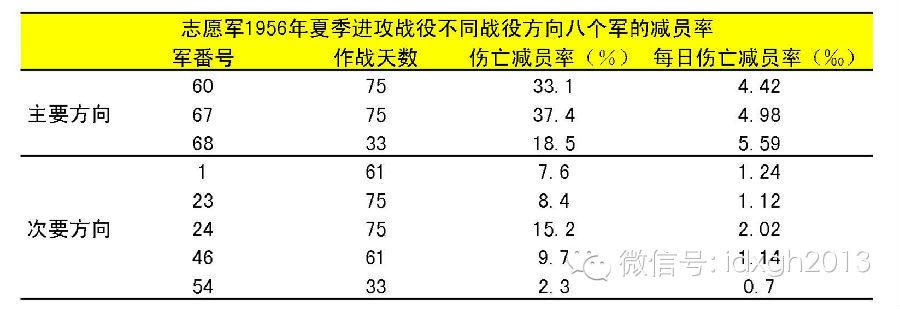
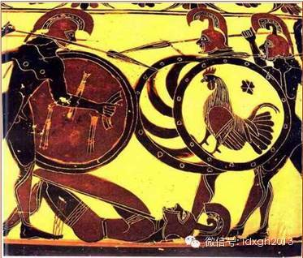
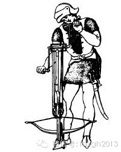
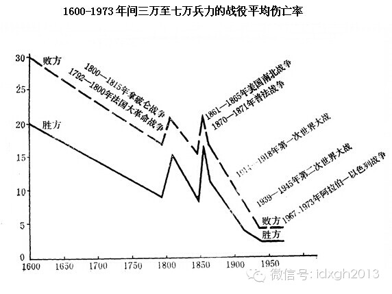
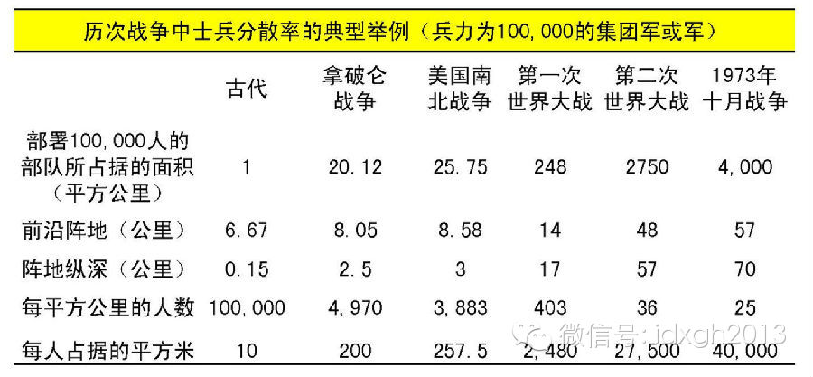
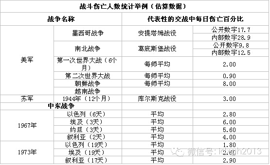
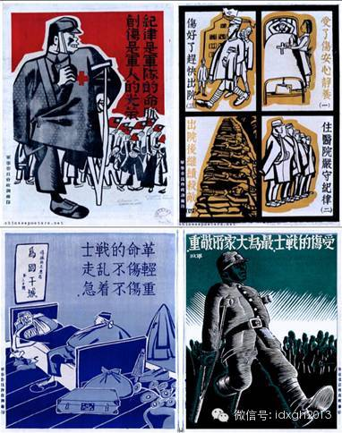

**战场总充斥人们最残酷的想象，但现实中，打仗会死多少人呢？伤亡率又与哪些因素密切相关？**  

  

文/江鸣

  

尸山血海，无人生还，往往是人们对战场的想象，尤其是对仅仅靠影视、诗词了解战争的普通民众。中国人尤为如此，曾经的人民战争让人印象极深，无人生还的惨状屡屡出现在
教科书上。

  

志愿军1956年夏季进攻战役不同战役方向八个军的减员率（数据来源：总后卫生部卫勤学教材）

  

许多知名战例就是因为伤亡超乎寻常被记录，而更多的战斗伤亡率并不高。从中国军队近年的战役就可以看出。

  

中国军队三次战争减员率（数据来源：总后卫生部卫勤学教材）  

  

战争是死亡的事业，但死神降临的频率受多种因素的影响，唐诗称：“醉卧沙场君莫笑，古来征战几人回”，而海湾战争盟军死亡不足400人。古代战场都是无人生还吗？现代
战争都极少伤亡？哪些因素影响了死神的光顾？

  

首先，要从冷兵器战争讲起。

  

**【17世纪前的战争】**

  

似乎冷兵器时代的战争都十分残忍，伤亡比例也更大。但这种印象并不可靠，首先，伤亡统计就很少准确。

  

最常见的是夸大参战人数。《战国策》中动辄战车万乘、奋击百万、斩敌数万，常超过一国青壮年人口总数。著名的长平之战，秦将白起坑杀40万赵军，从技术角度几乎无法实
现。

  

西方的记录同样存在问题。公元前216年，汉尼拔进攻罗马，发动坎尼战役，史书记载8万罗马人“全军覆没”，但考古证明这种说法并不可靠——不少被“歼灭”的士兵实际
是逃跑，一些人14年后又跟随西庇阿，在扎马会战中完成对基太伽人的复仇。

  

即使是战场伤亡，很大程度上也不是交战造成。古典时期，交战以方阵为单位，接敌面有限，纵深的士兵甚至得不到交战的机会。战败一方队形很快崩溃，20%左右的死亡由踩
踏造成。

  

一个公元前100年科林斯花瓶上所描绘的战斗场面，被击倒者都不会放弃他的盾牌，因为敌人和伙伴们的践踏足以致命

  

此外，军队常常躲避作战。1677年一位将军回忆道：我们像狐狸一样谨慎作战，可能要在二十次围城之后才来一次战斗。”许多部队在视力可见的范围内对峙，互不进攻，一
旦天气转冷，双方便有了体面的借口而拔寨回营。路易十五时期的法国大元帅萨克斯甚至说：“在近距离射程内交火死亡的，我总共见到甚至不到4个人。”

  

有意思的是，军队妥协的传统早已有之，他们有时会人为消除不对称因素，来一场公平的战斗。

  

公元前216年的第二次布匿战争后，罗马人对汉拔尼战象非常恐惧，曾和基太迦人约定，以后的战争中不动用大象。1139年，教皇曾亲自通谕，禁止基督教国家之间使用十
字弓（弩）作战，原因是这种不人道的武器带来过大的伤亡，但与异教徒的战争不在此禁令之列。

  

准备发射的十字弓手

  

真正造成大量伤亡，往往是由于战术落后于武器的发展。一旦战术与武器系统合拍，伤亡便大幅度减少。

  

火器大规模运用后的17-18世纪，各国都发展了匹配的战术，战场相对温和。1692年，以惨烈著称的斯蒂寇克战役，恰逢火绳枪时代的尾声，战术臻于成熟，虽然双方投
入兵力达到15万，但阵亡只有8000人。仅仅几年后，燧发枪出现了，一系列战役中近半数伤亡才变得常见。

  

**【武器，让战争更温和？】**

  

17世纪以后，武器随着科技的进步日新月异。矛盾的是，武器杀伤力虽然大幅增加，但有时却极大降低了战场死亡率。

  

毒气战就是典型，它广泛运用于第一次世界大战，让后世闻风色变。实际上，它的死亡率只有2%。但是，毒气战的震慑效果明显，如果换成枪炮，只有把战场变成血肉磨坊才能
相比。所以军事史学家富勒称之为“最有效而又人道的武器”。

  

1600年—1973年三万至七万兵力的战役平均伤亡率（数据来源：T**N**杜普伊《武器和战争的演变》）

  

美国南北战争中，每年平均1000士兵死亡21.3人，到了第一次世界大战，每1000士兵死亡降为12人，第二次世界大战中是9人，1973年十月战争期间，师级部
队的战斗日伤亡率平均在2%左右。

  

20世纪90年代之后，伤亡率的下降更为明显。海湾战争中，联军以不到400人的伤亡完胜，极大震撼了人们的军事观念。此后西方发动的数次战争，无不多方配合，精准打
击，极快地完成战斗，伤亡比非常低。

  

这种现象背后，是战争观念的重要变化。冷兵器时代，一场战役往往代表一场战争，杀伤敌人的多寡是胜利的重要标准。而现代战争更注重对局势的把控，对打击对象区分更细，
在技术的帮助下，实现战略目标十分迅速。

  

具体战场中，军队合成化程度的提高，也大幅减少了伤亡。南北战争时期，军队中80%是步兵，随着武器系统变得复杂，普通步兵比例越来越小。即使有大步兵传统的中国军队
，21世纪后步兵连数量也不到2000个。

  

合成战术单位可承受的伤亡率很低。二战中巴顿率领的美国第3集团军在欧洲的经验表明，师级作战单位，20%的伤亡即失去进攻能力，只有从别处补齐兵种，或者撤退、投降
。

  

同时，人员密集度不断下降，让伤亡人数锐减。著名军史专家杜普伊曾做过统计，虽然对大规模军事编队的杀伤力提高到原来的2000倍，但现实中士兵分散率提高了4000
倍，远远超过了武器进步的范围。

  

历次战争中士兵分散率的典型举例（兵力为100,000的集团军或军）

  

第一次世界大战中，机枪和铁丝网的出现，极大增加了步兵的伤亡。此后，合成单位和分散作战变为不可逆转的趋势，极少有人能用密集人力对抗工业力量。

  

战斗伤亡人数统计估计

  

但还是有人尝试，虽然并非本意。黄仁宇回忆录中，形容抗战时期国军“攻则蜂拥蚁附，退则鸟奔兽散”，极易被打击。抗美援朝战场上，无数座上甘岭，步兵的血肉之躯获得惨
胜，代价是总减员率51.5%。  

  

某些场合下，武器进步仍然增加了死亡率，那就是游击战争、平民武装冲突。这些战斗的目标就是打击有生力量，手段无所不用其极，渗透到每个角落，发挥了技术残暴血腥的一
面。这种战斗的恶果大多由平民吞下，令人心悸。

  

**【医疗的赠礼】**

  

医疗虽然不能改变伤亡数，但能极大降低伤亡比。

  

早期的战场，是民间古怪疗法的试验场。极少有专业的军医，通常被与祭司、方士混为一谈，往往只会救助灵魂，但伤员的肉身已先走一步。并且冷兵器交战中，受伤倒地的士兵
很快成为任人宰割的对象，这一时期阵亡者远多于伤者，军医和救治机构聊胜于无。

  

火器伤出现后，军医在相当长时间内没有适应这一改变。他们将并发症的伤口归咎于火药中毒。救治原则也是南辕北辙，1517年德国出版的《医师野战简书》主张缝合前用热
大麻油浇注伤口。法国军医毫不示弱，建议人为扩大创口，让脓液自由流出。

  

一部分医生尝试给失血的伤员输血。1818年一名叫布伦德尔的医生做过一次尝试，伤员在几小时内就死亡。普法战争中，伤亡惨重的普鲁士人给一批伤员输血，在对血型知识
一无所知的19世纪初，结果自然是悲剧。

  

抗战时期国民政府军事委员会印制的海报。二战期间，由于一系列救治原则的确立，即使像中国这样的前现代国家，伤员平均归队率也可达到50%。卫国战争初期，苏军的为7
6%，德军的可以达到80%以上。

  

几百年来，对于四肢受伤的伤员，截肢都是野战医疗的首选。这一时期，医生的工作与木匠类似。一名叫拉雷的法国军医，在波罗廷战役中挥汗如雨，一天做了200例手术，锯
掉的手臂和小腿在帐篷里堆成小山。

  

在没有麻醉剂的时代，这是一种惨无人道的酷刑，不少伤员宁可死去也不愿承受剧痛。路易十四曾说“士兵们害怕外科医生的手术刀，更甚于敌人的炮火”。

  

熟练的“手艺人”是军队宝贵的财富，1820年代，法国人詹姆斯**赛姆可以在一分半钟内剥离肌腱、骨头，将一条腿卸下来，大大缩短伤员的痛苦时间，他因此绝技成为法
国首席野战医生。

  

但是，截肢只是救治的第一步，坏疽病和其他感染仍然致命。在没有认识消毒重要性之前，救治基本上听天由命。普法战争13200名截肢者中，将近1万名最终感染死亡。

  

比战斗伤亡更可怕的是疾病。1870年以前，军队中死于疾病的人远远高于阵亡者，拿破仑进行的历次战争这一比例一直保持在8:1。美国内战中，往往一个团从开拔到加入
战斗前，已经减员一半。一战末期，新生的工农苏维埃政权，伤寒导致数十万军人死亡，其时恰逢外国武装干涉，伟大导师列宁忧心忡忡地评论道：“如果社会主义无法战胜这一
疾病，它将反过来战胜社会主义。”

  

医疗的进步最终改善了伤亡情况，尤其是抗生素的诞生，与战场阶梯治疗体系的普及。二战开始，伤亡比例便稳定在3：1～4：1，在其后的几十年都没有大的变化。最发达的
美国，越南战场上的伤亡比例达到7:1，到了反恐战争，这一数字上升到10：1。

  

战争固然可怕，但谢天谢地，不管哪一时期，大多数人还是回来了。

  

> 版权声明：  

> 大象公会所有文章均为原创，版权归大象公会所有。如希望转载，请事前联系我们： bd@idaxiang.org

大象公会：知识、见识、见闻

微信：idxgh2013

微博：@大象公会

投稿：letters@idaxiang.org

商务合作：bd@idaxiang.org

举报

[阅读原文](http://mp.weixin.qq.com/s?__biz=MjM5NzQwNjcyMQ==&mid=204388565&idx=1&sn
=e6334103e58bebeaa3daa7e33fc2ced5&scene=0#rd)

