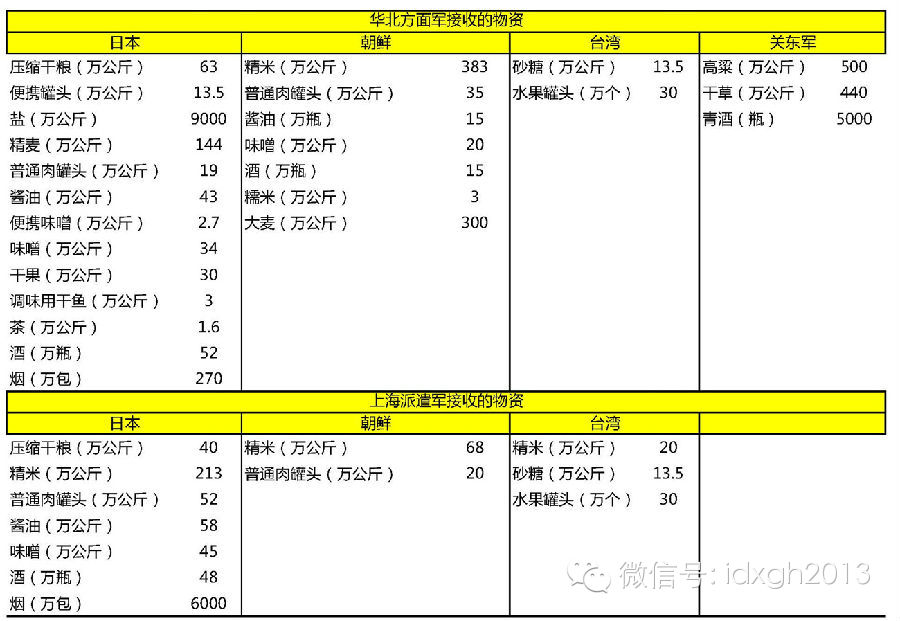
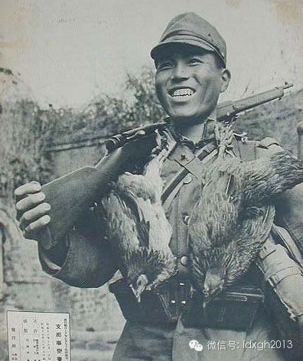
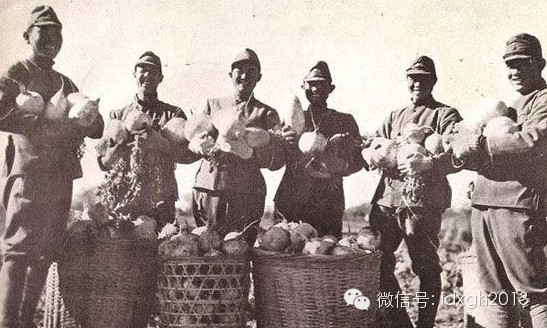
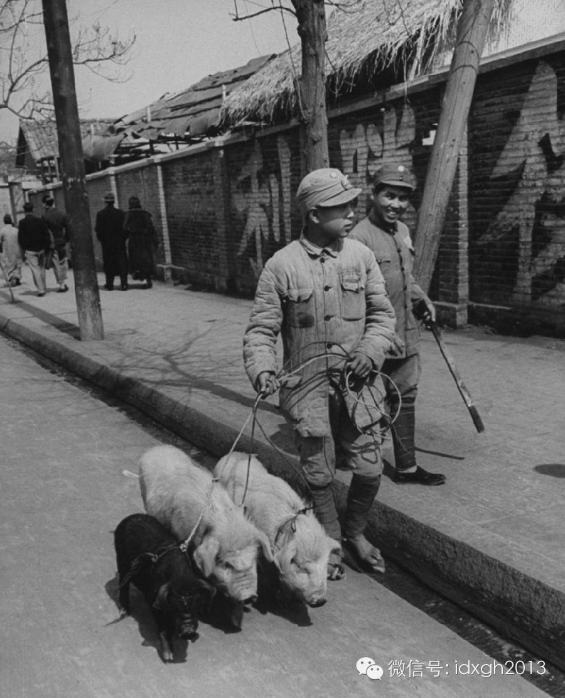
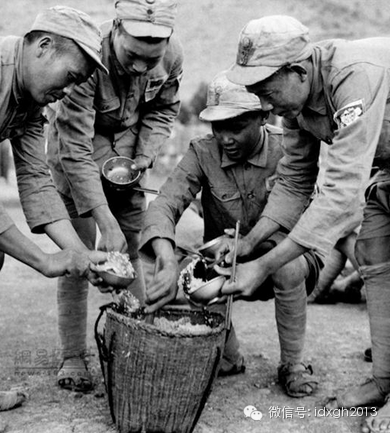
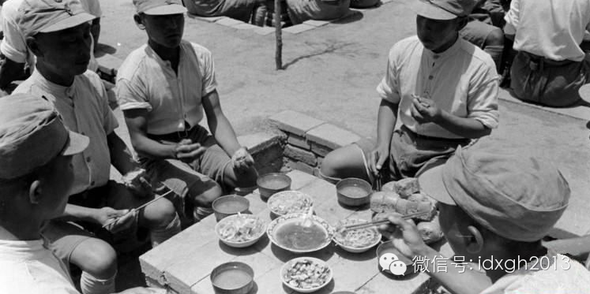
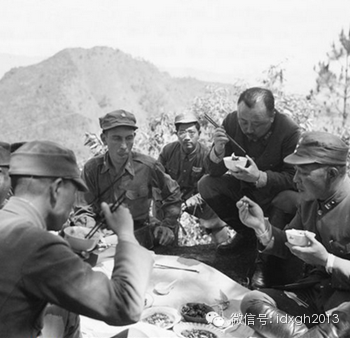
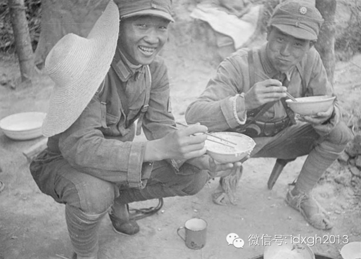
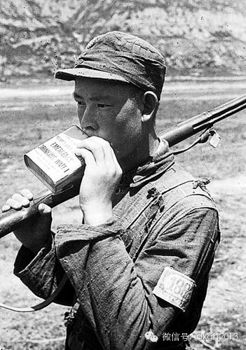
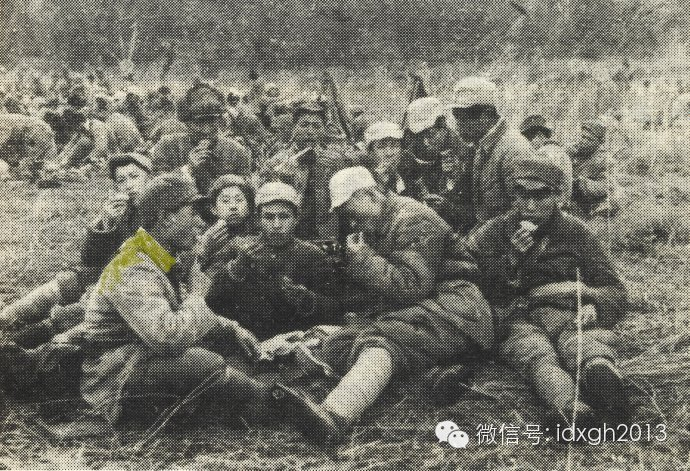

**抗战神剧中，总会有太君进村抓鸡。共军被称为“小米加步枪”，国军靠“八宝饭”充饥。这是真的吗？现实中，他们如何解决吃饭问题？**

  

文/唐元鹏 王戡

  

1943年3月，时在重庆的中央大学出现学潮，起因十分朴实：食堂的饭太难吃。

  

当时中大的米饭被称作“八宝饭”——掺有沙子、煤屑、稗子、稻谷，学生相当不满。关键时刻，兼任校长的蒋介石亲自视察食堂，不顾牙齿被咯掉的危险，与学生谈笑风生，连
吃三碗，诸同学面面相觑，一场风波无形化解。

  

客观来讲，中大的大学生确实娇气了。此时正值抗战关键时刻，物资匮乏，前线国军已经吃“八宝饭”很久了，而共军则连大米都吃不上——他们自嘲为“小米加步枪”。

  

日军的供应要好一些，但是随着战争逐步深入，也出现营养不良情况，以往从国内运输的粮食供应不足，只有频频扫荡。

  

兵马未动，粮草先行，后勤对于战争的重要性不言而喻。但抗战三方军队的后勤很难及格，国军、共军一直未能建立现代后勤系统，日军的系统很快无法支撑。

  

这样的军队都怎么填饱肚皮呢？真的都靠抓鸡、小米、八宝饭吗？

  

**【日军“精大米”】**

  

最初，日军还依赖后勤从国内运输，伙食标准令中国军队羡慕。

  

日军的后勤体系建立于明治维新时，经历甲午战争、日俄战争洗礼，侵华战争爆发以前，已有相对成熟的，由经理部（后勤部）领导，兵站线组成的体系。

  

按照日军后勤条例规定，士兵每人每天要吃870克精米，或者与之热量相等的面包、饼干、压缩干粮、精谷物。除主食外，还有熏肉、鸡蛋、盐渍或糠渍酱菜。为保证盐的摄入
，每天还有150克味增或者0.08升盐或调味汁。

  

以华北方面军为例，从1938年2月11日至3月10日，接收了来自日、朝、台湾、东北等地输送的海量物资，以养活12万日军。

  

图1 华北军接收的物资

  

庞大的物资在日本、东北、朝鲜、台湾等地聚集，通过广岛、门司、旅顺、台北高雄等港口海轮运到中国的天津、青岛，再由铁路公路转运，最后送到每个华北方面军士兵的手里
。

  

此时的日军还完全依赖本土或殖民地送来的物资，对搜集当地食品并不热心。1937年12月，京津地区日军把掳获的中国大米主要用于抚恤、赈济地方百姓。

  

1939年日军经理部一份交运清单中，蜜柑罐头、水蜜桃罐头、蜜豆罐头、马手贝罐头、瑶柱罐头、浅利贝罐头等赫然在列。除了浅利贝罐头，运量都在1万罐以上，蜜柑罐头
达到31万罐。

  

这些美味佳肴都是随着清酒送来的下酒菜。1938年的陆军纪念日，每名华北日本兵获得了0.4瓶清酒，1份甜品，100克干果，以资庆祝。

  

不过，依赖后方也有风险，一旦供应中断将十分被动，第二师团荻原支队在山西北部作战就是如此。运输车损坏后，他们只好在主食中掺杂从当地搜集的小米、高粱、粟米、生野
菜，辅以搜集的鸡肉、猪肉、砂糖、食盐、豆酱，还要日军飞机空投，勉强撑饱了肚皮。

  

只要有机会，日军便要制作家乡小吃——大快朵颐

随着战争不断深入，日军的后勤逐渐难以支撑，不得不把重点转移到就地取材上。《1941年度兵站运营要纲》中，经理部提出粮秣以当地（占领区）获得为主，即使运输，也
在满洲、内地占领区内部调剂，减少日本本土运送。

  

什么是当地征集？就是传说中的“鬼子”进村。日军下乡扫荡时，最喜欢抓鸡，1941年8月一次扫荡中，日军在北岳区共抓了5万只鸡。一位青岛人回忆：“日本兵爱吃鸡，
隔三差五出来四处抓鸡解馋，东西大村的鸡被日本兵抓得精光，在那苦难的抗日八年中，这里的黎明静悄悄。”

  

日军爱吃鸡，下乡抓鸡成为了抗战中侵略者的标准形象

  

日军很快建立了比扫荡更省力的制度：上贡。华北平原的日军建立据点后，向当地摊派“田赋”和“警备餐”，田赋每亩每年
4.3元（伪币）；警备餐是大米白面，猪肉牛肉，鸡鸭鱼鹅，蔬菜水果，烟酒茶等。

  

为了让日军少出据点扫荡，一般乡村都会尽力供应。望都县北坝子村给附近据点每天上贡菜12斤、香油5斤、鸡蛋20个。

  

适应了中式食材，也很快学会了中式炊具。36师团晋南作战后就总结道：用中式的大锅能在短时间内作出大量饭食，非常适合野外环境。

  

依靠着上贡、扫荡、运输，日军普遍能吃上精大米。但这也给日军带来了富贵病——脚气。

此脚气并非皮肤病，而是一种因只吃精米导致维生素缺乏的病症。这是日军老传统——甲午战争中，日军有20%的死亡源于脚气病。

  

1939年8月下旬，华南派遣军就有386个脚气病例，军医部很快下发防治脚气高发的文件。高级军官也曾中招，野战重炮第二旅团团长木谷少将就死于此病。

  

日军种菜，随着战争深入，就地征发成了日军主要的补给手段

  

1944年以后，娇贵的日军也出现了断粮。

  

1944年末，为了打通大陆交通线的日军27师团在湖南遇到了粮食危机，补给送不上来，部分中队只有在农田里觅食，幸好已是秋收，稻米和红薯获取不少。但是，副食品基
本没有，特别是缺肉，动物性蛋白质严重缺乏，造成了大面积的战争营养失调症。

  

“一号作战”的湖南战场，真成了日军的噩梦，营养不良造成的非战斗减员几乎与战斗伤员达到1比1，截至7月22日，10个师团有8327人战伤，得病的达到7099人
。

  

**【国军“八宝饭”】**

  

国军的供应体系远不如日军发达，饮食标准也偏低。

  

1935年，军政部制定了陆军战时给养定量标准：每人每天大米22两或面粉26两（旧制，一斤等于十六两），罐头肉4两、干菜2两、咸菜2两、食盐3钱、酱油4钱，临
时加给烧酒2两或白糖1两。军政部只部分解决运输问题：主食和油、盐依靠兵站采购，副食则靠部队自行购买。

  

抗战期间国军能买到的猪，要比现代的品种小得多

  

武汉会战后，苏皖浙赣沦陷，物价飞涨，副食很快买不起了，主食的米面接下来也难以供应。为了解决吃饭问题，1941年7月，国民政府成立粮食部，将田赋征收由现金改为
实物，当年就筹集到粮食2460万石，效果立竿见影。

  

“田赋征实”以数量衡量一切，粮食质量便急转直下。部队吃的米饭有霉米、沙子、石子、粗糠、稻壳、稗子、老鼠屎和小虫子，雅号“八宝饭”产生于此。第54军军长黄维曾
因粮食质量太差，愤而将整包大米寄到军政部抗议。

  

军政部虽然制定了伙食标准，现实中的执行常是炊事班抬出几大桶米饭，士兵蜂拥抢食。老兵对吃饭别有心得，总结为“一碗高、二碗半、三碗鼻子看不见”——第一碗略高过碗
边，先给肚子填个底；第二碗只盛一半，倒上热水当粥喝，也有利消化；第三碗要盛到看不见鼻子，再躲到一边慢慢吃。

  

国军在盛饭

  

大部分国军只能勉强吃饱主食，但身为天之骄子的空军得到了特别优待，抗战最困难的时刻，飞行员每餐依然可以吃到肉类、鸡蛋和牛奶，让因物价升腾伙食水平下降的地勤官兵
羡慕不已，自嘲：“空勤的紧吃、地勤的吃紧”。

  

海军的战舰虽然损失殆尽，待遇仍高陆军一筹，主食同样吃八宝米，副食却能做到“荤素兼有、肉食不断”。有些海军军官还不忘吃西餐的派头，每周总有一天用刀叉就餐，虽然
食物只是馒头一个、咸鱼一条、豆腐蔬菜各一碟。

  

陆军官员的回忆录中，“吃好”的标准低的可怜。国民党将军董其武，在87岁高龄撰写的回忆录里，还对傅作义总部吃到的一顿午餐念念不忘，感叹“真是一顿丰盛的美餐”，
其实，那不过是“糜米饭和羊肉煮山药蛋”。第75师参谋赵康侯记忆中的抗战美食更是寒酸，只是“半茶缸番薯米饭”而已，但是“饥者甘食，其味之美至今不忘”。

  

国军军校生的一餐

  

对普通士兵而言，吃好的唯一标准就是吃肉，但像日本人一样进村抓鸡，很可能被村民告状从而关禁闭甚至枪毙。于是偶尔抓到的狗成为了改善伙食的重要来源，当时任职排长的
黄仁宇就担心自己部下吃狗吃出毛病。

  

残酷的战争消耗着各方的供给，抗战后期，国军的伙食普遍下降。

  

湖南战场上，被日军围困的衡阳城守城国军主食从“机（磨精）米白面”换上了“灰糠和糙米”。副食也每况愈下，从最初的鸡鸭牛羊，到日军炮弹炸出池塘的鱼，再到油炸花生
和黄豆，最后就只剩下白盐和开水了。

  

抗战中期孤悬敌后的中条山地区更加艰难。粮食要长途运输，自己加工，菜蔬油盐奇缺，士兵只好采集野葱、野韭菜、野香椿、桑椹。

  

高级将领的午餐比士兵丰盛一些，图为松山前线，右二卫立煌

  

饿肚子最惨痛的，当属第一次远征时退入野人山的国军。最初还能吃到宰杀的牛肉、马肉以及自己携带的米面、罐头，之后就只有煮食山民种植的苞谷，以及草根、树叶、芭蕉根
吃。火柴用完之后，只能找些猴子吃的野果果腹。远征军女兵李明华回忆，饥饿多时的她吃到了两个煮小玉米：“如获稀世珍宝，其味道的鲜美难以笔墨形容”。

  

**【共军“小米加步枪”】**

  

八路军本身没有现代化的后勤体系，主要是靠各部自行筹措。1938年1月，中共中央书记处发出了《关于解决部队给养困难的指示》：一、别指望国民政府，二、给养不足就
要靠人民支援，三、加强统一战线，找开明士绅募捐筹款。

  

这对共产党军队并不是问题——他们有丰富的自给经验。开始时，八路采用苏区方式：“打土豪分田地”，打汉奸没收财产，以及向敌后的国民党政府征集，走到哪吃到哪，就地
筹粮、就地吃饭，没钱了就打个白条。

  

1940年6月，晋察冀军区要开辟平北根据地，正值青黄不接，阴雨绵绵，搞粮食非常困难。所到之处，百姓只能拿出刚刚成熟的青玉米棒、小土豆、窝瓜蛋，但部队吃了青玉
米棒，来年的收成便没有了。为了巩固新区，平北分区政治部主任段苏权，事后筹措了一笔钱给当地，总算还了白条。

  

八路军也常常只有主食可吃

  

在华北抗日根据地，八路军最主要的粮食是小米，重要性堪比货币。晋察冀的政府帐目是以小米或其等同物为单位结算，“小米加步枪”说法不胫而走。

  

根据地经验丰富了，也搞出了制度创新：屯粮，征收爱国公粮，达到了稳定供应。华北八路军每人每月的伙食标准是40~45斤小米，3两油，1.5~3.5元的菜金。

  

但这份标准中没有肉食，实际上，相对于国军和日军，共产党军队没法指望上级拨给，只有各显神通。

  

八路军也有享用瓶装水的时候

  

湖南人赵贵徵在1938年2月参加了八路军进入了抗大学习，他发现陕北人不吃下水，猪牛羊的下水都埋在地里，于是他便联系了当地人做内应，看谁家宰羊，就偷摸把下水起
出来，与战友们煮了吃。

  

后来小赵到了晋察冀当了连指导员，主要工作就是解决口粮，他鼓捣了20亩地种蔬菜，又养了两只猪，特别是躲藏反扫荡时，赵贵徵宰了一头猪，有效地鼓舞了连队士气。

  

战时，延安的领导们吃顿好饭也是值得一提的大事，359旅政治部副主任王恩茂率部返回陕北，他在1939年11月共30天的日记里，特别提到吃饭的有13天，其中有1
5顿饭是请客、被请客或者会餐，特地提到“好饭”的有三顿。

  

王恩茂还喜欢下基层，也经常能打牙祭，在特别困难的43年2月，王恩茂吃了一顿717团1营的酒席，这桌饭一开始是点心，糕、糖、油煎的花生面块、梨、枣等。正席则有
几十碗菜，最后每桌都剩下不少菜。

  

就在王恩茂吃一营的酒席时，整个华北的八路都陷入了粮食困境。1941年后国民政府断了对共军的供给，加诸“五一”大扫荡，中原灾荒等因素，共军伙食标准急剧下降，部
分地区以黑豆加野菜为食。

  

正在吃干粮的八路军

  

1942年，冀西区部分部队每天只吃二两黑豆，以野菜，树叶，树皮，草根充饥。但他们仍然保持了风度，把离村近的榆树皮和野菜留给群众，部队到十几里外的高山上采集。

  

连白洋淀这种号称富庶的地区，百姓也只能捞水草过活。著名的“雁翎队”经常只能捞点鱼虾白水煮着吃，既没油，也没盐，腥味扑鼻，有时候刚咽下去，立马吐出来。

  

日军也时刻在与八路抢夺着粮食，在1941年后，日军的扫荡多数在春秋两季，春季干扰播种，秋季跟八路抢收。1941年8月的扫荡中，日军在北岳区和平西区被抢走或损
坏粮食5799万斤粮食，3万头家畜。

  

面对如此局面，八路军放下枪，拿起锄头开始了大生产。冀西区在拒马河两岸试种稻子，1943年稻谷取得大丰收，军队吃上了大米饭。赵贵徵组织部下开垦了10几亩地，种
下了山药蛋，结果收了三万斤，解决了连队3个月的伙食，当然山药面饼不可能有多么好的口感。

  

经过一年的大生产，口粮问题逐渐得到了解决，晋察冀第3军分区2团1943年秋后，每人每天能吃六钱油、七钱盐、二斤菜，每人每月还能吃一斤猪肉。到1944年冬天，
这个团的士兵平均体重从94.5斤增加到114斤。

  

> 版权声明：  

> 大象公会所有文章均为原创，版权归大象公会所有。如希望转载，请事前联系我们： bd@idaxiang.org

大象公会：知识、见识、见闻

微信：idxgh2013

微博：@大象公会

投稿：letters@idaxiang.org

商务合作：bd@idaxiang.org

举报

[阅读原文](http://mp.weixin.qq.com/s?__biz=MjM5NzQwNjcyMQ==&mid=204323559&idx=1&sn
=5832bb6e0052222f15de545dab4fd2fe&scene=0#rd)

