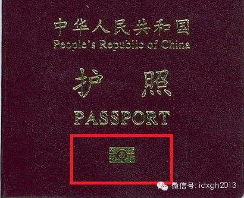
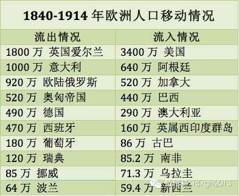
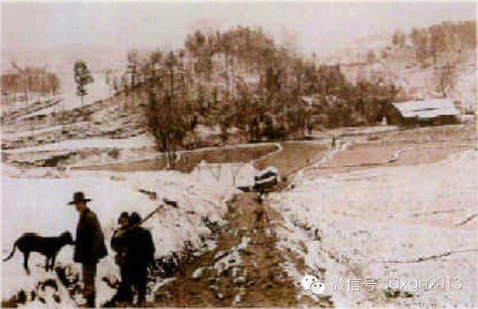
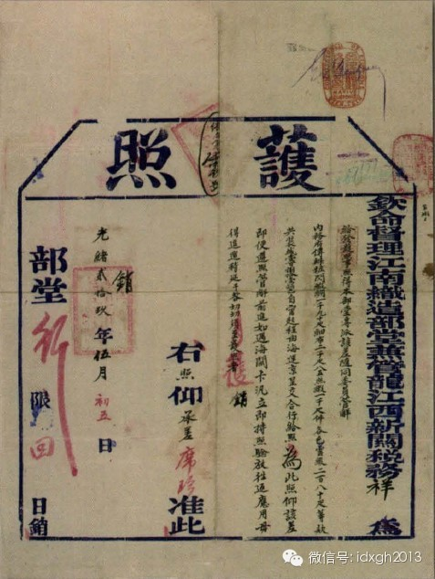
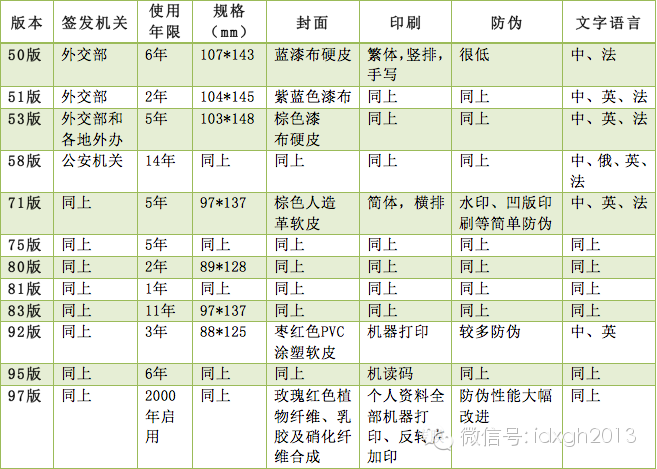

**在19世纪，没有护照没关系，要求护照的国家反而被视为异类。但好景不长，各国很快纷纷收紧了人口跨国流动政策。护照制度为何诞生，又为何加强？**

  

文/李晓璇

**  **

持假护照顺利通关并不难。尽管防伪技术已极其先进，且刻入了持有者的生物信息，但护照的丢失记录数据库并非国际共享，偷渡者只要更换一张照片，就能蒙混过关。

  

在失踪的MH370航班上，有两位乘客曾使用假护照登机，而护照的原持有者是一位意大利人与一位奥地利人——在护照黑市上，因为免签率高，加拿大、美国和欧盟成员国的
护照最为叫座，如果囊中羞涩，就只能买本中国或是越南的。

  

_很多护照下方都有一个特殊的符号，这实际是国际通用的“电子护照”标志，由__国际民航组__织__制定。目前记录持有人的面部和指纹信息，极大的提升了护照的防伪
级别。_

  

仅就人口的自由流动而言，复杂的护照体系是一块绊脚石。历史上，不仅欧洲内部人民曾自由通行，中美之间也可以随时自由往来﹑游历﹑贸易、久居，甚至进入官学——186
8年签订的《中美续增条约》曾规定，去美国，免签。

  

那一时期，英国废除了技术人员不能出国的法律，很多国家将护照闲置，外国人不再被国家怀疑和不信任，人们认为贸易和交流有着巨大价值，而这种意识极大地拆除了他们通行
各国的道路障碍。

  

但好景不长，各国很快纷纷收紧了宽松的人口政策。护照制度为何诞生，又为何加强，是哪些因素影响了今日的护照制度？

  

【宽松与收紧的往复】

  

类护照制度古已有之。在中国，不同的历史时期对其有不同的称呼，例如符、传、过所、公验、度牒、路证、通关文牒、安全证书、通行证、暂住证等。其中最著名的当属唐朝的
过所制度。

  

“过所”，是指通过关所的证明物，对国内人员来说，“过所”大致相当于身份证加通行证，对外国人来说，则相当于护照。此外，“过所”还有商业许可证的功能，可证明其行
踪及所携人口、物品的合法性。

  

但是，申请“过所”的流程十分复杂，需要层层报批，以致唐玄奘被迫成为了最著名的偷渡客。他最后只能混迹在商人之间偷渡前往印度。在《西游记》中，唐僧途径各国时都使
用的是通关文碟加盖官章，学者认为这是作者吴承恩对自己所处时代的护照制度的描写。

  

类似过所和通关文碟的文件，可以被视为现代护照的原型。但不同的是，古时交通不便，旅行尚未成风，并没有“出国”概念，出境理由无外乎外交、行商和游学。

  

在欧洲，也存在类似的情状。民族国家确立之前，尽管也有类似护照的文件，但国与国的边界比较模糊，只依靠不同的中心来界定彼此。直到法国大革命（1789年——179
9年），才拉开了建立现代国家的帷幕。

  

大革命前，路易十六（法国波旁王朝的国王，1774年－1792年在位）实行严格的人口控制，甚至乡村和城市之间也不能自由通行。路易十六被绞死之后，法兰西共和国大
开国门，标榜自由的政府放开了通行制度。

  

然而，随之而来的派系斗争和邻国战争，使法国很快陷入困境：犯罪盛行，富人外逃。此时，国家对间谍、武装土匪、逃兵和人民公敌的控制成为比自由流动更重要的原则。18
04年，拿破仑一世加冕之后，管制达到了顶峰，外国人在每个城市都得持护照登记。

  

在现代民族国家观念日渐壮大的背景之下，各国国界也逐步清晰。自此，国家合法的占据了控制人口进出的垄断地位，任何国民都不能自动假设他们有出国的权力。

  

但随着英法美相继完成了自己的革命，政治和社会环境趋向稳定，人们开始享受工业发展带来的富饶，护照制度也进入了一段宽松期。

  

当铁路铺向了整个大陆，蒸汽机车极大地方便了出行，距离的观念发生了巨大的变化，旅游因而成了中产阶级的新风尚。更大规模的自由流动在19世纪到来。此时，绝大多数的
欧洲国家都放宽护照政策，不夸张的说，当时的氛围是没护照没关系，要求护照的国家反而被视为异类。

  

_从1840年到20世纪的头十年，约有六千万人从欧洲流出。欧洲人在用商品和资本的流动拥抱世界的同时，也加速着人口的流动。_

  

但是，人口流动又带来了新的问题。最突出的便是发展中国家的劳工源源不断涌入发达地区。由于淘金热，1882年加州华人数目比1851年时增加了4倍，华人增多和经济
低迷推动了《排华法案》的出台，对美移民的蜜月期宣告结束。

  

而在德国，因为农业对劳动力的需求增大，波兰人的数量激增。德国的工会组织不断向政府施压，要求政府收紧原本宽松的护照通过率，这和现在收紧签证有异曲同工之妙——尽
管签证制度在二战之后才被各国确立起来。作为流入国进一步控制人口的手段，护照的发放和审批开始成为一门统治的“艺术”。

  

政府不能一棒子打死好人，绝对的“限制”变成了“筛选”出对国家有帮助的人。在美国，为了不把优秀的“候选公民”排除在外，检查站如雨后春笋般出现。更夸张的是，国会
甚至将文法测试作为获准进入的条件，这有效且巧妙的将众多没接受过教育欧洲人和亚洲人排除在外。

_1896__年共和党提出的文法测试得到了美国劳工联盟的大力支持。上图是针对土耳其人进入美国的文法测试。_

  

早期的护照通常包含持有者体貌特征的描述，但直到20世纪初，才添加了持有者照片。二战后，国际联盟、联合国和国际民间航空组织，颁布了在护照的设计和特征的指导标准
，现代的护照得以成形。  

  

【“惟准给与体面有身家之人”】

  

在世界的另一边，清政府于1845年首次将“PASSPORT”一词译为“护照”。它已有通行证件的证明身份、提请边境关防检查机关予以“保护”和“关照”、给予通行
的便利和必要的协助的功能。

  

不过，那时外国人虽被允许在广州做生意，但想要进入中国内地仍几乎不可能。咸丰帝在给军机大臣的谕令中表露出对外国人的忧虑：若准其在内地游行,
恐将来死于道路，更增疑案，愈费口舌，无益有损，应毋庸议。说白了，就是担心与外国人的交涉，实在是一桩麻烦。

_宣统元年（1909），洋人出城打猎，也要申请护照。_

  

1858年，《天津条约》签订后，外国人可以持执照进人中国内地游历。但要想获得清政府的护照，需要经过严格的“政治审查”——须是“正经好人”，且“惟准给与体面有
身家之人”。

  

另一方面，当时的护照上虽然没有时间限制，但旅游地一般不准超过四个省。有一次，两广总督发现一个英国人写了“十八省”（清朝全部行政省区），就断然拒绝了。若想去西
藏则完全不可能，西藏一直没对旅游者开放。

  

清政府的护照管理制度十分混乱。地方政府发，外国领事馆发，总理衙门也发。正规点的还用印刷品，有的地方衙门干脆就随便涂画。最头疼的是外国人的名字，由于官员没几个
识洋文的，因此还是以中文名字为准。光绪二十七年，两个法国教士执护照从俄国进入新疆，由于翻译不标准，他们护照上的中文名与此前法国通知中国海关的文件上的中文名不
一致，新疆拒绝放行。后经往返查证，最终确认身份得以入关时，已是三个月以后了。

  

_光绪二十九年护照，在屋形粗框线上部的空白处有椭圆形章两枚：其中一枚中部为中文篆体字，四周是英文，自左至上为COMMISSIONER OF
CUSTOMS，下部NATIVE CUSTOMSTIEN-TSIN。外国人的签字有两处，绿色签字上面有阿拉伯数字 27/7，其上有紫色的小英文字CUSTOM
HOUSE。_

  

清朝的另一特点是对西藏、新疆、蒙古地区的关注。为了避免宗教纠纷及境内外宗教势力的勾结，清朝对宗教人员的往来的管理非常严格。

  

民国时期，门派繁多的政治现实使得护照体系极为混乱。北京政府初期，袁世凯继承了清政府的条约。其死后，各系军阀都或多或少的同外国势力存在利益联结。如段祺瑞的皖系
军阀因依赖于日本，曾在1918年中日换文中规定，两国人口进入对方国境就无需护照。

  

不过，北京政府后期也进行了一系列争取主权的行动，为后来的南京国民政府奠定了基础。1919年，北京政府对无约国（没有签订外交条约的国家）人口进入中国国境增加了
查验护照的规定。南京政府在此基础上，开始了对有约国人口的管理。1930年，国民政府逐渐收回在华各国的护照发放权力，开始将出、入国的护照相关规范一致化。

  

【“该同志政治可靠”】

  

俄罗斯最早的护照出现在十八世纪，由沙皇彼得一世命令实行。十月革命前，护照含有持有者出身、社会阶层、宗教信仰等信息。1917年十月革命之后，国内护照作为“沙皇
制度的遗产”被废除。

  

斯大林时期，护照制度恢复，其核心功能是监控国内的人口流动。在当时，16岁以上的所有苏联公民都必须有护照，只有军人、残疾人和集体农庄农民没有护照——他们在获得
特许后才能领取护照并前往他处。

  

苏联解体后，由于护照不能很快更替，直至21世纪部分苏联护照仍被使用。

  

在中国，1949年建政后，护照制度也受到意识形态的诸多影响。当时几乎没有关于偷渡和非法出境的概念，有的只是移民，而这通常被视为“叛逃”——国界被认为是社会主
义和资本主义阵营的分野。

_新中国成立后，中国公民普通因私护照发生了12次版本的变化，印制越来越趋向标准化和国际化（点击图片查看大图）。_

  

建政初期，由于中国的建交国家甚少，主要还是以苏联为首的东欧国家，这使得出国的审查极其严格，留学定居者寥寥。但随着三反、五反运动的结束，公安机关开始腾出手接管
普通护照的发放。

  

文革开始后，护照更新的脚步放缓，因私出国几乎为零。71版的护照签发印章上甚至还出现了“革命委员会”的字样。据统计，从1949到1978的30年间，中国发放护
照的数量只有21万本，且主要是归侨和侨眷——相当于英国1926年一年的数量。

  

改革开放之后，因私出国人数迅速增长。80版中，“本护照前往下列国家和地区有效”也改为了“本护照前往世界各国有效”。不到20年，因私普通护照发生了6次版本变化
。83版护照在十年间签发了236.6万本，超过了前面所有版本的签发总和。

  

不管怎样，护照的背后始终是国家对人口跨国流动的管理。2002年前，中国公民申请护照无异于一场政治审查。不仅过程繁琐，需要提交的文件不计其数，而且发放与否，很
大程度上取决于申请人在单位的表现甚至人脉关系。

  

2001年，北京召开国家出入境管理会，政府对管理流动人口的措辞发生改变，以往的“控制”被“服务”替代。

  

不过，尽管中国大部分地区已实现护照的按需申请，但另一些地区和人口仍会遇到政治审查，被划分为“按条件申领护照地区”。比如新疆自治区、西藏自治区和青海省全境，以
及其它省份的部分区域。

  

当单位政审，街道政审，居委会政审——有时还得外加一份无犯罪证明——结束，他们将获得“该同志政治可靠，无犯罪记录，同意出国”的肯定。

  

[大象公会所有文章均为原创，版权归大象公会所有。如希望转载，请事前联系我们：bd@idaxiang.org ]

———————————————  

**大象公会订阅号的自定义菜单上线了，左边是官网文章精选，右边是大象公会官方微社区，点击进入来吐槽发帖吧！**

  

[阅读原文](http://mp.weixin.qq.com/s?__biz=MjM5NzQwNjcyMQ==&mid=201462084&idx=1&sn
=04c7d96d86ea143aeda1f4e22a41da86&scene=1#rd)

