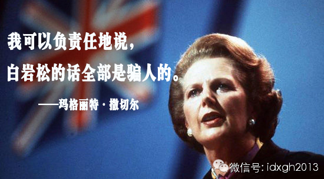
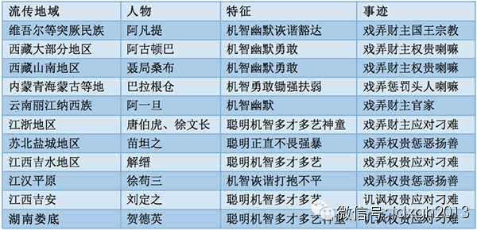
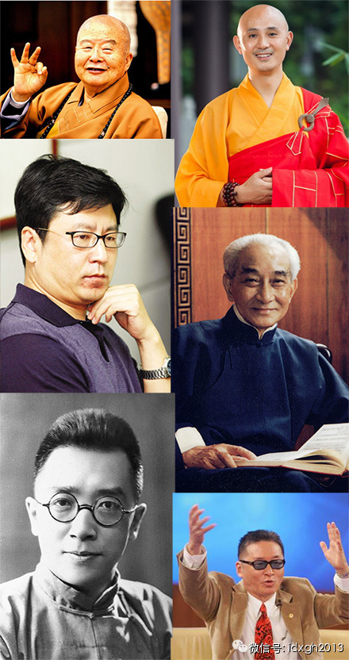

**撒切尔夫人曾说过：如果汉语背后没有文化，文化背后没有思想，思想背后没有精神，光TMD编造老娘和乔布斯根本没有说过的话，那中国永远不会是一个伟大的国家。  
**

  

文/黄章晋

  

问者：为什么我努力了还是得不到？念经行善了但命运却不变？

答者：我给你寄五百块钱来好不好？

问者：师父，你的钱我不敢要呢！

答者：我是要你帮我办一件事。

问者：师父，你说办什么，我绝对帮你办好！

答者：帮我买一辆汽车。

问者：师父，五百块怎么能买到汽车呢？！

答者：你知道五百块买不到汽车！可是世上有太多的人都在绞尽脑汁，想付出一点，就得到很多。

  

上面这段对话中，回答问题如此机智的人是谁？有的版本是星云大师，有的版本则是寂静法师，其实这个人是谁并不重要，他甚至可以是中国佛教界著名的法师当中，除了释永信
外的任何人。

  

在这里，大师们扮演的其实是阿凡提的角色——认真读完过《阿凡提的故事》的人，应该对前述精彩回答不陌生，《阿凡提的故事》当中，最出彩的部分就是大量对刁难问题的急
智回答。托名星云或寂静法师的精彩回答，每一个都能在阿凡提那里找到相同的母题。

  

而阿凡提式机智人物的传说，中国每个民族或地域都有，只不过因文化和社会差别各有特色。有学者统计，中国各类民间智慧人物应对难题的方式，总计有14种母题，类别最全
的便是阿凡提。

  

中国各地机智人物的类别对比

  

表中人物故事丰富程度各有别，但很多情节和套路完全雷同。类似的情况还出现在中国的刻舟求剑、朝三暮四、掩耳盗铃、守株待兔等寓言，也都有其印度原型。这些传说中的机
智人物，最大的共性特征是：穷人出身，喜好扶弱济贫，其聪慧往往用于羞辱、戏弄权贵和富人。

  

这种跨地区、跨文化的故事复制和段子模仿，或许体现了古代社会普遍存在的矛盾。按官方过去的说法，民间流传这些机智人物的故事，“寄托了劳动人民对剥削阶级统治压迫的
强烈不满和反抗精神”，在今天，则是一种弱者自我安慰和平衡的“意淫”。

  

【机智的总理】

  

1949年后，民间智慧人物的故事经过一次“提纯”，使之更符合阶级斗争教育的需要。这些故事里原本就极为稀薄的鸡汤成分便荡然无存——1980年代之前，中国社会流
行的是鸡血而非鸡汤。

  

但是，虚构的古代智慧人物不能满足国民对新世界的认识和看法，它需要附着在一个更贴近今天的真实人物身上，于是中国又有了一个全新的、集大成的智慧人物——周恩来。周
的智慧全部集中在应对各种西方的刁难上。譬如，中国人走的路为什么叫马路？中国的银行有多少存款？中国有没有妓女等等。这类展现周恩来急智的段子，与古代底层智慧人物
应对难题的语境高度相同，即敏感自尊的贫者要时刻面临富者优越感的挑衅。

  

较之古代同类段子，周恩来的急智故事不但有极高的脑筋急转弯水准，而且体现出分寸感极强的不卑不亢——阿凡提对天上星星有多少颗，以“不多不少跟我毛驴身上的毛一样多
，不信你自己数”的回答，虽然够急转弯，但既不庄重，也未留下谈笑风生的余地。周恩来的智慧故事，集中展现了那一代中国人的最高智力水平，也直接反应了那一代中国人对
世界的看法。

  

与各种急智应对刁难故事伴生的，还有周恩来去世后，时任联合国秘书长瓦尔德海姆陈述要为其降旗的动人传说。几天前，时逢周恩来去世纪念，早已被多次澄清的联合国降旗说
，再次在网上铺天盖地传播，它清晰地折射出这样一个事实——中国今天依然需要一个完美的道德化身。

  

改革开放后，中国政治语境发生巨大变化，底层创造的智慧人物，因含有让人厌倦的阶级斗争意识，自动丧失传播价值。被滚滚商潮冲得丧失方向感的大陆人，急需滋养温情、灌
溉心灵的精神产品，这种后来被称为心灵鸡汤的东西，恰逢其时地在1980年代中期登场，历三十年而不衰。

  

虽然底层创造的智慧人物故事鸡汤成分很少，但古代文人士大夫创造的智慧人物，其浓浓的鸡汤味可历千年而依旧让人甘之如饴。苏轼与佛印斗智的对话，今天依然有较高转载价
值，而古希腊的苏格拉底更是《读者》之类杂志的常客。

  

不过迄今为止，中国依然没有摆脱自古以来鸡汤基本靠进口的局面。在古代，印度是中国的鸡汤输出国，不但输出过曹冲称象、道旁李子其味必苦这类急智故事，还由于佛教的缘
故，为中国士大夫阶层提供了调制鸡汤的配方。今天，鸡汤产地由印度变成台湾，最先登陆的是在《读者文摘》上露脸的刘墉等散文家。接下来，传统文化符号强烈的南怀瑾、星
云、证严等在各平台隆重登场。大陆人如此需要台湾人的精神滋养，以至于连李开复这样的IT界精英也转行煲制鸡汤。

  

大陆当然也会崛起本土鸡汤品牌。白岩松之所以成为鸡汤品牌，其CCTV的高出镜率并非关键因素。重要的是：他看上去总是在思考，无论演讲还是写作，都有恰到好处的鸡汤
味，于是民间纷纷将各种自制鸡汤贴牌上市——从传播学上讲，信息依附于一个著名品牌是其增大其传播效用的最便捷方式。相比之下，被认为专事鸡汤烹制的于丹，虽有同样的
平台，其品牌认同度远远低于白岩松。

  

形象上离烟火气越远的人，才有可能烹制出味道最纯正的心灵鸡汤。市场对心灵鸡汤品质的挑剔和追求，使得各路“仁波切”（藏语原意为“珍宝”，现为藏传佛教信徒对活佛的
尊称）在鸡汤市场上异军突起且势不可挡。

  

最受欢迎“鸡汤”家

  

【串味的鸡汤】

  

但是，按《环球时报》主编胡锡进的看法，中国的基本特征是复杂，而复杂的社会必然有对智者的复杂需求，心灵鸡汤显然不可能一统天下——社会传播鸡汤、弘扬正能量的另一
面，是地下大规模传播各种反应社会阴暗现实的段子。当这些民粹色彩的段子仍不足以表达民意时，它必然要升级为一种规格更高的总结批评。——这是一个缺少真正公共政治生
活，也缺少公共文化生活的社会的特有现象——它是民意无法公开言说时的曲折表达。

  

于是，酸辣汤登场。以嘲讽见长的王朔成为这个细分市场中的著名品牌。强烈的社会需求，甚至让鸡汤品牌开始串味，贴着白岩松品牌的段子，已有相当比例是酸辣汤。更能说明
问题的是胡适这个指向性更为鲜明的名字，他的名人名言虽然不多，但其检索结果已与白岩松相去不远。

  

胡适最著名的语录是“一个肮脏的国家，如果是人人讲规则而不是讲道德，最终会变成一个有人情味的国家。一个干净的国家，如果人人都不讲规则而大谈道德、高尚，最终这个
国家会堕落成为伪君子遍布的肮脏国家。”胡适没说过这句话的事实并不重要，因为大家需要他这么说。

  

由于国产名人数量严重不足，无法体现复杂中国的各式表达渴求，撒切尔夫人、希拉里、小布什西方政要纷纷被征用，作为一个长者对今日中国提出批评和否定观点。比较特殊的
是兰德公司，这个在中国有极高知名度的智囊机构，同时被中国左右两派征用。

  

那些被左右两派拿来“挟洋自重”的西方人，偶尔也会是毫无大众知名度的人，譬如美国哈佛大学亚洲研究中心主任托尼**赛奇。他被指派的任务是指控中国《对毛的丑化已经
超越了一个民族应有的理智界限》，进而又在《美国教授：地球公民最瞧不起的三种人》再度重申对“非毛化”的鄙视。

  

由于这种观点的美国人确实罕见，所以名气不重要，重要的是白人的血统。故网上毛粉代表性人物一般不会错过引用托尼**赛奇的机会，譬如司马平邦在《铸魂：读托尼**赛
奇和张召忠的两篇谈话》这个标题上，干脆把托尼**赛奇的名字放在张召忠少将的前面。不过，托尼**赛奇真身已正式致函，要求相关网站删除其编造的最早版本的相关文字
。

  

台湾人同样不会缺席，最近几年以力挺大陆著称的李敖颇能贡献余热，他的出场几乎全部是长篇大论，从捍卫伟大领袖毛泽东到声讨美国日本，多条战线同时出击。

  

——相对来说，为左派观点张目的名人，大都会长篇大论，也许是因为这些观点没有足够篇幅很难说服人，而右派的观点非常简洁明快，连语录带作者身份不超过140字，更适
合快速传播。

  

虽然官方及时出手，沉重打击了网络谣言，但它只是打击了少数制造者，并未动摇巨大的言论市场需求，所以没人能保证，今天专司烹饪心灵鸡汤的星云法师，会不会在将来某一
天发表胡适级言论，因为撒切尔夫人早就说过：白岩松的话都是骗人的。

  

大象公会：最好的饭桌谈资，知道分子的进修基地。

[大象公会所有文章均为原创，版权归大象公会所有。如希望转载，请事前联系我们：idaxiang@idaxiang.org ]

  

[阅读原文](http://mp.weixin.qq.com/s?__biz=MjM5NzQwNjcyMQ==&mid=10193937&idx=1&sn=
c7270f9d3d28073edc123ebabeb53ae3&scene=1#rd)

