**为什么过去中国电影中，政委的形象总是全能全知且集人类一切高尚品质于一身，这种角色的设定，确实是因为它曾在历史中有如此重要的作用吗？**

  

文/鲍君恩

  

还有人能想起今天军旅影视中政委的形象么？没错，无论是《和平年代》、《突出重围》、《DA师》、《我的兄弟叫顺溜》，还是《亮剑》，政委、教导员或指导员这类角色都
是次要且形象和性格不那么鲜明突出的角色。以至于很多年轻人都快忘掉政委这个角色了。

  

政委，全称政治委员，根据《中国人民解放军政治工作条例》的解释，“政治委员与同级军事主官同为所在部队的首长，在同级党的委员会领导下，对所属部队的各项工作共同负
责。是党的委员会日常工作的主持者。”

  

中共早期领导人毛泽东、周恩来、刘少奇、邓小平都当过政委，1955年授衔的十大元帅中，除朱德、贺龙外，其余8人也都担任或兼任过政委一职。当今时代，政委几乎已是
解放军有别于他国军队的“中国特色”。

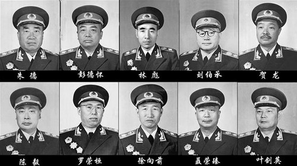

**中华人民共和国十大元帅**

  

政委当然很重要，甚至可以说没有政委就没有新中国。

  

**【政委的力量】**

最早的政委是法国大革命时期的“政治特派员（Commissaire politique）”。1791年6月22日，制宪会议颁布法令派遣特派员调查、监督武备。政
治特派员权力不断扩大，譬如“有权将将领及其它文武官吏暂时停职，遇必要时且可将他们拘禁，并有权暂时任命代理人”。

  

现代意义上的政委则是革命家托洛茨基的发明。俄国十月革命后，布尔什维克在选举中败北，列宁于1918年1月5日派兵解散立宪会议，用刺刀改变投票箱的结果，俄国内战
爆发。

  

当时，布尔什维克因为反对俄国参加一战，积极从事瓦解本国军队的工作，赢得底层士兵的支持，这些厌战士兵虽然可以帮布尔什维克夺权，但与高尔察克领导的正规军作战则毫
无胜算——工农红军最开始的负责人是“逃兵领袖”克雷连柯，他以军纪破坏者扬名立万，靠这样的人打仗，效果可想而知。

  

托洛茨基掌管红军后，立即展现了强大的组织才能。先是运用“什一法”（逃兵排成队列，每数到第10个人就当场枪毙）等命令立威，接着颁布《内务条令》、《卫戍条令》、
《夜战条令》严明军纪，迅速组建了一支300万人的正规军。

  

由于红军几乎没有军事专家和指挥人才，托洛茨基大胆启用沙俄旧军官。为监督这批敌对阶级出身的军官，托洛茨基在军队各级都设置了政治委员，并发布指令：任何军事指示未
经双方的共同授权签署都视为无效，阻止了沙皇军官在军事问题上结成派别体系的危险，形成相互牵制。

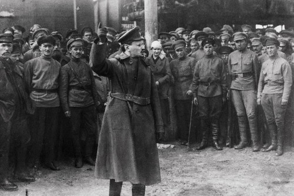

**1918年托洛茨基向红军战士讲话**

  

政委的存在，旧军官才能一心一意地为红军效命——前线作战时，他们的妻子儿女作为人质要扣留在政委手中，如果发生倒戈变节行动，人质就会被处死。

  

苦于革命军三天两头因军阀倒戈而瓦解的孙中山，立即注意到了苏俄红军胜利的经验，
1924年，孙中山模仿苏俄红军的建军经验，在黄埔军校和国民革命军中建立了党代表制、政治部制及特别党部制，中国第一支“党军”诞生了。

  

《国民革命军党代表条例》中规定：“党代表为所属军队之长官，其所发命令，与指挥官同，所属人员须一律执行之。”军中的所有命令和法令规则，均由党代表副署。“发现指
挥官分明变乱或叛党时”，党代表要“自动的设法使其命令不得执行”。

  

经过组织改造的国民革命军立即显示出了强大的战斗力，北伐时以少打多，却一路势如破竹。

  

不过，“以俄为师”的国民党用的是“党代表”而没有直接沿用“政委”，原因可能出自蒋介石。1923年，蒋介石率团赴俄考察，对红军的政委制度他在日记中写道：“大约
军事指挥上事务皆归团长，而政治及智识上事皆归政党代表，尤其是精神讲话及平时除军事外之事务，皆归代表也。”

  

蒋介石把政治委员称为政党代表，粗看并无不妥，但混淆了苏维埃和布尔什维克之间的关系——苏俄红军的政治委员虽然都是布尔什维克，但在法理上归苏维埃（见大象公会《一
切权力归苏维埃》）派遣。也就是说，政委不代表政党，只代表政权，它与法国大革命的政治特派员相同。

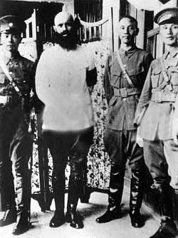

**1927年，蒋介石（右二）和苏联顾问鲍罗廷（左二）在广州**

  

而只代表党的党代表在法理的权威性上就低得多。更重要的是孙中山死后，蒋介石以军权裹挟党权，对军政并行的“二元制”极为反感，无论是军队还是地方政权，国民党干部的
地位都被大幅削弱。

  

在军中，国民党政工干部和政治工作地位一落千丈，沦为指挥员的附庸，政工人员甚至被人戏称为带兵官的“姨太太”。缺少党的统一意志的国民党军队逐渐暴露出严重的纪律涣
散问题，无法像布尔什维克建立的红军那样如臂使指。

  

国共分裂后，中共以武装暴动独立建军，初期同样面临军队极易瓦解逃散的问题，1927年毛泽东领导的三湾改编，确立了部队连以上要设立党代表的制度，强化了党对军队的
绝对指挥，此经验被推广后，中共军队强化党的制度建设不断完善，军队纪律性大幅增强，军官叛变无法带走成建制的部队，即使是后来的张国焘也只能带走身边的警卫员。

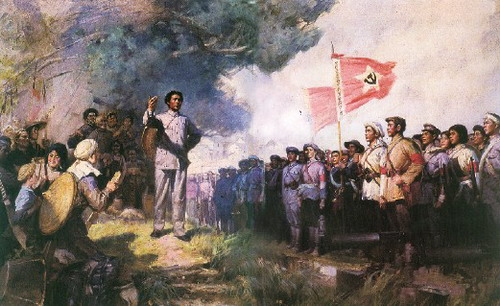

**油画《三湾改编》，作者：许宝忠 李译洁**

  

国共内战中，两支军队的最终命运，政治纪律的天壤之别起到了决定性作用。在国民党一方，一旦指挥官认为上级交代的任务将会使本部面临极大损失，便会消极抗命，极端情况
下，高级将官决定改变阵营，动辄可以拉走属下成千上万的军队，这些情形在中共却从未发生。

  

**【青出于蓝】**

不过，当时中共设置政委始自1928年6月第六次全国代表大会之后，周恩来在军事报告中提出：“红军绝对取消党代表，党代表是从国民党产生的，在苏联只有政治委员，由
苏维埃政府派”。红军遂弃用此前仍习用叫党代表的国民党习惯。

  

此后，红军中连一级设指导员，营一级为教导员，团及以上级别为政委。虽然中共军队与苏联红军在政治工作的重要性上同样看重，并在政委这个名目上完全相同（苏军连排级为
指导员，营级以上就称政委），但实际地位和功能上却有相当大的区别。

  

1919年1月俄共(布)颁布的《对红军党支部的训令》，对党支部的定位是“政治委员和指挥员在巩固高度军纪，提高部队战斗能力方面的忠实助手”，党组织书记的任命需
要政委批准。”

  

它使得苏联红军部队的实际领导和指挥权集中在政委手中，而且政委还凌驾于同级党组织之上，这使得苏联红军政委很大程度上带有强烈的监军性质（即使是二战期间政委军衔低
于同级军事主官）。政委权力过大，反而埋下了其地位几经起落最终被取消的伏笔。

  

俄国内战结束后，随着基层军队人员军事素质的提高，不受信任的沙俄旧军官被逐步淘汰，1925年3月，红军中逐步推行军事主官负责的一长制，监军性质的政委被取消，只
设置协助军事指挥员的政治副职。

  

但内战中崛起的杰出将官的权威让斯大林感到不安，1937年斯大林发动“大清洗”，在几乎整个消灭了红军中高级将领时，苏军党组织也遭遇重大损失，有的党组因为已经没
有党员而被迫取消，为加强军队控制，政委被恢复。

  

但1939年11月苏联入侵芬兰的战争，暴露出苏军指挥混乱训练不足的严重问题，1940年8月，苏军取消了政委。1941年6月，德国入侵苏联，为解决军队纪律涣散
军心不稳问题，政委又重新登场，他们以严厉手段稳定了军心，但严重的瞎指挥却使苏军初期蒙受了难以想象的惨重损失，例如克里木方面军政委麦赫利斯强调“进攻精神”，于
是部队前沿阵地距德军阵地距离由300米—100米变成了50米，导致部队在敌军炮火下无处藏身。1942年10月，政委再次取消。

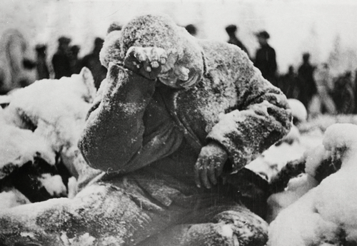

**1940年1月31日，芬兰，一名苏军士兵的尸体已经冻僵**

  

而中共原为苏联建立的共产国际下的一个分支，长期未形成稳定的核心领袖，使得中共很难像苏共一样出现对政委的朝令夕改的长官意志，而漫长的战争，也使其有机会在军队内
部逐渐形成一套更合理的政委功能建构。

  

中共军队中，政委与军事主官是均受党组织统一集体领导下的首长分工负责制，军政首长虽然都是一把手，但必须服从党组织的集体领导。它的专业分工远不像苏式双首长制那么
明确，同一个人往往有过既当过军事主官又当过政委的经历。它彻底改变了苏军政委的监军性质，实际上是“去（苏式）政委”化的政委。

  

中共军队最终形成党组织集体领导制而非苏式的政委凌驾党组织的架构，或许还与毛最终在党内地位的确立有关，1937年2月中共批判张国焘错误时，利用总政委身份对抗中
央就是他的主要罪名之一。

  

1937年5月，中央苏区党代表会议决定: “在军师及独立行动之单位组织军政委员会，这是党的组织，他指导军队的全部政治和军事工作，并向党中央负责。”军政主官之
间能够相互节制，军权牢牢依附于党权，不能不说是政委制度一次不易觉察但又至关重要的革命。

  

中共式的双首长制当然会带来政委与主官不和的问题，譬如著名的黄金搭档“刘邓”，挺进大别山后，矛盾严重到最后甚至“不一起吃饭”的程度，但这种不和的好处是，仲裁权
最后容易集中到更高一级手中。

  

**【从完人到凡人】**

由于中共的政委制是如此成功，以至于1951年，中共决定“建设正规化、现代化的国防军”的方针，热情学习苏军时，在统一编制、纪律，设立军衔制时，并未像苏军一样取
消政委。

  

彭德怀在全国军事系统党的高级干部会议上的总结发言一锤定音：“我们军队的光荣传统是什么呢？……在政治上和组织上就是党委集体领导、首长分工负责的民主集中制，就是
政治委员和政治工作制度。”

  

在政委制上绝不松口，一方面是因为解放军实行的是党委集体领导下的首长分工负责制，取消政委则集体领导无从谈起；另一方面，政委在军队中的负面作用也远没有苏军中那么
突出。

  

说到苏军政委曾起到的负面作用，不意味着苏联在取消政委后允许对政委形象的“抹黑”，哪怕是以人性化的形象。

  

譬如苏联1967年电影《女政委》中，主人公临近分娩，不得不到一个犹太家庭寄宿，虽然为了革命她最终舍弃了孩子，但在寄宿过程中，她被寄住家庭安详和睦的宗教气氛感
染，从一个铁腕政工干部变成了一个会哼摇篮曲的妈妈。

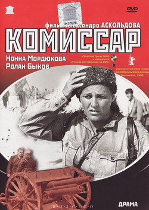

**《女政委》电影海报**

  

党性化身的政委居然流露出人性的温情，这简直像是神父和毛拉动了凡念，这不行。于是，《女政委》不但禁映，导演阿•阿斯柯尔道夫也定性为“反对苏维埃政权”，并以不适
合从事电影工作为由从电影厂除名。

  

中国的政委形象比苏联更完美。建国初期到文革结束的军事题材电影中，政委或指导员是绝不谈恋爱的。政委永远都是高大上、伟光正、不食人间烟火的，为衬托政委的形象，军
事干部往往是鲁莽任性、有勇无谋的粗汉，在政委的引导下逐步走向成熟是他们永远的宿命。

  

例如电影《铁道游击队》，影片开始，游击队是一群缺乏组织性、纪律性的散兵游勇，但政委李正赴任后，仅通过开一次会就让所有的游击队员心悦诚服，当大家为了下步的作战
计划争执不下，向大队长刘洪请示时，大队长一翘大拇指：“听政委的！”

  

这部电影中，政委永远胸有成竹、全知全能，大队长却急躁冒进，眼神游移，始终拿不定主意；大队长负伤之后可以和芳林嫂谈恋爱，政委负伤之后一心只挂念打仗，躺在病床上
的身姿都要比大队长站着时挺拔。

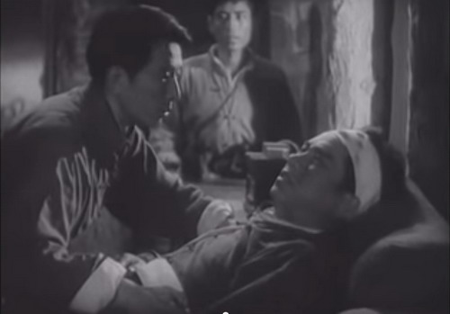

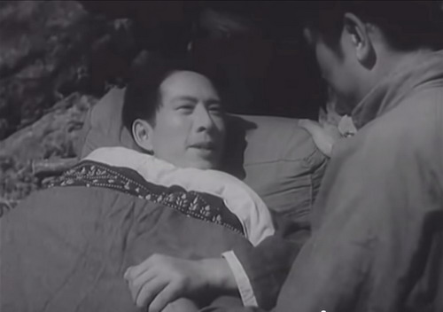

**电影《铁道游击队》中，无论是大队长（上图）还是政委自己受伤（下图），安慰、鼓励人的都是政委。细心的观者还会发现，躺在病床上的政委脸部都打了高光**

  

《回民支队》中的郭政委又比李政委更胜一筹，担任八路军团长的郭政委在回民支队司令马本斋不知情时救了他的命，左臂重伤。担任支队政委后，他一直隐瞒救命之恩，他回答
下属疑问时说：“工作再困难，也不能依靠这种关系来建立个人威信，要依靠党的方针政策，不然什么工作都会失败。”接着，他饱含深情地对着镜头沉思了7秒，缓缓吐出一句
：“他应该感谢的不是我——是党。”影片最后，郭政委壮烈牺牲，临死前，他从左胸掏出了一张沾满鲜血的纸，高兴地对马本斋说：“你的入党申请，批准了！”这才安心地闭
上了眼。

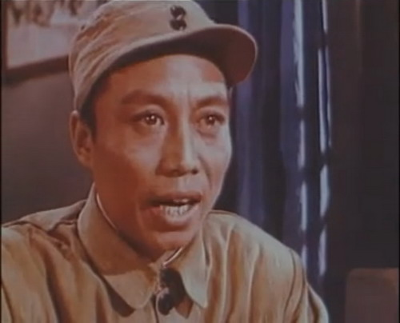

**《回民支队》中，政委沉思7秒后，眼中闪着泪光，对党深情告白**

  

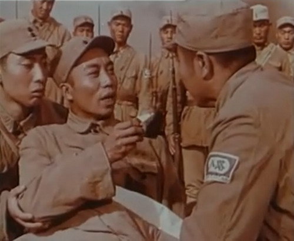

**政委临死前，掏出了沾满鲜血的入党申请书**

  

《铁道游击队》中政委与军事主官在电影画面中的位置，是当时电影的典型：当政委和大队长出现在同一个画面时，政委要么处于镜头中心，要么就在镜头的前景和焦点，形象始
终比大队长高出一大截。

  

因为人类所能拥有的一切高尚品质都必须在政委身上有所体现，只有想不到，没有演不了。反过来，政委过于神圣的形象，让有个性的指挥员几乎无法在银幕上生存。旧上海话剧
皇帝石挥1951年的电影《关连长》，因为塑造的连长形象过于鲜活，遭《人民日报》长文批判，其中一条罪名就是“作为连队中的政治思想领导者的政治指导员，竟成为连长
和群众的尾巴”。

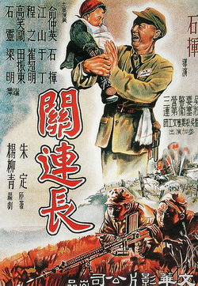

**《关连长》电影海报**

  

但是，1980年代后，解放军重提现代化、正规化建设，政委在电影中的形象随之逐渐暗淡。前面提到的《和平年代》、《突出重围》、《DA师》等电视剧中，政委已由红花
变成了绿叶，在军事干部成长中也起不到什么作用，更多的是做做思想工作，调解矛盾，工作难度并不比居委会大妈高出多少，以致大部分年轻观众对政委这一岗位感到莫名其妙
。

  

对80后和90后来说，唯一熟悉的政委形象可能是《亮剑》里的赵刚。他延续了建国初红色文学中的知识分子政委形象，但与指挥员的相互关系却发生了悄然改变——政委的主
要职能仍是调教好身边的粗汉，但明显心有余力不足，只有依附于李云龙，学会大块吃肉、大碗喝酒，再来一两句脏话，才能真正把工作开展好，这恐怕也是赵政委形象能够深入
人心的原因——在当代军旅题材影视中，粗莽机警的指挥员形象已全面占领审美高地，如果不甘沦为附庸，政委只能让自己也变成一个有文化的李云龙。

  

电影是现实的反应。政委在新时期该扮演什么角色，军队政治工作理论探讨中似乎出现了某种尴尬。据不完全统计，九十年代以来军队出版社出版的随军牧师研究专著达十余种之
多，讨论美军政治工作的论文也已汗牛充栋。

  

像《浅析美军随军牧师制度对我军政治思想教育工作的启示》、《浅析美军宗教教育对我军的启示》这样题目的文章，给人留下了用美军的随军牧师制度来为政委提供背书的强烈
印象。——论军队中的实际地位和功能，解放军政委和美国随军牧师中间还隔着有两伊战争时期伊朗军队的毛拉，二战时期德国的国家社会主义督导军官。

  

按这个趋势，政委迟早将沦为军中仁波切。这当然有悖于中国革命的成功经验。

  

关键时刻历史再度奏响了最强音——今年10月30日召开的“新古田会议”上，中共中央军委主席习近平强调，要“把政治工作威信在全军牢固立起来”，可以预见，在未来的
银幕上，政委的春天即将到来。

  

**版权声明**

****大象公会所有文章均为原创，****  

****版权归大象公会所有。如希望转载，****

****请事前联系我们：****

bd@idaxiang.org

****知识 | 见识 | 见闻****

阅读

__ 举报

[阅读原文](http://mp.weixin.qq.com/s?__biz=MjM5NzQwNjcyMQ==&mid=208096538&idx=1&sn
=7d973e13b130f20ef9eeec4e2bc98604&scene=0#rd)

