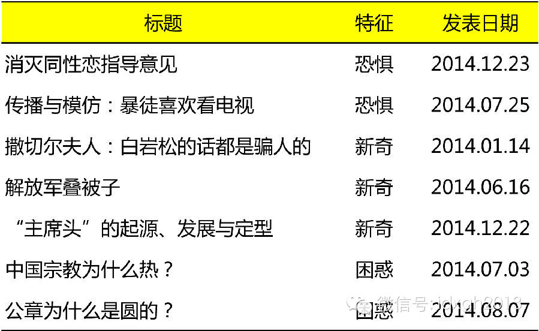

**好文章并非“只可意会不可言传”，它们背后存在共通的吸引力法则。心理学与认知神经科学的研究者们，可能比文章的读者和作者都更加清楚那些可以紧紧抓住读者注意力的秘密。**

  

文/郭婷婷

  

阅读者经常使用“扣人心弦”、“美妙绝伦”、“绕梁三日”等模糊性的词语表达对精彩文章的赞美。如果想要向他人推荐，还可能会进一步分析写作方式，摘要精彩片段，阐述
由此引发的个人感悟……看上去，一篇文章的好坏纯粹是一种主观的个人体验，一旦表达出来只会变成一种干瘪空洞的抒情，因此“只可意会不可言传”。

  

不过，心理学和认知神经科学的研究者们并不这样认为。在他们看来，“精彩文章”的主观感受背后存在共同的吸引力原理。这些原理至少可以回答下述问题：

  

◤为何在新闻出版自由的国家，不少媒体为了获得更多的阅读量，会频繁给负面新闻配上耸人听闻的标题，并安排在最好的版位上？

  

为何人们喜欢幽默的段子和故事，它们与吸毒成瘾之间的异同是什么？

  

设置有冲突和悬念的文章往往更吸引读者，这在心理学上的发生机制是什么？

  

为何我们记住了一些信息，却忘记了另一些？◢

**  
**

**【恐惧、激动、新奇与困惑】**  

  

简单而言，“吸引力”意味着：在浩瀚的信息中发现并关注、无需付出意志努力就可维持持续的注意力，以及记忆，即——注意力的调动，内在的满足感，长期记忆的形成。这几
个成分之间互相影响，共同起效，但为了叙述和理解的方便，本文将分别讨论。

  

事实上，某一篇作品能从海量的文字信息流中脱颖而出，并非全凭它的运气，而是有着深刻的进化基础。这一阶段，吸引读者注意力的主要是文章标题（也可能是作者的名气，这
种情况暂不讨论）。什么样的信息会最快得到人们的注意？

  

传统观点认为，在进化过程中，为了适应变化无常的外界环境，保护自己的生命安全，个体总是对威胁性的信息给予更快的注意，并优先处理这些信息。很多经典的心理学实验证
实了这种对负性刺激的注意偏好。

  

例如，研究者发现：在一系列中性图案（例如蘑菇、花朵）背景中搜索与恐惧情绪相关的图案（例如蛇、蜘蛛），速度和准确性均显著高于从恐惧相关图案中搜索中性图案。另一
个研究发现，从中性表情面孔中寻找负性表情面孔（如愤怒），速度也快于从中性表情面孔中寻找正性表情面孔（如愉快）。

  

正是因为这一心理机制，使得含有威胁性信息的负面新闻会频繁登上头条。在中国，虽然新闻主管机构对媒体有“报道正面向上的事件”以“践行社会主义核心价值观”的要求，
但这一现象仍然可以被观察到。

  

某新闻网站的首页截图（2014.8.22，18：20）

  

对负性信息的快速反应，依赖于大脑中一个叫做杏仁核（amygdala）的结构的活动。杏仁核位于大脑皮层底部，呈杏仁状，负责情绪的产生、调节，以及形成对情绪的记
忆。

  

最新对杏仁核功能的研究表明，能够引起杏仁核强烈活动的信息并不必然是负性的，而是具有“对个体而言很重要”这一共同特征。也就是说，如果接触到的事件/信息与自身密
切相关，无论其性质是令人恐惧，还是令人兴奋，或是对个体全然陌生，或是具有模糊不确定性，都更可能被个体标记为“重要信息”，并引发杏仁核结构的显著激活。

  

而在上述现象被发现之前，新闻行业的从业者们就已经依赖经验和直觉对此有过总结。比如，在任何一本新闻学教材上，信息与读者间的相关性都会被突出强调。为了取得更好的
传播效果，中国的新闻主管机构也要求“宣传思想战线”遵守“三贴近”原则——贴近实际、贴近生活、贴近群众。

  

在令人恐惧与兴奋之外，另外两种特征也很常见。例如，标题中含有“首次”、“全新”以及“独创”等词语，或是一个以问号结尾的开放式标题，都会更容易引发关注。

  

这种标记过程是迅速、自动、下意识进行的。由于杏仁核与大脑的整个感觉信息加工过程及植物性神经系统也存在直接的功能连接，因此，杏仁核的激活可以极大增进个体的处理
信息的动机，使人做好全身心投入的准备，包括注意力集中，心跳加速，出汗增多，肌肉紧张。更重要的是，广泛的大脑区域可以立刻被调动和组织起来，使得该信息得到优先的
加工。

  

因此，文章吸引人的第一条原则就是：在简短的标题中体现出信息的重要性。怎么算重要？令人恐惧，令人激动，令人感到新奇，令人感到困惑。

  

示例：大象公会标题对上述特征的使用

  

**【阅读您的文章感觉像在吸毒】**

  

短暂的注意力转移过程后，阅读者们就进入正文阅读阶段。这时，若非必须读完（例如要在某一会议上进行汇报，或者要撰写书评不得不通篇阅读等金钱奖励和成就动机），注意
力的持续就不应该付出意志努力，即阅读文章的动机来自文章本身，阅读过程带给人“奖励感”。

  

以一种最受人欢迎的题材——“幽默段子”为例，来看看“奖励感”是怎样产生的。

  

有多项研究证实，无论是文字还是图片，当人们在阅读幽默性内容时，会激活大脑中的“奖赏中枢”，并促进释放一种与快乐体验有关的神经递质多巴胺。尽管有程度上的差异，
但这种神经活动模式在赢钱、服用成瘾性药物，以及性兴奋的时候也会被观察到。此时，人会产生强烈的维持这一行为的冲动，欲罢不能。如果哪位作者被评价为：阅读您的文章
感觉像在吸毒，恐怕是对文章的最高褒赏了。

  

从写作的角度讲，促使幽默产生这种愉快体验的关键性因素，在于其独特的叙事结构：包袱（punch line，即“梗”）。

  

首先，幽默需要一个“引子”，以提供一个背景情境，然后给出一个转折（即“梗”）。转折有两个特征：意外与可解决性。前者要求相对于背景情境是出乎读者意料的（失调性
）；后者则可以使背景信息以一种可以被理解的、全新的方式呈现出来。

  

这种“探测到认知失调——解决失调”的过程，就是幽默中包含的关键性认知特点。脑成像研究也表明，欣赏幽默是一种高级智力活动，当成功捕捉到笑点时，激活的脑区与解开
一道难题很相似，同时伴随愉快情绪。例如：

  

◤每次和妻子一起看电影时，我总有方法可以轻易地事先就知道这部电影是否会是大烂片。（怎么会这样？）只要是她选的。（原来如此！）  

  

我反对在结婚前发生性行为。（怎么会这样？）因为很可能会延误结婚典礼啊。（原来如此！）

  

她来例假了肚子疼，他坐着她旁边，看了她一眼，拿出手机玩游戏，她看在眼里，心里凉了半截。（怎么会这样？）两分钟后，她实在坐不下去了，正准备离开，只见他默默地递
过来他的小米手机说：拿去捂着。（原来如此！）◢

  

真正的“有趣”，不是各种网络流行词语时髦话，而是不断铺设包袱，制造出虽然与当前思维惯性不符，但却可以被迅速整合到自己原有经验之中的意外感——类似电子游戏中轻
松的、有节奏的，跳跃式的闯关过程。

  

“意外”，不仅仅存在于幽默中，各种体裁的优质作品也都需要它。比如，小说中设置悬念与冲突的重要性，正是基于这样的考虑。

  

从心理学的角度讲，悬念是一种问题未得到解决的状态，它使读者困惑的同时，也在潜意识中（难以控制地）开始了寻找破解之法的尝试，被心理学称为酝酿（incubati
on）。酝酿是大脑自动地、基于直觉与生活经验的判断，试图使用自己熟悉的认知方式来解释一个事件或现象发生的原因。

  

因此，优秀的作者一定不会让情节的发展完全符合读者的预期，当悬念解开，打破了思维定势，重构了因果关系——“原来如此！”

  

而最成功的戏剧冲突，并不是指故事人物之间一定要矛盾重重、勾心斗角，也同样是指情节走向与读者心理期待不一致。这种感受有时被形容为“读完毁三观”——被催毁的，是
读者基于自身经验的解释框架。

  

**【重读、戏说、秘史与辟谣】**

  

读罢一篇好文章，阅读者常会有“学到了点什么”的感觉，有些内容可以被立刻记住当场复述出来，有些可以保持数周乃至终身。

  

我们可以把“旧”的信息理解为大脑中已经存储的知识经验，即“长时记忆”。短时记忆可以理解为当下保持在大脑中的信息——只有这一信息与以往的知识经验发生联系，并且
在较长一段时间内储存在大脑皮层中，才可以被称为长时记忆。

  

现在，因为“意外”，阅读者的解释框架已被摧毁，但是否可以成功重建新的框架？这涉及被传递的信息中，“新”与“旧”的平衡。

  

关于长时记忆的经典理论认为，大脑会对认知对象的关键特点、特点之间的关系，进行粗线条的归类。

  

被归类储存的抽象看法不一定准确，但却可以大大提高信息加工的速度。当我们接触一个外界信息的时候，会将其放在预存的图式中去认识，与以往经验进行对照，迅速判断信息
的性质，并且对是否会被记住产生影响。

  

一个有趣的悖论是：“意外”才会引发“学习”（记忆）行为，然而，如果我们搜索不到新信息与旧经验之间的联系——根本无法理解这一信息的意义，也就谈不上“预期”，更
加难以将其整合为自己的知识。

  

认知神经科学对学习过程的研究认为，可以把信息分为4种类型：

  

◤陌生的概念出现在陌生的情境里，如，一个不为人知的、在世界上短暂存在又消失的国家历史。  

  

陌生的概念出现在熟悉的情境里，如，发生在明朝一个不知名人物的故事。

  

熟悉的概念以可以预期的形式出现在熟悉的情境里，如，和历史教科书内容一致的国家领袖大事记。

  

熟悉的概念以难以预期的形式出现在熟悉的情境里，如，“揭穿国民党军队消极抗日的谎言真相令人震惊”。◢

  

以上四种情况哪一个最受欢迎？显然，期待与现实之间落差最大的，是最后一种。也正因此，重读、戏说、秘史、辟谣等题材广受欢迎——通过重新组织材料，使得为人熟知的背
景与人物走向发生反转，产生强烈的“预测错误感”（prediction error)，从而产生最大程度的可记忆性。

  

现在，不妨阅读下段文字，打赌你会记住：

  

◤“但‘猫论’并非邓小平原创或发明，甚至邓小平本人从来没有说过‘不管白猫黑猫，捉到老鼠就是好猫’这样的话。

……

邓小平的原话中，用的是‘黄猫、黑猫’，而非‘白猫、黑猫’，所以，这是为什么？”

  

(摘自《毛泽东黑了邓小平的猫》，大象公会2013年12月5日发布，输入关键词“猫”可以得到此篇文章。)◢

  

> 版权声明：  

> 大象公会所有文章均为原创，版权归大象公会所有。如希望转载，请事前联系我们： bd@idaxiang.org

大象公会：知识、见识、见闻

微信：idxgh2013

微博：@大象公会

投稿：letters@idaxiang.org

商务合作：bd@idaxiang.org

举报

[阅读原文](http://mp.weixin.qq.com/s?__biz=MjM5NzQwNjcyMQ==&mid=204545310&idx=1&sn
=dbc963aa9705000fc34f1ffb8208aaa0&scene=0#rd)

