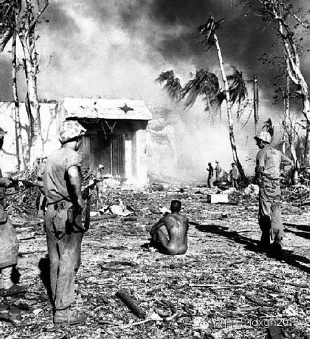
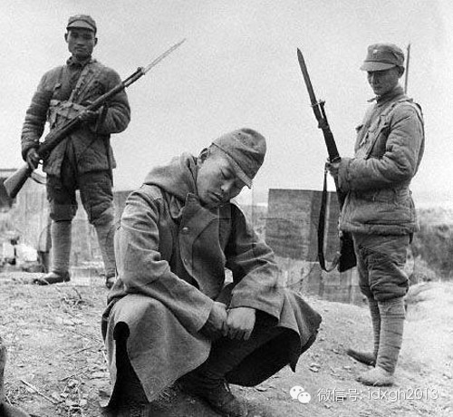
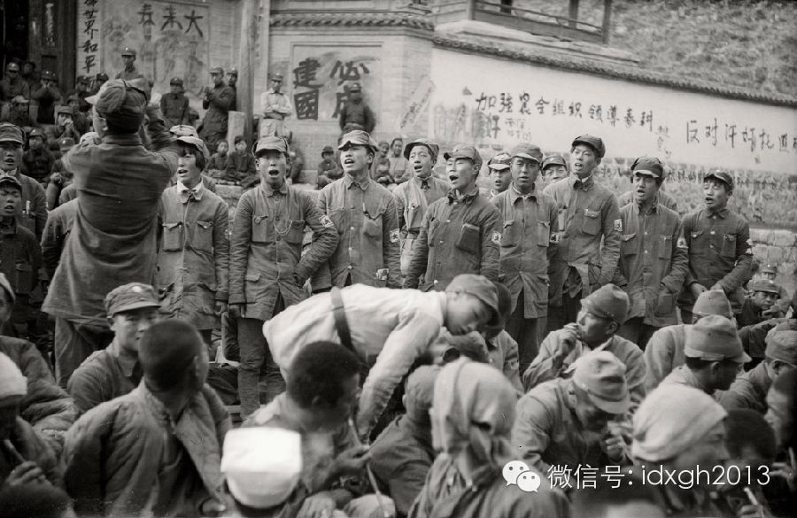
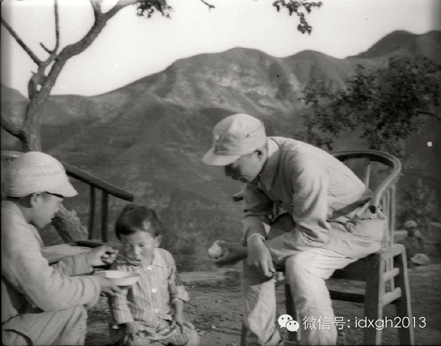
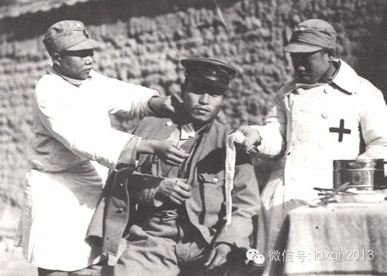
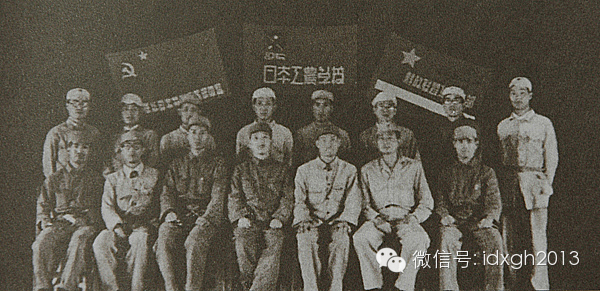
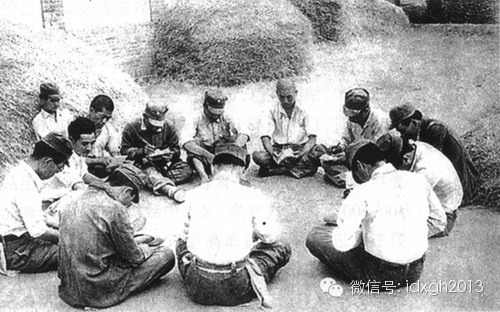
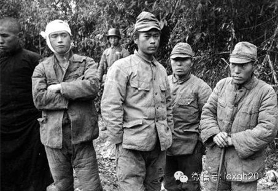

**日本兵以极难被俘虏著称。八年抗战期间，国共俘虏了多少日本兵？共产党军队宣称俘虏的日本兵远超国军，聂荣臻曾主动蹭吃俘虏的小灶......**  

  

文/唐元鹏

  

1937年9月25日，山西平型关附近的山沟里，两股日军辎重部队陷入八路军115师的包围。一场激战，八路军全歼顽敌，这就是“震惊中外”的平型关大捷。虽然比日军
多伤亡近200人，但此次胜利意义重大，它打破了日军不可战胜的神话。

  

美中不足的是，这么一场战果辉煌的歼灭战，竟然一个俘虏都没抓到！为何一个活的都没有？八路军内部流传着许多传说：一个八路军营长好心去背一名日军伤员，结果被伤员咬
掉了耳朵；一位医务兵试图救助一名藏在车底的鬼子伤兵，却被捅了刀子。

  

这些故事以及战斗经验给中国人留下了深刻的印象——想活捉一个日本兵，实在不容易。

  

**【到底抓了多少？】**

  

其实，不止中国人，任何与日军交战的军队都有同感。

  

美国在太平洋上与日本鏖战4年，血战无数，但战俘营压力一直不大。像塔拉瓦、佩里琉、硫磺岛这些血腥战场，想抓个日军俘虏简直难比登天。塔拉瓦4500日军，几乎全部
战死，被活捉的只有12人；佩里琉守备队1万人，只有160人生还；著名的硫磺岛血战23000日军，战死2.2万，只有1000余人被俘，其中很多是战役结束后才陆
续投降的。

  

塔拉瓦战斗罕有的日本战俘

  

大多数西方人怎么也无法理解日本人的顽固。鲁思**本尼迪克特在《菊与刀》中剖析：即使日本士兵由于受伤太重或者丧失意识而成为俘虏，他在日本也永无抬头之日了。他已
经丧失了名誉，之前的他就已经“死”了。

  

林彪在《平型关战斗经验》中指出：“日本兵至死不肯缴枪，一来是因日本之武士道的教育、法西斯教育，同时也因他们对中国军民太残暴，恐怕中国人报复。”

  

武士道精神、法西斯教育也好，听信了中国军队不留活口的传闻也罢，总之抗战八年，抓住一个俘虏对国共双方都不容易。

  

到底有多难呢？

  

平型关战斗一个多月后，343旅在昔阳县以西的广阳再度伏击了一支日军部队，才终于诞生了第一个俘虏。为此，八路军特意派旅级参谋长陈士榘出马，抓捕这名运输兵——他
冲进屋子时，发现日本兵站在粮筐里“吓得浑身发抖，两腿打颤。”

  

至于国军，一直到淞沪“813会战”才有了第一批日军俘虏，8月23日，国军战报称：第18军66团突入罗店与敌激烈巷战，生擒日军三名。

  

那么，八年抗战一共俘虏了多少日军呢？

  

由于谎报、漏算等原因，这个数字十分难考据，但可以肯定并不多。

  

战争结束时，日军司令冈村宁次统计称：“随着遣返输送的进展，由中国政府方面和共军方面（极少数）移交的俘虏，1946年5月末的数字为：陆军1212名，海军40名
，商民106名，共计1358名。另外，从延安返回日本的战俘约300人，200余名俘虏死在国方战俘营中。”

  

由此可见，可以稽考的被俘日军只有约2000人。但作为对外公布的战报，中国方面的统计比这个高很多，但并不准确。

  

首先国军没有八年来总的数目，只在战役战报中零星公布了部分数字：台儿庄大捷俘虏719名日军，第三次长沙会战俘虏139名日军，中国印缅远征军共俘虏647名日军，
湘西会战俘虏247名日军。

  

日军被国军俘虏后垂头丧气

  

军政部所属的陕西第一俘虏收容所关押过500余人，辗转于湖南常德、贵州镇远的第二俘虏收容所先后关押过700余人，在重庆的分所关押过约400人，总共1600余人
。相比之下，共产党军队宣称的日俘数目简直让国军汗颜：6213人。

  

其中，1938年5月前共产党军队只俘虏了124人，此后数字急剧攀升，到1941年5月共俘虏了1771人，然后每年保持400~500人的俘虏数量。

  

百团大战，八路军宣称俘虏日军281人，包括日军副大队长山西绥清，但遍查日军编制者，并无副大队长官职。

  

另外抓了56名武装移民，实际是各种平民。在共产党的俘虏中，打工者所占比例不小，如1939年1月2日，首批自愿参加中国八路军的日俘前田光繁（铁路工人）、小林武
夫（汽车司机）以及冈田义雄中。

  

到底俘虏了多少日军，延安方面可能连自己都说不清。1940年4月中共开始留用日方战俘，此后这个数字最高时也只有400余人，而同时期，战报宣称俘虏日军2500余
人，这两个数字根本对不上。

  

1944年9月，日共驻中国代表冈野进发布的数字与延安方面的战报也有出入：2400：3200。

  

延安方面宣称的俘虏数字不仅惊人，且无法证实。很长一段时间内，八路都宣传抓获战俘后迅速释放，下级只报告抓了几人，放了几人，没有详细核查。当然还有更惊人的数字，
八年中俘虏伪军高达51万多人。

  

**【日本兵被俘虏后】**

  

作为侵略者，成为俘虏是一件极度危险的事。冈村宁次回忆，早期软禁在国军前线部队的战俘有被杀害的现象。八路军也偶有虐俘情况出现，但很快就显示出了不同于国军的特色
政策。

  

善于做宣传工作的延安方面意识到，战俘是一种很好的鼓舞自己、瓦解敌军的工具。1937年10月八路军总部发布俘虏政策的命令，“不杀，优待，放归”。毛泽东也曾对外
国记者说，“他们杀的越多（放归日军），就越引起日本士兵同情华军……有些不愿回去的，可在八路军服务。”

  

这条政策因战局发生过变化。

  

1938年11月22日，八路军总部规定：除特种人员要劝留外，其他无论表现如何，一律慰劳后送还，不得超过3天。最后特注明，这一条不得笔录，只能口头传达到团级。

  

欢送日军俘虏大会上，八路军战士在唱歌

  

但1940年4月，延安方面政策大调整，提出了“教育后劝其回归，选择少数进步分子，给予长期训练”的指示，也就是“教育、训练任用”的原则。日军俘虏一旦被留下，优
待的规格令人震惊。

  

一些举措甚至堪比月下追萧何：彭德怀百忙中抽出时间要求各部队创造条件，解决日本俘虏的洗澡问题；129师师长刘伯承提着酱菜走了100多里，到医院看望日俘山田一郎
；井陉站的日本副站长夫妇在百团大战中被击毙，聂荣臻亲自抚养他们的女儿美穗子。

  

聂荣臻（右）亲自抚养失去双亲的日本小女孩美穗子

  

一般来说，被八路俘虏的日军会经历这样的流程：

  

**治伤**。有伤的先医治，走不动道的会用担架抬，或者骑马，骑驴。

**选择。**询问是否愿意回去，回去则吃顿好饭，教育之后放走。

**优待。**留下的总有比八路军普通士兵更好的食物。

**保护。**不但禁止看押士兵们打骂俘虏，搜俘虏腰包，还会保护他们的安全，不受愤怒群众的骚扰。

**交流。**总会有敌工部懂日语的干部与他们交谈，主要是打消他们对抗的念头。

**欢迎。**运气好的还会遇到一个有水果美食的欢迎会。通常到这时，再顽固的俘虏也会收起寻死觅活的心，接受命运的安排。

  

八路军为日本战俘治病

  

通常八路军会把俘虏们送到延安接受再教育和训练，那里有1940年开设的日本工农学校。在战争期间，这所学校的待遇好到令人发指。

  

“饭桌上摆满了日本风味和中国风味的菜。班长一声令下，大家便吃起来。我的筷子首先伸到牛肉火锅里，刚吃了一口，不由得大声叫起来:‘啊太棒了！这真是天下第一！’别
的桌子上也喊出声:‘我们真幸福！在日本国内，生活一天比一天差，而我们的生活，倒一天比一天好。’”这是降兵谷川在黑板报《在食堂里》里描述的场景。

  

日本工农学校属于延安的一级供应单位，和美、苏、朝鲜等外交人员同等待遇，一名日本战俘每月有大米15斤、面粉15斤、猪肉3斤、蔬菜30斤。工农学校新学员，第一个
月先发5元补助，毛巾、肥皂各一条，牙刷一把，牙粉及盐各一包，旱烟袋一根，碗筷、单衣单裤、衬衣衬裤、鞋袜、被褥应有尽有，每4个月补充一次。

  

日本工农学校

延安日本工农学校的学员在参加学习

  

难怪谷川会写文章赞美牛肉火锅，此时延安的物资紧张，周边的中国人都在吃小米，他们却顿顿大米白面，早晚餐两三个菜，周六加菜，甚至有白酒喝。老百姓过年才吃顿饺子，
学校里每周一都会吃饺子。每个学员每月固定的3元津贴，与八路军连长待遇相同。

  

聂荣臻看了学校的墙报之后，实在按耐不住，厚着脸皮找学校总务要求蹭饭，结果“放开肚皮吃了一顿日本菜”——鸡素烧，聂司令满意而归。

  

**【叛变者的工作】**

  

日本工农学校里的俘虏，通常会学习日本作家小林多喜的《蟹工船》、毛泽东的《论持久战》等书籍。4年间，共有400余人毕业，他们被认为是已经改造好的同志，发往各地
工作。

  

有技术的日俘从来不会放归，比如军医，会被留在医院效力；一些军官会被派到各部队里成为炮兵、工程、武器装备的教员，训练八路军士兵。

  

另一些人将要从事一件非常刺激的活动——上战场喊话。他们要躲避战火，跑到炮楼边，高声向同胞叫嚷：

  

“日本打不赢！”

“日本军阀才是我们的敌人！”

“你们都是劳苦大众啊！”

“想家了吧，我给你们送来了慰问粮！”

  

一位俘虏秋山良造在冀南对日喊话一战成名。日军内部经常问：“秋山君来了没有？”据说给他的信件高达一尺。

  

但战争毕竟很危险。归顺的日俘共有38人牺牲，延安方面称他们为同志。

  

另一些日俘的工作相对安全：宣传。首先是对外宣传，反战组织的战俘们到各地参加群众大会，为军民做报告；日本工农学校举办各种展览会，接待中外记者西北参观团的访问；
其代表向国统区和盟国宣传中共的战俘工作取得的成就。

  

当然，日本俘虏还要经常演戏。英国记者根室**史坦因在延安时，观看了一场由日俘表演的4幕话剧。在冀南区，日俘也组织了话剧团，自编自演话剧“活路”。冀中支部的“
国际剧团”、太行支部的两个剧团都经常进行巡回演出。

被国军俘虏的日军

  

延安方面的日俘工作令人印象深刻，美国外交官约翰**艾默逊1945年1月参观了国府的重庆日俘收容所后说：“这与在延安那些快快活活的日本人相比，真是鲜明的对照。
”

  

这个评语十分贴切。国军的战俘管理混乱，一度仿照共军让日俘从事宣传，但效果实在太差，被举报为“纵兵扰民”，最终日俘还是老老实实呆在营中。

  

由于活捉一个日本兵实在太难，当时国际上都不相信中国活捉了大批日本兵，为此，1940年国民政府在重庆拍摄了一部全部由日本战俘参演的反省侵略战争的宣传片，这部名
叫《东亚之光》的电影特意用了一个长镜头把大批战俘和他们的宿舍捕捉进镜头。

  

该片拍摄期间曾遭遇顽固日俘的破坏和日军轰炸干扰，1941年1月最终上映。恼怒的日媒称片中日本战俘是由留日学生演的，实际上全片只有导演何非光一个人是中国人，何
非光1913年在台湾出生，会一口流利的日语。1958年，因拍摄反动电影和参加国民党被判管制两年，1979年平反。

  

> 版权声明：  

> 大象公会所有文章均为原创，版权归大象公会所有。如希望转载，请事前联系我们： bd@idaxiang.org

大象公会：知识、见识、见闻

微信：idxgh2013

微博：@大象公会

投稿：letters@idaxiang.org

商务合作：bd@idaxiang.org

[阅读原文](http://mp.weixin.qq.com/s?__biz=MjM5NzQwNjcyMQ==&mid=203868450&idx=1&sn
=884e6077ed373b63aebe68c170086897&scene=0#rd)

