**日本人在家庭装修上的态度与中国截然相反，其所得也与中国人完全相反，这种差别是什么原因造成的？**

文/黄章晋

每个买了房子的中国家庭，大都会成为装修专家，他们甚至知道装修公司报价和质量上的猫腻——尽管多数是在事后。

  

比起中国人，日本人对装修问题的愚笨是难以想象的。多数日本人无法回答本地的建材市场在哪里，因为今天大部分日本新房都是精装修过的，不像中国大量新房是毛胚房。另外
，由于早已完成城市化进程且步入老龄化社会，日本二手房交易远不如中国活跃。而年代较久的二手房，售出前都会找公司重新装修。在日本，不需自己操心装修问题被视为理所
当然。

  

即使是精装房，中国人与日本人的用心程度也截然不同。中国精装房的购房者大都能说出新房每平方米的装修造价，这是房产公司必须告之的重要事项，而日本人则对此毫不关心
。有两位旅居日本多年的中国人，在被问及此问题时，竟然用了相同的比方反问：难道你在4S店买汽车时，需要知道汽车的喷漆花了多少钱吗？

  

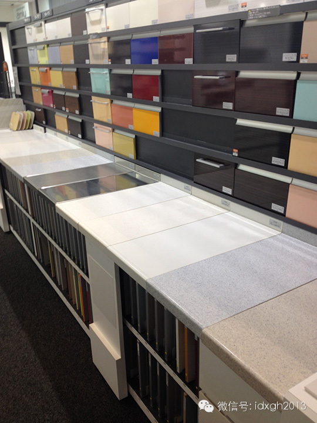_日本建材市场多由单个公司布置巨大的展厅_

日本人像看待工业制成品一样，将装修视为住房不可分割的一部分。或许是因为日本家庭装修已接近工业化制造的缘故：

  

日本公寓住房的家庭装修，本质上可算工业制成品的组合安装。住房装修设计与住房设计建造是一并考虑的。家装的大部分材料（厨、卫、浴、柜、桌椅等）都是标准设计的成套
工业制成品，装修工更像汽车生产线上的装配工，质量非常稳定。由于工业化生产制造的品质和工人的技能，使得家庭装修使用寿命较长，不像中国因为质量问题短时间内需要频
繁装修。

  

日本的现代家居装修业比欧美起步稍晚，但日本传统民居以榻榻米计算室内空间的习惯，使之很容易接受德国人率先引入的家居模块化观念，八十年代率先完成了家居的工业化生
产制造革命，与今天中国非标准化手工作业的家庭装修相比，质量上自然不可同日而语。

  

所以，墙纸几年后卷边、发霉、起泡怎么办？墙皮起泡脱落怎么办？木地板开裂或拱起来起伏不平怎么办？瓷砖断裂或脱落怎么办？厨房卫生间甚至客厅漏水怎么办……这些中国
人熟悉的问题，日本人都无法回答，因为今天日本人的生活中缺少这样的经验。

  

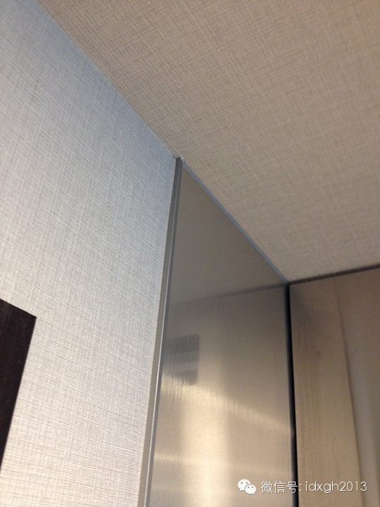_日本室内大量采用墙面贴纸（布）。_

但是，再精良的工艺，通常十年到二十年，厨卫浴的设施也会出现局部老化现象，但与中国人倾向于整个拆了重来不同，日本人只会委托专业公司对老化设施做整体更新或翻新，
而不是把家里的装修全部拆掉重来一遍。所以，中国小区里隔三岔五电钻电锤电锯的可怕噪音，在日本是极为罕见的。

  

由于这种翻新装修（“装修”这个词在日本和一些发达国家会因为程度和项目不同使用不同的词）需要重新设计，这时，房主通常会请专门的建筑士（设计师），而不是自己当设
计师。也许是因为这类需求较多的缘故，日本是建筑设计师最多的国家，其单位人口中的建筑设计师是发达国家平均水平的3倍。

  

日本人购买新房，并不像中国的精装房一样缺少选择。房产公司的样板房通常设在公司专门的住房展区。每种户型都有一模一样已装修好的样板房。由于采用模块化设计，购房者
可根据喜好挑选，或根据需求提出另外的需求，不过，附加的选项另外算价。

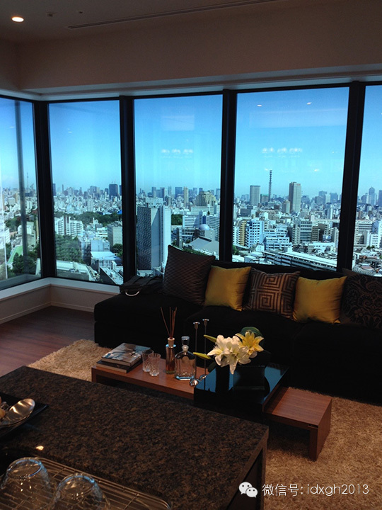

_日本的样板房（窗外的景色是布景）_

标准化设计并不意味着同样的户型，里面的布置会一模一样。建筑商会考虑不同家庭的需求。譬如依照家庭成员数量和年龄，将用户分为形成期、成长期、成熟期等不同类型的家
庭，同样的户型，会根据家庭情况不同，在空间布局和功能设置上有不同的安排。并且，由于模块化设计，它是可调整的，譬如多了一个孩子，或孩子长大独立出去，都只需要简
单的组装，就可适应需求。

  

住户在挑选住房时，房产商都会仔细询问其家庭状况。在更细微的环节上，房产商也会有比用户有更丰富的经验。日本房产建筑商大都有专门的研究部门，从人体工程学不断改进
住房设计细节。从有老人的家庭，什么地方需要扶手、怎样做到轮椅可无障碍通行，到案台、柜门该如何设计才可让家庭主妇更顺手，都有一套成熟完善的标准。

  

社会学的研究发现也被引入住房的建筑设计和装修设计上，它使得今天中国与日本家庭的布局差别，又多了文化习惯之外的因素。

【中日家居之别】

日本传统文化中注重简约的审美偏好，对日本家装风格影响至深。而今天中国的家装审美偏好千姿百态，多数人依然认为把家里装修的像商务消费场所才是美，并且由于缺少现代
都市生活的经验积累，视觉效果的考虑往往在装修时被置于首位。

  

相比之下，日本设计师在实用功能的考虑上经验远较中国更为丰富。譬如为夫老妻居住的房子，会考虑到老人往往会因鼾声互相干扰，有分床而睡的需求，卧室的两张床中间，会
设计一个可收放折叠的屏风，入睡前，拉开屏风就成了两间独立卧室。

  

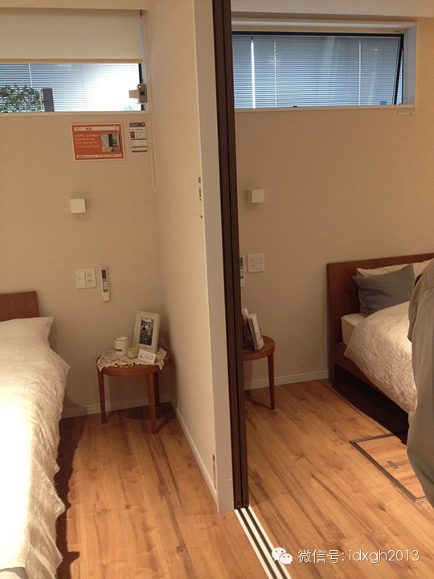_为老夫妻分床而睡的设计_

建筑面积在90-120平米的公寓住房，中日两国最大的布局区别在于，中国的客厅、餐厅、厨房多是分离的，至少厨房与前两者分离，而日本今天的住房，这三者几乎都是统
一的空间，并且处于居中位置，被称为家务空间。

  

这种中日差别，看上去最直观的原因，是因为中国人烹饪时多炒、煎、炸，油烟极大，厨房与餐厅、客厅必须分离。而日本烹饪方式油烟较少，可以不用担心污染室内空气。

  

但日本住宅注重客厅、餐厅、厨房打通形成家务空间，却是因为社会学研究的结果。研究者发现，由于日本社会的消费场所极其发达和观念的变化，近二十年来，家庭已不再是社
交活动的空间和场所，与此同时，都市人群开始注重家人的团聚交流。为此，空间上必须打破厨房与客厅、餐厅的隔离，尽可能增加家人的交流机会。家居环境中家务空间居中的
格局也由此形成。

  

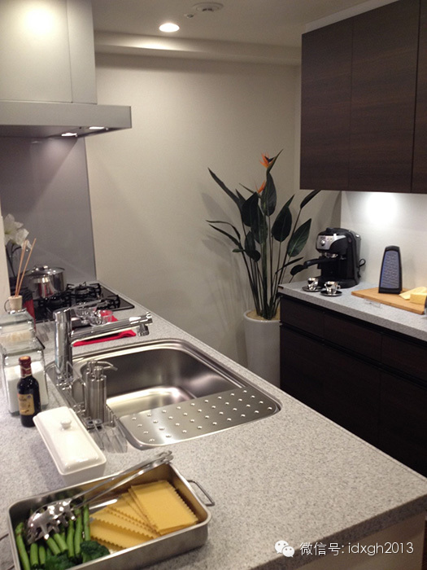_与客厅、餐厅空间相通的厨房_

另外，社会学的研究发现，日本学习西方国家给孩子独立空间后，易造成父母与孩子缺乏情感交流等一系列问题，孩子开始变得不爱学习，而更热爱学习的孩子，通常来自与父母
有更多交流沟通的家庭，他们更喜欢在母亲身边做作业读书。这些发现也体现在住房的空间布局和设计上。现在的住房设计，会为孩子在家务起居空间设置一张可移动的书桌，无
论是做家务的母亲还是读报的父亲，都有了更多的亲子交流机会。

  

中日住宅布局的另一大区别，是卫、浴空间的安排。

  

中国的住宅，除非面积特别巨大，通常浴室和卫生间是一体的，尤其不会刻意强调洗脸、洗澡的功能独立。而日本住宅布局，则奉行干湿分离的原则，洗脸间、卫生间和浴室的空
间都是互相分离的，由于日本人爱在浴缸里泡澡，哪怕面积很小的单元，卫生间与浴室都是分离的。

  

另外，洗衣机通常也有独立空间，不但预装了上下水的管道，并且有专门的座垫，不会出现洗衣机工作时，地面上水漫金山的情形。

  

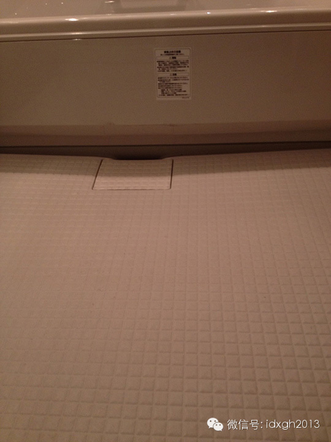

_今天日本浴室地面多是防止积水的漏斗形，地面材料是保温的_

在储物收纳空间上，日本住房装修设计时，隐藏式的储物收纳柜子，占用的空间要比中国大得多，给住户添置家具的空间很小，一方面与日本的“藏”多于“露”的审美偏好有关
，另一方面，是日本设计师积累了更丰富的现代都市人群的生活经验——中国全新的精装修房，刚搬进去时会显得很宽大，但往往需要不断添置新的储物柜，最后反而容易显得局
促凌乱。

  

由于今天日本住宅的储物空间是模块化设计制造的，它往往可根据家庭因人口、年龄的变化，重新组装调整，具有很大的灵活性。正是这种设计上的考虑日益周到，日本成套家具
因为需求减少，市场早已萎缩。

  

今天中国住宅建筑还不会考虑环保节能问题，而日本则为此挖空心思。譬如为减少使用空调，有的建筑会在相对的两面墙上开很小的窗口，一高一低，利用空气对流的自然风为室
内降温。

  

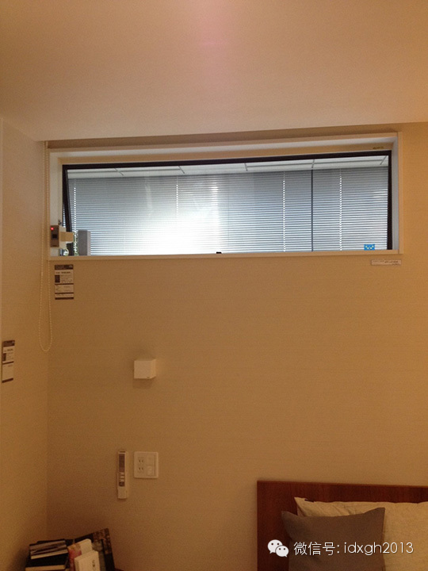_空气对流的上通风窗_

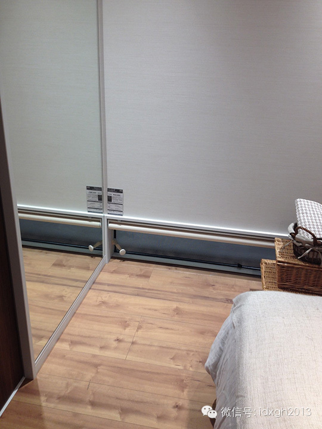_下通风窗口_

【职人与匠人】

日本制造业别于多数欧美国家的特点，是企业生产协作的分工极细，一个大公司下面有多个层级与之协作的小公司，装修亦然。房产商的装修任务，会交给多个模块功能的供货商
，每个供货商又会委托多个小公司负责施工。最终一个装修项目会有几十个小公司承接。

  

企业间的高度分工，它最终会体现为工种分工极细，工人专业度极高。据统计，日本普通公寓楼的家装，前后进场施工的工人，工种会多达十五个以上，而在中国，一般只有泥瓦
工、水电工、油漆工和木工四个工种，由于木工活现在越来越少，更多时候只有三个工种。

  

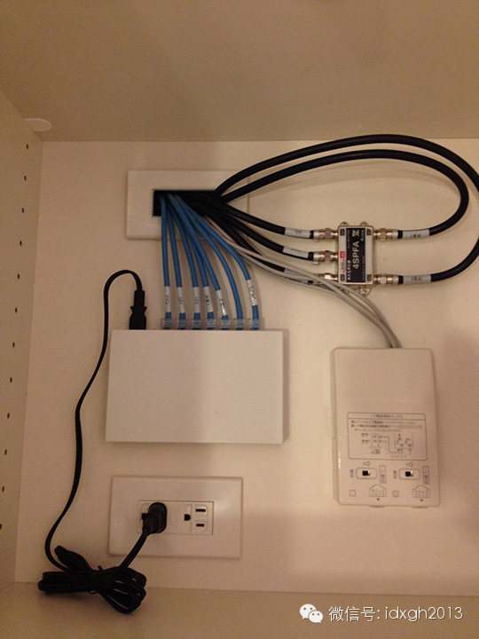_日本家装中看不见的布线也很讲究_

而日本公寓的住房者几乎永远不会与装修工人直接谈判交道。公寓楼需要局部重新装修时，则是与物业公司交道。通常会委托设计事务所，由事务所的设计师更具需求绘制装修改
造图，由设计师与物业公司的装修工人沟通交流。

  

当然，今天日本居民并不全都住在现代高层公寓楼中，大量人口是住在独栋或老式狭小的楼房中。装修老化时，不可能像公寓楼那样以标准化装修。但无论是东京这样的大都市，
还是北海道的偏远山村，非公寓楼住房的翻新装修，同样是委托专业的公司，内部功能模块依然尽可能地由供货商定制。

  

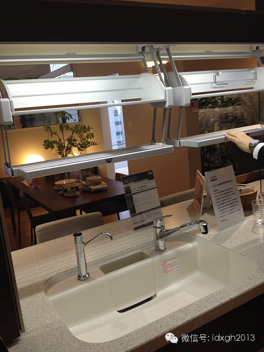_模块化设计厨房洗菜案台储物系统_

日本人很难理解中国人关心的装修施工质量问题，在他们看来，大、中、小公司之间长期稳定的协作关系，决定了无需担心工人技能和责任感。出了质量问题，追溯的链条清晰直
接，不可能出现事后找不到人的问题。

  

另外，在家庭建筑装修涉及的材料、工艺、质量标准上，日本有几十条法律法规，以确保质量标准和行业资质。据JIG-
EARTH株式会社的伊藤雅词介绍，在技术标准上，除了德国可能略高于日本外，日本在相关领域的标准是最高的。

  

家庭装修供货商负责组织施工工人的同时，还需负责对工人的定期技术培训，以确保工人掌握最新工具和技术。日本装修工人的计薪方式，有计时和计件两种，按正常作息工作，
其劳动时间大大短于中国同行，平均月收入为五十万日元，要明显高于一般公司职员的收入。

  

虽然与中国同行相比，日本工人体现出极高的专业水准，但他们并非中国最近开始频繁谈起的“匠人”，在日本，一般家庭装修的工人，被称为“职人”。此称谓通用于各个行业
的技术工人。

  

“匠人”是一个极高的技术称谓，据伊藤雅词介绍，它是专指纯传统手工劳动的技术工种，通常职业生涯要达到二十年以上，才有可能被称为“匠人”。

  

在承接很特殊的装修任务时，才会有“匠人”出现。最常见的是定位高端的日本传统风格的饭馆、旅店。譬如用竹、木等材料装修时，不但不能使用现代装修材料，而且不能使用
现代施工技术。只有手工工艺极高的工人，才能做出工艺品般的作品。

  

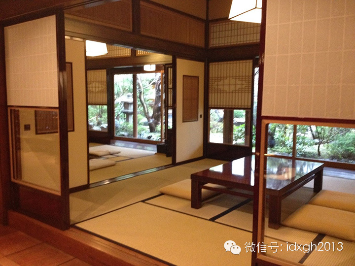_一个用传统手工装修的店铺_

_ 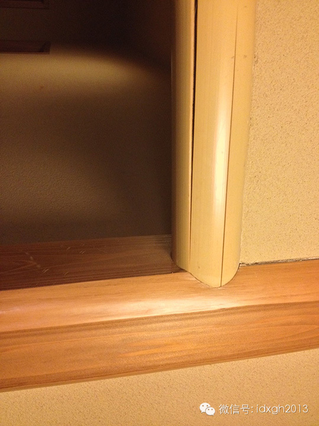__这种看似简朴的传统装修需要极高的手艺_

今天的日本，早已无城乡之别，无论是“职人”还是“匠人”，都不会是来自特定地域或社会阶层。高度的专业化分工，对职业很容易产生强烈认同甚至热爱。

  

而中国装修工人多自农村来，虽然相对从事其他行业的工人收入较高，但相对他们的城市雇主，则有明显的社会地位高下之别，大多数人只将其视为谋生手段，缺乏基本职业的认
同，更谈不上热爱。

  

另外，在家装问题上，中国人与日本人除了前述的巨大不同外，对预算的态度也明显有别，中国部分城市的住房价格已与日本相当，但中国人可接受住房高价，却很难接受在装修
上一次投入大量金钱。不过，由于中国人往往十年就会重新装修一次，算来算去，中国人一辈子花在住房装修上的钱，很可能与日本人是一样的。

_（近期将推出介绍德国装修的相关文章，读者敬请留意）_

  

[大象公会所有文章均为原创，版权归大象公会所有。如希望转载，请事前联系我们：bd@idaxiang.org ]

———————————————  

**大象公会订阅号的自定义菜单上线了，左边是官网文章精选，右边是大象公会官方微社区，点击进入来吐槽发帖吧！**

  

[阅读原文](http://mp.weixin.qq.com/s?__biz=MjM5NzQwNjcyMQ==&mid=202026884&idx=1&sn
=4d642ab60a7321d4dd20a94079b2bb81&scene=1#rd)

