**大红灯笼是今天中国逢年过节时喜庆元素的一部分，但这种大红灯笼并非中国传统式样，而是日本人设计的日式灯笼改进版。**  

  

文/闫京生

  

今天，无论是中国传统节日还是官方的国家节日，中国各地照例都会挂上大红灯笼，以表达喜庆之意。物资匮乏的文革时代，大红灯笼是奢侈品，多数单位组织也找不到会制作灯
笼的工匠，于是，就用宣传画上的大红灯笼代替实物，每个灯笼上写一个字，构成“春节快乐”或“欢度国庆”的完整句子。

  

这种灯笼无论大小，通常直径与高度（含圆形的灯头与底端）之比在1.1：1至1.35：1之间，无论是外观形状、比例、颜色还是结构，都是天安门上那8个灯笼的翻版。
今天，中国喜庆时很少见到传统形状各异的灯笼。

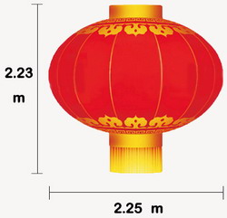

****天安门灯笼的比例示意图****

  

不过，今天挂满中国的大红灯笼，并非中国传统式样，而应当是“日本丸”的改进版本。

  

**这一切得从1949年天安门城楼的改建说起：**

1949年初，接收的北平城令市委十分难堪：垃圾遍地、千疮百孔。一直被视为重要政治象征的天安门也不例外——堆积的风干野鸽子屎有数吨之多，踩上去霉味扑鼻。

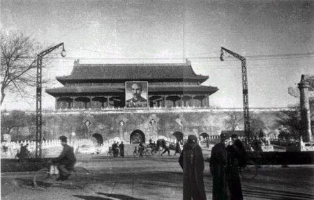

****民国末年的天安门城楼****

  

当时北平市委和市政府已知道开国典礼极可能在此举行。他们绞尽脑汁，发起了一场又一场清洁运动，天安门广场是重点对象——广场上309个坑被填平，周边不少建筑被铲平
，同时，恼人的野鸽子屎也装满数卡车，运送出城。

  

1949年9月2日，周恩来批示“阅兵地点以天安门前为好”。虽然清除了垃圾，天安门城楼仍急需修缮、装饰——悬挂的毛泽东画像、正面的两条字幅、城楼上的灯笼，都需
要现做。

  

画像、字幅都容易解决，灯笼却令所有人为难。天安门城楼原有的六角宫灯，既小又破，落满灰尘，根本无法适应“张灯结彩”的政治任务。而被周恩来从20张设计图中一眼相
中的大红灯笼，高2.23米，周长8.05米，只是一副草图，但无人能制作。

  

**北平为明清两代京城，不是有很多做灯笼的巧匠吗？**

  

因为这种竖龙骨大红圆灯笼并不符合中式传统，很大程度上是“日式丸提灯”的改造版。

  

传统的中国灯笼，主要用途并不是照明，而是装饰、出行。宫灯就是装饰的一种，其以六角等多边形为主，形若“肃”字。

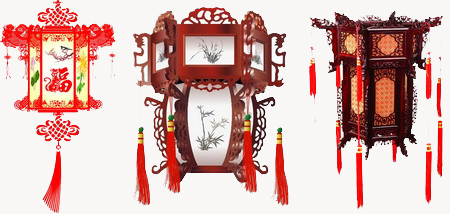

****中国传统宫灯样式****

  

《大明会典》卷一八二•仪仗中写道：

“红纱灯笼六对。红油竹灯骨、铜烛盘、外以红纱蒙之。硃漆竿、竿首、贴金龙头。其下龙尾。竿头、带黄熟铜钩、垂玉色纱罩之。红油纸灯笼三对。红油竹骨、下有烛盘木座、
以竹丝编为笼、加红油纸、竿同红纱灯。魫灯三对。制同红纸灯。但用魫为之、铁为灯骨。”

  

天安门的大红灯笼不属于传统宫灯。

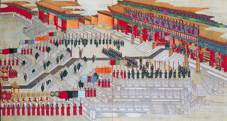

****光绪大婚图，图中殿堂悬挂宫灯****

  

另一种装饰灯笼为元宵节异型灯，其形状各异，却很少见圆型带上下輪、带穗的种类。而出行用的手提灯笼更不可能造成不易于携带的椭圆形，走马灯也没有现在的大红灯笼形状
。

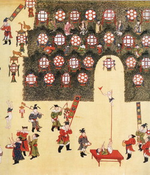

****明宪宗元宵行乐图，其圆灯笼为竹木编织的外骨架，与大红灯笼不同****

  

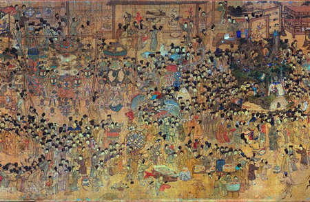

****明上元彩灯图，装饰类灯笼并没有天安门城楼灯笼的样式****

  

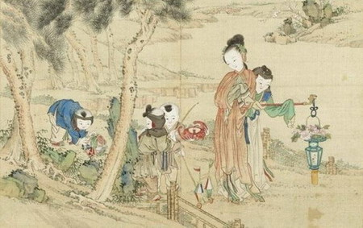

****古画中的手提灯笼****

  

中国传统中，圆红灯笼是有的，比如红纱灯，民间的比如河北藁城灯笼。但藁城灯笼分为宫灯、走马灯等花色，红圆灯笼是其中的一种，并不是最重要的种类，同时与当前的大红
灯笼在许多做法上也有差异。有一种说法，藁城的圆红灯笼是“传统贡品”、“传统宫灯”，这种属于民间传说，明清宫廷并没有这种红圆灯笼。

  

另外，民间的其余灯笼，如瓜楞灯、羊角灯、红纱灯、油纸灯、魫灯，元宵灯笼龙凤麒麟、孔雀仙鹤、螃蟹鲤鱼、西瓜葡萄等并没有大红灯笼的样式，而传说与大红灯笼相似的福
建灯笼，明朝张岱《陶庵梦忆》说道：“福州所进（灯笼）……晃耀夺目，如清冰玉壶，爽彻心目，遂为诸灯之冠”——“清冰玉壶”状，可见相差甚远。

  

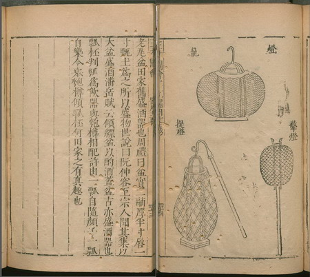

****《三才图会》中的圆灯笼，但没有垂穗和上下輪，诸多设计不同于大红灯笼****

  

**那么，开国大典的重要装饰为什么由日本人设计？**

  

当时人们不像今天的中国人这么敏感。由于需求特殊，设计要求高，天安门装饰的总负责苏凡将任务交给他最得力的两个助手：日本左翼画家小野泽亘（中文名肖野），还有投奔
共产党的日本青年森茂。苏凡的妻子是《白毛女》的主人公田华，而小野泽亘是该剧的舞美设计，其设计给苏凡留下了深刻印象。

  

这两位日本人也是跟随中共多年的老朋友。19岁时，受日本左翼作家小林多喜二的《蟹工船》影响，小野泽亘参加了日本无产者美术家同盟，很快成为左翼画家中的佼佼者。1
939年，他来到北平，一直从事左翼宣传工作。1945年，中日战争结束，小野留在中国，成为晋察冀抗敌剧社的“台柱子”，其宣传画水平高超，多次受《晋察冀日报》表
扬。

  

小野的搭档森茂，比他小近十岁，14岁时到中国丹东，受小野泽亘鼓舞留在中国。森茂曾任职《晋察冀日报》社的利民广告公司绘图部，“白毛女”牌香烟的商标就是由他绘制
。

  

设计图被选中后，苏凡带着小野和森茂在北平城内四处寻找能制作的灯笼铺，但一无所获。最终，在一位70余岁的老匠人帮助下，他们决定在天安门城楼上自己制作。老匠人操
作灯笼的主体部分，而“手板”（云头板）和“下房”（垂穗）由小野和森茂操作。

  

三天三夜后，八盏中国有记载以来最大的圆红灯笼被悬挂在城楼上，每个重约80公斤，由二十几个年轻战士将灯笼挂在横梁上，旁边砸紧两个铁环才固定住。

  

**这两个日本画家设计的天安门灯笼就是日式的吗？**

  

并不完全是。日本传统中，圆红灯笼并不少见，上下輪和垂穗与天安门灯笼下差不多，但多是横龙骨结构，呈纵向椭圆形。

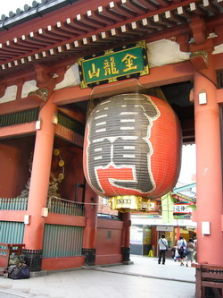

****日本浅草寺雷门****

  

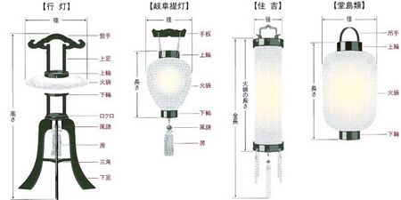

****日式灯笼****

  

小野和森茂自然对日本的灯笼设计十分了解，同时，在中国生活多年，也吸取了不少中国民间的灵感，尤其是华北晋察冀地区。据苏凡回忆，二人对待设计极为认真，时刻注意日
常生活中的事物，无论在冀西山村，还是冀中平原，走到哪里，他们的素描本上都会画满各种速写。

  

这让他们吸取了两国的设计，制作出了天安门城楼上的巨型竖龙骨大红圆灯笼。不过，整体上看，灯笼主体仍是日式丸提灯的改进放大版——出于承重考虑，横龙骨换为竖龙骨，
保留了其上下輪设计，笼身呈圆红状。增加了中式手提灯笼和部分日式提灯的垂穗。

  

八个大红灯笼刚挂好，已是10月1日凌晨。周恩来等人在凌晨三点巡视，验收通过。于是，这八个灯笼在大典结束后一直悬挂了45年，直到1994年被摘下。其后新换上的
灯笼也延续了这一设计。

  

后来，这两位日本画家都离开了中国。1953年，他们离开华北军区文工团舞美队，并在50年代先后回国。其中，小野在北京郊区教了5年书，才在1959年返回日本。

  

他们仍旧与苏凡保持着联系，并希望重返天安门，再看一眼大红灯笼。遗憾的是，直到二人在90年代相继去世，也没能如愿。

  

1949年后，大红灯笼与天安门一起成为重要的政治符号，尤其在1978年之前，经由共产党的政治运动和宣传工作，一度被塑造为灯笼的标准形象。今天，它甚至被认为是
中国传统文化的代表，重大场合时，无不成为装饰标配，成为喜庆的象征。

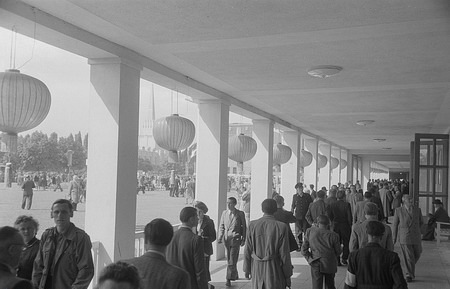

****1953年，仿照天安门灯笼制作的红灯笼****

  

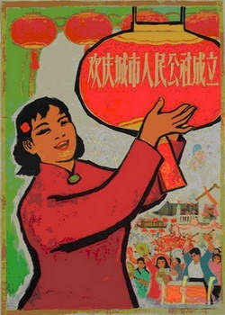

****宣传画中的大红灯笼****

  

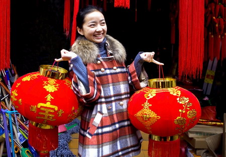

****挑选春节灯笼的年轻人****

  

**大红灯笼的政治含义实在太重了，一家企业一时冲动，竟然买下了其中一对，也因此吞下了苦果：**

1995年，前一年被摘下的八个大红灯笼，两个（东二、西四）交由中国嘉德拍卖公司拍卖。2月19日，这场最具政治影响的拍卖开始了，买家被严格限定为境内机构。经过
七分钟，17轮的叫价，起拍价10万的这对灯笼火箭般的蹿升到1380万人民币——要知道，那可是1995年，1380万的价值远高于今日。

  

拍下灯笼的中华百鱼亭乐园，连同一对灯笼，很快被转让给一家名不见经传的企业——浙江宁波金鹰集团，这让他们名声大噪。其总裁吴彪向社会宣布：灯笼将挂在其投资的中华
百鱼亭乐园，让海内外游客参观。

  

不幸的是，由于吴彪成为媒体焦点，他很快被查出以国家干部身份挪动国有财产及从事金融诈骗，2000年一审被判处死刑。

  

金鹰集团也遭此连累，本来孱弱的财政，因1380万的巨额支出资金链断裂，也在不久破产。

  

至于百鱼亭乐园，失去了靠山后，当然也很快倒闭。一对灯笼并没有悬挂太久，后来曾有人见到它们落满灰尘，放置在仓库中。再后来，据说是保留在金鹰集团所在的乡镇政府。

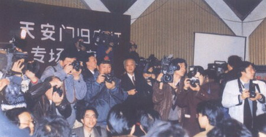

****1995年拍卖会现场****

****  
****

********

**版权声明**

****大象公会所有文章均为原创，****  

****版权归大象公会所有。如希望转载，****

****请事前联系我们：****

bd@idaxiang.org

****知识 | 见识 | 见闻****

****  
****  

阅读

__ 举报

[阅读原文](http://mp.weixin.qq.com/s?__biz=MjM5NzQwNjcyMQ==&mid=206709410&idx=1&sn
=bc05b67e6d05f751592280455896ee40&scene=0#rd)

