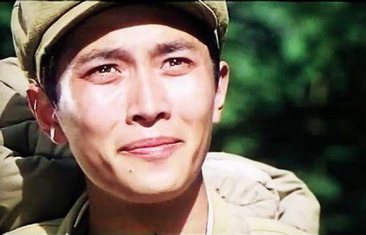
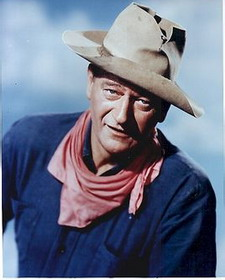
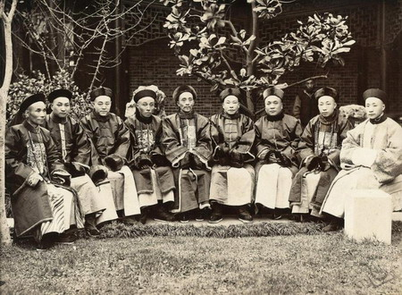
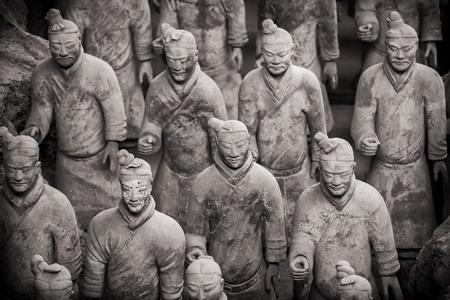
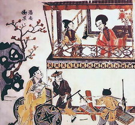
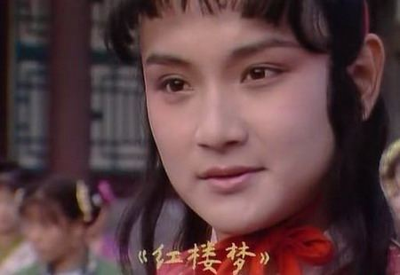

**中国屏幕缺少好莱坞和日本式的男性魅力形象，其实是中国社会男性真实形象的投射，中国传统文化中的男性审美一直就缺少阳刚吗？**  

  

**文/黄章晋**

  

11月10日去世的日本影星高仓健，曾在1980年代因电影《追捕》登陆中国时，引发了一场寻找中国男子汉的热潮，甚至连带着让当时正红的唐国强因此被贬为“奶油小生
”，若干年后，唐国强由“小鲜肉”变身中年大叔，才因为一系列成功的帝王形象摆脱了昔日噩梦。

**1979年，出演电影《小花》的唐国强奶油气十足**

  

不过，环顾今日中国，屏幕上依然不像欧美和日本有类别众多、令人心仪、信服的男性形象，当然，今天中国不是没有梗着脖子装硬汉的影星，但他们塑造的硬汉形象往往让人觉
得他们是在扮演国外同行，而不是真实生活在中国的普通人，毕竟屏幕中的男性形象多少是一个真实社会男性形象的投射。

  

是的，无论是好莱坞还是日本，他们塑造的极具男性魅力的形象，多少是现实中真实存在的，譬如好莱坞可以展现男子气形象的经典类别：牛仔、警察、军人、特工之类，就取自
丰富而多元的真实社会素材。而中国屏幕上无论是警察、军人、公务员之类角色，一旦个性十足、阳刚起来，就显得非常外宾，因为与这些角色的社会真实形象相去甚远。

  

中国没有让人信服的男性魅力影星，其实是中国男性整体缺乏男性魅力的缘故。甚至，中国社会突然开始有了男性魅力审美的意识，多少应归功于高仓健等一批国外电影进入中国
之后。

  

中国传统文化中的男性审美一直就缺少阳刚吗？

**好莱坞硬汉名片——约翰**韦恩**

  

**【由阳刚到阴柔的中国男人】**

近世西方人初次见到中国人时，对士大夫阶层的印象普遍是形象文弱阴柔，虽然他们或傲慢或谦恭，而普通百姓则多半是勤劳恭顺驯良的，虽然美国传教士丁韪良也曾称赞中国士
绅的教养可与英国绅士相比，但西方人常用于概括和描述男性魅力的词很少用于中国人。

  

而中国人当中，很早就敏感注意到中国社会喜欢孩子乖巧驯顺、并且男性形象偏于阴柔的著名批判者，应当是鲁迅。

  

他曾在《论照相之类》中批评道：“我们中国的最伟大最永久的艺术是男人扮女人……外国没有这样的完全的艺术家，所以只好任凭那些捏锤凿，调采色，弄墨水的人们跋扈。我
们中国的最伟大最永久，而且最普遍的艺术也就是男人扮女人。”

  

一个社会对性别形象的审美取向，当然来自这个社会的中上阶层，很遗憾，西风东渐之时，中国主流社会对男性偏向阴柔的审美取向已近于极致，无论是诗歌还是小说，塑造的男
性形象不但在形态上是文弱白净的，在性格上也是胆小懦弱、多愁善感的。

**清末中国官员合影，摄于1900年，佚名**

  

不过，中国男性形象并非自古文弱，只是千载以来确实是不断阴柔化发展的。从文学诗歌中可以清晰看出这种演变的历史脉络。

  

以先秦时期的《诗经》为例，虽然今日流传的《诗经》，尤其是“风”大部分题材是追述爱情，对男性身份表述较模糊，但当时对男性外貌的崇拜包括身高、力量、容貌几个方面
，理想男性的气质是英武有力。

  

如《邶风 • 简兮》中对伶官美男用的是“硕人俣俣，公庭万舞。有力如虎，执辔如组”，如《郑风 • 大叔于田》中骑射贵族美男是“叔于田，乘乘马。执辔如组，两骖如
舞。叔在菽，火烈具举…叔于田，乘乘黄。两服上襄，两骖雁行。叔在菽，火烈具扬……叔于田，乘乘鸨。两服齐首，两骖如手。叔在菽，火烈具阜。”

  

最能让今日爱国热血青年两腮滚烫的，大约是《秦风•无衣》中歌颂兄弟袍泽情深的诗句：“岂曰无衣？与子同袍。王于兴师，修我戈矛。与子同仇！岂曰无衣？与子同泽。王于
兴师，修我矛戟。与子偕作！岂曰无衣？与子同裳。王于兴师，修我甲兵。与子偕行！”

  

它是当时中国从上层社会到贩夫走卒阶层中男性整体精神风貌的一种折射，春秋战国时代无数重然诺、轻死生、慷慨勇武的故事，让一千多年后的日本武士道看上去像是对中国先
秦精神的一种致敬。

**秦兵马俑忠实记录了当时秦代男性的形象，即使是最低等的士兵，也都显得孔武有力、英气十足**

  

两汉延续了前代对男性勇武、英迈、刚健的审美，司马迁《史记》中的项羽大约是其最集中的体现。两汉期间虽然迭遭战乱，但并未形成后世“好铁不打钉，好男不当兵”的观念
，反倒是班超“大丈夫无它志略，犹当效傅介子、张骞立功异域，以取封侯，安能久事笔研间乎”的功业观是主流。

  

不过，“臣妾意识”和女性人格开始进入中国文人士大夫，恰是在武功赫赫的汉武帝时代开始出现，它由女性自称逐渐扩展到男性在面对君王时的自称。男人模仿女性的闺怨诗也
在这个时期出现。“犯强汉者虽远必诛”的雄武时代其实也投下了第一道阴柔的影子。

  

魏晋时代的男性审美较前代多元化，在延续前代男性以刚健勇武为自我期许的同时，也出现了最早的女性对小鲜肉型男性的审美，譬如何平叔、潘岳、夏侯湛、卫玠这类姿容妙曼
、肌肤雪白的美男，甚得当时女性粉丝的热爱。

**《潘岳掷果盈车图》，摘自《世说新语》配图。掷果盈车是说潘岳每次乘车出游，爱慕他的女性不但围追堵截，还争相向他丢水果，使得他每每满载而归**

  

不过，这些美男与后世阴柔、驯顺的书生有巨大的性格反差，自恋、张扬、甚至乖张不羁的他们大约很难看得起后世一点儿也不酷的文弱书生。

  

南北朝时代受胡风影响极重的北方，将魏晋时代出现的偏向女性审美苗头一扫而空，《乐府诗集》中“健儿须快马，快马须健儿。跸跋黄尘下，然后别雄雌”可算典型。而相对安
定的南朝则走向了另外一个方向。

  

隋唐直接袭承了北朝尚武刚健的精神余脉。即使是《柳毅传》中一介儒生的柳毅，看到龙女的悲惨遭遇后，正义感立即发作，义无反顾担负起解救龙女的使命。柳毅大约想不到，
清代《聊斋志异》中的儒生进化到只能巴望狐狸精正义感发作求解救的程度。

  

值得一提的是，两汉和唐代，都有过首都纨绔子弟和不良少年踊跃参军冒险的记载。

  

宋代是被认为是中国人性格走向文弱的转折。从文学作品中寻找当时审美偏好的线索，可以明显注意到宋代发达的市井话本，虽然故事和素材多取自唐代，但柔弱的、向往爱情的
书生开始成为主角。

  

中国后世理想的男性这时才开始出现，他应该是个饱读诗书的、会画画弹琴的、略有酸腐气、没有坏心眼的肤色苍白瘦弱的年轻人，并且没有生活自理能力。

  

当然，雄武之士偶尔也会显示出竞争力。宋哲宗为妹妹选择夫婿时，“遍士族中求之，莫中圣意”，近臣问要何人物，哲宗遂道出妹妹的心思：“人物要如狄咏者”。狄咏是著名
边将狄青的二儿子，史载他继承了父亲的基因，“颇美丰姿”，因为在宫廷当过卫士，故被公主知道。可惜地位不匹配，狄咏最后只能以公主择婿的“人样子”留名。

  

元明清三代，今日中国人熟悉的审美偏好逐渐定型，仅从文学作品看，男性形象持续向文弱化发展。最典型的是四大名著，元明之际的《水浒传》、《三国演义》中虽有关羽、武
松等成功的男性形象，但这种没有七情六欲只为大哥赴汤蹈火的男神，都有一位多愁善感的没事就哭一会儿的大哥。

  

而足智多谋如诸葛亮、周瑜都是容易生病的文弱书生，恐怕是当时的文化人标准形象已然定型之故。《西游记》中的唐僧、《红楼梦》中的贾宝玉，即使让今天“小鲜肉”、暖男
来演，恐怕符合其形象的也不多。

**87版《红楼梦》中，演员欧阳奋强饰演的贾宝玉**

  

毕竟《红楼梦》、《聊斋志异》中无论是贵公子还是落魄秀才，光白净还不行，还必须纤弱，得有一张让人相信他是经常生病的脸，并且按今天人的营养健康放宽身高标准，他也
不应该超过1.72米。

  

形貌一点也不白面书生的鲁迅在《病后杂谈》中挖苦“某人”愿望时的恶毒文字，多少可算对中国读书人极端阴柔面貌的概括：“愿秋天薄暮，吐半口血，两个侍儿扶着，恹恹的
到阶前去看秋海棠。”

  

为什么中国古代逐渐会形成一种与欧美、日本完全不同的越来越偏向柔弱的男性审美？**请看《最适合演毛泽东的是姜文》（中）之《骑士、武士和强盗》。**

**  
**

**版权声明**

****大象公会所有文章均为原创，****  

****版权归大象公会所有。如希望转载，****

****请事前联系我们：****

bd@idaxiang.org

****知识 | 见识 | 见闻****

阅读

__ 举报

[阅读原文](http://mp.weixin.qq.com/s?__biz=MjM5NzQwNjcyMQ==&mid=208506762&idx=1&sn
=3853c7dfb96cb9948632d0d7a93fa068&scene=1#rd)

