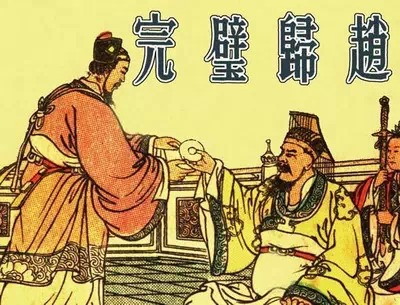
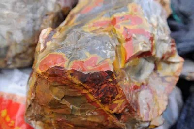
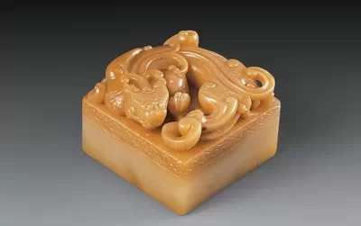
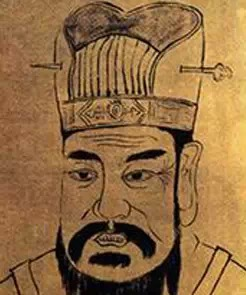
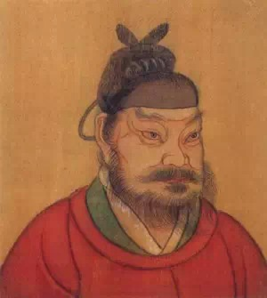
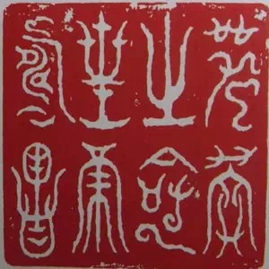
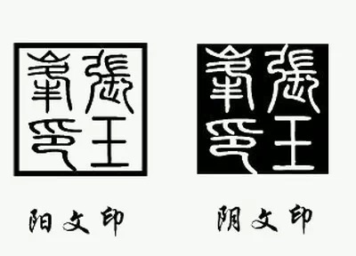
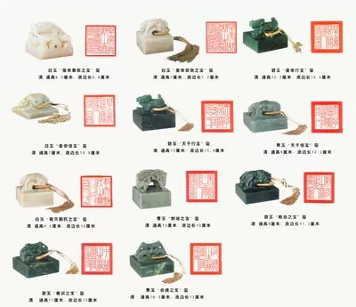
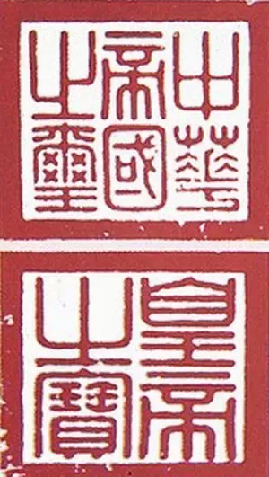

**传国玉玺被历朝统治者视为“天命”象征，秦始皇后辗转多次，真假难辨。后世的传国玉玺是秦始皇雕刻的和氏璧吗？朝代更迭中多次离奇重获的玉玺，究竟可不可信？**  

  

**文/闫京生**

  

金镶玉、和氏璧、传国玺……许多人都或多或少知道传国玉玺的传说。影视作品更是偏爱这一题材。《东成西就》中梁朝伟（欧阳锋）打伤林青霞（三公主），就是为了抢夺她保
管的传国玉玺。

  

通常，人们都认为玉玺由和氏璧雕刻而成：秦始皇令李斯将和氏璧改成玉玺，刻上“受命于天，既寿永昌”八个字。此后，玉玺被历代王朝视为权力正统的象征物，一直被争夺、
流传，多次不知所踪，又离奇复现，极具神秘色彩。

**玉玺的前身——和氏璧，可能比玉玺还要出名。几乎所有人都听过完璧归赵的故事**

  

至今还有不少人相信传国玺仍然存在，只不过流落民间，暂时隐匿。清亡后，驱逐溥仪出宫的冯玉祥曾派人寻找玉玺，但一无所获，更加深其传奇程度。

  

不过，和大多数传说一样，传国玺的故事也有非常多的疑点。甚至其和氏璧的出身都并不可靠。

  

**【和氏璧？】**

  

传国玉玺是由和氏璧雕刻而成？

  

人们似乎默认了这一说法。但正式的秦、西汉文献中，却找不到相关的记录。

  

直到唐朝，文献中才出现把和氏璧做成传国玺的记录。张守节《史记正义》引北魏崔浩之言，称“李斯磨和璧作之”；梁肃《受命宝赋》和杜光庭《录异记》都主张此说，称李斯
命咸阳玉工孙寿将和氏璧精细研磨，雕琢为玉玺。

  

更关键的是，和氏璧本身似乎并不是我们认为的“玉”。

  

史书称和氏璧出自荆山，但此后千余年中，荆山再无产玉记录。近年有人在湖北保康发现类似于石英、夹杂有彩色杂物颗粒的硅质岩石，命名为“荆山玉”。不过，这与中国传统
文化中温润含蓄的玉相差甚远。

**近些年开采出的“荆山玉”原石**

  

也有研究者认为和氏璧是湖北出产的绿松石。虽然绿松石在商代的文化中很受推崇，但从周朝时期起已经让位给透闪石、阳起石、蛇纹石一类的玉石，不可能在春秋战国价值连城
。

  

这让和氏璧转换为玉玺的说法十分可疑。而且，和氏璧本身在传承过程也多次失窃：

  

楚威王时期，昭阳令尹率宾客游赤山，取出和氏璧供人观赏，不料有人突然起哄，混乱中和氏璧不翼而飞。大约半个世纪后，赵国宦官缪贤在市场上用重金购得美玉一块，据玉工
称，就是和氏璧。

  

除此之外，《史记•秦始皇本纪》也记载了一则神秘的传说：始皇三十六年，有使者夜过华阴平舒道，一人持璧拦使者，说“为我遗滈池君”。据鉴别，这块璧是八年前秦始皇南
巡洞庭、封湘山时，遇风暴投入江中的和氏璧。

  

和氏璧出现的传说——“卞和献玉”也未必是真，乾隆帝就曾亲自做过考证，最后认为“卞和献玉”只是一则寓言故事，不能相信。

  

当然，璧在古代只是泛指“美玉”。不过，主要专指带有圆孔的圆环形扁平玉，讲究“肉”（璧身）的部分要大于“好”（中央的孔洞。如果孔的半径过大，则称为“环”）。这
和后世方形的传国玺形象很难对应，若真能改造成功，不啻于手工艺史上的奇迹。

  

另一种说法可能更靠谱一些：秦始皇制作传国玺的玉料出自蓝田山，即蓝田玉。

**以蓝田玉为材，雕刻而成的工艺品**

  

宋朝曹彦约在《玉玺本末》中说：“其色绿如蓝，温润而泽”，方四寸，面文曰“受命于天，既寿永昌”，印钮为五条蟠龙，中有小窍，用以贯印绶。

  

但是年代久远，这种说法也需要更确切的考证。

  

**【颠沛流离的正统象征】**

  

汉元年十月，刘邦至霸上，秦王子婴降于枳道旁，献上秦始皇玉玺、符节，秦亡。这是传国玉玺第一次经历王朝更迭，也是最为平静的一次。

  

除了传国玺，西汉初年还制作了天子之玺、天子信玺、天子行玺三方玉玺，均为白玉质地，螭虎印钮。天子之玺由皇帝自佩，其余各玺藏于符节台，用时由尚符玺郎取出。

**寿山汶洋石章上的螭虎印钮。螭虎是战国之后玉器上常见的异兽纹饰**

  

  

后来又制作了皇帝之玺、皇帝信玺、皇帝行玺，合称六玺，分别用于不同的场合：封命诸侯、三公用皇帝行玺，赐诸侯书信用皇帝信玺，发天下之兵用皇帝信玺，征召大臣用天子
行玺，策拜外国事用天子之玺，祭祀天地鬼神用天子信玺。

  

最为正统的始皇传国玺则藏于未央宫中，西汉末年则存于太后居住的长乐宫。这才有了金镶玉的传说。

  

西汉末年，王莽派堂弟安阳侯王舜向姑母王政君（西汉太后）索要传国玺。太后不同意，王舜苦求不已，被逼无奈，太后将传国玺砸到地上，王舜连忙捧起已经崩碎了一角的传国
玺献给王莽。

  

王莽大悦，在未央宫的渐台置酒款待王太后，并命人用黄金将缺损的一角补上——就是“金镶玉”，成为后世判断传国玺真伪的一个重要依据。

**王莽，一位在历史上备受争议的人物。古代史学家以“正统”的观念，认为其是篡位的“巨奸”。但近代帝制结束之后，王莽被很多史学家誉为“中国历史上第一位社会改革家”**

  

此后，传国玺的行踪变得模糊起来，王莽覆灭时带着传国玺逃往渐台避火，被商人杜吴所杀，接着经过王宪、绿林军、李松、更始帝、赤眉军、刘秀之手。

  

东汉末年，传国玺引起了诸多势力争夺，去向不定。《三国演义》以此为题材，描写了董卓、袁术、孙坚、曹操等人获得玉玺的经历，可见其混乱。但此时的传国玺已经无法确定
是否为始皇原玺。

  

西晋初，司马炎将传国玺与刘邦斩蛇剑定为西晋两大国宝，存于洛阳武库之中。历经东晋、南北朝之乱，据说落入北齐高氏手中，接着传给北周和隋朝。

  

隋朝灭亡时，隋炀帝的萧皇后携传国玺逃奔突厥。贞观四年（630年）萧后返归中原，将玺献给唐太宗。唐亡之后，传国玺又为后梁朱温、后唐李存勖所得。公元936年，石
敬瑭引契丹军至洛阳，后唐末帝李从珂怀抱传国玺登玄武楼自焚。

**石敬瑭，五代十国时期后晋开国皇帝。凭借契丹人的援助问鼎中原，却将燕云十六州作为条件割让给了外族，被羞辱性的称为“儿皇帝”**

  

这是史籍中传国玺命运的终点，高温下，无论是否是原件的传国玺都会被焚毁。

  

不过，质疑史籍中传国玺的传承的也大有人在。宋人曹彦约在《玉玺本末》中说，“自（西晋末年）洛京失守，南北纷争，假托天命者皆欲得此玺，变诈百出，无所不至”，怀疑
西晋后所有的传国玺。元朝脱脱在修《辽史》时也评论说“自三国以来，僭伪诸国往往模拟私制，历代府库所藏不一，莫辨真伪”。

  

更有人详细考证了具体的失传时间。南宋李心传就认为真正的传国玺失踪于东汉末年——徐璆献给曹操的并非原物，因为魏朝成立后自刻传国玺，玺文同为“受命于天，既寿永昌
”，但顺序是从左至右，而非秦玺的从右至左。西晋代魏后也是自制的传国玺，玺文是“受天之命，皇帝寿昌”。

**“受命于天，既寿永昌”玺印拓，向巨源本**

  

**“受天之命,皇帝寿昌”玺印拓**

  

所以，经过前赵、后赵、冉魏而落入东晋手中的，乃是这方晋玺。历史上，东晋得到这枚玺之后，宰相王导的侄子王彪之曾经仔细辨认，最后也不认为这是始皇之玺。

  

**【玉玺的终结】**

  

然而，传国玺是最直接的正统权力代表，是历代皇帝最为梦寐以求的“天命”象征物之一。汉至唐，始皇传国玺均被历朝帝王视为开国必备要素，东晋诸帝渡江之后，因为没有传
国玺，还曾被北方诸政权讥讽为“白板天子”。

  

民间也广泛存在对传国玺的兴趣，就像在野史中死而复生的李自成、陈圆圆一样，传国玉玺也在民间传说中不断被“偶然发现”，失而复得。

  

这也让许多人铤而走险，伪造传国玺。如公元352年的燕王慕容儁，就伪造了一枚传国玺，方六寸，高四寸六分，文字与始皇玺相同，惹得诸侯厮杀。隋朝时终于辨别为赝品，
乃更名为“神玺”。

  

另一枚影响较大的赝品是后秦姚苌伪造的，方四寸，高二寸，文字同始皇传国玺。东晋末年刘裕北伐，得之于关中，后来亦历经宋齐梁三朝，侯景之乱时被投入建康栖霞寺井中，
为寺僧永行所得，永定二年（558年）献给陈武帝。至陈朝灭亡，为隋朝所得。

  

隋朝因此非常兴奋，以此为真传国玺，将上文提及的慕容氏传国玺改名为“神玺”。但是后秦姚氏传国玺的印文“隐起而不深刻”，也就是说属于阳文印（文字凸起，高出平面）
而非阴文印（文字凹下），而秦汉的玺印绝大多数都是阴文，用以钤印封泥；汉以后的玺印多为阳文，用以钤印绢纸，而从资料来看，始皇传国玺也是阴文。

**阳刻、阴刻示意**

  

所以，后人以此证明这枚传国玺就是姚苌伪造之物。

  

这两枚印玺流传至宋朝，尚且受到尊崇，但宋徽宗即位后，大量制作宝玺，有的尺寸、玺文完全仿照始皇传国玺，专门用于皇帝封禅。

  

后人对徽宗此举有“画蛇添足”之讥，但恐怕徽宗心里更加清楚，也有着冲淡始皇传国玺地位的用意。

  

这也成为之后明清的一块心病。朱元璋就曾经感慨说“天下一家，尚有三事未了：少传国玺；未擒王保保；元太子无音问”。

  

1370年明军横扫漠北，攻克应昌，俘获元顺帝出逃时携带的一批珠宝，但其中没有元朝玉玺。明朝非常失望，于是大量制作玉玺，以冲淡传国玺的重要性。

  

明朝初期皇帝宝玺有十六颗，除了传统的天子、皇帝六玺外，还有皇帝奉天之宝、制诰之宝、敕命之宝、广运之宝、皇帝尊亲之宝、皇帝亲亲之宝、敬天勤民之宝、御前之宝、表
章经史之宝、钦文之玺等等。

  

朱棣即位后，重新制作了被建文帝焚毁皇帝奉天之宝、皇帝亲亲之宝、敕命之宝，并增制诰命之宝，统称为“国初十七宝”，到明世宗嘉靖年间，又制作了奉天承运大明天子宝、
大明受命之宝、巡狩天下之宝、垂训之宝、命德之宝、讨罪安民之宝、敕正万民之宝，合称为“二十四宝”，已远远超过之前朝代的玉玺数量。

  

清朝开国时，也从蒙古林丹汗遗孀手中得到了一枚“传国玺”，1636年，皇太极据此登基称帝，改国号为“大清”。实际上，这枚玉玺只是元朝的“制诰之宝”白玉玺，但当
时的皇太极急需正统象征，也就半信半疑的使用了。

  

到乾隆年间，紫禁城交泰殿一共贮有三十九颗玉玺，放在正中的一方篆刻着“受命于天，既寿永昌”八字，相传为传国玺。但乾隆十一年（1746年）钦定二十五宝时，也把它
定为膺品。

**大清宝玺（部分）**

  

至此，达到中国历史上中央集权巅峰的清朝，已经不像之前的王朝那样在意传国玺了。

  

之后，袁世凯曾在1915年筹备帝制时，制作了“中华帝国之玺”和“皇帝之宝”两方金玺，以及另外三方金玺（印文不详，有可能是封策之玺、荣典之玺和陆海军大元帅之印
），总价60万元。又仿照历代传国玺的尺寸，制作了一枚四寸见方的白玉玺，玺文是“诞膺天命，历祚无疆”八个字，造价高达12万元。

**袁世凯玺印**

  

这是中国历史上最后一枚帝制“传国玺”，但是一次也没有使用过，其最终下落也无人知晓。

  

**版权声明**

****大象公会所有文章均为原创，****  

****版权归大象公会所有。如希望转载，****

****请事前联系我们：****

bd@idaxiang.org

****知识 | 见识 | 见闻****

阅读

__ 举报

[阅读原文](http://mp.weixin.qq.com/s?__biz=MjM5NzQwNjcyMQ==&mid=209649837&idx=1&sn
=fe8a277220b79f447f2ef770d91f788d&scene=1#rd)

