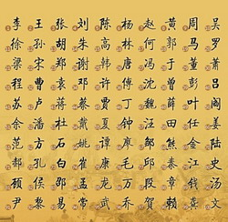
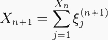
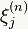
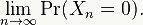
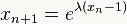
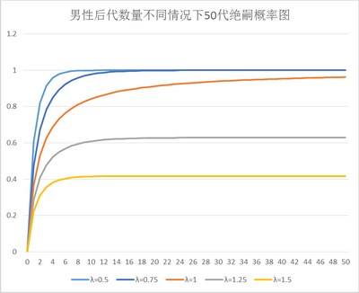

**在中国，问“您贵姓”大概是两个陌生人见面寒暄的必备程序。只是对方的回答恐怕就有些单调了，问出这个问题后，您有接近三分之一的机会听到“我姓李/王/张/刘/陈”。**

  

文/郑子宁

  

最新的姓氏统计，中国前十大姓占了全国人口四成左右，前二十大姓就包括了一半人口，而前100姓占全国人口近85%。大姓人口动辄以千万计。三个最大的姓李王张更是各
自拥有近一亿人口。  

**近期的中国常用姓排名**

  

中国到底有多少个姓，这个问题众说纷纭，由于众多小姓容易漏计，精确的数字很难求得。说法上从3000多的到7000多的都有。以最高的7720个姓来计算，13亿人
口平均下来则每个姓有近17万人。

  

这篇文章谈的不是李王张刘陈等为何成为大姓，而是中国姓氏的分布问题。

  

**【姓氏的集中与分散】**

光看中国可能并不觉得中国姓氏分布有什么奇怪，但跟其他国家对比，中国的姓实在少得可怜。近邻日本人口一亿多，姓氏数量高达十万以上，人口为中国十分之一，姓氏数量比
中国多十倍不止。

  

欧洲国家以比利时为例，根据统计，比利时平均每个姓只有48人。而全国人口有1230万左右。比利时总人口约为中国总人口的1%，但平均每姓人口只有中国姓氏的万分之
三以下。

  

这些国家不但姓氏数量比中国多很多，大姓集中度也显然不如中国。英语系国家最大姓普遍是Smith，但在英国，Smith不过占总人口的1.15%。法国最大的姓Ma
rtin占人口还不足0.5%。

  

主要国家中，姓氏集中度高于中国的有韩国和越南，韩国金、李、朴三大姓比例高达40%，越南40%的人姓阮。但是越南和朝鲜姓氏发展历史特殊，平民姓氏是近代纷纷采取
王姓产生的。和其他国家的可比性比较低。

  

莫非是中国姓氏的产生机理也和其他国家有明显不同吗？

  

姓和氏在先秦时期本是两个不同的概念。氏容易变，姓作为女性共祖标识较为稳定。秦代以后姓氏合一，概念已经和现代的姓氏相差无几，司马迁在《史记》中就有“黄帝者，少
典之子，姓公孙”的记载。当今大多数常用姓氏实际上来自氏。

  

姓的起源非常古，具体来源恐怕已经不能轻易得知。而氏来源主要有祖先名地名身份等等。

  

地名是氏的一大来源，不少现代大姓正是来自古代的地名国名，如赵、周等。另有一部分氏来自于某代祖先的名字，如郑穆公有七个儿子合称七穆，字分别是子良子罕子驷子印子
国子有子丰，他们的后代也就成了良氏罕氏驷氏印氏国氏有氏丰氏。后世七穆就演变为七个姓氏。身份职业时而也能转化为姓氏，如司徒、司马等。

  

那欧洲的情况又如何呢？

  

父名是欧洲姓氏的一大来路，最明显的是法国，大姓Martin、Bernard等均为常用名，他们的后代则以父名作姓。

  

此外地名为姓在欧洲也有，此类姓氏在欧洲贵族中尤其常见，因欧洲贵族早期往往被称为“某地的某某”，以其封地作为身份标志，久而久之这个“某地”就固化成为姓氏了。法
语姓氏中的de某某，荷兰语姓氏中的Van某，德语姓氏中的von某都是此类路子。

  

职业身份作姓也相当普遍，前面提到英语世界第一大姓是Smith，这个姓就是职业名得姓的典型例子，smith作为一般的名词时意为铁匠，该姓人的祖先想来从事过铁匠
工作。又由于中世纪时铁匠的功能相当重要，数量在各职业中较多，因此以铁匠为姓的人多也不足为奇了。

  

不光在英国，德国第二大姓Schmidt，俄罗斯第三大姓Кузнецо́в（库兹涅佐夫）也都和铁匠有关。此外，欧洲还有一些以个人特征绰号作姓的，如英国的Bro
wn（棕），法国的Petitjean（小让）。

  

整体而言，欧洲姓氏产生原理和中国姓氏类似，并没有什么本质区别，最后形成如此大的数量差距恐怕还另有原因。

  

**【历史越长越难传承】**

秦朝以后姓氏合一带来的一个重大变化就是氏失去了能产性。原本氏作为个人的身份标记之一在代与代之间是可以变动的。但与姓融合后，姓氏功能合一，都演变为主要依据父系
进行代际传递的身份信息。这也就通常父亲姓什么子女也就姓什么。

  

这样姓氏产生机制就急剧缩减，后来出现新姓基本上不外乎被赐姓，如武则天赐姓蝮，避祸自行改姓，以及外族采用汉姓，像令狐之类。而一般的中国人则遵守“立不改姓”的规
矩，不会随意更动自己的姓氏。

  

由于姓氏产生机制的衰亡，姓氏数量也就自然而然地开始减少。如果某个男性没有男性后代的话，他也就绝嗣了，很多人实在没有儿子的情况下不惜采取抱养甚至拐卖男婴的方法
给自己续嗣。

  

绝嗣的概率可能比很多人预想得要高得多，那到底绝嗣情况有多普遍呢？

  

姓氏在自然传递中消亡属于随机过程，可用高尔顿—沃森过程加以推导。

高尔顿-沃森过程，Xn为第n代父系男性后代数量，
为这些后代中第j个个体的男性后代数量。则绝嗣概率为：

  

假设一个男性的男性后代数量是参数为λ的泊松分布的话，则绝嗣概率公式可简化为：

  

  

从以上公式可以看出，参数小于1（平均每代男性后代数量不足1），这个男性长期绝嗣的概率是100%，如果参数等于1，除非出现实际上没有可能的每代都严格生一个儿子
的情况，否则仍然会绝嗣。而在大于1（即人口增长）的情况下，这个男性才有不绝嗣的可能性。就算这样，除非生得特别多，否则情况也不乐观：在参数为1.25的情况下，
最终绝嗣率仍然会超过60%。

  

从以上这个非常简单的模型就可以看出，由于绝嗣率相当高，所以男性个体少的小姓很容易绝，而在小姓消亡的同时，活下来的姓就容易发展壮大，成为大姓，一长一消姓氏集中
度就必然提高了。

**在一般男性动辄绝嗣的情况下，少数成功者则因为后代极多化身超级父亲**

  

根据历史研究，中国历史上的姓曾经有过12000个左右，比现代是要丰富多了。正由于起源很早，所以中国姓氏在历史传承损耗也相当严重，到如今姓氏稀少就不稀奇了。

  

起源早不但意味着中间绝嗣的可能性大，也意味着姓氏产生的时候人口较少，更是让姓氏稀少，分布集中的情况雪上加霜。

  

除了历史起源悠久外，中国历史上多次人口急剧减少，然后慢慢恢复的事件对姓氏又有什么影响呢？

  

人口急剧减少后慢慢恢复的过程中，会有些姓要么在人口减少过程中几乎全体灭亡，要么人口数量降低得很厉害，以致后来自然消亡。而顺利生存的姓氏则会在人口恢复的过程中
取而代之，产生奠基者效应，从而改变了姓氏的构成比例，让姓更加集中。

  

一个绝好的旁证是魁北克，魁北克先是由法国殖民，后来因为英国占领整个加拿大，法国移民停止，现今500万的魁北克法裔人群，大多数是当年8500名法国移民通过自然
繁殖产生的后代。因此魁北克姓氏相比法国要集中很多，而且不少大姓在法国本是名不见经传的小姓，第一大姓Tremblay占魁北克人口1.13%，但在法国排名恐怕都
到1000开外去了。

  

反观姓氏多的日本和西欧国家则是另外一种情况。

  

日本姓氏大多数是十九世纪明治维新时期产生的，不但历史短，而且当时日本的人口已经有三千万，所以姓氏一开始就很丰富。其后日本并没有经历人口大幅衰减的过程，所以至
今姓氏仍然很多。

  

西欧姓氏也是相当晚近才产生和固化的，像姓氏特别丰富的比利时，15世纪时候姓氏方才开始萌芽，17世纪时，父子不同姓乃至个人改姓都相当常见，如音乐家亨利•德•提
挨尔（Henri de Their），到了巴黎大概嫌自己姓太土，把自己名字改成了高端大气上档次的亨利•杜•蒙（Henri Du Mont）。

  

真正姓氏固化得到1796年身份登记制度完善才开始。自此之后除了如Montcuq之类特别不堪的姓（和“我的屁股”同音），一般来说姓氏就不允许随便更改了。

  

**【文字与姓的数量】**

历史和概率只是目前中国姓氏稀少的一部分原因，语言上的因素也不可小觑。

  

相对而言，欧洲早期姓氏多是教会和税务官登记时记录的。平民往往自己并不知道自己的姓怎么拼，而教士和税务官文化水平也不见得有多灵光，一个姓在拼写时出现差异的情况
时有发生，如果是偏远地区方言有明显差异的话，姓的记录中出现差池就更加常见。再加上欧洲语言多有屈折，一个词自身就有多种形式，最后局面乱成一锅粥也就可以想见了。
如法语大姓Bernard，就分出了Biernard、Berna、Bernat、Bernau、Bernaus、Bernaut、Bierna、Biernaux、
Bernardus、Bernardi、Bernardy、de Bernard、De Bernardi等五花八门的形式，而英语姓Mainwaring据说有13
0种变体，此种乱象一直延续到印刷开始普及，拼写固定化规范化，国家从教会手中收回了登记权才终止。

  

中国的姓是用汉字书写，而汉字的书写从很早开始就非常规范，并且和实际发音脱节，不管一个姓在不同地方的读音如何，记录在汉字上基本只有一种形式。

  

汉姓方言差别的情况只在东南亚有所反映，一个广州籍的Mr. Wong，一个泉州籍的Mr. Ng，一个漳州籍的Mr. Wee在官方统计中可能算成三个姓，但是只要
他们懂点汉字知道点家谱，则都会明白自己姓黄，倘使有人真把黄写得多了一点或少了一横的话，大概只会被人当成写了错别字，根本传不下来。

  

书写变体分化的情况在中国就更是极少发生了，简化字的到来让事情起了小小的变化，引发萧姓分出肖姓，傅姓分出付姓两例，但也基本仅限于此。

  

就这样，中国的姓氏变得越来越少，如果没有新的大量产生姓氏的机制的话，想来未来遇到李/王/张/刘/陈先生的概率还会越来越高。

  

**版权声明**

****大象公会所有文章均为原创，****  

****版权归大象公会所有。如希望转载，****

****请事前联系我们：****

bd@idaxiang.org

****知识 | 见识 | 见闻****

阅读

__ 举报

[阅读原文](http://mp.weixin.qq.com/s?__biz=MjM5NzQwNjcyMQ==&mid=207881659&idx=1&sn
=c2b1eaf7ff38c744916bd89493be0547&scene=0#rd)

