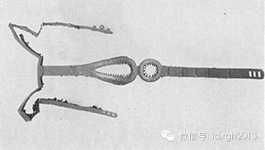
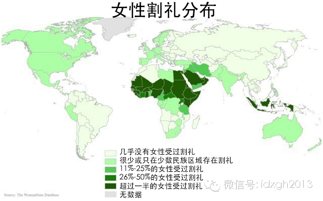

**强奸者在深夜或凌晨偷偷潜入事先选定的处女卧室，趁其熟睡之际迅速完成手指破贞，这在萨摩亚语里被称为“莫托托洛（moetotolo）”，字面意思是“睡觉时爬进来”。**

****

文/辉格

童贞（virginity）崇拜广泛存在于各大文化中，在定居农业社会尤为盛行。时至今日，处女党队伍在某些国家依然庞大，妇产科医生们时而还会遇到男性咨询者请教如
何甄别女友是否为处女，为此有人甚至不惜将女友私处照片上传到健康咨询网站。

  

对童贞的要求曾经是男性觅偶策略（mating strategy）的一部分。历史上，由于人类幼儿特别沉重的养育负担，人类后代抚养模式经历了一个从单亲抚养向双亲
合作抚养的转变过程。在此过程中，男性对家庭与子女的情感与资源投入不断增加，然而在亲代投资上，男性面临一个根本障碍：亲子关系的不确定性——对童贞的强调正是用来
克服这一障碍的方法。

  

新娘的童贞可以让丈夫相信至少头胎孩子是自己的，否则他就需要将新娘闺禁小半年以确认其此前没有怀孕。更重要的是，婚前守贞的历史，是判断妻子今后出轨风险的重要信号
，所以一旦谈判地位（这一地位随男方在家庭中投入资源的比例增加而提高）允许，男性就会对童贞提出要求。

  

不过童贞并不容易识别，它意味着在很长一段时间内没有发生过某种事情，要证明这一点非常困难。传统中国社会的流行做法是，将达到性成熟年龄的女孩置于严密监控的隔离制
度之下：多数时间关在与外界隔绝的闺房里，通过缠足削弱其行动能力，外出须由女眷陪伴，且活动时间与地点皆有严格限制，还有一整套社交规范限制其与成年异性的接触。

  

这么做成本相当高，不仅损失了受控女性的生产力，还要耗费监控者（通常由女性长辈或女佣担任）的大量时间，即便如此，其成效就个案而言也是无从验证的，而只能体现在这
套系统在家族历史上的长期执行效果（即所谓的“家风（familyhonor）”）上。

  

为此而建立的各种昂贵设施和制度，其实是一种信誉抵押品，相当于品牌厂商所投入的巨额广告费，借此告诉买家：如果我闹出丑闻，这些投资就全部泡汤、甚至会成为我的负资
产（一个难以洗刷的坏名声），所以你可以相信：我会尽力避免这种事情发生。

  

这样昂贵的闺禁系统，只有大户人家才负担得起，穷人就只能求助于其他更廉价的措施，比如早点把女儿嫁出去，把闺禁负担转移给夫家，或者用石刑、火刑和沉潭之类的事后严
酷惩罚来威慑女孩守贞（在一些文化中被称为“荣誉处决（honorkilling），除了震慑女性之外，也可宣示家族守贞决心）。而其中最简单粗暴的做法，莫过于流行
于非洲北部和阿拉伯地区的女性割礼，对生殖器的残毁与缝合使得婚前性行为根本不可能发生。

_全球女性割礼分布图_

所有这些措施的重点都在于行为控制，但假如性交会在女性身体上造成某种不可逆的改变，那么童贞便无须依赖对个人历史的了解、可直接由当前状态而得到验证了，就像盖印封
蜡的完整性可以证明信件在封印之后从未被打开过。曾几何时，人们为童贞也找到（或以为找到）了这样的封印——处女膜，尽管它实际上和封蜡一样并不那么可靠。

  

于是，从童贞崇拜衍生出了更专门化的处女膜崇拜。

【强奸者的动机】

然而，童贞崇拜以及围绕它而发展出的整套贞操文化，尽管在降低亲子关系不确定性，从而提高男性对家庭的投资意愿上确实起到了作用，但同时也带来了一个出人意料的后果：
对贞操的极端苛求实际上鼓励了强奸。

  

这种鼓励以两种不同方式发生，首先是强奸受害者经常不敢揭发强奸罪行，因为在贞操文化中失贞（即便是由强奸所导致）被视为非常丢脸的事情，失贞者可能因此而遭受严酷惩
罚，甚至会被荣誉处决，所以假如强奸是发生在隐秘场合，受害者很可能隐忍不发，而许多男性正是利用这一心理才敢大胆施暴。

  

第二种与传统社会处理强奸案的习俗有关。由于失贞使得强奸受害者在婚姻市场上的地位大幅跌落，她与强奸者发生过性关系这一事实，在所有潜在配偶看来都是个难以容忍的污
点——除了强奸者本人。这样，强奸者通过实施强奸为自己取得了垄断地位：受害者除了嫁给他，几乎别无选择（除非她愿意接受最差的条件）。

  

所以在许多传统社会，强奸受害者的家庭，往往会要求强奸者娶受害者，以此了结案件，只有当强奸者拒绝（或不可能）这么做时，受害方才寻求其他惩罚或报复手段。可是这样
一来，就为那些因为贫穷、地位低下、丑陋或身体残疾而没有能力通过常规正当渠道娶到妻子的人提供了一个额外机会：通过强奸获得妻子，这种做法，不妨称之为掠夺性强奸。

  

掠夺性强奸可以视为一种特殊的抢婚，实际上，广泛流行于中亚社会的抢婚，是基于人们对被抢女孩贞操的怀疑而得以流行。所以真正的抢婚行动多半都伴随着强奸，这样即便没
有真的发生强奸，女孩的贞操也不再可信，于是女方家庭被迫接受婚姻。（当然，抢婚习俗在某些地方如今已丧失了掠夺性实质，只剩下一个仪式性的外表了。）

  

童贞崇拜和掠夺性强奸的上述关系，从一个特殊案例中可以看得更清楚；在太平洋西波利尼西亚的萨摩亚社会，童贞崇拜和掠夺性强奸协同发展到了一种极端的形态，人类学家德
里克•弗里曼（DerekFreeman）在《玛格丽特•米德与萨摩亚》（弗里曼此书本意是在反驳玛格丽特•米德在其名著《萨摩亚的成年》中对萨摩亚社会与人格特征的
描绘）一书中对此作了详细介绍。

_萨摩亚女性。_

萨摩亚人极端重视童贞，尤其表现为处女膜崇拜，女孩被兄长们看管的很严；在萨摩亚传统婚礼上，有一项重要仪式：新娘裸体站在众人面前，由新郎（如果新郎是位高级酋长，
就由他的首席议事酋长代劳）当众用右手食指加中指刺破新娘的处女膜，然后骄傲的高举手臂展示带血手指，于是众人才开始赞颂与庆贺。

  

这种情况下，假如经过两次尝试后新郎手指未被染红，则婚礼将被取消，新娘会当即遭受其家人的严厉责罚，在较早年代甚至可能被当众乱棍打死。

  

萨摩亚男人将亲手破贞并沾得处女血视为一项极大荣耀，多次成功破贞（无论是在婚礼上还是通过暴力强迫）的男人将被奉为英雄，尤其是当对象是其他村庄的高地位处女时。吹
嘘曾给某某处女破贞，是男人们私下闲聊的重要主题。

  

同时，萨摩亚社会中发生的强奸与其他社会有着明显不同，强奸的主要对象是处女，而强奸的首要目的是破贞而不是完成常规性交。通常做法是，用拳头猛击女孩胸窝令其暂时丧
失呼叫能力，然后迅速将一根或两根手指插入，刺破处女膜，一旦得手并沾血，常会狂喜大呼，只有在不到一半的案例中，强奸者会继续完成性交。

  

类似的强奸方式也会以一种偷偷摸摸但更有效的方式进行，强奸者在深夜或凌晨偷偷潜入事先选定的处女卧室，趁其熟睡之际迅速完成手指破贞，以此方式发生的强奸案比前一种
更加普遍，它在萨摩亚语里被称为“莫托托洛（moetotolo）”，字面意思是“睡觉时爬进来”。

  

无论是通过哪种方式，强奸行动如果失败（未能完成手指插入），强奸者若被抓住就会遭受严厉惩罚，可一旦成功，和上述其他社会的习俗一样，被强奸女孩的家族通常会答应把
女孩嫁给他，后者只须支付一笔赔偿。所以很明显，对于那些没有能力通过正常渠道娶妻的男性，这是一种获得妻子的可行方法，实际上，这也正是萨摩亚社会强奸作案者的主要
动机。

  

男人控制运用自己的手指，比控制运用自己的生殖器，显然容易得多，因而完成手指破贞的成功机会也比完成常规性交大得多，所以既然这些强奸的首要动机是掠夺配偶而不是满
足性欲，也就不难理解为何强奸者会将手指破贞而不是常规性交作为其行动的核心目标了。

  

童贞乃至处女膜崇拜，最终会孕育出对女性具有如此伤害性的副产品，真是一出文化悲剧。

  

[大象公会所有文章均为原创，版权归大象公会所有。如希望转载，请事前联系我们：bd@idaxiang.org ]

———————————————  

**大象公会订阅号的自定义菜单上线了，左边是官网文章精选，右边是大象公会官方微社区，点击进入来吐槽发帖吧！**

**  
**

  

[阅读原文](http://mp.weixin.qq.com/s?__biz=MjM5NzQwNjcyMQ==&mid=202199483&idx=1&sn
=af4237860a42d8d319ab2b3a9ef277ca&scene=1#rd)

