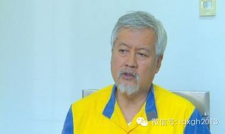
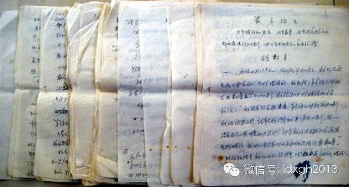

**与中国式检讨最近的，是斯大林时代的苏联，那时已可以清晰地看到检讨书的雏形。而毛泽东后来则发明了重在攻心而避免肉体伤害、以“批评与自我批评”为主要组织形式的检讨活动。**

文/潘游

一个1980年代以前出生的中国人，活到成年多半都有过作检讨的经历，或书面检讨或口头检讨，它差不多是中国人最早掌握和熟悉的实用公文——小学生时代可能不需要写作
任何公文，但检讨却是唯一的例外。一个人不但会在学校、单位会作检讨，甚至家庭也会。对特定年龄的人来说，从没写过检讨应该是情商超高，适合当青年干部的证明。

  

“检讨”一词在汉语中的古意为核对、整理，并引申为一种负责文书校注与法规编修的官职名称。很多古汉语词汇为明治时期的日本人所用，在翻译对应西来的近代观念时，就发
生了意义变化。检讨亦不例外，其在“和制汉语”中焕发了新生，转变为总结研讨的含义。附着了新含义的“检讨”一词，随着学成归国闹革命的留学生回归汉语。

  

不过，“检讨”一词由略含反省之意变成今天包含认错、自我批评、表态多个复杂环节的一种特定程序和格式，却非自然演进的结果，而是突变，转折点在延安。从那时起，“检
讨”就成为几代中国人的集体记忆。

  

检讨的功能是承认权威，表示服从，并因此获得从轻发落。它是在下级对上级具有高度依附性的社会，对上级的服从可获宽大处理的典型特征。从“坦白从宽，抗拒从严”、“认
罪态度较好”等司法用语中，我们能能清晰看到同样的观念痕迹。

【检讨的内容与技术】

检讨是有技术标准的——无论是文本格式还是基本内容组成。这点并非所有做检讨的人都真正能领会把握。

  

从内容构成上，合格的检讨必须有三项基本要素：

1、表态认错；2、分析错误原因；3、表明改错决心和目标。

  

表态认错：这部分的功能是承认权威，表示服从。这部分失败或不足，就意味着检讨的失败。

  

表态认错应积极，不扭捏遮掩，这是赢得认可的第一步。不同时期，所用语言各有不同，政治氛围浓郁的时代，要大量、积极地引用当时最流行的政治口号，正确引用口号，表明
检讨者能紧跟形势，且是认错程度好的重要指标。

  

分析错误原因：一般要分客观原因、主观原因。客观原因要讲足，它是一种有技术、有技巧的自我辩护，但绝不可让检讨审读者认为有推卸责任的嫌疑；主观原因其实也是自我辩
护的机会，一般来说，讲述自己对规章、纪律、上级意图领悟力和理解力不足，或自我意志和要求不足，这可表白自己并不存在某种主观故意。

  

但是，当检讨不会因为服软、认错而被从轻发落，而是导致身败名裂，就不可能按照自己的意愿去为自己辩护，而是必须按检讨审读者的意志为自己罗织罪名，这时检讨就会变成
痛苦的羞辱。

  

遇到这种情形，权高位重者自然难于接受，而拒绝检讨多半意味着对抗，等于彻底断绝任何被宽恕的可能，为逃避这种痛苦有人会选择极端举动，比如高岗以“自杀自绝于党和人
民”拒绝检讨，林彪以北逃拒绝检讨。

  

表明改错决心和目标：它通常会包含三个要素：1、表明自己改正的决心和态度；2、对审读者承诺日后的表现；3、再次承认错误并感谢从轻发落。

  

今天中国人最熟悉的检讨，无疑是薛蛮子的公开忏悔。薛蛮子虽为美国公民，但几十年红旗下的生活经历，并未让他忘掉什么是检讨——薛蛮子以涉嫌嫖娼和聚众淫乱被抓，但他
的数度检讨，重点都准确落在网络大V造谣上，当然，从官方报道看，他从拒绝配合到切换到标准检讨状态，还是花了一些时间，想必经过一番思想斗争。

_薛蛮子在央视做检讨。_

从表态认错上看，薛蛮子的检讨语言运用非常熟练：“我造成了社会、国家和人民的损失，不仅没有尽到一个大V的责任，甚至没有尽到一个公民的责任。为此我受到了法律的惩
罚，这是我咎由自取”。

  

薛蛮子在分析自己造谣的原因时也颇合乎要求，不但剖白自己作为网络大V的非正常心态，还正确认识到“成熟的网络一定需要法律的规范。网络虽然是虚拟的，但也需要秩序”
。

  

在表明改错决心和目标上，薛蛮子也毫不含糊，除了“有朝一日再回到网络环境，我一定要在转发信息时做好核实”外，还承诺“将来如果有机会，会多做一些公益事业，向社会
传递些正能量，也为净化网络环境做一些贡献，以此来弥补当初犯下的错误”。

  

相对而言，与薛蛮子同一批在媒体公开忏悔或认错的网络人物，检讨多少显得不够完备，某种程度上，这种检讨水平的落差应该是时代的产物——比薛蛮子年轻的人，受到的检讨
文化教育和熏陶，已大不如前了。

【治病救人的改造之道】

检讨是中国政治文化中的重要组成部分，考察国际共产主义运动史，我们会发现“写检讨”几乎是中国独有现象。有研究者因此认为，检讨现象带有浓厚的中国内圣之学的痕迹，
干部坦白交代和自我剖析与宋明新儒家的“格物致知”，寻求“天人合一”的路向几乎异曲同工。

  

然而，将检讨追溯到皇帝“罪己诏”的说法难以自洽：罪己诏来自最高权力者，发布后并不要求满朝文武效法，而自我批评则有明显的权力秩序，在校园内学生向老师检讨、在政
权内，下级向上级检讨，且有强制作为保障。

  

与中国式检讨最近的，还是斯大林时代的苏联。在1936年-
1938年的大清洗期间，众多被处决的高官在公开审判中的陈述和审判前致斯大林的信件中，可以清晰地看到检讨书的雏形。

  

布哈林在审判前曾给斯大林写信表忠心：“当和你在一起时，我总有种特殊的感觉……我甚至曾有机会触摸你。我开始对你产生了像对伊里奇那样的感情——像亲人一样的亲近感
、无限热爱和信任感。对你可以说出一切，写出一切，抱怨一切……”在审判时，布哈林说：“我向国家、向党、向全体人民下跪。”

  

其他人的表现和布哈林一样，公审时，他们几乎都把自己描述成不杀不足以平民愤的魔鬼，一致要求枪毙自己，都用最美好的词汇赞美斯大林同志。比如加米涅夫说：“不管对我
作出什么样的判决，我都认为判决是公正的。你们不要向后看，要勇往直前，和人民一起跟着斯大林走。”而格林科的态度更积极：“我敢说，我因我们恶毒的阴谋被揭露而感到
高兴”。

  

当时被邀请参加公审的西方记者对他们所见的一切目瞪口呆，所以他们大都认为审判是公正的，有位英国律师事后说：“我们又一次坚定地认识到控告是正确的、承认是正确的，
判决是公正的。”

  

虽然“大清洗”在当时莫斯科之外的各党最多只是以存在“肃反扩大化”的方式被提及，但避免出现类似残酷悲剧，至少在延安应当是秘而不宣的共识。所以，检讨兴起的延安整
风期间，被反复提及的口号是“治病救人”，它明显有一种与残酷的肉体清除做区别的意味。

  

1942年春，毛泽东亲自选编了干部必读的若干文件，要求干部们对照文件，联系个人情况，写整风笔记。最核心的则是在组织层面于各级党委设置了学习委员会，并专门检查
个人笔记写作情况；在整风运动的后续发展中，要求党员干部、知识分子和那些来延安的知识青年写自传，向党交心，交代自己“所做的一切对不起党的事情”。

  

无论是相对长征前各苏区惨烈的肃反还是斯大林的大清洗，毛泽东发明的这套重在攻心、避免肉体伤害、以“批评与自我批评”为主要组织形式的检讨活动。这种全新的组织清洗
改造模式，某种程度上确实可以被称为治病救人的改造之道。

  

综观国际共运史，延安之后的中国，是党内组织整合过程当中，肉体消灭现象最少的一个——甚至可以称得上并无肉体消灭现象。因此，检讨虽然会被认为是检讨者的一种自我矮
化和自辱，但不得不说，或许正是检讨的发明，才是产生这独特一现象的最重要因素。

【不断发扬的文脉】

1949年后，“批评与自我批评”的艺术，窑洞走向全国，它最先被知识分子们掌握。从1951年12月开始，《人民日报》在重要版面开设名为《用批评和自我批评的方法
开展思想改造运动》的专栏，连续推出知识界知名人士的检讨文章。

  

检讨书在体例上千篇一律，文章呈现三段式的结构：承认错误并全盘否定——挖掘“旧我”的根源——宣誓决裂，重新做人。但是在文化人手中，也能写出“异彩纷呈”的样子。

  

有深入根源的一类，譬如：金岳霖《分析我解放以前的思想》；梁思成写的《我为谁服务了二十余年》；有谈学习心得体会的，比如朱光潜《最近学习中几点检讨》、沈从文《我
的学习》；更有立誓性质的，比如郭沫若《在毛泽东旗帜下长远做一名文化尖兵》、茅盾的《认真改造思想，坚决面向工农兵》、蔡楚生《改造思想，为贯彻毛主席文艺路线而斗
争》等等。

_一份长达29页纸的检讨书草稿_

一次成功的检讨往往建立在对掌权者心思的洞察之上，检讨过关等价于老大满意；如若不然，就会备受煎熬。社会学家潘光旦历时十个月做了八次检讨，依旧没有过关。在思想改
造运动基本结束时，才写了一篇三万字的检讨涉险过关。

  

为了能让掌权者满意，丢掉知识分子的架子和被赋予的“原罪”，语言上向党靠拢亦是努力的方向。毕竟运动中最重要的一个提法已经是“脱裤子割尾巴”了。钱锺书的父亲，著
名古文学家钱基博，在检讨一开始就用大俗的词汇，表明自己“家学渊源”“腹有诗书气自华”等等都是可以放弃掉的：

  

“思想改造，当得自动，不能被动；不过人类通病，自屎不觉臭，旁观者清；所以发动群众，帮助自己改造。”不过发表在1952年夏华中大学思想改造运动中的这篇检讨，只
是书面发言。钱老先生的颜面之光，因他的江南口音得以有所保留。

  

相比之下，14年后邓小平的检讨才真正是文字上臻于化境的典范。

  

“在这场伟大的史无前例的文化大革命运动中……始终贯彻着两个阶级和两条路线的尖锐斗争，即以毛主席为代表的无产阶级正确路线和代表资产阶级的反动的错误路线的斗争…
…代表资产阶级反动错误路线的……就是少奇同志和我两人。”——认清形势，承认错误

  

“我这次犯这样严重的路线错误，当然不是偶然的……在思想方面，最根本的一条是，长期以来，不但没有高举，简直可以说没有举起毛泽东思想的伟大红旗。按理说，我的工作
岗位是接近毛主席的，可以经常地道毛主席的教诲和指示，但我却对毛泽东思想学得最差，宣传最少，用得也最不活”——深挖错误根源

  

“林彪同志是我们学习的典范，正是他高举毛泽东思想红旗，正是他把毛泽东思想举得最高……对重大问题及时向主席请示报告，既最了解主席的思想和意图，也最了解群众和下
面的情况，所以他的思想水平和领导水平很高……对于我这样犯错误的人，应该老老实实地象林彪同志学习”——树立榜样，说明改正的目标

  

“我的上述检讨，当然只是初步的，不深刻的，希望得到同志们的批评和指正”——表明自己的虔诚和忏悔

值得提起的是，邓小平的检讨从头到尾没有精神上的自辱，并且巧妙地传达了这样一层含义：承认主席的绝对权威，错误是因为没有及时了解主席的思想意图，因而理解不够。

  

在一个段落中，邓小平三次强调自己的问题是没有跟上，比如“由于学习不力，没有跟好主席思想，犯了不少错误”等。在那个时代，其克制而有节是极为罕见的。

  

邓小平掌权后，中国检讨文化最浓厚的时代被他轻轻翻了过去——强调以法律和规章制度作为是非标准，而非以家长制下长官的个人好恶随意调整奖罚的时代，检讨逐渐丧失了其
赖以生存的制度土壤。

  

所以，作为一种已经深植于几代中国人血液中的文化，一种曾有过灿烂华章的文脉，检讨逐渐开始淡出中国人的日常生活。

  

幸而有“清理网络大V”和“党的群众路线教育实践活动”横空出世，改革开放后成长起来的一代人，也能透过官方媒体，感受到“洗洗澡、治治病、红红脸、出出汗”的严肃活
泼。而薛蛮子老师嬉皮笑脸的表情，和阴阳顿挫的语调，则是检讨书文化在新时代别开生面的一页。

  

[大象公会所有文章均为原创，版权归大象公会所有。如希望转载，请事前联系我们：bd@idaxiang.org ]

———————————————  

**大象公会订阅号的自定义菜单上线了，左边是官网文章精选，右边是大象公会官方微社区，点击进入来吐槽发帖吧！**

**  
**

  

[阅读原文](http://mp.weixin.qq.com/s?__biz=MjM5NzQwNjcyMQ==&mid=202384983&idx=1&sn
=8934bd3cae08de6a21ee56ad87d5940f&scene=1#rd)

