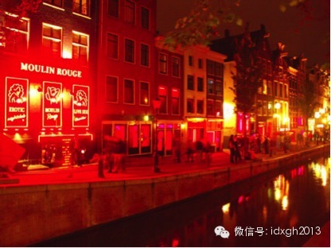
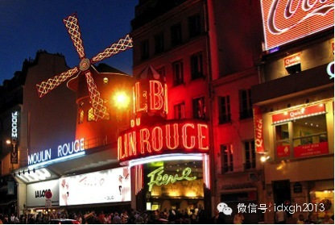
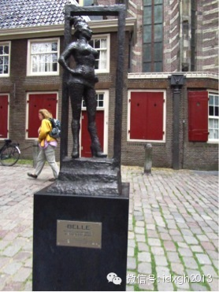
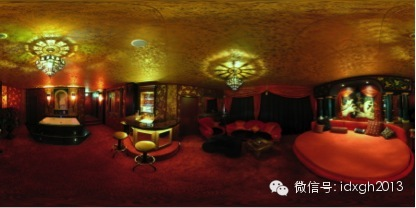
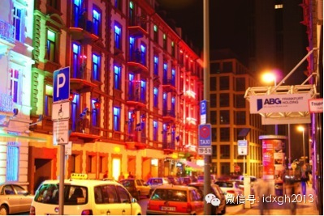
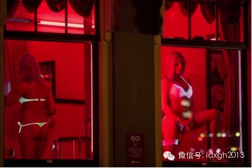

**欧洲不同国家对待性服务业差异很大，有全面合法化的荷兰、德国；也有扫黄时抓嫖不抓娼的瑞典。但相同的是在法律地位上，性工作者享有与任何职业平等的权利和地位。全面合法化的荷兰与德国，因为行政管制成本低，甚至价格比中国还要便宜。**  

  

文/Kamaz

  

世界最早的广告雕刻在一块白色的大理石板上。这块公元前雕刻的石板位于土耳其爱琴海边古城埃菲斯，它是一个被铺在路面上的指路牌。其上刻有一个左脚脚印、一个女人头像
、一颗心以及一个十字。广告指向的目的地今天还在，那家古老的妓院废墟就在附近。

  

                            

今天，人类最古老行业的广告方式，恐怕是各行业中最多样的，手段无所不用其极，还会适应不同的法律法规环境和顾客的区别。由于有钱的中国人大量走出国门，一个极具讽刺
性的说法在中国广泛流传：欧洲红灯区的性工作者看到东亚面孔的游客路过，会热情地用“FaPiao（发票）”来招徕顾客。

  

此说因符合公款消费人群的行为特征，背后其实承载着今日中国社会的复杂民情。但确有其事吗？

  

【关于“性”的路线斗争】

  

因为各国法律的差异，城市规模、区位等原因，欧洲形成了以阿姆斯特丹、法兰克福、汉堡和巴黎为代表的性产业中心。夜总会和性工作者集中租用的民房都集中于老城区，与酒
吧、舞厅、电子游戏机厅杂处，构成了夜生活的中心。

  

不过，欧洲性产业的真正历史远没有中国源远流长。工业革命前，因为宗教观念保守和城市规模较小的原因，除港口城市和极少数像巴黎这样的特殊城市外，欧洲大部分城市不存
在成型的性产业。

  

工业革命将大批人口召唤进城市，性产业才开始在欧洲发展起来，于是有了红灯区这个名字。其得名的说法之一，是铁路工人晚上买春时，会把红色信号灯挂在性工作者的门外，
提醒工友及同好，此处请勿打扰。

  

二战后，由于福利国家的形成和人权观念的影响，欧洲对性产业的管理趋紧。不过，管制对象严格限于组织经营者和买春者，对性工作者一直保持非罪化。比如欧洲法院曾裁定，
卖淫是合法的自由职业，应受到欧盟条约的保护。

  

不过在世纪之交，也出现了两股完全不同的趋势。

  

一个以荷兰为代表的模式主张完全放开。2000年，荷兰成为欧洲第一个对性产业完全开绿灯的国家，德国在2002年紧随其后。这才是真正意义上的卖淫合法化。历史上就
曾因往来水手强劲的消费能力而以性产业闻名的阿姆斯特丹，彻底奠定了欧洲“性都”之名。

  

_欧洲版的夜泊秦淮_

  

另一个是瑞典为代表的严厉打击买春者的模式。瑞典于1999年通过了《禁止买卖性服务法》，它不惩罚性工作者，但对买春者予以重罚。受瑞典影响，法国或将于2014年
实施同样的政策。

  

其实，历史上真正的性都一直是巴黎，但战后法国立法终止妓院经营，禁止拉皮条，让性产业规模化程度最高的巴黎，逐渐变成散户经营，昔日地位不复。不过，有红磨坊等品牌
的存在，依然无损其情色之都的地位。

  

_位于巴黎皮加勒红灯区的红磨坊_

  

荷兰德国的“实用主义”管理模式，优点首先在于性工作者的安全、健康和权益能获得更大保障，从业人员必须上岗登记，登记制便于官方定期体检、打击人口买卖等犯罪活动。
目前荷兰注册登记的性工作者约3万人，德国则高达40万人，大部分为东欧、南欧人和土耳其人。

  

另一方面，开绿灯后，性服务业能给当地增加更多的税源，性工作者也能因此名正言顺地享有参与国家保险计划的权利。

  

为了给性工作者正名，2007年荷兰阿姆斯特丹著名的红灯区德瓦伦的一座教堂门前，专门为性工作者立了一座塑像，基座上铭有一行字：尊重全世界的性工作者。

  

  

不过，显然有人高估了性服务业的正名速度。因为人手不足，2009年德国两家休闲会所竟然向当地劳工署申请招聘性工作者。甚至德国某市劳工署向一位申请工作的19岁姑
娘发函，认为她的外貌足堪胜任一家会所的“前台工作”。按照法律，如果拒绝劳工署介绍的工作，将会削减其失业救济金——这些事例被保守人士视为“激进合法化”的不良后
果。

  

性从业者也不认为自己已被视为值得尊重的劳动者。原本预计会有大批性工作者踊跃参加国家保险计划，但这种情形并未出现，事实是几乎没有人参加，因为这意味着哪怕找医生
看个小病也要暴露自己的职业。

  

不过，在女权主义或其他人权组织质疑“性”路线时，最有力的反对声，恰恰来自性工作者，她们认为合法化在整体上改善了她们的处境。

  

【Freier们的天堂】  

  

荷兰、德国的性产业政策，除了务实考虑外，也许与其文化中对性交易行为的态度有关。德语中，买春者被称为“Freier”，在历史上也有乞婚求婚之意，其褒贬强度与汉
语中的“嫖客”有相当差距。

  

无论如何，德国、荷兰今天是Freier的天堂。不但吸引了稍有不慎就遭重罚的欧洲邻国消费者，甚至吸引了大洋彼岸的美国人——美国对性产业整体上采取严格管制态度。
据统计，德国每天的性交易人次约为120万。所谓“性都”阿姆斯特丹早已被超越。

  

除了爱尔兰、阿尔巴尼亚等少数国家，欧洲各个地方都能见到个体性工作者和脱衣舞、钢管舞表演场所，但大规模经营的性服务场所，主要是在荷兰、德国这种国家，尤其以德国
为最，它们多以俱乐部或会所命名，有些因规模巨大还形成了连锁品牌。不过大型会所多不建在红灯区。

  

_柏林阿蒂米斯俱乐部内部_

  

因为没有行政管制造成高昂的额外成本，德国、荷兰的性服务价格甚至低于中国。在阿姆斯特丹的个体经营的性服务，20分钟收费50欧元，汉堡则为40欧元，在法兰克福甚
至可以低到30欧元，超时加收10欧元。如果性工作者是本地人，可能会多收20欧元。

  

个体经营的性工作者的工作场所，多是在整栋出租的老式居民内租单间——按法律规定不得小于5平米，必须有独立的卫生间。每日租金和税金约在150欧元上下，剩余部分即
其个人所得。由于收入和保障较为稳定，她们可自由支配的时间较多。

  

_这栋位于法兰克福的居民楼被租给了性工作者_

  

大型会所价格要高得多，首先要购买最多可达80欧元的门票，好在通常它可以管一天。为吸引身体好和自以为身体好的客户，有些会所提供了不限次数的套票服务。

  

由于同样奉行低价策略，提供性服务的俱乐部和会所，其消费人数也往往多得惊人。根据对中德两国近似场所的“蹲点”观察，德国高端会所在单位时间、单位经营面积能接待的
客流量，较中国高出一个数量级。

  

而经营脱衣舞或钢管舞表演的“软色情”场所，其收入是靠动员客人为舞者购买酒水饮料，故其收费同样低于中国。这些行业多系外籍移民养家糊口的小本经营，故在硬件条件方
面，无法与“高大上”的中国同类场所相比。

  

【发票在哪里】

  

欧洲著名红灯区内的中国人身影确实在急剧增多，但中国旅游者的习惯和往往随团的出游模式，决定了他们更偏好奢侈品消费而非大胆的性消费。大多数国人看到了传说中的红灯
区和橱窗女郎，满足好奇心后便打住。

  

_橱窗女郎。为招徕客人，有的性工作者身着荧光内衣_

  

在红灯区最容易看到是标识醒目的脱衣舞表演，但这类店铺的客人通常很少，进去后通常会成为众人注意焦点。中国游客如果同伴较少，即使平时对着镜头滔滔不绝的官员，在美
女凑上来“谈心”时，多半也会浑身僵硬，少有人能坚持到与语言不通的美女到单间继续谈笑风生。这差不多是东亚人的共同表现。

  

对购买性服务时习惯回避旁人的中国人来说，不在意大街上行人目光，直接踏进街道旁个体性工作者聚集的居民楼，更是一种心理挑战——由于空间狭小，每上一层楼都会与多人
对视，如果没有客人，每个房间门口都会站着一位性工作者，一切都非常的直截了当。

  

而楼道里还不断有Freier经过。这些人往往是身强力壮的城市中下阶层青年，而且外籍移民的比例也很高。对典型的中国公款消费人群来说，面对这些需要侧身避让的体型
巨大的欧美同好，也是一种心理压力。精神上的紧张会让他们无法发挥正常水平，简陋的环境会败坏他们的性趣。

  

很难想象以七秒著名的雷振富同志，在众目睽睽下跟着高大丰满的异邦女郎走进单间的情形。即使是正当大好年华的爱国青年，鼓足的性致，也容易被内心复杂纠结的联想挫败。
倒是性消费习惯相对放肆、甚至直接冲着异域性体验而来的日本人，会直接组团去大型会所，而不会把时间浪费在红灯区。

  

在这里营业的女郎，身上根本没有发票，因为她们极少遇到中国消费者，根本不知道中国人有索要发票的爱好。所以，当街站立的性感女郎说出“FaPiao”的故事仅是一个
传说。

  

此说并非空穴来风。

  

“哪个西方国家没有去过”的地方官员，几乎都由国内旅行社组团或有专门的安排接待。参观红灯区，加深对西方社会腐朽落后一面的感性认识，自然是行程表外必有的安排。如
果团内职务最高者没有就此行程表态或干脆拒绝，那么躁动的跟团成员，会因前往相关场所必须回避同胞而格外痛苦。

  

去较高档的会所看色情表演，也会因不符合国情的小费导致一笔额外费用，而因沟通不畅，往往会给出数百欧元，表演者还未进展到实质阶段。使整个消遣娱乐违背了“和平与发
展”的主流。

  

故一般而言，有丰富资源的旅行社，会使用简单的财务技巧，通过地方中资企业或中国餐馆之类的方式弄到收据，为会所消费买单。而红灯区附近的酒店也是个体性工作者的工作
地，主场作战会让中国客人不再紧张。性工作者会体贴地把相关费用列入酒店收据——只不过她们不是专为中国客人准备，而是为所有商旅人士准备的。

  

公款支付会有一种格外的崇高感：几分钟内就为国家扬了眉吐了气。

  

[大象公会所有文章均为原创，版权归大象公会所有。如希望转载，请事前联系我们：idaxiang@idaxiang.org ]

  

[阅读原文](http://mp.weixin.qq.com/s?__biz=MjM5NzQwNjcyMQ==&mid=200170031&idx=1&sn
=970701501cc3f3e40ea47dc3fb054ccf&scene=1#rd)

