**《齐步走，以国家的名义》一文曾详细介绍了德、俄、中、朝等国阅兵式的演进和技术特征。这次专文介绍英、美、法、印等国的阅兵式，以飨读者。**

**  
**

文/阎滨

  

有些细心的读者或许会注意到，包括朝鲜在内的外军，阅兵时，每个徒步方队都会有一面极尽装饰的部队旗，并且走在方队前列的军官（通常为三人）年长且军衔较高，这与中国
阅兵时的情形截然不同。

  

参与阅兵的部队多是有辉煌历史的作战部队，而非特意选出来练习走正步的仪仗兵，这是外军阅兵时与中国很大的不同。

  

西方国家受阅部队多半是有辉煌历史的单位，每个方队有自己的部队旗，并由该部队的前任长官率队，是为展示受阅部队各自的历史和荣誉。由于其战绩动辄可以追溯到一两百年
前，所以经常会出现奇形怪状的军旗。

  

现代意义的军旗在古罗马军团时代就正式出现了。罗马军队早期军旗比较简单，方布上绘制各自动物图腾，与世界其他民族的战旗类似。布匿战争时代，罗马军团开始使用鹰形旗
，以后还标以番号，与不同的军团、大队、中队直接挂钩。罗马帝国崩溃后，军旗与罗马军团一道销声匿迹，直到近代国家化常备军的出现才再次复活。

  

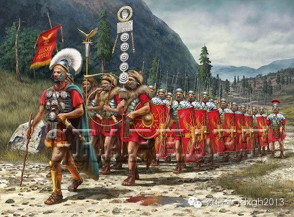

_古罗马军团的旗帜。_

  

受阅部队展示历史的极致，就是受阅部队不但会出现早已被淘汰的骑兵，而且会身着数百年前该部队最辉煌历史时的装扮出场。譬如身着猩红色军礼服、头戴高顶熊皮帽的英国王
室禁卫骑兵团，其装扮是滑铁卢战役击败拿破仑的老禁卫军的。而2005年俄罗斯为纪念卫国战争胜利，受阅官兵穿的事二战时苏军土黄色军服。  

  

历史情结深厚的英国人，不但阅兵时的装扮特别古老，其队列亦是如此，今天各国阅兵都是直线列队行进，只有英国人依然保留线条战术时代的特色，在阅兵时有较为复杂的变换
队形内容，可一窥18世纪遗风。

  

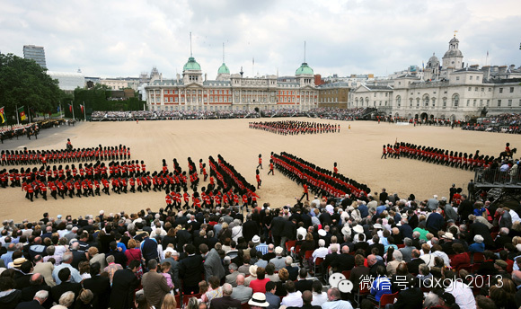

_英国军旗礼阅兵中的队形变换。_

  

西方军队在列队检阅时，指挥官下达“奏乐”口令后，军乐队要演奏一支包含三个声部的乐章，即所谓“三次欢呼”，军乐队一边演奏，一边在受阅部队前走一个来回，然后回到
原位置再演奏一遍“三次欢呼”。该传统据说起源于十字军东征时代，当时被选拔的军人要从队列中出列，单独站成一队，由军乐队在其队列前来回行进演奏以示致敬。

  

除了仪仗队，现代西方国家已不太讲求阅兵时走得特别整齐，甚至因为不同部队有自己的历史传统，有些国家的阅兵会有不同的步速和步伐，比如法国外籍军团在阅兵式上会按照
传统走每分钟88步的步伐，显得卓尔不群。

  

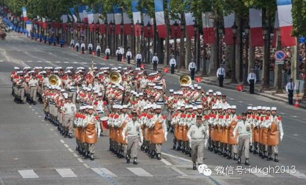

_法国国庆阅兵中的外籍军团。_

  

仪仗队是近代西方军事科学发展的产物。但外军仪仗队与中国仪仗队有很大不同。

  

如活跃于白宫草坪、阿灵顿国家公墓的国家仪仗队——美国陆军第三步兵团，该团隶属华盛顿军区，成立于1784年，参加过从1812年战争到伊拉克、阿富汗战争的历次军
事行动。该团招募士兵时，在体型、相貌上有特别要求。但步三团并非可逃避打仗的去处，除担任仪仗队任务外，日常作战训练科目他们一样不少，战时还得和普通部队一样，被
轮换派驻海外参战。

  

中国人民解放军三军仪仗队，无疑是全世界选拔标准最严格、队列训练最苛刻、仪仗水平最高的仪仗队之一。但就像举国体制搞奥运会，与西方国家参加奥运会的情形大不相同一
样，中国的仪仗队也很有中国特色。

  

解放军三军仪仗队是与武警的国旗班，国宾护卫队等并列的窗口部队之一。三军仪仗队虽名为三军，实际隶属陆军，每名仪仗兵有陆海空三套衣服，视任务需要选择不同着装。

  

解放军普通部队新兵训练为三个月，科目较均衡，仪仗队新兵训练长达五个月，且以队列训练为主。新兵下部队后，只训练仪仗队列，军官由本部队士兵考军校或提干产生，事实
上自成一体。它与美英同行只是业余训练，随时准备参与作战任务完全不同，

  

【英国：威慑与怀旧】

  

英国没有国庆日，招牌阅兵就是英王官方生日，别名“军旗礼”，源于17世纪查理二世统治时代，1748年变成为英王庆生的仪式。从1820年开始成为每年例行盛事。除
1955年因铁路工人罢工而取消外，伊丽莎白二世女王每年都参加军旗礼阅兵。

  

从1969年到1986年，女王都是骑一匹由加拿大皇家骑警进贡的名为“缅甸”的母马。因为年事渐高，自1987年起女王改为乘坐马车检阅。

  

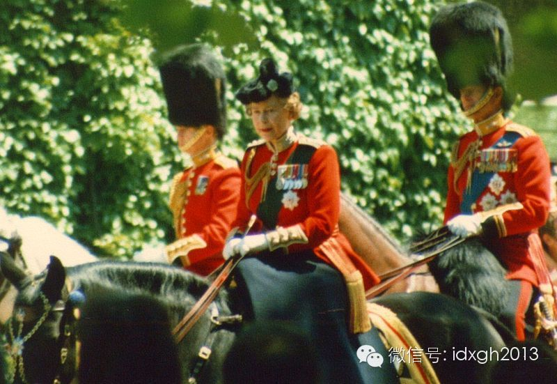

_1986年军旗礼阅兵，女王最后一次骑马检阅部队。_

  

每年军旗礼上，英国王室禁卫军步兵6个连队、两个王室禁卫骑兵团在圣詹姆斯公园接受英王检阅。身披重甲的重骑兵和拖着布尔战争时代轻型火炮的皇家骑炮兵，在军乐队不时
变换的进行曲伴奏下，表演复杂的纵队、横队队形变换和整队原地转向等18世纪遗风的分列式。

  

军旗礼上，参阅人数不多，全来自禁卫军，是英军的精华。他们并非表演性质的仪仗兵，而是货真价实的战斗部队。英国的禁卫军和普通部队一样，要定期轮换派赴海外执行作战
任务，回国则担负白金汉宫警卫仪仗，因此号称“双面人”（Double Face）。

  

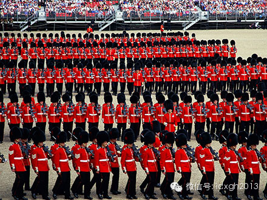

_禁卫军步兵团。_

  

每年受阅前，部队会抽出四周时间，在各自军营强化训练，因此，阅兵活动不但不扰民，甚至基本不影响正常训练。英军并无仪仗专用枪，受阅步兵部队所携枪械就是其日常使用
的武器。骑兵和骑炮兵虽早换成坦克和自行火炮，但仍延续百年前的传统，骑着战马或驾驭马拉的木轮轻型火炮受阅。

  

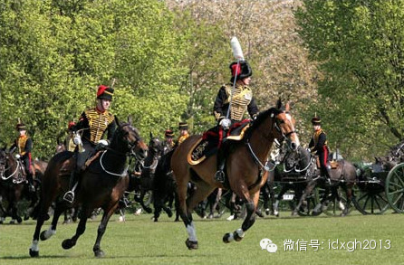

_皇家骑炮兵。_

  

殖民帝国时代，英国会在各殖民地定时阅兵。巴巴拉•塔奇曼在《史迪威与美国在华经验》一书中讽刺英国殖民统治的真谛在于“威慑”：“英帝国在远东统治的本质是通过威慑
显示力量，派炮艇四处游弋，士兵在街道上操练，做漂亮的操枪动作，身穿猩红色紧身军服的士兵在阅兵场举行阅兵等等。”

  

最有英国特色是阅兵其实是海上阅舰式。阅舰式距今已有600年历史，传统上主要在英格兰南部军港朴茨茅斯和怀特岛之间的斯皮德黑德海域举行，这里常年风平浪静，适合海
上检阅，也适合沿岸民众观礼。

  

第一次皇家阅舰式是1773年，乔治三世在斯皮德黑德检阅海军。1814年欧洲列强联合打败拿破仑，英国为庆祝签订巴黎和约举行第二次皇家阅舰式，这是最后一次全部由
风帆战舰参加的海上阅兵。维多利亚时代是英帝国全盛时期，维多利亚女王在位60多年，先后搞了17次海上检阅。

  

1914年的阅舰式在英国对德宣战前两周举行，各国海军有60艘战列舰参加，很多都参加了两年后的日德兰海战，这是历史上战列舰这种钢铁巨兽参加最多的一次阅舰式。1
937年乔治六世加冕阅舰式上，来自18个国家多达160艘各型舰艇中，仅航空母舰就有5艘，这也是二战前各国海军最大、也是最后一次阅舰式。

  

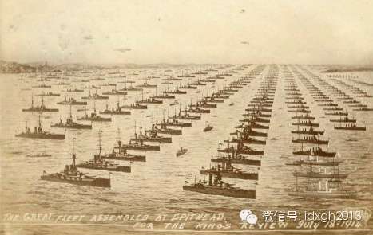

_1914年阅舰式参阅战列舰最多的一次。_

  

战后至今的60多年里，因为经济窘迫，英国仅举行了8次阅舰式，且已盛况不再。2005年为纪念特拉法加海战200周年二举行的国际阅舰式是罕见的大型阅舰式，来自3
5个国家的160余艘舰艇参加。

  

【法国：理性与包容】

  

自从1880年以来，除了两次世界大战等少数年份，法国每年都要在巴黎举行阅兵式庆祝7月14日国庆。

  

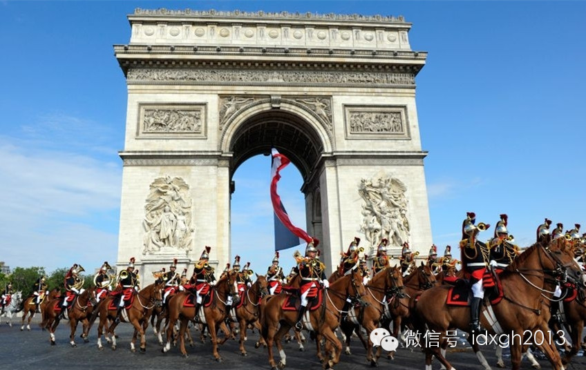

_法国阅兵。_

  

法国认为国庆阅兵是军队与人民直接接触的最佳日子，人民可通过阅兵了解军队。包括各军兵种、外籍军团在内的受阅部队规模保持在5000人上下、200匹战马。与一些对
阅兵精益求精、力求万无一失的国家不同，法国尽管年年阅兵，但受阅部队一般提前两周才开始为阅兵做准备，练习队列。

  

受阅时走在法军各部队最前面的队伍，是头戴拿破仑式三角帽、身着双排扣大礼服的巴黎综合理工学院的学生，而世界最负盛名的军校之一、法国圣西尔军校的学员队列则位居其
次。巴黎综合理工学院创建于拿破仑时代，最初为军校、至今还隶属法国国防部。拿破仑亲自为学校立了校训：“为了祖国、科学和荣誉。”。可见法国人对科学的尊崇。

  

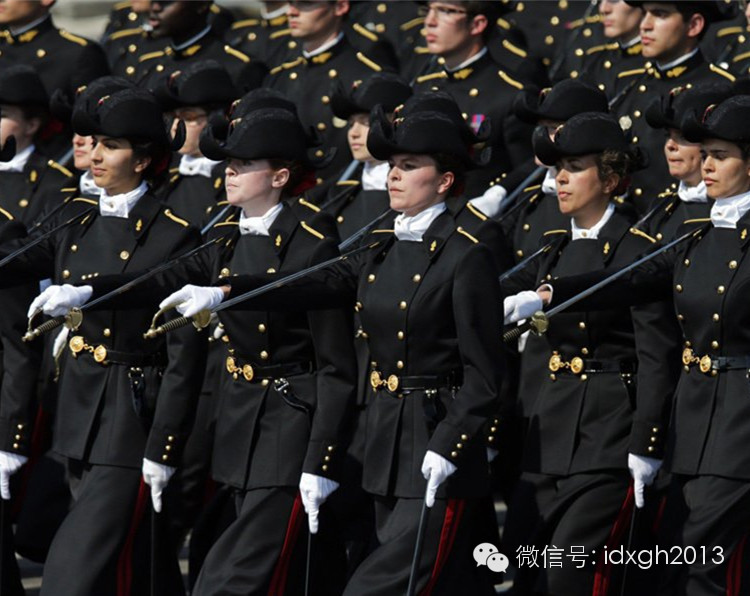

_法国阅兵中的巴黎综合理工学院学生队列。_

  

法国国庆阅兵式上，最吸引人的既不是各式坦克大炮重型装备，也不是富有传奇色彩的外籍军团，更不是身着拿破仑时代军服、担任总统护卫仪仗任务的胸甲骑兵，而是每年给阅
兵注入的新元素。每年的阅兵都有不同主题，因此颇有新意，也显示出法国人的理性与包容。

  

2002年是美国西点军校成立200周年，还是“911”事件后法国第一个国庆日，为体现法美友好，西点军校派了160人参加，纽约消防队也连人带车参加法国国庆阅兵
式。纽约消防队在“911”事件中奋勇救人，不少消防员遇难，他们获得了法国观众的热烈欢呼。

  

2003年阅兵式上，为纪念欧洲军团成立10周年，行进在全体受阅部队最前列的，是由120人组成的欧洲军团队列。2004年是《法英友好协议》签署一百周年，100
多名英国禁卫军士兵走在最前列，英国皇家空军红箭飞行队也飞过香榭丽舍大街。

  

近年法国国庆阅兵，还有过印度和巴西主题。2013年阅兵式则突出了法国在西非国家马里的军事行动，阅兵邀请联合国维和部队、马里军队参加，在马里圆满完成了任务的法
军部队也骄傲地处于受阅队伍的显眼位置。

  

2010年，解放军三军仪仗队在建队半个世纪后，首次走出国门参加了墨西哥国庆阅兵检阅，2011年再次出国，派出了多达百人的规模，参加了委内瑞拉阅兵，也许未来中
法关系某个重要时刻，解放军三军仪仗队也会迈步于花都的香街之上。

  

【美国：反感并坚持着】

  

美国长期以来对大规模阅兵式存有偏见，很多人视为“旧大陆君主们的陋俗”。两次世界大战战胜后，美国各地曾举行过规模大小不一的阅兵仪式庆贺。艾森豪威尔、肯尼迪时代
，为彰显军队在冷战中维护和平的意义，华盛顿也曾多次举行大型阅兵，长长的三军受阅队伍和重型装备隆隆压过宾夕法尼亚大道，今天的人很难想象，这是曾经的美国。

  

越战后，美国很少再举行国家级的大型阅兵。海湾战争胜利后，纽约举行欢迎归国部队阅兵式，受阅部队在漫天彩带中以散漫队列通过第五大道，与其说是阅兵，不如说更像纽约
传统的节日花车巡游。

  

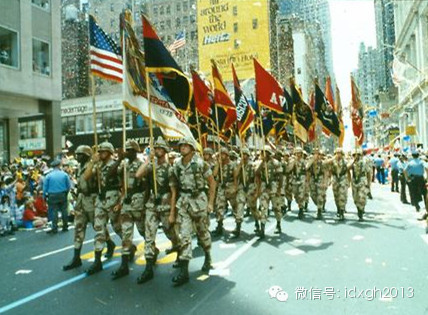

_海湾战争胜利阅兵。_

  

不过，美国各军种大小基地的阅兵活动要比解放军多得多。在庆典活动和繁多的特定纪念日，各大军事基地都会举行小规模的阅兵礼。为博取民众好感与支持以获得更多预算拨款
，很多阅兵式都向公众开放。

  

全美最负盛名的是西点军校的阅兵式。入校第一天，全体新生就已被编成队伍，列队接收检阅，新生父母坐在观礼台上观看。西点学员身着灰色紧身双排扣军礼服，不同于美国陆
军制式的蓝色礼服，该传统据说是为了纪念1812年英美战争中美军首胜的奇帕瓦战斗。

  

西点几乎每天下午5点都会举行阅兵，提前五分钟发出阅兵预备命令，到5点钟时，全校所有2400名学生就能准时穿着指定制服、带好步枪在营区整齐列队站好，然后以整齐
划一的壮观军容，在几分钟内通过阅兵台。

  

每年的毕业典礼阅兵是西点军校阅兵中的重头戏。每次学校都会邀请总统、副总统级VIP或重要官员、议员参加。应届毕业学员们身着西点的灰色军礼服，扛着老式步枪接受校
长、嘉宾和学生家长的检阅。

  

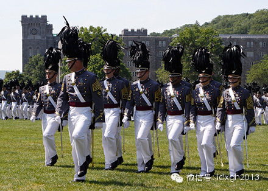

_西点军校阅兵。_

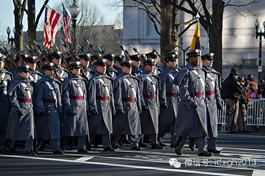

_西点军校学员团上街阅兵。_

  

虽然当代很多美国人反感阅兵，但早期殖民时代的1675-1676年，北美殖民地居民和印第安人冲突加剧，新英格兰地区民兵训练增至每周两次，每逢集训日，民兵连队会
被召集到公共场地上，先点名、祈祷，再进行兵器教范和制式队列操练，最后在家乡父老围观中，接收民兵指挥官和地方官员的检阅。

  

美国独立后，正式建立起合众国的民兵制度，18-50岁男性公民全体参加民兵。那个时代正是极具仪式表演性质的线条战术的巅峰，受华丽制服、铿锵鼓点和军乐的吸引，爱
好阅兵分列式并乐此不疲的成年男子不少。

  

南北战争以后，美军分散驻扎于老西部300多个前哨基地中，照例会有每日的分列式操演。麦克阿瑟小时候生活在利文沃斯堡军营，他几乎每天都会去看驻军下午全副武装的分
列式降旗礼，他尤其喜爱看骑兵部队操练和检阅。

  

前国务卿鲍威尔将军的军旅生涯历经整个冷战时代，他回忆曾在德国和越南，经历过很多过分喧闹的指挥官交接仪式，每次必有大规模阅兵。全体部队走完阅兵式就要晒着太阳听
高级军官们说废话套话。但他的退休仪式上，华盛顿三军仪仗队、军乐队，仪仗队分列式一样不缺，还有喷气战斗机和直升机轰鸣飞过阅兵场。

  

【印度：军民鱼水情】

  

印度立国很晚，缺少足够古老的军队传统，但其民族、宗教构成极为复杂，这份特殊历史遗产同样体现在阅兵时不同部队的装扮上，如果不了解其背后的阅兵文化，很容易将之视
为一场热热闹闹的赶集。

  

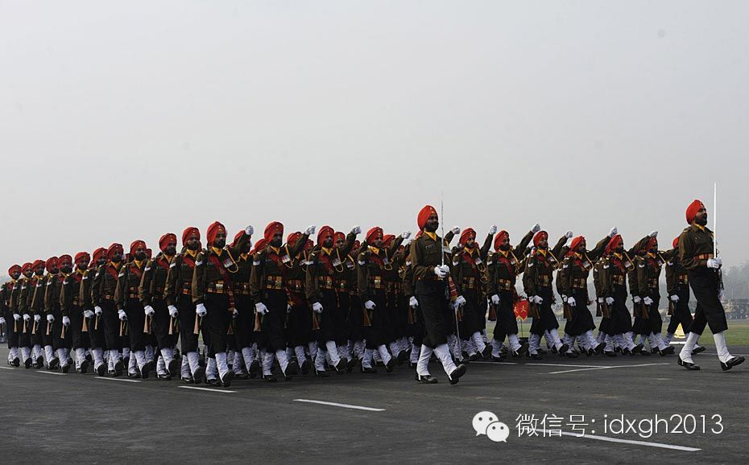

_印度阅兵中的锡克族部队。_

  

每年1月26日的“共和国日”和8月15日的独立日，首都新德里都会举行盛大阅兵式。阅兵是印度人寻求国家认同和自豪感的纽带。印度人民感情丰沛，也许因为这个原因，
与不少国家庄严肃穆的阅兵式相比，印度的阅兵更像是全民狂欢。

  

印度在每年阅兵式前，都对外公开售票，票价低廉，大约人民币10元左右。因此，新德里长长的阅兵道两旁，挤满了拖家带口、“鱼水情深”的普通百姓，热闹非凡。

  

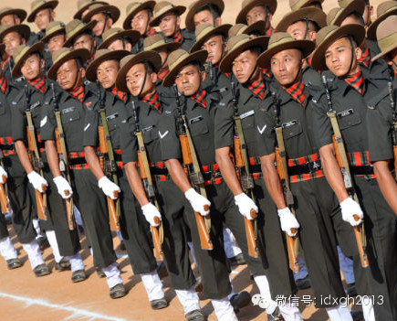

_印军中来自尼泊尔的廓尔喀兵。_

  

印度的阅兵中，充分体现了印度军队按照民族组成不同团队的特色，不同团队、不同肤色的士兵，身穿富有民族特色的鲜艳军服依次通过，甚至包括来自尼泊尔的廓尔喀兵与流亡
藏民组成的部队。与英联邦国家以徒步分列式为主不同的是，印度阅兵很喜欢展示坦克、大炮、导弹等重型武器，很有苏俄风格。印度人甚至还把不便展示的飞机和潜艇做成模型
抬出来展示。

  

常为人讥笑的吐火、钻火圈、多人叠罗汉摩托表演等杂技项目，其实并非印度阅兵式的内容，而是阅兵式之后的群众性巡游中的内容，类似于中国国庆阅兵结束后的庆祝游行队伍
。

  

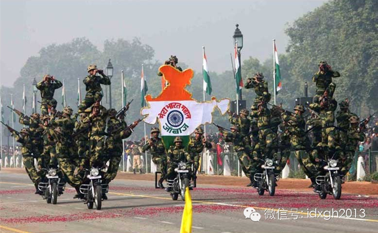

_印度阅兵中表演性质的摩托车特技队。_

  

绰号“魔鬼突击队”的摩托特技队隶属印军，其摩托车特技表演是庆祝巡游的重头戏，历来很受观礼群众的喜爱。就像中国的首长们喜欢看武警表演胸口碎大石一样，他们出现的
时刻，也是观众反响最热烈的时刻。  

**  
**[大象公会所有文章均为原创，版权归大象公会所有。如希望转载，请事前联系我们：idaxiang@idaxiang.org ]

[阅读原文](http://mp.weixin.qq.com/s?__biz=MjM5NzQwNjcyMQ==&mid=200075578&idx=1&sn
=e2f0f99cf9d921894fb9adc893f64686&scene=1#rd)

