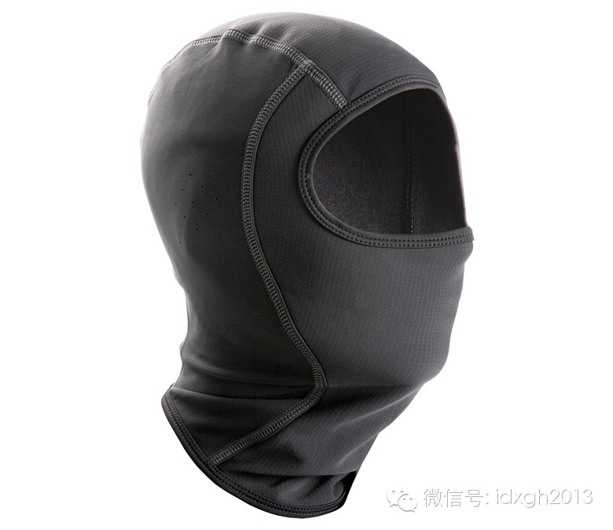
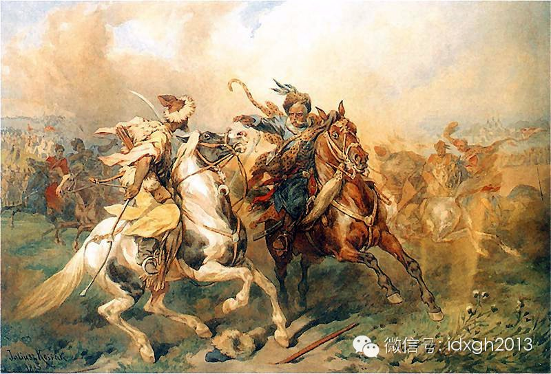
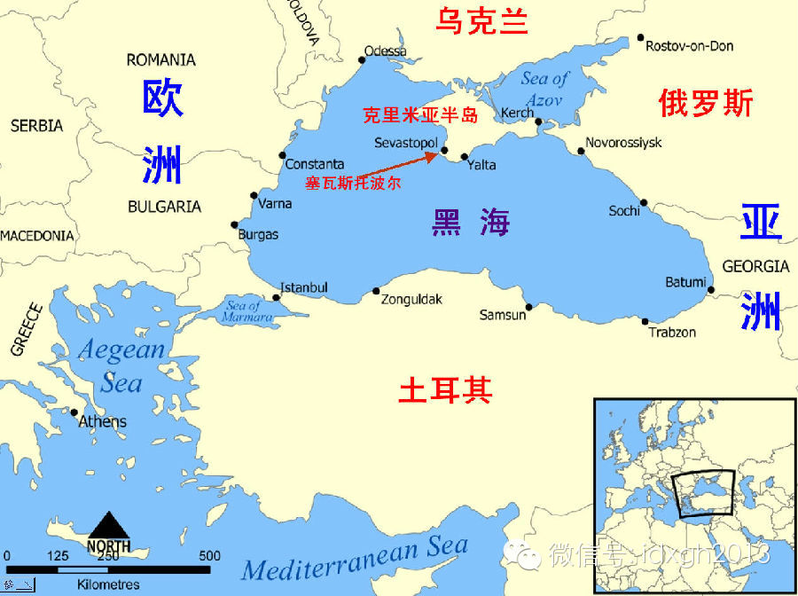

**乌克兰动荡的舞台已从基辅转移到克里米亚半岛。黑海之滨的半岛何以成为乌克兰危机一个新的爆发点？**

  

文/阎滨

  

二战行将结束时，盟国三巨头罗斯福、丘吉尔、斯大林于雅尔塔开会，决定了全球数十亿人此后半个多世纪的命运。这座东南欧海滨小城的名字，由此构成了一个国际关系方面的
术语——雅尔塔体系。

  

而全世界的特种部队、行凶歹徒乃至恐怖分子都喜欢戴一种能遮住面部、只露眼鼻的黑帽子，这种名为巴拉克拉瓦帽的帽子在CS电脑游戏等流行文化的带动下广为人知。

  

_特种部队与匪徒都偏爱的巴拉克拉瓦帽_

  

很多人未曾注意到雅尔塔和巴拉克拉瓦帽之间的联系——他们都来自扼守亚欧两大洲要冲、地处基督教世界与伊斯兰教世界分界线的克里米亚半岛——这里恰好位于两千年来东西
方民族大迁徙的十字路口附近，也因此见识过太多的兵火刀戈。

  

【千年血火史】

  

考古发现克里米亚半岛最早的文明居民是凯尔特人，即今天苏格兰、爱尔兰人的祖先。作为欧洲最先使用铁器、精于经商且善战的民族，以金发白肤长颅、高大魁梧、性情暴烈著
称的凯尔特人，曾分布于东及黑海、西抵英伦的广阔空间。

  

公元前7世纪，活动范围遍及中亚和南俄草原上的斯基泰人（又译西徐亚人，即我国古代史书所称的西域“塞种”或“尖帽塞人”）取代了半岛上的凯尔特人。

  

斯基泰人没有文字，因此未留下本民族的记录，但从中国到希腊、从埃及到波斯的众多民族史籍中，对其均有不少记载。克里米亚的草原上至今还散布着许多斯基泰人的坟墓，成
为这段历史的见证。

  

希腊人随后抵达克里米亚，并陆续建立了一些城邦殖民国家。在古希腊留传至今的神话、戏剧中，很多都提到今日的克里米亚。比如希腊神话中，英雄伊阿宋与五十位英雄一道乘
快船“阿耳戈号”，离开希腊经黑海去科尔喀斯（今天的格鲁吉亚境内）寻找金羊毛的故事，便途经了克里米亚。

  

因为神话中提到了铁器时代的生产工具，因此“阿耳戈号”历险故事的原型，很可能发生在更晚近的铁器时代而非早先青铜时代。这样的传说可视为文字出现前，描绘古希腊人殖
民开拓精神的口述史。

  

公元前438年，希腊化居民在黑海北部建立博斯普鲁斯王国，领土范围包括克里米亚半岛。王国盛产小麦，并因此与希腊本土商贸往来密切。公元前15年，罗马征服了克里米
亚半岛，将此地纳入帝国的保护。克里米亚随后跟着罗马帝国一起皈依了基督教。

  

3世纪时，罗马帝国经济与社会全面崩溃，帝国无力抵挡来自东方大草原一波接一波游牧蛮族的冲击，克里米亚也成为农耕民族与游牧民族交锋的拉锯场。

  

随着罗马帝国分裂为东西两半，此后的近千年中，东罗马帝国（拜占庭）努力维持自己在黑海之滨的帝国北部疆界，但众多入侵者还是如同绵绵不绝的潮水一般相继侵袭过这里。
哥特人、匈奴人、保加尔人、可萨人、钦察人（信奉伊斯兰教的突厥人的一支）、蒙古人先后占领过克里米亚，中世纪末期，威尼斯、热那亚的商人还在半岛上建立过几个殖民城
市。

  

这些曾拥有克里米亚的外来征服者中，值得一提的是可萨人。他们是半游牧民族，据说与突厥的阿史那氏（唐代昭武九姓之一）有亲缘关系，建立的汗国统治范围遍及里海、伏尔
加河流域、顿河平原。

  

在近500年的历史上，可萨人长期是拜占庭帝国的忠实盟友，多次联合拜占庭与波斯、阿拉伯帝国交战。公元704年，拜占庭皇帝查士丁尼二世被国内叛乱推翻，在被割掉鼻
子和舌头后流放到克里米亚。在那里遭到毁容的前皇帝娶了可萨可汗的妹妹，并在可萨人的帮助下成功复位。

  

公元8世纪，可萨人的上层统治阶级从萨满教皈依犹太教(据说是犹太教中的卡拉巴派)，可萨人的平民则是三教皆有。公元10世纪以后，可萨汗国衰落下去，并在拜占庭和基
辅罗斯的联合夹击下灭亡，可萨人从此消失在历史中。钦察人随后占据了克里米亚，半岛逐渐被伊斯兰化。

  

近年来，随着DNA技术的进步，遗传学被应用到考古方面。可萨人的去向问题也渐渐浮出水面。

  

有美国学者发表论文称，发现德系犹太人，即诞生了马克思、爱因斯坦的阿什肯纳兹系犹太人，其DNA中含有比例不等的高加索血统成分，与格鲁吉亚、亚美尼亚人有着较近的
亲缘关系。

  

同时，中国天山以东发现的古匈奴墓葬中的遗骸所携的Q1b类型基因，在今日东方很少发现，反倒德系犹太人检出较高比例，约占7%。这就支持了部分古籍上的说法，德系犹
太人可能并非直接来自中东，而是与混杂了突厥、高加索诸民族血统的可萨汗国有关。

  

【残暴的克里米亚鞑靼汗国】

  

成吉思汗西征后，征服了东南欧大草原上的钦察人，在其故地分封汗国，克里米亚归长子术赤一系所建的金帐汗国所有。14世纪，汗国分裂并衰落下去。1430年，术赤的后
代建立信奉伊斯兰教的克里米亚汗国，臣属于奥斯曼帝国。

  

克里米亚汗国历代的汗都企图恢复对伏尔加河流域的控制，因此经常发动对南欧草原各个斯拉夫部落和公国的讨伐。同时伴随讨伐的还有猎奴活动，这还逐渐发展成一门延续数百
年的兴旺生意。

  

这些踢掉一半头发、可怕的大胡子在风中飞舞的鞑靼骑兵，经常深入东欧大草原，捕捉俄罗斯、乌克兰、波兰、罗马尼亚人并卖给土耳其人为奴，他们是奥斯曼帝国最“出色”的
奴隶贩子。汗国的城市卡法（因商业繁荣而号称小君士坦丁堡，今费奥多西亚市）成为最著名的奴隶贸易市场。

  

_著名油画《鞑靼舞》：左侧的克里米亚鞑靼骑兵和右侧的波兰立陶宛联邦骑兵在战斗。（来源：维基百科）_

  

据说鞑靼人贩奴“颇有心得”：俄罗斯人和波兰人身强体壮，卖到战舰上做划桨奴隶很受欢迎；匈牙利人、威尼斯人和德意志人则有体格纤弱的坏名声，被认为“干不了苦工”；
这些民族的女人被认为“身体僵硬、缺乏女人味”。

  

自克里米亚汗国建立后的200多年中，克里米亚鞑靼人共贩卖了三百多万白奴，仅位于巴勒斯坦的雅法港一地，作为转口贸易港，平均每年都有1万多白奴的“吞吐量”。

  

这些白奴中最著名的一位，也许是奥斯曼巅峰时代的苏丹苏莱曼大帝的妻子洛克塞拉娜王后。据说她本是利沃夫附近一个乌克兰神父的女儿，有着白皙的皮肤和一头红发，被鞑靼
人抢走后转手卖给苏丹。

  

按照奥斯曼的传统，苏丹像占有财产一样拥有数百女人，但不与任何一个结婚。可怜的女人们居住在监狱一样的闺房中，只有被阉割的非洲黑人奴仆为伴。

  

洛克塞拉娜最初在后宫中的地位很低，但是，聪明绝顶的她绝非本分的普通女奴，很快设法吸引了苏丹的注意，并完全迷住了他。苏丹从第一次见到她起，就再也不愿与其他女人
睡觉。洛克塞拉娜还让苏莱曼做了一件此前几个世纪的苏丹从来不做的事情：正式娶洛克塞拉娜为妻。

  

一名外族女奴一跃变为尊贵的皇后，听起来像是《甄嬛传》一样的“正能量”励志故事。

但洛克塞拉娜留给历史的远不仅于此，她善于玩弄权术，积极干预政治，借苏丹之手设法干掉了一个个政敌，取得巨大的权势，开启了奥斯曼帝国历史上后宫干政的先例，土耳其
人因此称她为“许蕾姆苏丹”。

  

她还设计除掉苏莱曼精明能干的长子，让自己亲生的儿子成为继承人，这就是苏丹塞利姆二世，在这个酒鬼及其同样昏聩的子孙统治下，奥斯曼帝国由盛转衰。

  

1571年，基督教联军在勒班陀海战中打败土耳其舰队，从此奥斯曼帝国再也无力威胁西欧，从某种意义上来说，克里米亚人卖给苏丹的这个女奴，改变了历史的轨迹。

  

【沙皇的明珠】

  

16世纪后，莫斯科公国强盛起来并统一了俄罗斯，渐渐走向对外扩张的道路。占据黑海出海口的克里米亚汗国，因其扼守南方不冻港的优越位置，引来历代沙皇的垂涎。

  

从1676年开始，此后200多年里爆发了十一次俄土战争，平均每十九年一次。通过这些战争，沙俄占领大片土耳其领土。彼得大帝打开了俄国朝向北方的波罗的海出海口，
但他活着的时候没能完成打通黑海出海口的愿望，最终这一梦想由德意志来的叶卡捷琳娜大帝实现。

  

1768年，俄土爆发第五次战争，在鲁缅采夫元帅的指挥下，沙俄大胜并于1774年强迫土耳其签订《凯纳尔基条约》，土耳其承认克里米亚汗国"独立"，实际是由沙俄继
任克里米亚汗国的保护国。很快的，克里米亚半岛即被吞并，沙俄如愿获得了港口并建立黑海舰队。

  

成军4年后的1787年，叶卡捷琳娜大帝为了宣示对克里米亚的主权，特意邀请奥地利国王约瑟夫二世和她一起前往克里米亚半岛“度假”。

  

此举大大激怒了土耳其苏丹哈米德一世，苏丹要求恢复克里米亚的独立，并向俄国宣战，第六次俄土战争打响。苏沃洛夫在这场战争中大放异彩，他于1790年12月攻占了土
耳其坚固的伊兹梅尔要塞，奠定了其军事史上的不朽声望。1792年，土耳其最终在《雅西合约》中正式承认克里米亚归属俄国。

  

在有英法为土耳其撑腰的克里米亚战争中，俄国血战守住了半岛。前来半岛作战的英军，为避免脸和脖子被寒冷和强风侵袭，入乡随俗，将当地人佩戴的这种帽子带回英国并流传
于世。

  

_克里米亚地理位置_

  

【20世纪的克里米亚】

  

因信奉伊斯兰教的鞑靼人在克里米亚半岛上较多，在苏俄时代，根据社会主义特色的民族理论及政策，1921年这里的国号变更为克里米亚鞑靼社会主义自治共和国，隶属俄罗
斯。

  

斯大林时期，很多非东正教或非斯拉夫的少数民族都遭到了集体流放的全民族性“惩罚”。

  

世人皆知车臣人、印古什人、卡拉恰耶夫人、巴尔卡尔人、卡尔梅克人、伏尔加德意志人、朝鲜人曾遭到集体流放，而在“各族人民的父亲、一切科学的泰斗”的关怀下，克里米
亚鞑靼人也未能逃过此劫，半岛上的居民再次经历了一轮民族大迁徙的厄运。

  

1944年5月，克里米亚半岛刚刚解放不久，斯大林即借口克里米亚鞑靼人在战争中同德国纳粹有合作行为，“背叛苏联人民”，将鞑靼族集体流放。

  

希腊人、保加利亚人、亚美尼亚人、克里米亚德意志人（被认为是叶卡捷琳娜时代来到俄罗斯的德意志移民，也有观点认为他们是哥特人的直接后裔）也遭到“池鱼之殃”，被一
并赶出克里米亚。

  

约有35万鞑靼人被内卫部队用冲锋枪驱离故土，像牲口一样被装进“闷罐”列车，流放到中亚和西伯利亚等地。近一半人因饥饿和疾病死于集体流放的途中。次年，三巨头在半
岛南岸一个海滨小城逗留短短数天，决定了此后40多年全球数十亿人的命运。从此雅尔塔的名字广为世人所知。

  

_克里米亚半岛南部温暖潮湿，自沙俄时代起便是疗养胜地。而在苏联时期，这里更是最高领导人的休假地。_  

  

既然鞑靼人已经被全部流放，再叫“鞑靼自治共和国”就不伦不类了。1946年苏联取消了自治共和国，改称克里米亚州，大批俄罗斯族迁入，半岛的居民结构被永久性改变。

  

克里米亚鞑靼人被驱逐到中亚后，其民族语言甚至也遭到禁止使用。直到1956年，赫鲁晓夫搞拨乱反正，克里米亚鞑靼人的公民权才得到恢复，但由于克里米亚已于1954
年被划入乌克兰，他们被禁止重返家园。

  

直到90年代早期，许多克里米亚鞑靼人才乘苏联解体、政策松动的机会，开始返回克里米亚。今天，克里米亚的居民中，俄罗斯族占58%，乌克兰族24%，鞑靼人仅占约1
1%，但因为二战中结下的积怨，这11%的鞑靼人坚定反俄。

  

奈何悲情打不过冰冷的比例。眼下，克里米亚议会已经全票通过了并入俄罗斯的决议。决定未来克里米亚归属的公投也将在3月16日举行。

  

**[大象公会所有文章均为原创，版权归大象公会所有。如希望转载，请事前联系我们：bd@idaxiang.org ]**

** **

[阅读原文](http://mp.weixin.qq.com/s?__biz=MjM5NzQwNjcyMQ==&mid=200731965&idx=1&sn
=5aa317b0019d7ae7aed44150cbfb208d&scene=1#rd)

