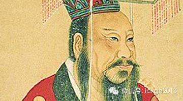
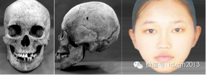
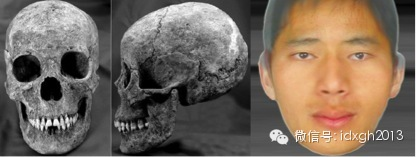
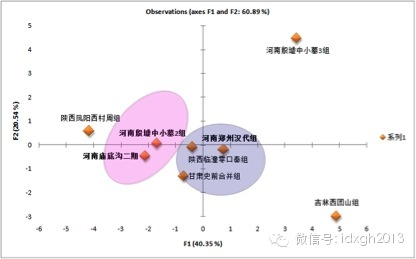
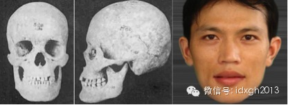
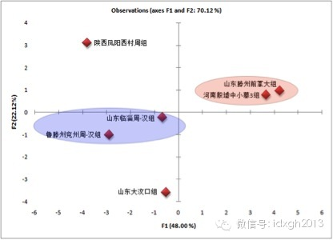
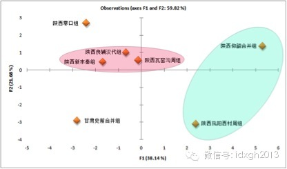
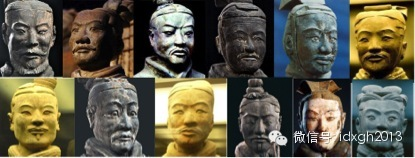
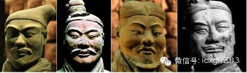
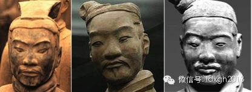

‍‍‍‍‍‍‍‍‍‍‍‍‍‍‍‍‍‍

**广义的中原指的是河南、山东、陕西地区，那么，汉朝的中原人长什么样？用体质人类学来解答这一问题时，或许它给出的解答与我们的想象有很大出入。  
**

  

文/王冰

  

汉族最早的得名始自汉朝，汉朝时期的中原人，可认为是汉族最早的定型，那么，汉朝的中原人到底更像今天的南方人还是北方人？

  

能较信服解答这一悬疑的也许是体质人类学。简单的说，就是比较古代中原人和现代各地人群和各民族的颅面骨骼特征，来判断哪些古今人群最为接近，进而推测古代中原人的起
源和流向问题。

  

这里的中原，指的是河南、山东、陕西三个广义中原地区，下面逐一分析。

  

**【汉代河南人的人种演化史】**

  

狭义的中原专指河南，历史上该地区还曾被称为“中国”、“中州”、“中土”。

  

虽然汉朝古墓发现不少，但直到2013年，吉林大学研究者才在《郑州汉唐宋墓葬出土人骨研究》一文中首次系统分析了汉代河南人的种系特征。报告指出：郑州地区汉唐宋居
民均与现代亚洲蒙古人种的东亚类型存在较大一致性，较多表现出“古中原类型”居民的特点。与近代对比组比较表明，郑州汉代组居民虽然可能混入西北羌系民族和北方游牧民
族的某些基因，但在体貌特征上与现代南方汉族存在很大相似性。

  

简而言之，汉朝河南人与近代华南组相似性最大，这个近代华南组具体指的是福建汉族。

  

郑州汉朝组人骨采集于多个考古遗址，种系特征较为统一，男女样本无明显差异。只是女性的颌骨突出程度更为明显，就是我们通常说的龅牙，鼻型也更阔一些（复原图软组织特
征主要参考华南人面部软组织特征，未考虑年龄因素）。

  

_图：郑州汉代女性人骨非正式模拟复原图  
_

  

_图：郑州汉代男性人骨非正式模拟复原图_

  

周人崛起之前，河南地区是商王朝统治中心区。以往研究显示，陕西地区的周人与河南地区的商人在种系特征上虽保持较大的一致性，但存在一定差异。那么，当周人入主河南后
，是否一定程度上改变了河南地区人种的组成结构？

  

春秋战国时期，郑国、韩国先后在郑州地区建都，长达500多年。而秦王朝并吞列国时，韩国第一个被灭亡，其过程极为残酷血腥。史料记载，公元前317年：秦败韩师于脩
鱼，斩首八万级；公元前308年－307年：秦将甘茂破韩国宜阳，斩首六万；公元前293年：秦白起击败魏师、韩师，斩首二十四万级；公元前273年：魏赵联军伐韩华
阳。秦救韩，杀魏赵兵十四万；公元前264年：秦伐韩，斩首五万；前256年：秦伐韩，斩首四万……

  

秦人征服韩国的百余年间，被秦人屠杀的韩国军人就有几十万。而《中国人口通史》估算，战国中期总人口在3000万左右。韩国地小民稠，人口约150万，军亦有30万。
可见，秦人的征服活动造成韩国人口伤亡惨重。秦人入主韩国后，是否也带来较大的种系变化？

  

因尚无郑州地区更早的古代人骨资料，我们假设战国时代河南地区人种结构较为单一，并选取安阳殷墟中小墓的商代人骨作为比对样本。

  

商代古人明显分为两个种系，殷墟中小墓2组代表人数最多的一个种系，他们与更早的河南古人有更大相似性，可能是土著人群；殷墟中小墓3组代表一类中原地区新出现的新种
系，人数较少，但墓葬规格较高，通常认为是商的贵族阶层，甚至商王族也属这个种系。他们与同时代东北和内蒙古东南地区的古族更相似。

  

陕西凤阳西村的周代古人，与陕西土著种系相似性较高；另外，吉林省吉林市船营区的西团山古人是周代东北地区古族的代表；而甘肃史前合并组是甘肃地区的西戎集团的代表。
新石器时代河南庙底沟二期文化组是河南地区的土著种系，很多考古学家怀疑这便是传说中黄帝族群的文化遗存。

  

我们应用种系分析常用的主成分分析方法考察发现：汉代郑州汉人与陕西西村周人、河南安阳殷墟2组的商王朝平民、石器时代的河南庙底沟二期文化古人都有一定差距，相对更
接近陕西零口秦人和甘肃的西戎族群。

  

这样的结果似乎暗示秦人消灭韩国的过程中，确实对河南地区的人口结构造成重大冲击。在秦人入主韩国之后，很可能带来为数不少的秦国移民，填补了战争造成的人口空缺。

  

因为秦人的征服可能对郑州地区造成较大影响，而又因为尚无战国时代郑州地区人骨特征的相关研究。所以，周人取代商人后，是否有大量移民迁入商王朝中原故土就变得很难考
证。但殷墟3组所代表的商贵族阶层很可能已被逐出中原，他们的种系特征最为独特，不见后世中原汉族人群。

  

_图：河南种系变化分析图谱（男性）_

  

**【汉代山东人的人种演化史】**

  

山东古时为东夷之地。周人崛起后，封吕尚于齐，封周公旦于鲁，另外尚有曹、滕、卫诸国。山东地区并入周王朝版图，广义的中原包括整个黄河中下游地区。

  

山东地区汉代人骨资料包括两个组，一个是鲁中南兖州和滕州合并组，另一个是临淄组。两个山东古代组还包括周代样本，因为两个时期的样本具有一致的种系特征，因此研究者
将样本合并在一起比对分析。研究者均指出：山东周代至汉代古人种系特征相对接近今华南人群。

  

_图：鲁西南汉代女性人骨非正式模拟复原图_

  

_图：鲁西南汉代男性人骨非正式模拟复原图_

  

为什么周代山东居民和汉代山东居民的种系特征较为一致？从史料上看，秦人征服齐国并未爆发大规模军事冲突，齐国人口损失非常有限，而史料也未提供其它地区居民大规模迁
往山东地区的线索。

  

那么，周人宗室和异姓权臣在征服山东境内诸侯国的过程中，是否伴随着周人移民迁入呢？

  

山东境内最大的诸侯国是齐国和鲁国。我们从有限的史料中可知，尽管周人任命山东本土人士姜太公统治山东最大的诸侯国齐国，但过程中伴随一定的军事冲突。而姜太公早年移
居陕西，重返故土时，依赖的力量大多不是山东本土军民。为考察周人称霸前后山东地区社会变迁和人口迁徙活动，我们需要比对周代山东居民和周代以前土著居民的种系特征。

  

_图：山东种系变化分析图谱（男性）_

  

考古学上，岳石文化被认为与东夷民族直接相关。但目前尚未见公开报道的岳石文化人骨分析报告。不过，山东地区，从大汶口文化（距今6300-4500年）到龙山文化（
距今4600-4000年）再到岳石文化（前1900-前1600年）的过程中，并未见外来文化因素覆盖土著文化。所以，我们姑且认为石器时代的山东居民种系特征较为
统一，人口结构相对稳定。

  

若将山东新石器时代人骨（大汶口文化）、商人统治时代人骨（滕州地区）作为古代山东居民的代表，与商人统治阶层人骨（河南安阳殷墟中小墓3组）、陕西周人人骨比对分析
，可以发现：

  

首先，商代山东商文化居民的确与河南商族上层人群有着最接近的种系特征，同时，二者均与山东土著居民有较大种系差异。此结果似乎并不支持商族源自东夷的论点。但商人对
东夷的统治以联盟形式为主，商人是否广泛取代山东土著族群，尚需等待更多人骨资料的分析。

  

其次，齐国（临淄）和鲁中南人骨表现出较高的种系一致性，其种系特征则介于陕西周人和山东土著大汶口文化人群之间，它似乎暗示周人在征服东夷民族的过程中，确实伴随较
大规模的人口迁徙和人群混血现象。

  

**【汉代陕西人的人种演化史】**

  

陕西在西周初得名。当时周、召二公以陕原（今河南省陕县西南）为界分而治之。陕原以东由周公治理，称“陕东"﹔陕原以西由召公治理，称"陕西"。又因陕西在春秋战国时
为秦国治地，故又简称"秦"。陕西关中地区又称渭河平原。位于陕西省中部，介于秦岭和渭北北山（老龙山、嵯峨山、药王山、尧山等）之间。属于广义的中原地区。

  

陕西地区汉朝人骨样本采集于渭南澄城县刘家洼乡良辅村。在商代，渭南为骊戎国之地。西周时期，属畿内，也即京城效区。春秋时期，属晋。战国时期，渭南先属魏，后属秦。

  

研究者指出，他们比对渭南汉代人骨与近代人骨资料，发现华南（福建）近代组和澄城良辅组的关系最为接近（原报告提供的人骨资料版图似有变形，暂无法模拟复原该人骨）。

  

在汉朝之前，有两次历史变迁值得追问：

  

第一、渭南在新石器时代属于仰韶文化（前5000年-公元前3000年）核心区。商代，一些原本分布在长城沿线的戎狄族进入渭南地区。周人崛起前，“自窜于戎狄间”，
曾与姜戎联盟，后者与考古上的刘家文化相关。周人后离开戎狄到岐（今陕西岐山县境），崛起并取代商成为中原统治者。那么，进入夏商之际，陕西地区人种结构是否发生了明
显变化？

  

第二、秦人最早生活在今天甘肃礼县一带。甘肃、宁夏、青海三省在石器时代，人种结构较一致，人类学定义为“古西北类型”，他们在同时代中国北方古族中，与近代华北汉族
（主要采集于河北、山西两地）相似性最高。

  

周王室东移至洛阳，秦人也逐渐东迁至关中一带。考古上，秦人盛行一种“屈肢葬”（即在人死后，用布带将其下肢向上卷曲捆扎，然后入棺埋葬。尸骨姿势与胎儿在母亲子宫里
的形状极为相似）广泛出现在关中地区。那么，秦人入主关中地区之后，其民众是否取代了原本居住在关中地区的周人族群？

  

解答第一个疑问用的比对样本，新石器时代关中地区古人为陕西仰韶文化合并组，周人包括两个样本，一为进入关中地区的周人（陕西咸阳凤阳西村周组），一为与周人始祖关系
更大的陕北地区样本（陕西延安市瓦窑沟周组）。

  

人骨数据分析结果显示，陕北地区的周人与关中地区的土著存在一定种系差异，周人入主关中后与土著种系的接近程度相对更高。这似乎暗示周人自戎狄返回关中平原后，对关中
土著血统既有继承也有改变。而“自窜于戎狄间”的周人先祖则可能混合了更多戎狄族血统。

  

_图：陕西种系变化分析图谱（男性）_

  

解答第二个疑问，秦人包含两个古代样本，其一为零口秦组，属于战国时期，其二为新丰秦组，年代为战国中晚期-
秦末。两组秦人样本都采集于陕西西安市临潼县，为秦王朝的京畿之地。另外，还有甘肃史前合并组，是西北地区的戎狄民族。

  

人骨数据分析结果显示，战国时期秦人、战国中晚期至秦末的秦人与仰韶文化土著人群和关中地区周人的种系差异较为明显，而相对接近甘肃史前组，而西北古代人群是同时代古
人中最接近现代华北汉族的种系。这也是为什么我们看兵马俑容貌，并不觉得他们与近现代汉族汉族有什么明显差异的原因。

  

历史上，秦人偏居西隅之际，与甘肃的西戎民族有过较广泛的混血，他们入主关中地区后，似乎对关中土著周人血统产生了较大影响，有可能随着周王朝东迁，关中地区的周人也
大规模向东迁徙。

单就此分析而言，汉代陕西人似乎与战国至秦末的新丰秦人之间并无特别明显的种系差异，但与零口秦人相对略有差异。

  

_图：接近古西北类型的秦俑，特点是面部较高（长）较狭，鼻型狭长。_

  

_图：接近古蒙古高原类型的秦俑，特点是面部高（长）而阔，鼻型长而阔。_

  

_图：接近古中原类型的秦俑，特点是面部低（短）而偏狭，鼻型短阔。_

  

相信读在看到这里时，难免会问，今天什么地方的人最像汉朝的中原人。要回答这个问题，必须加入更多的对照样本，进行更细致的对比才可获得较精确答案。我们把这个疑问留
给本系列的下篇，我们将解答两个问题：今天谁更像汉代的中原人，日本人是“徐福东渡”的童男童女吗？

  

  

[大象公会所有文章均为原创，版权归大象公会所有。如希望转载，请事前联系我们：bd@idaxiang.org ]

———————————————  

**大象公会订阅号的自定义菜单上线了，左边是官网文章精选，右边是大象公会官方微社区，点击进入来吐槽发帖吧！**

**  
**

  

[阅读原文](http://mp.weixin.qq.com/s?__biz=MjM5NzQwNjcyMQ==&mid=201725265&idx=1&sn
=d9211dff13389a761e6e36de73b25e9b&scene=1#rd)

