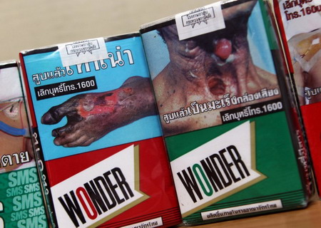
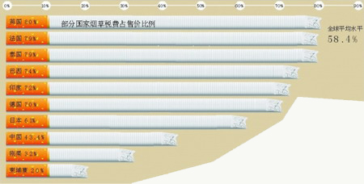
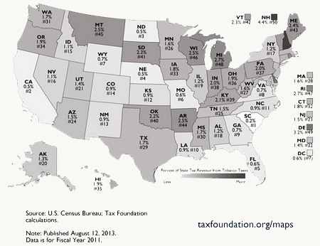
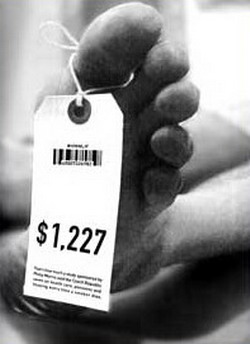

**吸烟有害健康，烟草的税收贡献无法抵消社会的健康支出，这是今天常见的观点。然而，从财政角度计算，或许烟民都是点燃自己、照亮他人活雷锋。**  

  

文/郑子宁

  

政府应该禁烟吗？

  

似乎答案是现成的。经过几十年论战，吸烟有害健康早已是社会共识。舆论压力下，各国在烟盒上提示吸烟有害的图案、标语，以及公共场所的禁烟政策已是最好的回答。

**泰国烟盒上的警告图片，让人看后不适**

  

吸烟和饮酒不同，公共场合吸烟会影响他人健康。但这部分很难精确计算。如果除掉政府在公共健康上的义务，单从财政角度，似乎政府也应该禁烟。

  

这主要体现在公立医疗费用的支出。仅仅在美国，吸烟导致的公共财政损失可以超过1000亿美元：预防、诊断和治疗吸烟相关疾病；因治疗导致误工的损失；烟民提前死亡导
致的潜在劳动力损失。

  

这1000亿中，很大一部分最终由全社会承担。当然，如果所有的烟厂归国有，又不必建立全民医疗保险，就是纯粹的只赚不赔。但这种制度很难持续，比如中国，随着农村和
城市的医保缓慢完善，近几年的禁烟令趋于强硬。

  

所以，我们很容易得出这样一个结论：政府禁烟，是一个从经济、公共健康义务、声誉上都获益的举措。

  

**但是，从经济和财政角度上，还有另一种算法。**

  

**【短命，财政的福利？】**

现代国家的财政支出十分繁杂，公立医疗只是其中一项，具体到吸烟问题带来的后果，如果由此产生其他项支出的减少额度大于医疗的增加额，那么总体上仍旧划算。

  

退休金就是与吸烟相关的另一项重要支出。一般来讲，退休金是靠公民在工作期间积累，退休后发放的酬劳。从政府财政来说，若是一个人在工作期间努力缴纳大量退休金，但退
休后就去世，这类短寿公民便为财政做了净贡献。

**吸烟和饮酒不同，公共场合吸烟会影响他人健康**

  

现代社会，民众健康水平不断提升，平均寿命大大超过退休年龄，这时候，烟民群体的贡献就格外引人注目——不同的研究显示，烟民的平均寿命比非烟民要短4-10年，这意
味着在绝大多数建立了基本社会保障的国家，烟民平均少拿4-10年的退休金。

  

烟民对社会的贡献远不止少拿4-10年退休金。大多数人的医疗、健康花费发生在暮年，高龄老人多需要服用大量药物维持身体机能。

  

美国2011年的统计显示，19-25岁的青年平均每千人开4165个药方，60-64岁则平均每千人22212方，到了80岁以上组，更是飙升到每千人36715方
，平均每人一年要开30多剂药方。金额上，耗资最大的肿瘤类药物（232亿美元）使用的主要人群也是老年人。老年期的缩短就意味着花销的节省。

  

**于是，短寿的烟民便又节约了一大笔公立医疗支出。**

  

此外，老人最怕失能，生活不能自理的老人是家庭、社会事实上的负担。

  

一位需要全天候照料的老人，其花费往往令人瞠目结舌。美国2012年在养老院入住单独房间的年花费大约为90500美元。在中国，虽然社会有孝顺传统，提倡由家人照料
，但由于误工费等实际原因，负担仍旧很大，越来越多的人选择雇佣劳力。

  

**那么，吸烟造成的这些财政支出总额到底能不能减少？**

  

这个问题可谓众说纷纭。以目前的证据，说多的有，说少的也有。美国学者维斯库斯对美国烟民的研究认为，吸烟财政方面的净外部效应接近零。

**一位需要全天候照料的老人，其花费往往令人瞠目结舌**

  

不过，由于各国人均寿命、医疗体系、社保体系的不同，吸烟的外部效应也会有所变化。但有一点是肯定的：吸烟并不只单纯增加支出，其造成的短寿也会部分地降低财政花费。

  

**【烟税：财政的重要支柱】**

与相对复杂的支出影响相比，烟草对财政收入的影响十分明确、直观——大幅度增加了政府财政收入。

  

通常，政府会对负外部效应征税，如工厂排污征的污染税，拥堵地段的堵车费等。这类税叫做庇古税，得名于英国经济学家庇古，其目标就是让制造负外部效应的一方承担相应的
责任。吸烟当然如此，不少地区会对烟草征收高税以维持“社会公平”。

  

不过，烟税的历史已有数百年，远早于“吸烟有害健康”的观点普及，后者是20世纪中叶以后才被广泛接受。这也就意味着所谓负外部效应和社会公正只是现代税收体面的借口
，官员们征税另有其动机。

  

利益当然是征税的原因，烟草的成瘾性才是税收的关键。对烟草上瘾，就意味着长期稳定的需求。香烟的成瘾性可从戒烟的难度看出：通常，没有药物和专业咨询帮助的话，单次
戒烟成功率只有4%-7%。如此一来，烟草对于烟民就是不折不扣的刚需。

**部分国家烟草税费所占售价的比例**

  

刚需是什么？与丈母娘打过交道的人肯定明白这一点——不买就无法结婚。经济学上用需求的价格弹性来表现需求随价格变化的敏感度，多项研究显示，发达国家烟草的需求价格
弹性在-0.2至-0.6之间，平均值在-0.4左右。即10%的价格涨幅只能带来4%的需求降低。中国烟民烟草需求的价格弹性不同研究范围相差比较大，从-0.15
4到-0.84都有，但都不算高。相比而言，可口可乐的需求价格弹性高达-3.8。

  

所以，坚挺的烟草就算价格被税拉高，烟民的需求受影响也很有限。反之，如果对可口可乐之类的商品征收高税则会导致商品需求急剧下滑，乏人问津，达不到增收目的。

  

美国1862年引入香烟消费税，成为联邦政府的重要财源，1868年甚至成为主要收入来源。20世纪后，美国各州纷纷征收州级烟税，税率也水涨船高。如今，联邦政府每
包烟收税1.01美元，州级从0.17美元（密苏里州，烟叶种植大户）到4.35美元（纽约州）不等。纽约、芝加哥等地还征收城市级别的烟税。此外，烟税并不能抵扣销
售税，并且后者计算时采用含烟税价做为底价。

  

这笔收入十分关键，新罕布什尔州税收4.37%靠烟草提供，全美2011年光烟税就收了171亿美元。此外，90年代后期各州起诉烟草公司达成的调解协议，烟草业在2
5年期间需为政府支付2500亿美元赔偿，其后还将视经营情况继续补偿。

**美国各州烟税占税收比（来源：美国税务基金会）**

  

在中国，根据《中国烟草控制规划（2012-2015）》，烟草行业2010年缴纳各项税费4988亿元，占当年全国财政收入总额约6%的比重。

  

而据中国疾控中心控烟办2012年发布的《中国烟草业经济和财政效益再评估》报告，2011年烟草业累计实现销售收入达10111.4亿元，实现工商利税7529亿元
。虽然烟草对GDP的贡献不到2%，但对财政税收的贡献却达到8%左右。

  

**【禁还是不禁？】**

1980年，英国政府一项未公开的报告被《卫报》公开，舆论大哗：报告指出公众控烟行动将在很大程度上影响税收，并造成退休金支出上涨。

  

同样，2001年，一份为捷克政府准备的咨询报告也认为吸烟对其公共财政有益——平均每个烟民的死亡的可为捷克政府节省1227美元。不过，该报告由菲利普•莫里斯公
司（世界最大烟商，万宝路为其旗下品牌）出资，中立性和客观性尚有疑问。

**该捷克咨询报告因把人早死算做“益处”导致轩然大波**

  

给政府提建议的大有人在。美国的一份报告认为，1989-90年度，美国烟民平均让政府多花203.57美元，同时让政府多赚了620.56美元。最夸张的是当属芬兰
的一项研究，认为烟民一生平均比非烟民多贡献133000欧元。

  

那么，在烟民比例远高于大多数国家的中国，3亿多烟民们也是点燃了自己，照亮了他人活雷锋吗？

  

中国烟草税率由于长期未调整，在全球主要国家中偏低，卷烟价格更接近全球最低，一般收入的烟民一年抽100包廉价烟只会花掉年收入的3%。世界上真的很难找到对烟民这
么友好的社会了。

  

但是，中国医疗体系和退休金制度与国外有巨大差别，上述国外报告未必能有效证明中国烟民同样是损己利人的活雷锋——当然，从某些地方鼓励乃至要求农民种植烟草的做法看
，至少对烟草产区，烟民的贡献是被认可的。

  

**版权声明**

****大象公会所有文章均为原创，****  

****版权归大象公会所有。如希望转载，****

****请事前联系我们：****

bd@idaxiang.org

****知识 | 见识 | 见闻****

阅读

__ 举报

[阅读原文](http://mp.weixin.qq.com/s?__biz=MjM5NzQwNjcyMQ==&mid=206924614&idx=1&sn
=5fd7e91685bd95352d3f136473dbcd37&scene=0#rd)

