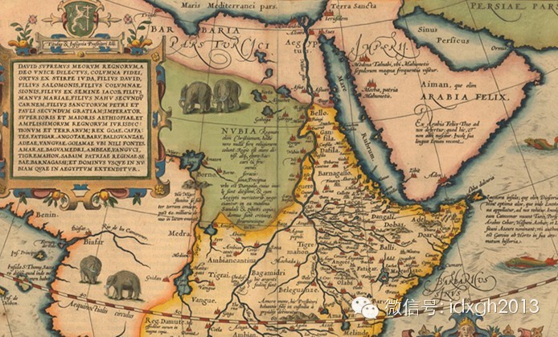
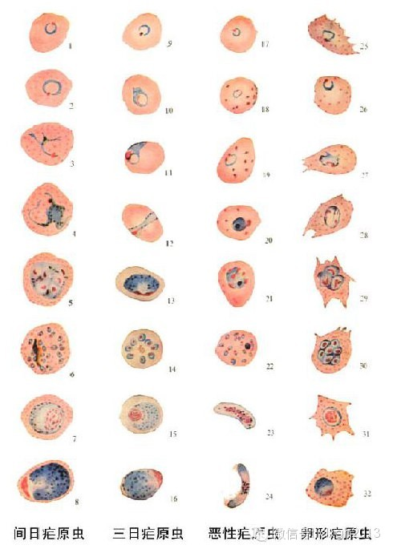
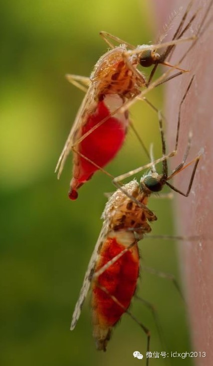
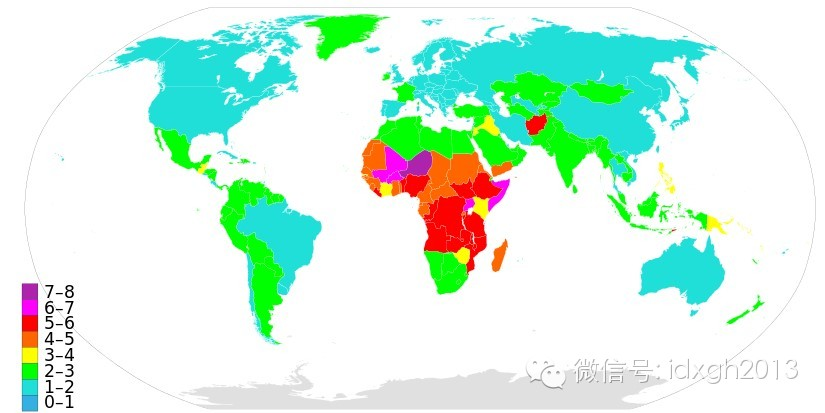
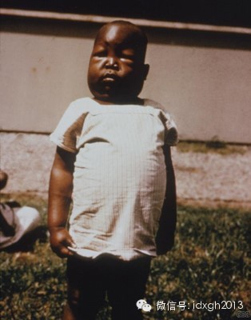

**为何欧洲殖民者首先征服的不是近在咫尺的非洲，而是万里之外的美洲？为何现代非洲仍陷入贫困的陷阱不可自拔？为何印度看似富足实际贫弱，种姓制度绵延数千年？**

  

文/余昊

  

【那片大象填补的世界】

  

1500年，在国王“幸运儿”曼努埃尔一世治下，葡萄牙帝国国运正盛。自1434年越过博哈多尔角后，葡萄牙人一直沿非洲西海岸稳步推进。

  

1498年，达伽马越过好望角到达印度；1500年，佩德罗•阿尔瓦雷斯•卡布拉尔到达了巴西。正是在这一年，国王派出一支探险队，沿西非的冈比亚河溯流而上，去探索
那“黑暗的中心”。然而，探险队最终只有一人安然返回，其他人全部被疫病留在了非洲大地上。

  

后世的历史学家若望•德•巴洛斯写道：“上帝派遣一位天使，挥舞着致命热病的火焰之剑，阻止我们进入这花园里的清泉，黄金的河流从那里一直流入我们多次征服的大海。”

  

此后数百年，这致命的热病——疟疾仍将欧洲冒险家们拒之门外，使其无法深入“黑暗大陆”的内陆，直到欧洲人从美洲的金鸡纳树中提炼出治疗疟疾的特效药奎宁。即使到了1
9世纪，最伟大的非洲探险家大卫.李文斯顿夫妇仍双双死于疟疾。

  

甚至到了1900年，非洲尚有四分之一内陆地区未被勘探。迪安**斯威夫特曾这样描述人们绘制这片黑暗大陆时的窘境：“在非洲地图上，地理学家们用野生动物填补空白。
因此，对于不适于居住的丘原，便填上大象以代替城镇的缺乏。”

  

_十七世纪绘制的非洲地图_

  

而在此期间，欧洲人带去的致命传染病：天花、麻疹、斑疹伤寒、流感和白喉已横扫美洲大陆，消灭了大半的美洲土著印第安人，帮助欧洲人彻底征服了美洲。

  

美洲印第安人何以难逃被传染病征服的命运，贾雷德.戴蒙德的巨著《枪炮、病菌与钢铁》已提供了令人信服的解释。而非洲和其他热带国家的命运，则与疟疾这一人类历史上最
可怕的传染病联系在一起。

  

为何欧洲殖民者首先征服的不是近在咫尺的非洲而是万里之外的美洲？为何同为原住民，今天印第安人总人口仅四千八百万而非洲有十亿人口？现代非洲为何仍陷入贫困的陷阱不
可自拔？印度为何看似富足实际贫弱，种姓制度绵延数千年？这些问题的答案，可能要追溯到上古时代，而疟疾则是其中的主角。

  

【进化军备竞赛】

  

多数人都知道，疟疾是一种由单细胞生物疟原虫造成的寄生虫传染病，通过按蚊传播；但少有人知的是，能够感染人的四种疟原虫，即间日疟原虫、恶性疟原虫、三日疟原虫和卵
形疟原虫有着截然不同的特性、进化历史和地理分布；在千年、万年的尺度上，这些原生生物与人类展开了一场激烈的进化军备竞赛。

  

_四种疟原虫在红细胞内的各期形态_

  

间日疟在印度、中东、中南美洲和加勒比海等地区占比达80%以上，但在非洲却不超过10%。所有的疟原虫都发源于非洲，为何间日疟却被赶出了老家？

  

现在我们知道，间日疟肆虐非洲的时间至少在十万年以上，在这漫长的过程中，非洲人进化出了对抗间日疟的武器——Duffy抗原阴性：90%以上的西非和中非人缺少一种
红细胞表面的蛋白Duffy抗原，阻断了间日疟原虫进入红细胞的路径。由于有了这一强大的武器，多数非洲人对间日疟基本免疫。

  

不幸的是，Duffy抗原阴性通过进化机制固化的时间可能不超过7万年，因此7万年前走出非洲的智人并未携带这一基因，现代印度人和美洲人也就无法对抗间日疟的侵袭。

  

恶性疟是四种疟疾中最可怕的一种，以发病急、死亡率高著称，目前非洲的疟疾80%以上都是恶性疟。恶性疟的出现时间可能只有短短数千年。世界各地的人类进化出了多种武
器来对抗恶性疟：地中海地区是地中海贫血，非洲是镰刀形红细胞贫血和G6PD缺乏症，美拉尼西亚则是卵形红细胞症。

  

这些武器虽然在对抗恶性疟时威力巨大，但往往是杀敌一千自损八百。例如，一个人如果从父母那里同时继承了双方的镰刀形红细胞基因，往往无法活到成年；而只从其中一方继
承一个基因的人则并无异常症状，但感染恶性疟后死亡率下降90%。

  

但是，战斗的另一方——疟原虫的进化更加迅速。20世纪的短短几十年时间里，疟原虫就进化出了对氯喹、青蒿素等特效药的耐药性。

  

人类与恶性疟原虫的进化军备竞赛告诉我们一个事实，那就是人类的进化从未停止。已故古生物学家史蒂芬.J.古尔德曾认为：“近4万或5万年内，人类没有发生生物学特性
变化，我们用相同的身体和大脑创造了所有的文化与文明。”

  

现在我们知道，古尔德错了：地中海贫血、G6PD缺乏症、镰刀形红细胞贫血的进化历史都只有短短数千年到一万年。非洲人、欧洲人和美洲人的身体并不相同，而正是这不同
造就了美洲和非洲截然不同的历史。

      

【忧郁的热带】

  

疟疾主要是一种热带疾病。离开了热带，疟原虫的生命周期变长甚至停止繁衍，按蚊的活动能力也急剧下降。然而，在非洲、南亚、东南亚、中美洲和加勒比等热带地区，疟疾不
仅影响了人类的生存状况和生态环境，还彻底改变了热带国家的社会和经济运行。

  

撒哈拉以南的非洲是疟疾唯一的“稳定传播区”。由于受反复感染，大量儿童在4-5岁前死亡（20世纪初，一半的东非儿童在4岁前死亡，绝大多数是因为疟疾），幸存者可
获得一定的保护性免疫，再度感染疟疾时死亡的风险大大下降。

  

疟疾还极易感染孕妇，导致高流产率、低出生体重和其他先天缺陷。尤为可怕的是，疟疾和艾滋是一对致命的组合，艾滋病毒感染者更易感染疟疾，感染疟疾的妇女将艾滋病毒传
给新生儿的风险也较高。

  

此外，在很多非洲国家，镰刀形红细胞基因的携带者超过30%，而他们的后代十个中至少有一个会患病夭折。

  

非洲人厄运的种子其实早已埋下。由于当地缺少可供驯化的哺乳动物，当非洲人于四五千年前开始由狩猎采集社会进入定居的农业社会时，他们没有像欧亚大陆的人们那样饲养各
种家畜。

  

非洲人砍伐树木建立村落，人口数量和密度开始膨胀，同时在热带雨林中造就了大量的池塘和积水，将聚居地变成了按蚊的天堂。

  

适应这种生活环境的按蚊只会吸食人血，因为没有其他动物可供选择。在自然选择的作用下，一种对吸食人血有着强烈偏好的按蚊——冈比亚按蚊应运而生。冈比亚按蚊80-1
00%的时间吸食人血，而其他大陆的按蚊常常只有不到20%。这就是非洲疟疾感染率远超其他地区的最重要原因。

  

_冈比亚按蚊的两个品系_

  

生活在疟疾稳定传播区的非洲人面临的最大挑战是极高的儿童死亡率，这一持续数千年的强大选择压力可能同时作用于生理和文化制度。

  

例如，相比其他族裔，撒哈拉以南非洲人的异卵双胞胎几率更高：西非约鲁巴人生双胞胎的几率为4.5%，是世界平均水平的4倍；在同等条件下，非洲妇女的孕期比欧洲人短
一周，早产儿更多且更易存活，初潮时间也更早。

  

【印度病人】

  

印度则是一个不同的故事。肆虐于印度的间日疟以不稳定传播的方式存在，对成年人更加致命。由于没有足够频繁的感染来维持保护性免疫，人们终身都受到疟疾的威胁。同时，
印度人缺少Duffy抗原阴性基因的保护，使间日疟与恶性疟一道成为危险的杀手。

  

1947年，3.3亿印度人中有7500万感染疟疾；20世纪上半叶的印度，死于疟疾的人数超过死于其他原因的总和。为避免疟疾侵袭，英国殖民者在印度最嗜好的饮料之
一即是杜松子酒加奎宁水，它后来演变为酒吧里的宠儿金汤力。

  

_杜松子酒加奎宁水_

  

参思生死无常，注重来世的佛教出现在印度，可能并不是偶然的。《首楞严经》卷五：“从无始际，与诸无明，俱灭俱生，虽得如是多闻善根，名为出家，犹隔日疟”，间日虐的
寒热无定，被佛经用来比喻无明的生灭。

  

疟疾和其他热带疾病的盛行，使大量的能量被这些微生物消耗，统治者们难以征调足够的军人和从事公共工程的劳力，以维持一个大一统的帝国。印度诸帝国在政治和军事上的脆
弱，可能与之不无关系。论者常将热带印度与温带中国放在同一水平线上进行制度比较，可谓谬以千里。

  

更进一步，印度的种姓制度可能与疟疾等热带病也不无关系。近年来对印度人基因组的研究表明，严格实施种姓内通婚的种姓制度已绵延了数千年。

  

一个合理的推测是，外来的入侵者（如约三千年前入侵印度的雅利安人）南下进入印度热带地区时，遭受了疟疾等热带传染病的侵袭，种姓制度和跨种姓接触的禁忌成为一道防火
墙，体现了入侵者与传染病保持安全距离的恐惧心理。

  

【难以祛除的诅咒】

  

今天，疟疾稳定传播区和其他区域间的人员流动和贸易往来依然十分困难，外国投资者对疫区畏之如虎。1998年，矿业巨头必和必拓在莫桑比克投资14亿美元兴建电解铝厂
，两年内即有7000例疟疾感染，13位外派员工死亡。

  

疟疾抑制了疫区的贸易和外国投资，经济发展自然成了奢望。世界疟疾疫区地图，其实就是世界贫困国家地图。

  

美洲的两个北温带国家和三个南温带国家，平均收入是夹在其中17个热带国家的5倍；非洲最富裕的5个国家也位于非洲的南北温带地区。热带地区几乎没有发达国家，疟疾难
逃其咎。

  

疟疾不但抑制疫区与外界的交往，还抑制了本地人民的活力。

  

由于生下的孩子有很大几率无法活到成年，非洲人生儿育女时更倾向于重数量轻质量，而持续高生育率的社会，女性不得不将几乎全部时间用于生育和抚育孩子，丧失工作机会。

  

今天，疟疾仍是影响生育率的重要因素，从下图可以看到，生育率超过4的区域几乎与疟疾的稳定传播区完全重合。

  

_来源：维基百科_

  

而那些幸存下来的人，由于童年时反复感染疟疾对大脑和身体器官的发育造成损害，学龄儿童的学习时间也受到影响，使全社会的人力资本难以有效形成。饱受疟疾折磨的人群普
遍精神萎靡，缺乏进取心，注重短期利益。

  

_因感染恶性疟继发肾病的非洲儿童_

  

近200年来流行病学的进步消灭了大部分致命传染病，并将剩余的少数逼入死角。但疟疾这一最古老的传染病，仍是屹立在人类面前的最后一座堡垒。

  

2012年，全球仍有2亿例疟疾感染，60万人死于疟疾。虽然多数国家的感染率和死亡率已得到控制，撒哈拉以南非洲的疟疾稳定传播区仍未打破，情况并未得到太大改观。

  

事实上，借助杀虫剂DDT和疟疾特效药氯喹，到20世纪60年代已有十多个国家消灭了疟疾，疟疾大国印度的病例下降至10万，胜利似乎指日可待。1962年，雷切尔•
卡森出版了畅销书《寂静的春天》，在指出DDT毒性的同时，预言了按蚊将出现耐药性。

  

此后DDT在美国被禁用，具有耐药性的按蚊和疟原虫分别出现，并从东南亚再度传入非洲。如今，完全有效的疟疾疫苗仍未出现，完全控制热带地区按蚊也是难题。这一来自远
古时代的传染病，注定还会伴随它的宿主一段很长的时间。

**  
**

**[大象公会所有文章均为原创，版权归大象公会所有。如希望转载，请事前联系我们：bd@idaxiang.org ]**

[阅读原文](http://mp.weixin.qq.com/mp/appmsg/show?__biz=MjM5NzQwNjcyMQ==&appmsgid=
200499582&itemidx=1&sign=419f45822e09511b6439d7653139496c&scene=1#wechat_redir
ect)

