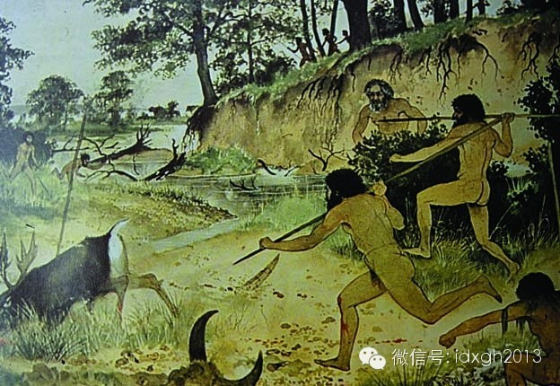
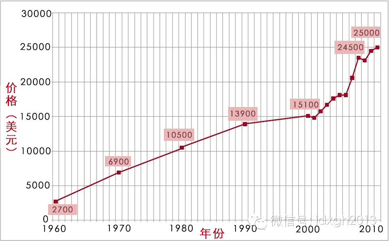

**钻石并不保值，甚至难以兑换。但是，正因为如此，千百年来，人类才在第一次表达爱情时，比起雄性螳螂送蝗虫，要高贵了一些。**

  

文/伊默  
  
雄螳螂并不比男人更看重爱情。广泛流传的雌螳螂交配时弑夫之说并非事实，只有百分之一的雄性螳螂成了爱人的点心——与雌螳螂婚配确实也有危险。实际上，很多雄性螳螂会
给雌螳螂送一只蝗虫作为聘礼。对于螳螂来说，蝗虫的贵重程度与人类的钻石戒指差不多。

  

送钻石戒指表达爱意的历史并不算太长。有案可查的第一枚钻石订婚戒指，是1477年奥地利大公马克西米连一世送给法国公主玛丽。

  

那一年，克西米连一世为玛丽的美貌倾倒，但玛丽已许婚于法国王储。于是，他采纳了亲信大臣的建议，送了一枚镶着又薄又平的M形钻石戒指给公主，打动了她的芳心。

  

而钻石被用于订婚仪式，是从1840年代才开始的。

  

【什么最能表达爱意】  
  

按一些人类学家的说法，在以打猎采集获取食物的原始时代，男女两情相悦表达爱意的方式颇具螳螂式的古风：男子会向心仪的女人送上一只小猎物，以博取心上人的欢心。

_原始人狩猎。_

  

然而，人类开始进入文明时代后，似乎出现了一种倒退：在大部分文化中，婚姻的基础并非两个青年男女之间的两情相悦，而是双方家庭的互相认可。双方家庭的财力才是决定性
因素。除印度等少数文化，缔结婚约时，总是男方家庭向女方家庭输送财物，而非向女方本人。

  

整体上，无论农耕社会还是游牧社会，婚姻的聘礼总是偏向实用性，农业社会是粮食和纺织品，游牧社会是牛羊马匹或骆驼。

  

越是富裕的家庭或社会，聘礼清单上的物品偏离实用功能的物品越多，譬如黄金和贵重装饰品这类物品都是财富的符号。在中国的“三年自然灾害”期间，一担萝卜就能娶回一个
新娘，新娘的价值倒退回了穴居时代。

  

然而，如果男女双方在婚前就已情投意合，他们互相赠送的礼物才能更代表爱情本身。

  

虽然兰花花给放羊的情哥哥送的手帕、汗巾依然带有强烈的实用性特征，但亲手做就，并特意绣各种花纹图案——不具备兑换的高附加值，才象征了爱情的非物质性特征。

  

文化人送给情人的礼物更有脱离实用性的特征。譬如给爱人贡献一首诗，谱写一首曲子，绘一幅画、绣一副花、或者以某些离奇的举动展示其浓浓的爱意。总之，比较东西方爱情
故事，不难发现人类表达爱情时互送的礼物，总是具有一些共同特征：

1，礼物是直接送给对方的；2、倾向于偏离实用性而强化其精神性；3、可兑换性很低，并且，如果成本越高而兑换性越低，其价值越高；4、必须是送礼一方的劳动，最好是
抽象劳动（这条很重要，文革时代结婚时互送的红宝书，具备了前三个特征）。  

  

对于能接受到这些礼物的多情女子来说，这些礼物的价值，远远高于获得她父母首肯的另外一个富裕家庭的聘礼。爱情的确是无价的，不能用财富来衡量的，至少在结婚前是如此
。

  

只是，在工业革命出现之前，浪漫的行吟诗人、四处游荡的文人才子、头脑发热的骑士，只是极少数的存在。也正是由于其稀少和罕见，在东西方，各种流传的爱情故事，都是由
他们写就的，奠定了爱情表达的基本技术套路。

  

在金钱没有污染大学校园爱情的浪漫年代，中国青年男女表达爱意的手段，基本没有超出诗人、骑士、才子与兰花花和王五构成的一个技术区间。

  

工业革命让人类拥有了爱情的机会和权利。大家庭模式解体，每个民族的包办制婚姻都因此动摇瓦解，年轻人获得了前所未有的独立和自由，爱情在每个年轻而美好的生命前招呼
，而闪闪发光的钻石，也在正前方不远处等待着。

  

【婚姻保证金与订婚标配】  
  

真正男女平等的社会基础才是爱情存在的广泛土壤。

  

即使在二战前的西方，女性婚后相夫教子的婚姻规则，也依然决定了女性在婚后处于从属地位。与农耕社会不同，缔结婚约时，男方向女方家庭大笔输送彩礼的习俗，逐渐改为送
给女方本人。

  

并非所有人都是浪漫诗人或艺术家。缔结婚约时表达诚意的最好方式，是实用性价值低但却贵重的黄金、宝石之类装饰品。而戒指从来都在西方的婚姻文化中具有特殊地位。

  

11世纪末12世纪初的夏尔特尔主教，通过对以往有关文献的整理，提出合法婚姻的缔结，除了双方同意外，还应具备以下条件：公开发誓、婚姻聘礼与陪嫁、交换结婚戒指、
牧师祝福。

  

如果是贵重的钻石戒指，那自然是更好的信物。而钻石戒指之所以成为爱情的信物，被认为是1888年组建后的、控制了全球钻石产销的戴比尔斯（De
Beers）公司的伟大营销成果——它让物理特性稳定的钻石成了爱情的象征。

  

不过，要让钻戒成为订婚的标配，单纯靠营销因素并不能完全做到这一点。美国乔治梅森大学长期从事与家庭相关法律研究的教授玛格丽特，对钻石戒指成为订婚标配的历史源流
，梳理出一个独特线索。

  

她发现，她以美国为例，钻石戒指的销量变化，与相关婚姻法律和性观念变迁具有高度的相关性。

_美国乔治梅森大学教授玛格丽特。_

  

1935年，美国印第安纳州首先立法废除了解除婚约的诉讼，它很快成为一个潮流，到1945年，美国16个州都通过了类似的决议。今天即便在还未废除解除婚约诉讼的州
，相关诉讼也已经名存实亡。

  

这项制度的存废带来的变化是：此前婚约被视为一种正式的契约合同——如果未婚夫毁约，准新娘可以将他告上法庭，并索要赔偿。男方不仅要赔付女方为准备婚礼付出的实际成
本，还可能支付悔婚所造成的精神损失。

  
受清教徒文化影响，当时美国人的性观念极为保守，不认可婚姻外的性行为。但年轻人缔结婚约后，很可能会发生性关系，如果男方悔婚，女方会因为不再是处女，名誉遭到毁灭
性打击，是日后婚姻和终身声誉的严重威胁。

  

玛格丽特怀疑，正是在此背景下，寻求婚姻安全感的女性将目光投向了钻石戒指——这是一笔昂贵的押金，它会大大增加准新郎的悔婚成本。

  

这项研究中，玛格丽特将包括戴比尔斯公司的大规模营销等诸多因素也包含进来，设计了尽可能多的变量，分别评估它们与钻石销量之间的相关性。

  

这些变量包括，价格、广告量、废除解除婚约诉讼的州人口占全国人口的比例、二战期间的投资额、以及适婚年龄人口比例。

  
研究结果显示，废除解除婚约诉讼是影响钻戒销量的最大因素。当法律不再是向“负心汉”讨说法的工具之时，钻戒成了女性对未来生活的安全感的来源。

  

而戴比尔斯公司的营销攻势，恰巧撞上了法律修改后为社会习惯留下的重构空间，拿下了订婚仪式所要求的奢侈品市场。

  
1960年代美国性解放，处女情结已成过往，被悔婚的女性也不会太多“贬值”。

  

1965——1980年期间，虽然美国人均收入持续上涨，但钻戒需求竟然开始下降。为此，戴比尔斯公司不得不调整策略：1980年代，钻戒之外的钻石首饰大量出现在广
告当中。从1980年起，钻戒的销量从未超过钻石首饰总销售量的20%。

  

是的，戒指依然是爱情与婚姻象征，但未必一定是钻戒。而在只同居不结婚比例奇高的北欧国家，甚至戒指的地位都不复以往。

  

【钻石不需要价值？】  
  

1982年美国《大西洋月刊》发表了一篇题为《你是否尝试出售一颗钻石》的长文，详细分析了戴比尔斯公司在全球的钻石营销策略。它粉碎了一个神话，认为钻石并不保值，
甚至无法兑换。

  

其实，无需此文，就能发现钻石根本无法保值——一件被源源不断地开采加工，却几乎永远不会被损伤的物品，必然无法长期维持高价。

  

虽然黄金也是抽象的财富符号，但黄金可随意熔铸再加工，钻石一旦加工成型就永远无法再改变其外在特征。

  

除了炫耀功能，钻石只有些微的工业价值。可以说，钻石是迄今为止价格与实用性悖离最远的东西，它与同具这一特征的文物、艺术品不同，不识字的人也会喜欢这些闪闪发亮的
东西，比起玉石、玛瑙，因为它来自文化先进的西方，它具有全球认可性。

  
必须感谢戴比尔斯公司日复一日的全球营销，像脑白金“送礼只送脑白金”一样，省却了无数人送礼的心思——如果你不是一个诗人、艺术家、或满脑子奇怪创意的人，只是一个
普通人，为打动爱人芳心，还有什么送钻戒更省事的办法呢？  
  

所以，在今天男女已经高度平等，早已不需要各种形式的婚姻保证金的中国，钻戒作为种普世先进文化的象征被广泛接受。  
  

不要因为你在网上看到了《大西洋月刊》那篇文章的翻译稿，就向她们介绍钻石不保值，甚至难于兑换，其实这无所谓，钻石只需要被认为是高价值的符号就可以了。  

_钻石价格走势图。_

  

理想的爱情信物本来就该如此，如果有良好的变现特征，它就离钱太近，而谈钱总是伤感情的。准新娘们也不傻，万一谈崩了，钻戒可以退，彩礼坚决不退，中国近年大量的悔婚
案例，清楚地表明了这一点。

  
大家都清楚，钻戒其实就是一种石头做的脑白金，它除了象征性，没有任何价值。

  
但是，正因为如此，千百年来，人类才第一次在表达爱情时，比起雄性螳螂送蝗虫，要高贵了一些。

  

[大象公会所有文章均为原创，版权归大象公会所有。如希望转载，请事前联系我们：idaxiang@idaxiang.org ]

[阅读原文](http://mp.weixin.qq.com/s?__biz=MjM5NzQwNjcyMQ==&mid=200203011&idx=1&sn
=ae32dea888ad603a967866a77b3c806f&scene=1#rd)

