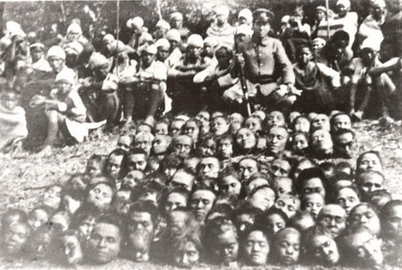
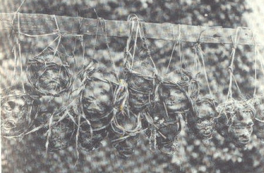
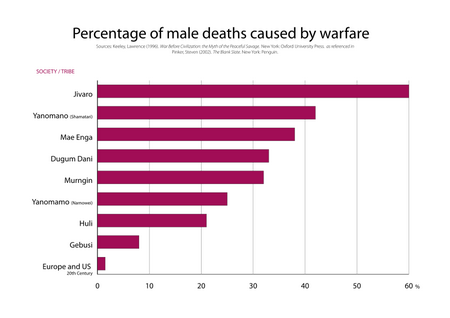
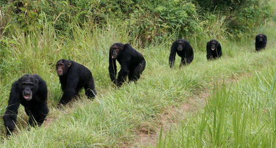
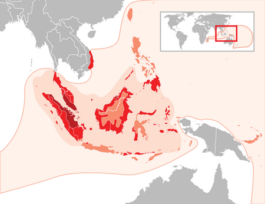
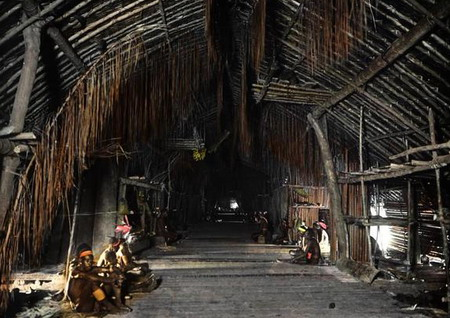

**只为猎取人头而杀人，曾是广泛存在于从美洲、南太平洋、东南亚到华南地区的习俗，各地对猎头的理由和动机解释完全不同，是什么原因让这些地区变成了人人恐惧的高危地带。**

  

文/辉格

  

冷兵器时代，战场上割取敌人头颅是世界各地普遍的习惯，敌人的首级通常是论功行赏的凭证。但在有些地方，杀人并猎取对方头颅并非有组织的军人行为，而是全民习俗，他们
往往不分战时与和平，仅仅是为了猎取其头颅，它会为了炫耀而被长期保存。这就是所谓的猎头习俗。

  

比如发源于台湾，后来广布于东南亚和太平洋的诸多南岛民族（Austronesian）中，一种专以猎取和收集头颅为目的的杀戮行动沿袭成风，乃至发展成著名的猎头习
俗，台湾原住民称之为”出草”，台湾电影《赛德克•巴莱》就曾描述过这一习俗。

  

雾社事件中亲日土著味方蕃猎取反日土著首级向日方领赏

  

在有猎头习俗的社会，头颅是重要的炫耀展示战利品。譬如新几内亚部落民会将它作为装饰品挂在房间，就像猎人喜欢把鹿头挂在墙上一样。

  

因为保存整颗头颅并不方便，于是就有了各种简化办法。北美大平原印第安人选择割取颅顶的一小块头皮，制作成舞蹈仪杖的缨穗，或装饰战袍和马辔的流苏；亚马逊丛林部落似
乎更看重头颅的本来面目，他们将所猎首级剔除头骨、留下皮肉，经用草药浸泡、填塞、烟熏之后，珍藏起来，用于宗教和节庆仪式。

  

大平原印第安人用来装饰马辔和仪仗的头皮

  

欧亚草原的斯基泰人和匈奴人，只保存头盖骨的颅顶半球，沿眉骨切下做成饮器，纪念和实用兼顾。头骨饮器后来在藏传佛教密宗那里演变成了宗教法器嘎巴拉碗，被用于灌顶仪
式。

  

嘎巴拉碗

  

展示猎头记录的徽章，也可以符号化的形式存在，只要有目击证人作证：吕宋山区的伊戈罗特人（Igorots）将猎得头颅集中悬挂在村社公共大屋外的旗杆上，猎获者则会
在身上文上特殊的猎头徽记表明其勇武；他们的邻居伊隆戈人（Ilongots）则用一种红嘴犀鸟头骨制成的耳环承担这一职能。

  

伊隆戈人将猎得头颅挂在栏杆上

  

**【当猎头成为风俗】**

  

在流行猎头俗的民族中，成功猎头并取得相应文身、饰物或头衔，成了男孩成长为真正男人和合格战士的前提，甚至是娶妻成家前需要完成的大事之一（尽管未必是必要条件），
它极大地激发了年轻人参与猎头的热情，这也成为相邻部落之间互相发动攻击的原因。

  

猎头俗无疑加剧了这些民族的群体间冲突，使得血仇循环世代延续。最糟糕的情形，是猎头心切的年轻人常常拿来访的客人下手，以至破坏群体间联盟关系，而这种关系是一个地
区秩序赖以维持的仅有资源。于是，每当新一代青年成长起来，新一轮猎头浪潮兴起，原本就脆弱不堪的秩序便荡然无存，陷入人人自危的状态。

  

河南郑州二里冈出土的商代头骨饮器

  

如此奇特的习俗何以能够存续？假如我们（像人类学家那样）去问猎头者，会得到各种各样的答案，都与某种迷信有关：这样才能让死去祖先的鬼魂安心，不至降祸于子孙；收藏
头颅可以控制被杀敌人的灵魂，使其不再成为祸害；从敌人头颅中获取对方鬼魂神秘力量，增强战士的勇气和战斗力；可以使粮食获得丰收，等等。

  

亚马逊的熏干首级

  

猎头者或许真的相信这些说法，但这并非令人满意的解释——与猎头有关的迷信五花八门，每个地区都有自己的一套说法，但这些理由完全不同的迷信却引出了如此相似的行为，
其背后当另有原因和规律。

  

**【霍布斯的诅咒】**

  

从有关盛行猎头俗社会的民族志描述中，有一个共同点很容易引起我们的注意：它们几乎全都缺乏超出最小血缘群体之上的政治结构：社会组织仅限于村社或游团（band）层
次，规模都在150人以下，没有政府，没有习惯法或其他制度化的纠纷解决机制，没有稳固的政治联盟，总之，没有任何可以维持最低和平秩序的制度元素。

  

这大概是最接近17世纪政治哲学家托马斯•霍布斯所设想的“自然状态”的局面了，只需一个小小修正：把“所有人对所有人的战争”换成更准确的“所有小群体对所有小群体
的战争”；实际上，近二十年多来，越来越多的学者相信，这正是上古前国家社会的基本形态，尽管程度有所不同。

  

托马斯•霍布斯（1588-1679）

  

地理大发现后，欧洲传教士和殖民者很早就注意到了前文明社会广泛存在的暴力现象，他们尤其对猎头和食人习俗尤为震骇，从美洲、大洋洲、非洲、东南亚，类似情景反复出现
。

  

1901年，一批传教士在新几内亚南部面积仅47平方公里的小岛戈阿里巴里（Goaribari）上，发现了一万多颗被收藏在村庄公共长屋里的头骨。

  

人类学家拿破仑•沙尼翁在亚马逊丛林对亚诺玛米人（Yanomami）做了30多年田野研究，生态学家贾瑞德•戴蒙德在新几内亚和西太平洋从事了数十年鸟类研究，他们
都与当地土著有着长期共同生活的经历。他们对这些社会得出了同样的观感和评论：暴力和恐惧无处不在，越出村社边界的旅行极度危险。

  

亚诺玛米战士

  

在1996年出版的《前文明战争》一书中，古人类学家劳伦斯•基利（Lawrence
Keeley）利用广泛的考古记录和人类学材料对上述状况做了系统性考察，得出了同样结论；2011年，心理学家史蒂文•平克（Steven
Pinker）在《我们的善良天性》中，提供了更多更广泛的数据再次确认了这一判断：前文明无政府社会近乎于霍布斯的自然状态。

  

《前文明战争》中的统计数字

  

为什么这些前文明无政府社会中会流行猎头习俗？

  

**【猎头的功能】**

  

对一个猎取了敌人头颅的年轻人来说，猎头行为直接向社区证明了他是一名优秀的战士，而成功猎头者的名声，以及它所标示的勇气和战斗力，还可以吓阻潜在攻击者，降低自己
和家人受攻击的机会。

  

它不但能为猎头者在群体中赢得敬畏、尊重和社会地位，最重要的是，会让他成为更受欢迎的夫婿，他不仅更有能力保护妻儿，还可提高女方家族的战斗力和安全感。

  

我们知道，一旦某项特性和能力成为择偶中被重点考虑的条件，其优势就会被性选择机制扩大和强化，在盛行猎头俗的族群中，猎头经历正是如此。

  

对群体而言，猎头习俗和能力也能带来两方面的好处：猎头俗可以让群体和猎头个体一样建立有关其战斗力、嗜血残忍和勇猛好战的声誉，从而吓阻邻近群体的攻击；通过持续的
猎头行动，可以削弱、驱逐、乃至消灭邻近群体，从而为自身的繁衍壮大争得生存资源和空间。

  

那些被人类学家观察到的猎头群体，其有幸存在于世，都要感谢他们的历代祖先在这场激烈而严酷的竞争中免遭败绩。

  

这一点人类和黑猩猩很像。简•古道尔和西田利贞在各自研究中都发现，黑猩猩群体的雄性成员会组成巡逻队守卫领地，并在巡逻过程中伺机猎杀相邻黑猩猩群体中的落单个体或
数量占下风的小团伙，那些在战争中命运不济的群体，常在几十年内被逐渐消灭，或者在一次成功偷袭中遭毁灭性打击。

  

黑猩猩边界巡逻队

  

这与人类学家在亚马逊丛林、新几内亚高地、吕宋山区、南部非洲的前文明社会中见到的情形极为相似；此类战争多以小股团伙路边伏击或凌晨偷袭的方式，通常单次伤亡不大，
袭击者往往杀死一两个人后即满足地立即撤退（在少数特别成功的偷袭中，也会发生灭门屠杀）。

  

虽然这种村落战争伤亡很小，但由于战争持续不断，它造成的总体死亡率非常高，大约1/4到1/2的成年男性死于这种冲突。

  

尽管前文明战争极为普遍，程度却颇有不同，有些社会虽没有现代意义上的政府或司法系统，但已经有了某些政治组织、纠纷解决机制和习惯法，这些制度元素发育状况参差不齐
，但多多少少能带来一些秩序。

  

为何群体间冲突和秩序缺乏在南岛表现得尤为突出？从台湾、菲律宾、印尼，到新几内亚和西太平洋，以猎头为直接目标的猎头俗也主要流行于南岛？

  

**【为何是南岛】**

  

答案或许要从地理特征上找，南岛地处欧亚、菲律宾、太平洋、澳洲四大板块交汇处，被挤压得满是褶皱，它由众多岛屿组成。这些岛要么本身很小，要么被层峦叠嶂分割得非常
细碎，在现代交通和通信工具出现之前，这种地区在政治上必定是高度碎片化的，这使得它既难以通过征服而产生超越村社以上的大型政治实体，也难以被一个中央权力所统治。

  

南岛民族分布

  

历史上，从部落、酋邦到国家，政治实体最初都是通过武力征服创建的，征服的速度必须足够快，才能确保共同体内在语言、文化、习俗上保持足够的同质化，以维系认同，也才
能确保控制各下级单元的统治者都是血缘关系足够近的亲属，以维系统治层的紧密合作。

  

但南岛的地理环境中，任何一个强大的社区都很难快速征服周边邻居。在那里，群体间的排挤、消灭、替代只能以小口蚕食的方式进行，消灭相邻群体的过程通常要持续几代人。

  

这样一来，即便最成功的氏族，当它扩张到足以构成一个部落时，已经过了十几代，各分支首领的亲缘已很远，文化不再同质，甚至语言都难以相通，假如这过程中曾经几度交恶
，更难再形成认同或结成联盟。

  

即便有幸建立了一定规模政治共同体，或者被某个外来政权所征服，像南岛这样地理障碍极大的地区，交通和通信上的障碍，使得有效统治在技术上不可行，短暂统一很快又会退
回四分五裂状态。

  

Goaribari的村社公共长屋

  

这些地区政治上的碎片化，也反映在语言特征上。语言学家将语言区分为两种：泛布区和马赛克区，前者是单一语种或内部差别细微的语系分布于一个大区域，比如印欧语、汉语
、突厥语、班图语，后者则是在一个小区域中呈细密网格状分布着大量相互差异巨大的语言，最典型的是新几内亚，该岛拥有1200种语言，占全球语言总数的1/5。

  

这两种格局，实际上对应了族群之间排挤、征服和替代过程的两种模式，从南岛、横断山脉、喜马拉雅和兴都库什，到高加索、巴尔干和阿尔卑斯，地理上的褶皱区域，在语言分
布上常表现为马赛克，在政治和社会形态上则表现为碎片化。

  

南岛另一个影响冲突强度的因素是人口密度，热带食物来源原本就较为丰盛，而且南岛民族大多已学会了农业，以园艺、游耕或精耕方式种植西米、番薯、芋头和水稻，饲养鸡猪
，吕宋山区甚至发展出了高度精细的水稻梯田和灌溉系统。

  

菲律宾吕宋山区的水稻梯田

  

农业支撑了比狩猎采集高出一到两个数量级的人口密度，大幅缩短了敌对群体间的距离，它意味着在同等技术条件下强化了冲突。

  

与此同时，南岛却并未像温带地区那样随着农业和定居出现国家，或其他任何赖以维持和平的政治秩序和制度安排，因而始终无法摆脱霍布斯的诅咒；在吕宋，猎头活动直到19
72年才在菲律宾政府高压之下得以平息。

  

是的，政府是一种恶，但它或许比人人自危的无政府社会之恶要小一点儿。

  

> 版权声明：  

> 大象公会所有文章均为原创，版权归大象公会所有。如希望转载，请事前联系我们： bd@idaxiang.org

大象公会：知识、见识、见闻

微信：idxgh2013

微博：@大象公会

投稿：letters@idaxiang.org

商务合作：bd@idaxiang.org

举报

[阅读原文](http://mp.weixin.qq.com/s?__biz=MjM5NzQwNjcyMQ==&mid=206118067&idx=1&sn
=fd9701818257ceb067e7660bbe91eda6&scene=0#rd)

