**龙的原型是什么？是蛇？是鳄鱼？是恐龙？是闪电？这些假说都没有证据，有完整证据链的，是猪，它起源于猪图腾。如此说来，难道中华民族竟然是猪的传人？**  

  

文/王冰  

  

龙是汉、朝鲜、壮、侗、泰、佬、掸、芒、苗等民族传说中，具有超凡力量的动物，近世在建构中华民族概念过程中，又逐渐成为中华民族象征物。今天，标准的龙具有鹿角、蛇
身、鹰爪、狗鼻、牛嘴、鱼鳞、虾须等复合特征，既像典型食草动物（比如有角），又像食肉动物（比如有爪牙）。

  

少有人相信古代有龙这样的动物，但它的原型是什么？近代以来学者们提出各种假说，根据龙的外形和它的某些能力，认为其原型主要是蛇、鳄等爬行动物，也有认为它是远古的
恐龙，甚至认为它的原型是闪电。

  

但是，这些假说考古上都缺少完整闭合的证据链。比如，龙若由蛇逐渐演进而来，出土文物中应找得到由蛇图形逐渐变成4条腿龙的完整证据链。反之，按初具龙形的出土文物演
进线索上溯，能否找到龙的原型？

  

距今约五六千年，出土于内蒙古赤峰翁牛特旗三星他拉村的C形玉雕龙，被称为中华第一龙，它于1971年被发现，是今天中国最著名的早期龙形象。

  

**【第一龙的长相问题】**  

  

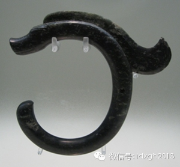

_“中华第一龙”玉雕_

  

这枚“中华第一龙”由绿色岫岩玉雕琢而成，因其呈C形，又被称为C形玉雕龙。它造型高度洗练、简洁抽象，颈部长鬣弯曲上扬，有腾云驾雾的动感，与后世造型繁复具象的龙
风格截然不同，乍一看有横空出世之感。

  

它的原型是什么？严格来说，它不属于我们熟知的任何实际存在过的动物，从躯体形象看，最接近的当然是蛇，而不是其他动物。那么，它的头部像什么动物呢？让我们放大它的
细部。

  

_“中华第一龙”玉雕头部放大_

_  
_

龙的吻部前伸，略略上翘，嘴紧闭，鼻端截平，有对称的圆鼻孔——它的头部与我们熟悉的龙差别很大，是否很像我们熟悉的某种动物？C型玉雕龙并非孤品，还有另外一个外形
完好的黄玉刻件，被称为中华黄玉龙，也出土于内蒙古赤峰翁牛特旗，与“中华第一龙”是同一时代的文物。  

  

_ 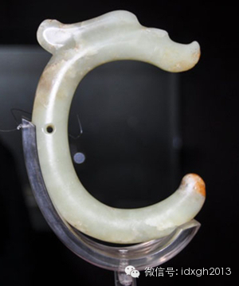_

_中华黄玉龙_  

  

C形玉雕龙和黄玉龙，因为非正规考古发掘，具体年代不易估算，但肯定属于红山文化。红山文化距今5000年—6000年前，由燕山以北、大凌河与西辽河上游流域活动的
部落集团创造，因其最早是在内蒙古赤峰红山后挖掘的遗址，故得名红山文化。  

  

一般认为，典型玉龙仅出现在红山文化中。而两例C形雕龙均发现于内蒙古赤峰市翁牛特旗，带有强烈的域型特征。其他绝大多数红山文化玉龙造型，都是类似的C形，我们不难
看出它的传承关系。

  

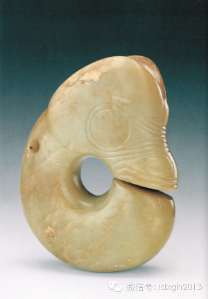

_天津博物馆征集的红山文化玉龙_  

  
下图是红山文化中两个很具代表性的龙形象。它们由于长得像猪，如今被统称为玉猪龙。右图中还长有野猪特有的獠牙，说它是熊或别的动物，确实不太容易令人信服。  

  

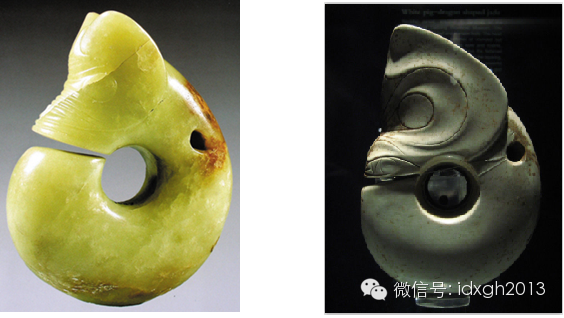

_左图：红山文化的玉猪龙；右图：带獠牙的玉猪龙（辽宁博物馆征集，出处不明）_

  

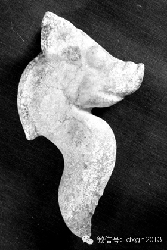

  

这个S形猪龙比C形龙要古老得多，它大约距今7000年前或者更早出现（处于兴隆洼文化和赵宝沟文化的过渡阶段），于河北北部的滦河流域征集，属于对红山文化产生过重
大影响的早期母体文化。说它不是猪而是熊，就需要很大勇气了。

  

陶器上的猪龙形象比玉猪龙更早，下图陶器出土于内蒙古赤峰敖汉旗，属于比红山文化更早的赵宝沟文化时期，距今7200年—6400年，它写实风格的野猪特征更明显。但
这种龙与后来的龙风格相似，都是野猪头加蛇身，而且也是S形。  

  

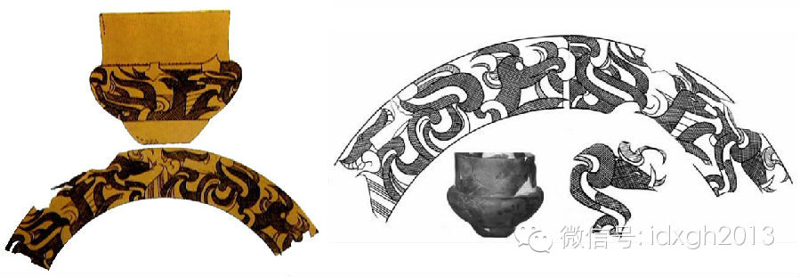  

_陶尊上的猪龙造型：赵宝沟文化猪龙图案S形构图_

  

比陶器上猪龙更早的，是石头堆塑龙形图腾，它出土于内蒙赤峰敖汉旗宝国吐乡兴隆洼村，属于比赵宝沟文化更早的兴隆洼文化时代，距今约8000年，由石块与猪头骨摆放拼
接而成。兴隆洼遗址是内蒙及东北地区时代较早、保存最好的新石器时代聚落遗址，是中国最早的旱地农业发源地之一，考古学界有“华夏第一村”的美誉。  

  

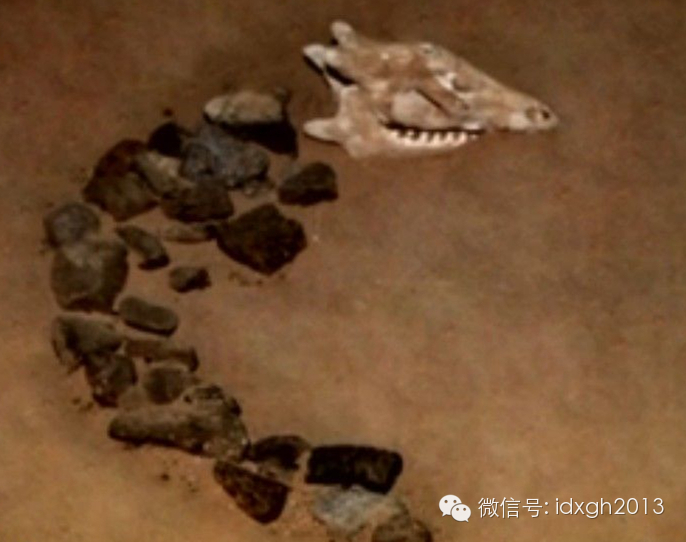

  

兴隆洼文化是中国目前发现最早的玉文化地区，值得注意的是，该地出土的多数玉器都是闭合的圆环被切开一个小口的C型（见下图），与附近地区后来出现的各种C型玉龙有强
烈的风格延续。这种C型玉器，推测是在金属工具出现之前，无法以钻孔方式在较厚的玉石中间切出内圆，只能用细绳由外切出一个小口方式加工。

  

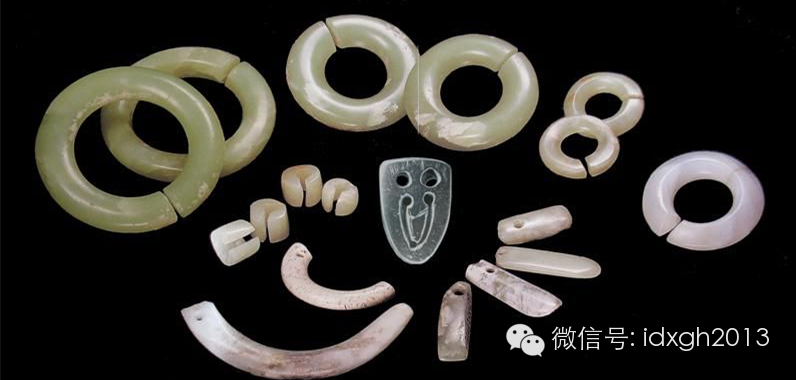

  

红山文化同时代的中原地区，考古未发现此类器物，但商人在中原建立政权后，玉猪龙的形象开始出现在中原地区。从外形上看，它与红山文化的玉猪龙带有强烈的继承关系特征
。

  

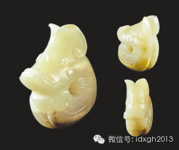

_商代玉猪龙，河南安阳殷墟出土_

_  
_

不过，商代的玉龙已与红山文化时期的玉猪龙形象有了相当差异，虽然也有C形和S形，但已由高度简洁抽象的风格趋于工艺更为繁复细致，这也许是商代的工具已大为进步，可
以雕刻更为复杂图案的缘故。  

  

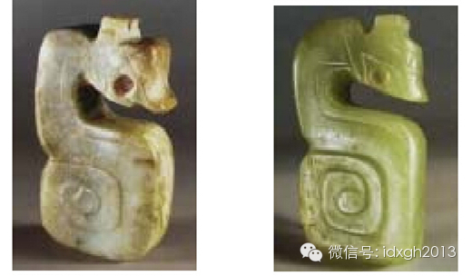

_S形玉雕龙 _

_C形玉雕龙_

  

商代的玉龙大多已彻底摆脱野猪形象，开始揉合其他猛兽特征，部分已略有今天龙的雏形。不过，即便玉龙的头面部已有巨大变化，但从整体形态上看依然有强烈的风格袭承，无
论是C形还是S形，都是细小的蛇形尾，并随着打破C形，尾巴也有了从内卷到外卷的各种变化。  

  

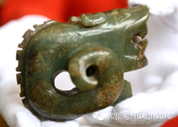

_商代卷尾龙_

  

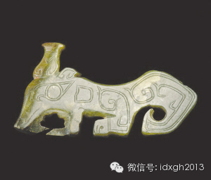

_商代玉龙，河南安阳妇好墓出土，造型更接近后世龙形_

  

周代的墓葬中也出土外形高度近似红山文化的玉猪龙。因现代技术手段无法确定玉器完成的具体年代，很难断定它到底是周人还是商人的作品。有专家根据《逸周书**世俘解》
中记载“凡武王俘商旧玉亿有百万”，认为周代玉猪龙很可能是商人的遗物。

  

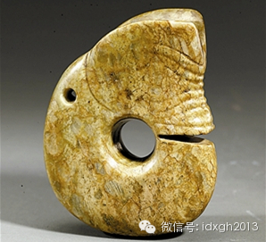

_周代芮国文物玉猪龙，陕西韩城出土_

  

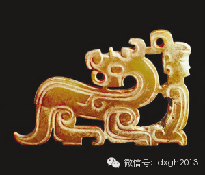

_周代人的龙玉佩，山西曲沃晋侯墓地出土，与后世的龙几乎没有太大区别_

  

读到这里，应该有读者强烈质疑了，“中华第一龙”难道不是1987年河南濮阳出土的贝壳堆塑的龙吗？  

  

**【谁是中华第一龙】**

  

论知名度，河南濮阳的“中华第一龙”现在早已超过C形玉雕龙。它还以《中华第一龙》为题进入了小学课本，文章带有强烈爱国主义教育色彩——结尾写道：“中华第一龙”的
发现，再次证明中国是龙的故乡，中原是中华民族的发祥地，中国人是龙的传人。

  

被认为距今约六千年的河南濮阳“中华第一龙”，系用贝壳堆塑（蚌壳标本C14测定距今6600年），一同出土的还有一头用贝壳堆塑的老虎，而躺在青龙、白虎间身高1.
84米的遗骸，很可能是黄帝颛顼。此外，该墓还出现了最早的“北斗”，一举将中国天文学起源时间，从过去的公元前1000年提到公元前4500年。濮阳因此被称为“龙
城”。

  

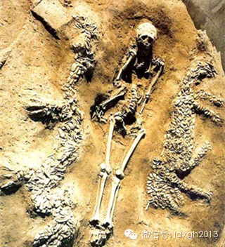

  

但濮阳“中华第一龙”的名头很快在1994年6月被辽宁阜新查海遗址发现的鹅卵石堆塑龙抢去，这条19.7米的长龙，距今约8000年，比河南濮阳的第一龙还要早14
00年。

  

濮阳考古队员在挖掘“中华第一龙”时曾有种种奇遇，而阜新考古队员碰到了更多的奇遇，据亲历者称，挖到石龙前的当晚，现场曾有“几道神秘的地光，时隐时现”。由于阜新
龙只是单独出现，既无白虎伴随，更无疑似三皇五帝的墓主，所以知名度很低。

  

这两条“第一龙”不可思议之处在于，它们都是孤立的存在，周边同一文化圈内没有任何与之相似的同时代龙形文物，而且一出现就风华正茂，外形与今天的龙高度相似。

  

如果我们以红山文化的玉猪龙为龙的起点，龙的外形就是个漫长的演进过程：先出现C型的圆环和S型的写实猪龙，后出现C型的玉猪龙，再演进为不像猪的龙，玉龙的尾巴也由
圆柱型断面，渐变为细小蛇尾，然后再内卷或外卷，汉代才由蛇形尾演变为鞭型，到了五代才开始出现狮尾，明清才开始变成鱼尾。

  

商代的玉器和青铜器上，大部分龙还没长出腿，但濮阳的第一龙不但有腿，而且腿上有四爪。虽然龙头努力想让人联想起像霸王龙之类的食肉动物，但龙尾的形状已经进化到接近
清代的龙尾。而“昂着头，弓着背，跃跃欲试，想要腾飞”阜新版第一龙，虽然肢体残损不完备，但在形体姿态上比濮阳的第一龙更像现代龙。

  

一直有人质疑河南濮阳第一龙（濮阳的黄帝墓葬未见任何彩陶之类随葬器物出土报道）和辽宁阜新第一龙，但它们毕竟被官方所承认，而且对提高中华民族的自信心和向心力贡献
巨大。  
  
所以，这样的表述或许是不会错的：龙这种动物，在中国历史上至少被独立创造发明了三次，前两次（阜新和濮阳）都是横空出世后就失传了。较晚的红山文化圈的人们只好重新
创造它，这次历时较长，由很像猪逐渐变得不像猪，最后才越来越像我们熟悉的龙的样子。

  

必须强调，并非所有人都用玉猪龙来称呼红山文化圈出土的龙，某些猪的特征不够明显的会被称为“玉熊龙”，就像河南濮阳的贝壳龙旁边刚好躺着三皇五帝中某一位一样，称之
为玉熊龙的重大历史意义在于，古史记载“黄帝为有熊”，熊崇拜正好与古代神话中黄帝的传说相吻合。

  

也有人认为，这些玉龙全都是熊而非猪，理由是“我们不是猪的传人”，称玉猪龙是“玷污了中华民族”。下图这个“玉猪龙”，就有人要求为之恢复名誉，改称“玉熊龙”。

  

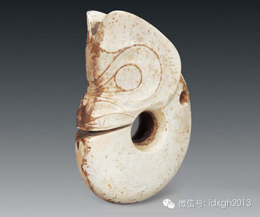

  

如果黄帝来自有熊氏，而玉熊龙是有熊氏象征的假说成立，黄帝就不是河南濮阳人，而是东北人了。那么，传说中的黄帝应该是哪里人？

  

**【龙自何方来】**

  

传统观念认为，中原才是华夏文明的源头，但龙的原始形象商代以前不见于中原（至少是埋掉后失传了），而此前有浓厚玉文化的地方，目前中国境内只发现两处：东北的红山文
化，以及长江流域的良渚文化（太湖东部浙江余杭县周边，距今约5300年—4200年，以最早发现遗址的余杭良渚得名）。

  

从出土文物的器形上看，红山文化圈的玉器不但数量大、类型丰富，而且工艺水准明显要远高于良渚文化。当代考古学大师苏秉琦先生曾提出：“黄帝时代的活动中心，只有红山
文化的时空框架与之相应。”

  

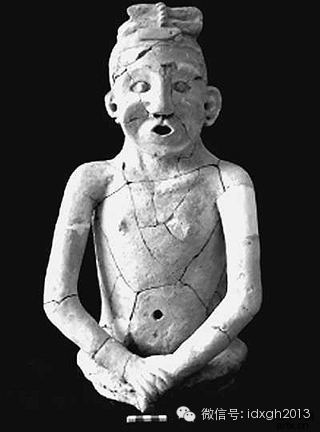

_红山文化出土陶塑人像，距今5300年_

  

当前的考古证据表明，玉猪龙出现在中原地区，应当不早于商代。商人起源众说纷纭，有中原土著说，有东夷说，有西来说，但越来越多人类学证据支持北方起源说。

  

体质人类学家发现，殷墟商人中上层墓葬人骨特征与平民人种差异较大，他们更接近东北地区的古人，即接近红山文化古人。而此类古代种系从未在商代以前出现在中原地区。人
类学家还发现，红山文化以及其后石器时代的考古文化古人，其种系特征较为单纯，与其他东北地区的古人接近，被称为“古东北类型”。

  

不过，青铜时代早期，一种最早出现在内蒙古中南部鄂尔多斯地区的种系开始出现在赤峰、辽西地区，到了青铜时代晚期，“古东北类型”种系在这一区域近于消失。几乎与此同
时，他们陆续出现在河北中南部、河南、山东等区域。

  

“古东北类型”种系的人群在离开故地后，玉文化在当地并未消失（辽西地区盛产岫岩玉），但玉龙却消失了。中原这时开始出现了玉文化。并且，这些玉器多非中原本地玉石雕
琢而成，而是用东北岫岩玉或和田玉（东北岫岩玉与和田玉成分很难区分，故有专家认为它们是和田玉）。

  

人类学家用古DNA技术分析殷墟商人与同时代其他古人之间的遗传学关系发现，商人与内蒙古赤峰地区青铜时代早期古人接近程度最高，这进一步支持商人北方起源假说。目前
，研究人员正在破解商人的父系基因密码，对比红山文化古人的父系血统，可以更深入地判断商人的父系血统起源。

  

如果DNA技术证明商王朝的统治阶层来自北方，那么与权力象征紧密相关的玉龙乃至龙图腾，应该是由北方红山文化圈带入古中原的。

  

红山文化的父系血统基因标记为N1*，这一遗传标记尚未被在当前破解的中原和江南古人的基因库中发现。有可能是红山文化古人或其兄弟族群从北方农牧交界地区带入中原，
并进而带入江南地区。

  

今天，这一遗传标记广泛见于包括汉族在内的东亚诸民族，尤其以藏缅语系的彝族和珞巴族最高，比例可超过30%。基于当前的小样本量研究，不同地域汉族之间差异较大，广
东汉族最高，可达15%，其他地方要低于10%。

  

而该基因家族万年前分离的兄弟家族，则广泛见于从西伯利亚东北到欧洲西北部的欧亚大陆北部区域。比如东方的雅库特人多数是此类型，芬兰人60%+，俄罗斯平均20%，
北部俄罗斯可达40%。

  

_红山文化古人所属的N基因家族在全球范围的地理分布图，颜色越深表示该基因家族成员比例越高_

  

俄罗斯帝国的“始皇帝”留里克家族便属于这一兄弟基因家族。只是在基因家族大迁徙的年代，他们可能尚未学会雕刻玉龙，或者生活环境没有玉石，否则，没准今天的俄罗斯人
也会自称“龙的传人”或“猪的传人”。

  

**【侯德健惹的祸】**

  

以野猪为图腾在世界史上并不鲜见。在原始狩猎民族中, 野猪是人们惧怕、崇拜的对象。农耕民族驯化出家猪后，并未影响图腾观念。比如珞巴人的米古巴部落神话中,
猪的形象是氏族女性始祖, 是生育和繁衍的期望。除了传说, 珞巴族还有与猪有关的祭祀仪式、宰杀禁忌等。

  

中国境内除了满、苗、珞巴、傈僳等民族都曾以猪为氏族图腾或存在猪图腾崇拜遗迹外，北方汉族地区也曾有类似习俗。《山海经》中有关于今天山西、河北及东北广大地区以猪
为图腾的记载。伏牛山、桐柏山地区的先民也以猪为图腾。

  

中国北方大部分地区都曾有埋葬猪骨的习俗, 来源于猪与地母的认同，这种习俗可以看作是图腾崇拜的一种表现方式。出土了石头堆塑猪龙形图腾的“华夏第一村”兴隆洼，就
有人猪并穴埋葬的风俗。其中一个地位特殊的墓主与雌雄两头猪同穴并列埋葬。

  

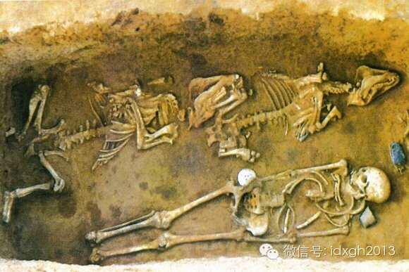

_兴隆洼文化人猪合葬居室墓_

  

中国社会科学院考古研究所的赵志军研究员也认为，那两条C型玉雕龙的出现，说明早期龙并不一定源于对自然神的崇拜，而有可能还是那时的动物崇拜，如野猪、麋鹿。

  

从六七千年前的猪到今天的龙，其逐渐定型完备要比我们通常的印象晚得多。汉以前的龙还是没有长出鳞片的走兽，大体到了唐宋时代，龙才定型为我们熟悉的龙的形状。但龙爪
、龙尾、龙首、龙须的形状此后一直在不断变化。

  

我们无法准确得知大体在什么时候龙开始成为权力的象征。传说周公旦（公元前1100年）所著的《周礼》中规定“五爪天子，四趾诸侯，三趾大夫”。不过《周礼》实际是西
汉末王莽时期（公元前45年－公元23年）刘向和其子刘歆的伪作。

  

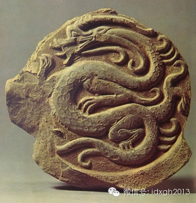

_汉代龙纹瓦当_

  

自汉代始，龙开始成为帝王权力的象征，其后两者之间的关系不断强化，最终在明清两代龙的使用权被皇室垄断，成为至高无上的帝王象征。

  

历史上龙从来没有成为中国的象征，更不是中华民族的象征，因为中华民族是辛亥革命后才构建的概念。它成为“中华民族”的象征，是更晚的事——1978年，台湾音乐人侯
德健谱写了《龙的传人》，1980年代初，经香港歌星张明敏演绎后风靡大陆，龙的传人由此深入人心。

  

_1988年春晚侯德健演唱《龙的传人》_  

  

如果没有侯德健，很难想象龙会被拔高到如此程度，蒙古人不称自己为苍狼白鹿的传人，突厥语民族不称自己为狼的传人，法兰西人不称自己是鸡的传人，大约是因为他们都缺少
一位侯德健这样音乐文化人的缘故吧。

  

当中国人普遍接受自己是龙的传人时，若得知龙的形象竟然源于猪图腾，确实情感上难以接受。不过，下面的发现或许是个好消息：

  

考古学家通常认为红山文化古人以农业生产为主，但有体质人类学研究者发现，红山文化古人的龃齿率与其他狩猎民族相近，低于同时代中原地区的农耕民族，他们因此认为，直
到旱地农业文化更深入发展的红山文化时代，狩猎仍占有重要地位，这可能意味着红山文化的猪骨遗存仍可能是狩猎所得，而非人工饲养。

**  
**

就是说，我们祖先曾经崇拜的是野猪而非家猪。

  

> 版权声明：  
大象公会所有文章均为原创，版权归大象公会所有。如希望转载，请事前联系我们： bd@idaxiang.org

大象公会：知识、见识、见闻

微信：idxgh2013

微博：@大象公会

投稿：letters@idaxiang.org

商务合作：bd@idaxiang.org

[阅读原文](http://mp.weixin.qq.com/s?__biz=MjM5NzQwNjcyMQ==&mid=202943585&idx=1&sn
=301db9b107e15b763f33d716e2628633&scene=0#rd)

