**国家队制服的配色都与国旗有关吗？西班牙队小组出局是由于球衣诅咒吗？球衣记录着沧海桑田的往事。曾经，廉价床单是今日豪门选择的队服；更有甚者，一支穿着百年前版式队服的球队成为六冠王。**

  

文/Vince Chin

  

2014年世界杯第一场半决赛，踢出一个不可思议的比分。对伪球迷而言，7分钟完成4粒进球的德国球员，在视觉上显得有些陌生。毕竟最为人所知的德国色彩是白上衣和黑
短裤，而非客队战袍的红黑相间。

  

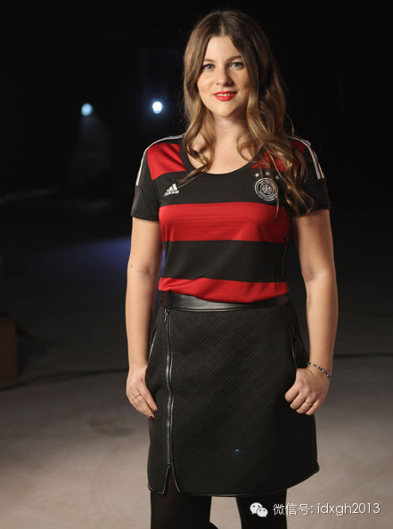

本届世界杯德国队的客场队服

  

**【国旗、传统和标志】**

  

大多数国家队球衣，尤其是主场球衣往往根据国旗配色来设计。比如阿根廷的蓝白间条衫、葡萄牙的绛红色球衣、英格兰主客场的白红色队服。但每一个理论都有例外：意大利、
荷兰和德国这三个传统欧洲豪门的主队球衣，似乎与现今国旗关系不大。

  

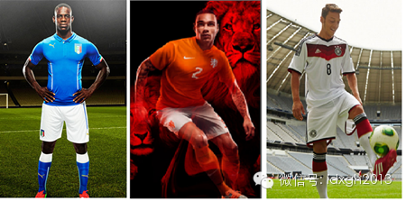

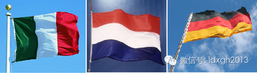

意大利、荷兰、德国的主队队服和国旗

  

据说意大利的蓝色队服是由法西斯党魁墨索里尼亲自指定，但据考证：早在第一次世界大战前意大利就使用了蓝色队服。当时，作为盾形徽章的蓝色外围确实存在于意大利国旗中
心。1946年意大利公投废除君主制后，代表着萨伏依王室的徽章被永久移除，蓝色元素就此消失，退位的国王维托里奥**伊曼纽三世也于第二年去世。

  

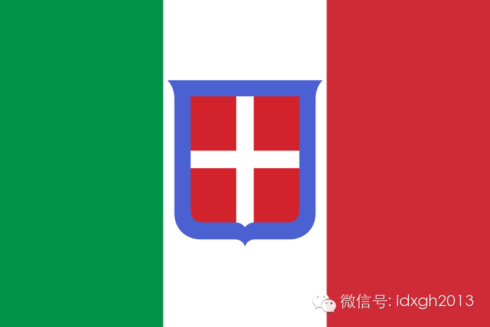

意大利王国国旗（1861年—1946年）

  

几小时后，身披经典橙色战袍的荷兰队，将作为主队参加另外一场半决赛。橙色虽没进入荷兰国旗，但在历史中地位极高。

  

现代荷兰的国父是威廉一世奥兰治亲王（荷兰语：Prins van Oranje），他于1565年组织贵族们反抗西班牙对尼德兰的统治，虽然多次失败并死于非命，但
奥兰治—拿骚家族的子孙们前赴后继领导着“建国大业”，终于在1648年赢得独立。现存最古老国歌《威廉颂》还吟唱着他，而其名字奥兰治（Oranje）在荷兰语里便
是橙色之意。

  

荷兰独立之初，最早的国旗就是“橙、白、蓝”三色的奥伦治亲王旗，直到荷兰航海业迅猛发展，因船上挂的三色旗辨识度差，橙色才为红色替代。

  

德国队经典的白黑队服曾陪伴德国队三夺世界杯，这两个主色调取自近代德国统一的主体普鲁士的国旗颜色，统一后的德意志帝国旗帜中，黑白两色也居于旗帜上方。

  

普鲁士国旗与德意志帝国三色国旗

  

**【白色的诅咒】**

  

如果不是今天凌晨那神话般的7：1，本届世界杯最让人震动的比赛恐怕是卫冕冠军西班牙以1：5负于上届世界杯决赛对手荷兰。

  

西班牙在这场比赛中所穿球衣颇为诡异。本来西班牙主场和客场队服分别为红与黑，结果赛前国际足联认为西班牙的红色与荷兰客场队服拿骚蓝同属深色调，在电视转播中可能会
造成视觉混淆，因此阿迪达斯临时为西班牙赶制了一套第三队服——主色调为白色。

  

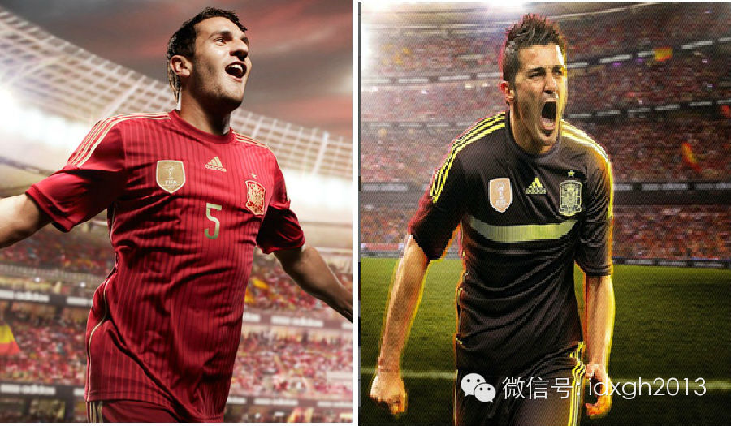

本届世界杯西班牙主客场队服

  

查阅既往征战历史，很容易理解西班牙人口中的“白色魔咒”意味着什么。1994年美国世界杯，身穿白色球衣的西班牙被意大利的两个巴乔淘汰出局，恩里克更是被塔索蒂肘
击血染赛场。

  

1998年法国世界杯，在劳尔领衔的西班牙队中，守门员犯下低级失误，令白色球衣的西班牙2：3负于非洲雄鹰尼日利亚，导致小组未能出线。2004年的欧洲杯，白衣西
班牙在1/4决赛被东道主葡萄牙淘汰。

  

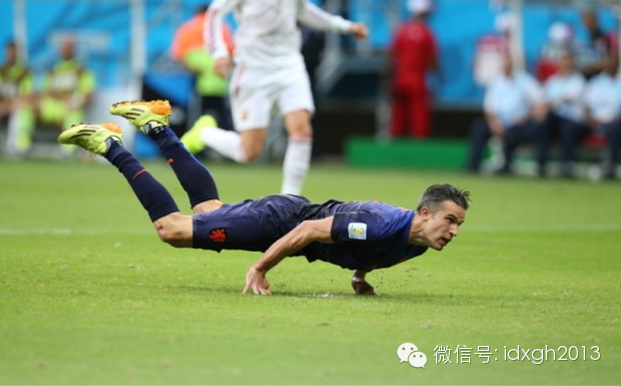

上半场结束前，荷兰队范佩西一记超人鱼跃将比分追平。下半场荷兰连续攻入4球，将身着白衣的西班牙队击败

  

西班牙如此表现，不禁让人联想起另外一支常穿白衣的球队，他们就是：

  

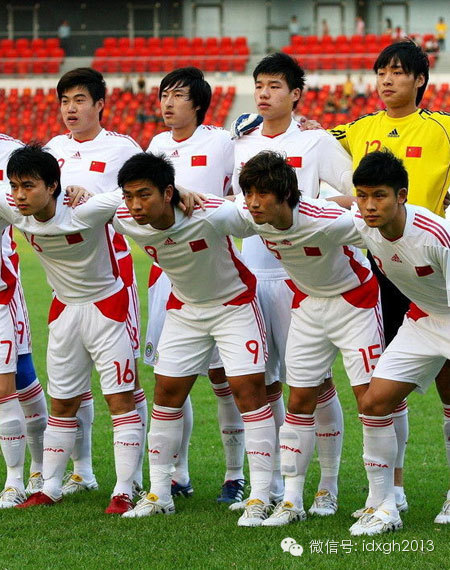

  

其实，白衣魔咒并不是西班牙的专利。与白色球衣有关的最大悲剧莫过于1950年的“马拉卡纳惨案”。当时世界杯采用循环赛制，东道主巴西只要在对乌拉圭的比赛中战平即
可主场夺冠。然而乌拉圭队吉贾的绝杀，令巴西以1-2错失雷米特杯。此后半个世纪，每一个巴西人都无法忘记那一年7月16日下午发生的噩梦。此役巴西使用的白色球衣也
被弃用，时年19岁的报社插图师阿尔迪尔**加西亚**希利以巴西国旗为蓝本设计了现在还在使用的黄蓝球衣，成为了足球史上最经典的队服之一。

  

现在，似乎到了巴西弃用这一版本球衣的日子了。主场身着黄蓝球衣1：7负于德国，必定成为未来至少半个世纪里巴西人不愿回想的过往。

  

**【最炫英伦风】**

  

英国人不仅确立了现代足球运动规则，在球衣款式与流行趋势上也做出了铭记史册的贡献。“早期，英国在球衣设计领域遥遥领先于其他国家。他们的球衣穿起来舒适，甚至看上
去都赏心悦目。”毕尔巴鄂竞技队博物馆馆长约翰**佩洛斯如此解释。

  

1879年，全世界第一家足球运动装备制造商Bukta诞生在英国。此后不久，Bukta开始提供舒适的纯棉球衣，其他地区使用的羊毛球衣显得过于落伍。因此在球衣方
面，其他国家都乐于向英国“取经”。

  

在足球运动早期，区别两只球队的办法是帽子、绶带等外部配饰，配饰在激烈的拼抢中极易掉落，而双色间条衫要比传统纯色球衣更易区分，于是色彩多样的间条衫迅速风靡全英
足球俱乐部。

  

很快，整个欧洲甚至全世界都开始模仿英国。巴塞尔、多特蒙德乃至巴西的桑托斯在建队时都披上了间条衫。效仿球队中最有名的莫过于意大利豪门AC米兰。1899年，球队
创始人兼首任队长英国人赫伯特**吉尔平亲自设计了米兰队服。曾在服装厂工作的吉尔平深谙英国球衣的优点与特色，便将间条衫引入意大利，并辅之以红黑两色配色，创造了
足球史上最著名的红黑间条衫。

  

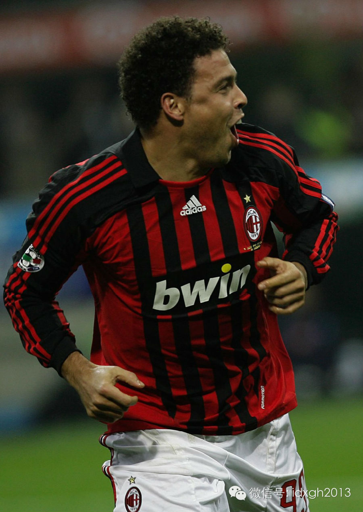

罗纳尔多身着AC米兰的红黑队服

  

最廉价的间条衫是红白配色。传言当时的床单大多如此，用下脚料制成的球衣立刻赢得了很多经费紧张的小俱乐部的喜爱，例如当年的南安普顿和桑德兰俱乐部。为了能够穿上更
加舒适、更加时尚的球衣，西班牙毕尔巴鄂竞技队的球员胡安•洛蒂在1910年的圣诞假期到英国采购球衣。

  

身着蓝白球衣的胡安•洛蒂本想继续延续球队的传统，购买蓝白球衣，但最后买到手的却是南安普顿的红白间条衫。自此红白两色成为毕尔巴鄂的传统色调，其主队与梯队一直在
使用，而梯队就是后来大名鼎鼎的马德里竞技，与母队一样身披红白间条衫的马竞随后成为了世界球迷口中的“床单军团”。

  

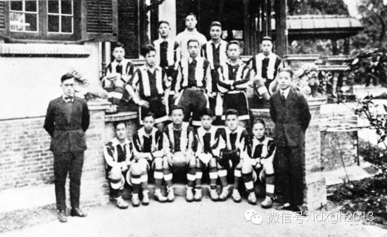

1901年，上海圣约翰大学成立足球队，球队队服紧跟时代潮流

  

并不是所有俱乐部都热衷于间条衫。少数俱乐部如诺丁汉森林选择使用纯色球衣，另外一些俱乐部则使用双色竖块平分的队服——可视为做“粗体”间条衫。1899年，历史上
最著名球队之一的巴塞罗那成立，其中一名英国创始人将半红半蓝的队服带回了巴萨。巴萨建队110周年时，俱乐部复刻了建队时半红半蓝款式的球衣。身披这套战袍的巴萨队
员夺得了前所未有的六冠王战绩，成为国际足坛的新传奇。

  

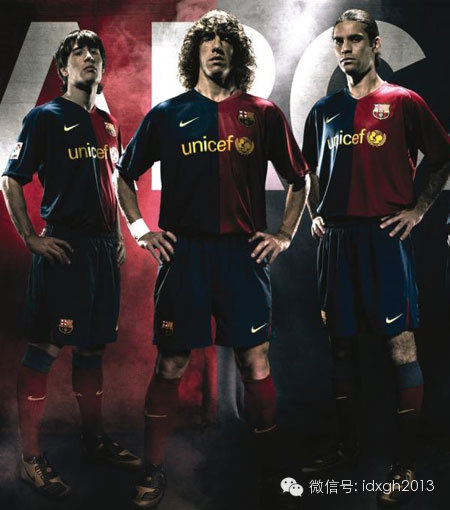

身着传统战袍的巴萨在2008-2009赛季势不可挡

  

**【复古风，新时尚】**

**  
**

从最早的由羊毛下脚料做成的粗糙球衣，再到棉质球衣，再到现在由复合布料制成的高科技球衣，球衣在不断进化。不过，除了在“上古时期”曾短暂出现的衬衫式球衣彻底退出
历史舞台外，球衣的款式在这百年来基本没有太大的革新，样式上稍微改进都会引起球迷的吐槽与议论，甚至会遭到国际足联的处罚。

  

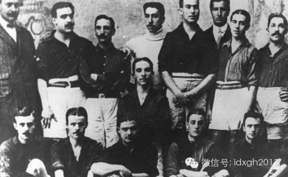

巴萨20世纪初期的球衣，类似衬衫样式

  

“非洲雄狮”喀麦隆队曾打算身披“无袖球衣”征战2002年世界杯，但这种“过于超前”的款式却被国际足联所禁止；几年后，喀麦隆又穿上了前所未有的“连体球衣”，更
是在2006年世界杯非洲区预选赛中被扣掉6分积分。

  

国际足坛并不是十分热衷于对球衣的款式进行大幅度创新。不过，现在人们却可以在球衣上看到越来越多的向传统致敬的复古元素，而这也成了当下国际足坛在球衣设计上的新趋
势。

每逢大赛，各个国家队也乐于将一些传统战袍上的经典元素融入到新球衫上，以求球员能够复制前辈的成功。

  

2010年南非世界杯上，荷兰、阿根廷和英格兰三队的球衣上都融入了极其明显的复古元素。荷兰主场球衣参考了1974和1978年两夺亚军时的球衣样式，如黑色衣领和
黑色球裤；于是成功的再次夺得亚军；阿根廷的主客场球衣的设计灵感来源都来自于1986年的世界冠军球衣；英格兰队的红色球衣更是直接以1966年夺冠时所穿的球衣为
蓝本来复刻。

  

从视觉角度来说，复古未必就能赢得球迷的喜爱，而创新也有可能得到意外收获。上赛季利物浦第一客场球衣借鉴了上世纪80年代利物浦全盛时期的球衣元素，但其独特的钻石
纹图案被红军球迷调侃“看得眼花缭乱”；而2012-2013赛季的巴塞罗那主场队服创造性地运用了渐变色风格，成为了夺冠赛季的经典球衣。

  

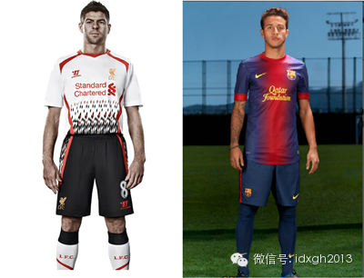

利物浦的“钻石”与巴萨的渐变色

  

> 版权声明：  
大象公会所有文章均为原创，版权归大象公会所有。如希望转载，请事前联系我们： bd@idaxiang.org

大象公会：知识、见识、见闻

微信：idxgh2013

微博：@大象公会

投稿：letters@idaxiang.org

商务合作：bd@idaxiang.org

[阅读原文](http://mp.weixin.qq.com/s?__biz=MjM5NzQwNjcyMQ==&mid=203292755&idx=1&sn
=3fa8e16a871f17660108ecf01a52b27c&scene=0#rd)

