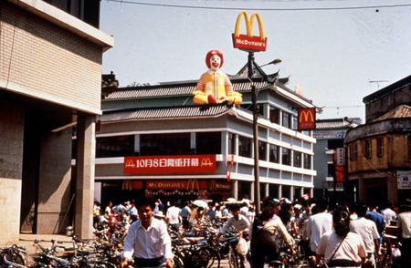
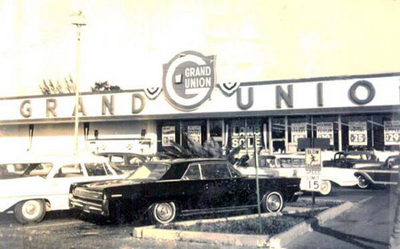
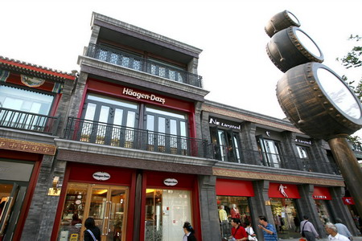
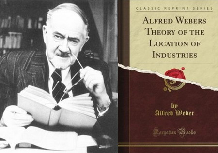
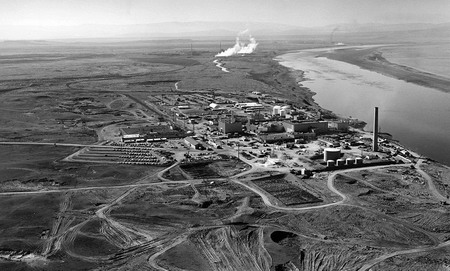
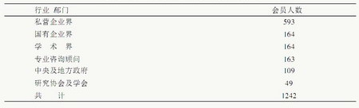
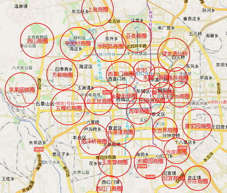

**西方商铺选址常会用到一套非常精细的分析工具，它早已发展成为专业学问，这无疑是一项先进的生产力，但它在中国用得着吗？**  

  

**文/刘宇 王光举**

  

商铺应该开在什么地方？

  

很多人会回答：人多的地方。国内有些零售学教材会细致些，区分多项要素：人口，交通，收入，房租，楼层，最终“综合分析”。网络上火热的帖子还会反复提及家乐福、沃尔
玛的选址圣经，基本是要素组合的翻版。

  

不过，这些笼统的原则实际上很难化为操作经验。更多中国的商业选址依靠个人经验和直觉，远远没有精密型选址学的应用。

  

但中国人受精密型选址学的冲击感受却很普遍。1987年、1990年，肯德基、麦当劳进入中国，前期每个店铺都堪称选址学案例展示。他们花费数月做调研、评估——厚厚
的选址规范，都让人们觉得新鲜。原来，除了挑人多，选址还有更复杂但更有效的路数。

**1990年10月8日，中国内地第一家麦当劳餐厅在深圳市解放路光华楼西华宫正式开业。当天，无数深圳人举家前往，等候的队伍从餐厅二楼排到一楼，再绕着整个光华楼转了一圈**

  

洋品牌选址有什么秘诀吗？

  

确实有，而且应用繁杂，远不止零售选址。欧美国家早已发展出将运筹学等应用数学手段与商业经验结合的精密选址学，今天，甚至工业工程、系统工程等学科都有可与精密选址
相关的研究方向。

  

不过，国外商家的选址秘技虽然耀眼炫目，它们在中国的实践运用到底效果如何，以及它对中国商家的参考价值几何，都需要打上大大的问号。

  

**【西方的先进生产力】**

  

在今天的欧美国家，商铺选址已经普遍告别依赖个人经验或直觉，多依赖成熟的精密商业选址工具计算分析。对普通商家来说，有大量发行印刷的读物指导他们如何商业选址。如
1980年的《Market Research For Shopping
Centers》，包含了大量的运筹学公式，考虑的极为细致，包括驾车距离与购物中心大小的比例，对预定区域分级销售区的细致划分等。

  

商业精密选址工具的广泛运用和大量专业选址服务公司的出现，使得同一个街区内必然会有的银行、服装店、大众餐馆、高档餐馆、便利店、高端品牌店，会根据完全不同的选择
策略，选择与谁毗邻甚至是在马路的哪一侧。

  

而大型连锁企业的要求就更高，常会将第三方选址服务公司的咨询结合自身经验设计算法组合。家乐福、沃尔玛等巨头，则有独立的选址部门，每个新店都有单独的调查，将数据
传给总部分析人员，最终由总部确定新址。

  

对跨地域经营的商家来说，社会形态和经济发展水平的差异，当然会让在不同地区选择完全不同的选址策略。

  

以大型超市为例，在美国、澳大利亚、加拿大等发达国家，因为汽车普及高，且人口密度较低，高速路出口附近往往是选址重点，大型购物中心往往不会在地价高昂的市区选址，
而会在多个城镇均可驾车抵达的郊区。而欧洲的法、德等国，因为人口密度相对较高，超市多会更贴近市镇选址。

**美国迈阿密迪克西高速路旁的Grand Union购物广场，摄于1964年**

  

同一商家在不同社会的定位差别也决定了选址倾向。如山姆会员店，在美国是会员制低利润的仓储卖场，但在中国，更偏重中高层白领。因此，遍布美国各地的山姆会员店，到了
中国就只亲睐北上广等大城市，并且不像其他超市设在人口密集的市中心，而是位于靠近高速公路的地段，并配有超大停车场。

  

更离谱的是哈根达斯，在美国是街边店，人流量是其选址的最主要衡量指标，到中国却非市中心不进，非大型商场不入的中高档冷饮店。

  

不过，这种20世纪中叶才逐渐成熟的统筹分析工具，很大程度上形成于战争时期。

**位于北京前门大街的哈根达斯专卖店**

  

**【战争与运筹学】**

  

人类自定居始，就有了选址问题，自然会发展出各种选址方法论，譬如中国的风水学也算是一种前现代的选址学。

  

真正第一次将选址问题精密化的，是19世纪末的德国经济学家。当时，德国刚完成统一，工业发展迅猛，科学研究水平居欧洲前列。

  

1909年，吸收了屠能（ Thuunen）等前辈的经验，经济学家阿尔申尔德•韦伯（Weber）出版了《工业选址（区位）理论》，研究单个仓库到不同客户的总距离
如何达到最短，将选址问题转化为可以被计算、讨论的经济学问题。

**阿尔弗雷德**韦伯与他的著作《工业选址理论》**

  

当时商业并不发达，商业选址重要性远不如工业。之后的选址的零散研究主要集中于工厂、城镇的位置研究，即使与商业相关，也是供应商的选址，并非现在被关注最多的零售选
址。

  

但战争意外加速了研究水平的提升。第一次世界大战爆发后，参战国各行业的专家被动员组织参与研究军事项目。许多人逐步摸索出了粗糙的运筹学方法，如美国的T.A.Ed
ison用统计方法研究海军舰艇对付潜艇的最优战术。

  

战争不仅催生了新研究，还为以往的猜想提供绝佳的验证机会。一战前，英国工程师F.W.Lanchester用微分方程研究兵力部署，推论出集中兵力原则，残酷的战争
很快为其提供了证据。二战更深入地推进了运筹学发展，尤其是英、美两国，都出现了运筹学小组。Operational/Operations
Research（运筹学）一词也来自于这批科学家的自称。前苏联也很快有了类似的组织。

  

通过对雷达应用、商船护送等问题的研究，军事运筹学逐步完善。运筹学成了战争的意外收获。据保守估计，二战中英国、美国、加拿大在运筹学机构服务的总人数超过700名
，产生了线性规划、整数规划、图论、网络流等等影响深远的理论。

  

这些理论成果在选址问题的运用，主要来自美国政府主导的大型项目。典型的是40年代初为核武器提供材料的汉福德工厂。汉福德核工厂需要考虑规模、污染、原料供应、保密
等因素，十分复杂，多方考量后，最终经过建于华盛顿州。

**坐落于哥伦比亚河畔的汉福德核工厂，摄于1960年**

  

战后，这些经验、成果很自然的被运用于其他领域，尤其受大公司注重。50年代末，半数美国大型公司将运筹学的方法应用于经营管理。

  

而战后经济国有化的趋势也带动了应用数学，尤其是运筹学的传播。1964年，英国运筹学学会有1242名会员，分布在国有、私营企业、学术界等，成为一时显学。

**1964年英国运筹学会会员分布概况**

  

此后，精密化的选址学蓬勃发展。统筹学本身的发展当然重要，更关键的是战后西方商业逐渐逼近工业（制造业）在国民经济中的地位。除了前苏联，运筹学强国美国、英国在商
业选址时都开始使用运筹学方法。计算机的出现更让运筹学等方法得以广泛应用。

  

1980年代，随着外资进入中国，这种先进的生产力也有了在中国一展身手的机会。

  

**【洋工具与中国国情】**

  

其实，中国也可算是与西方同步将运筹学运用于选址的先进国家。

  

1956年，在钱学森等人推动下，第一个运筹学小组在中科院力学所成立。很快就开始了选址研究——服务于“大跃进”。典型例子就是“打麦场选址”：如何在手工收割情况
下提高生产效率。

  

此后，运筹学的数学家集中精力于“实践”问题，华罗庚是其中的先锋人物。1958年后，知识分子背负着沉重的压力，千方百计为生产服务是他们少有的活动空间。时任数学
所所长的华罗庚主张“联系实际任务”，运筹学、选址学被寄予希望。

  

1960年，山东济南召开全国运筹学现场会议，主要内容便是交流各地区“大搞运筹学群众运动的经验”，让线性规划得到更广泛运用。

**随着运筹学的“大搞”，中国各地纷纷响应号召成立研究会。图为六十年代初期的华东师大数学系运筹学研究室**

  

显然，运筹学连打麦场选址这个阵地都丢失了。当时的中国社会确实不需要选址研究。与苏联更尊重理性，尊重专家规划不同，政治挂帅的中国基本取决于长官意志。毛泽东曾设
想过将来每个县都建一个飞机场、一两所大学。

  

但1980年代后，西方成熟的运筹学选址方法进入中国后，很快发现老革命遇见了新问题——许多注重科学选址的西方企业发展远远不如同类中国企业，大型超市中选址最为精
细的沃尔玛，反而不如更注重本土化的家乐福扩张顺利。

**沃尔玛与家乐福，自登陆中国伊始便是你争我赶**

  

为什么会水土不服？

  

因为中国实际上是个不需要精确选址的奇特国家。

  

逻辑上，商业选址是根据现有环境及其预测，分析出合理的商业区位候选，再由经营者决定地点。但是，如果能够提前了解城市规划方案，甚至干脆一切反过来，商家先选址，再
影响城市的未来规划，那么还需要费力分析、预测吗？

  

由于在中国的城市化过程中，资本的作用太重要，而土地资源又掌握在渴盼投资的政府手中，城市扩方向张完全可被行政力量改变。如果资本与这种强大力量保持良好关系，“X
X建到哪里，市中心就是哪里”并不是梦想。

  

另一方面，精密选址学不断发扬光大的西方，早已完成了城市化发展，而中国的城市化高速发展，变化比计划还快是一种常态。一家大型外资商业机构专司规划的高官曾感慨：闭
着眼睛在北京地图上扎图钉，选出的都是好地段，这种情况下，精密选址反而不如放手扩张的效果好。

**北京五环内商圈概览**

  

中国城市的街道特征，也往往让西方的经验完全失效。中国宽阔的马路对步行购物者犹如阻断交通的河流，所以，即使两家大型购物中心对街营业，互相影响也非常有限。

  

今天，那些海外学成了精密选址相关专业的学子们，尴尬地发现自己的专业成了“屠龙之技”，不过，他们或许值得等一等。——理论上，过了城市大规模扩张的阶段，城市格局
成型，精密选址学应该会有用武之地。

  

但中国的情况毕竟独具特色，比如北京。2014年8月，消息称北京市发改委原则上不再批准四环以内的商业用地，即使特批，也不会超过1万平方米。

  

也许，只有在小型连锁超市才是选址理论应用的希望。

  

**版权声明**

****大象公会所有文章均为原创，****  

****版权归大象公会所有。如希望转载，****

****请事前联系我们：****

bd@idaxiang.org

****知识 | 见识 | 见闻****

阅读

__ 举报

[阅读原文](http://mp.weixin.qq.com/s?__biz=MjM5NzQwNjcyMQ==&mid=208530727&idx=1&sn
=733ab79adb15d1dee66c5aed344150eb&scene=1#rd)

