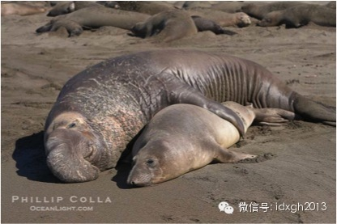
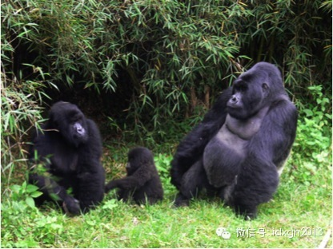
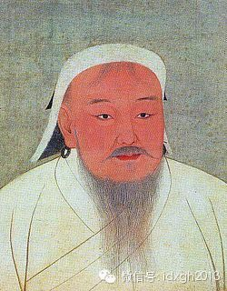
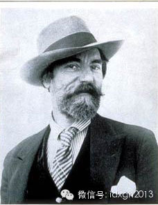

**人类不像动物靠体力争夺配偶，对男人来说，权力、财富、名望才是性竞争力的体现，虽然进取型的男人拥有强大竞争力，但稳妥型甚至浪子型的男人，并不是没有机会，尤其是后者。  
**

  

文|辉格

  

“男人有钱就变坏，女人变坏就有钱”、“男人喜欢年轻漂亮，女人需要安全可靠”之类的总结，虽然片面，但却抓住了某些真实的事实，只是实际情形比这些段子所表达的内涵
要复杂而微妙得多。正是人类性策略的微妙之处，很大程度上塑造了我们的心理和文化。

  

在讨论男性的性策略之前，不妨暂时放下人类，看一个蜥蜴的例子。在发表于1996年和2000年的两篇论文中，生物学家巴里**西内尔沃（Barry
Sinervo）和他的同事介绍了美洲侧斑鬣蜥（学名：Uta
stansburiana）的性策略，这种蜥蜴按喉部颜色分为三种类型：橙喉、蓝喉和黄喉，其雄性各自采用不同性策略。

  
三种侧斑鬣蜥

  

橙喉与蓝喉雄性都占有领地并与领地内雌性建立配偶关系，黄喉雄性则不占领地，专门偷偷摸摸伺机与前两者的配偶偷情；橙喉富有攻击性，常抢夺霸占蓝喉的领地与配偶，但因
为领地大配偶多，照看不过来，常被黄喉偷腥；蓝喉则满足于较小领地和较少配偶，但严加看管，因而较少被黄喉偷腥；而黄喉的特长是擅于伪装成雌性而混进别人领地，并能制
造更多精子从而在精子战争中占据优势。

  

如此构成了一个像“剪刀石头布”一样循环相克的策略多态：橙喉增加时，黄喉偷腥机会也增加，因而第二代将有更多黄喉，此时更多橙喉将戴上绿帽，其第三代数量将减少，而
蓝喉的严防死守策略变得更有优势，也更少受橙喉攻击（因为橙喉少了），结果第四代蓝喉数量增加，于是橙喉有了更多可攻击的目标，导致其数量在第五代又反弹，如此循环，
三种类型将以某个比例达成动态均衡。

  

从这一有趣的模式中，可以窥见一些人类的影子：有些男性富有野心，不甘人下，冒险好斗，为谋取权力和财富不惜拼命，和橙喉鬣蜥一样，他们的雄性荷尔蒙水平更高，死亡率
也更高，尽管成功可以让他们得到很多女人，但失败的下场可能会很凄惨。

  

另一些则是稳妥保守型，满足于凭自身资源条件容易获取的地位，尽早成家娶妻生子，把资源和精力集中在照顾和守护家庭上；人类发展出了多种心理机制来配合男性的顾家策略
，包括爱情这种对特定对象的迷恋，对天伦之乐的偏好，以及多数动物都缺乏的父爱。

  

还有一些是类似黄喉的风流浪荡子，他们无意成家立业，也不爱争权夺利，其遗传成就主要通过短期关系实现，凭借的优势是性吸引力和社交能力，不仅善于取悦女人，也善于取
悦男人从而获得接近他们妻女的机会。

  

尽管有些相似，但人类的策略与蜥蜴显然有许多重要差别；首先，由于人类极高的后代抚养负担，所以对大多数资源条件一般的男人来说，稳妥保守都是优选策略，贪图多妻的进
取策略只适合于资源条件特别优厚的男性，而浪子策略则处于边缘地位。

  

其次，侧斑鬣蜥的性策略由基因决定且终生不变（除非人为改变激素水平），而人类在策略选择上更为灵活，可以随境遇变化而调整，甚至可以运用理性能力进行反思和权衡；和
其他许多策略一样，性策略可以在早期发育阶段根据资源条件进行配置。

  

假如胎儿根据营养供应水平“判断”（加引号是因为这种判断是无意识的）自己将生在一个富裕家庭，就更可能将性策略配置成较为进取的那种，因为进取策略在富家子弟的成功
率较高；相反，假如他预期自己未来会极端贫穷，娶妻成家的机会渺茫，则更可能选择浪子策略。

  

类似的早期配置选择可能也导致了基于排行的差异，比如当男孩发现自己有好几位兄长，因而无望分到家产，成家立业时也难得到父母帮助（因为届时他们很可能已经死了），就
可能偏向浪子策略；将排行作为一个配置参数，可以在兄弟之间实现策略差异化，降低兄弟间资源竞争。

  

更重要的差别是，人类会组合使用多种策略，以适应复杂多变的现实条件。

  

进取型男性也会针对绿帽风险采取防御措施，不过他们的防御风格和稳妥型男性的不同，后者更偏重强化夫妻感情，通过占满妻子时间来防范出轨，而前者更多依靠恐吓来吓退偷
腥者，他们的好斗性格适合这么做。

  

在确保不影响婚姻稳定的条件下，稳妥型顾家好男人也可能出轨，否则就不会有1/4到1/2的丈夫曾有过婚外情了，只是他们这么做时会更谨慎隐秘，选择更安全的对象；在
制度允许且资源充裕时，他们也会寻求多妻，只是他们不会贪多而降低养育子女和防范绿帽的标准。

  

多数浪子也会娶妻生子，只是与经营婚姻家庭相比，他们更热衷于四处撒种；按《精子战争》作者罗宾**贝克（Robin Baker）的看法，浪子策略常常与双性恋倾向
相搭配，与单异性恋男性相比，双性恋男性更早开始性行为，更勤于探索和尝试各种性技巧，因而拥有更多性经验，他们的异性伙伴也远远多于单异性恋者，而这些正是浪子策略
所需要的优势。

  

浪子策略与双性恋的组合优势，和前面提到的排行差异联系起来就更容易理解：心理学家雷**布兰查德（Ray
Blanchard）发现，男性成为同性恋的概率与其兄弟排行高度相关，每多一位兄长，成为同性恋的概率提高1/3，而根据贝克的理论，同性恋是双性恋的副产品。

  

除了风流，在婚姻之外通过短期关系谋求遗传收益的另一条途径是强奸；强奸会导致反抗、报复和社会惩罚，因而是一种高风险策略，所以只有在这样一些情况下才会被采用：其
他常规策略的弱势者或失败者，只好铤而走险；强奸者拥有权力因而有信心免受报复和惩罚；社会规范的约束暂时被解除时。

  

部落时代，约束侵犯行为的规范通常只适用于部落内和熟人间，男性经常结成团伙攻击其他部落，就像他们结伙狩猎一样，除了扩大领地之外，强奸和掳掠妇女也是这些攻击的重
要动机；即便在文明时代，战争或社会秩序崩溃也常伴随着大规模强奸，这种场合，持任何性策略的男性都可能参与强奸，因为此时既没有报复和惩罚的风险，也不会影响既有的
婚姻。

  

从上面对各种性策略的介绍可以看出，尽管多数婚姻是单偶的，但男性普遍会在条件适当时寻求更多性伙伴，所以在性伦理日益宽松的现代社会，每位男性一生中平均有多达12
位性伙伴；特别值得注意的是，人类的社会结构和制度，大幅拓展了男性实施多妻策略的空间。

  

多偶策略当然是以牺牲其他雄性的交配机会为前提，动物界通常凭借的是体能优势，胜负通过个体搏斗决出，所以多偶制动物的雄性体型显著大于雌性。

  

与大猩猩或象海豹相比，人类的男女体型差异并不算突出，男人间的性竞争（和他们的狩猎活动一样）更多的凭借团队合作和组织优势，其结果经制度化之后，形成了等级制、财
产权、继承权等社会制度，于是性竞争的焦点逐渐转向对权力、地位、财富和继承权的争夺上来，只有在这些制度全面崩溃的场合，焦点才又回到个人战斗力上来。

象海豹的雌雄体型差异

大猩猩的雌雄体形差异

  

组织和制度的发展，财富的积累，为富贵者实施多妻策略提供了更多手段，帮助他们缓解多妻与防绿帽之间的冲突：高墙深院创造了更严密的闺禁，贞操伦理提高了出轨代价，雇
佣奶妈可缩短妻子哺乳期从而增加生育次数，女仆和阉奴可协助预防红杏出墙，裹脚或许也是为了限制妇女的行动能力和出轨机会；相比之下，缺乏资源的小土豪们，只能使用贞
操带、割礼、阴道缝合等更野蛮原始的方法。

  

假如“祖母假说”成立的话，那么女性在预期寿命还剩十几年时就早早绝经，也是对她儿子实施多妻策略的一种帮助，绝经可让年长女性放弃自己的生育机会而将资源转向抚养孙
辈（这一交换之所以值得，是因为她自己再生孩子很可能变成生存希望渺茫的孤儿），这一帮助在孙辈不幸丧母时尤为宝贵，同时，婆婆还可监督媳妇防其出轨。

  

随着大型社会和多层等级制度的出现，多偶策略的空间被无限拓展了；中国和奥斯曼的后宫嫔妃可多达数千，不过繁殖效率却不如阿拉伯后宫，繁殖成就最高的中国皇帝康熙，生
了55个孩子，远远落后于与他同时代的摩洛哥国王伊斯梅尔的888个。

  

然而，论长期繁殖成就，冠军则非成吉思汗莫属，2003年的一份DNA调查显示，一个据信源自大汗的Y染色体特征标志，在中亚各国的频率高达8%，在全人类中的频率也
高达0.5%。

成吉思汗-元太祖皇帝像（来源：维基百科）

  

另一方面，随着分工和贸易的扩展，社会流动性的提高，以及近现代的风气开放和妇女解放，浪子策略的优势也越来越明显，尤其在艺术家社会地位和经济状况有了大幅提升之后
，浪子策略更大有走出边缘而成为主流的苗头。

  

不过，浪子们的繁殖成就多数在婚外实现，难以查证和统计，有据可查的案例中，成就最高的浪子当属威尔士画家奥古斯都**约翰（Augustus
John），留下了大约100个孩子，当然绝大多数是私生子；亚军大概是美国黑人歌星杰伊**霍金斯（Jay
Hawkins），据信他的妻子、女友和粉丝们总共为他生下了75个孩子。

  

  
威尔士画家奥古斯都**约翰

  

至此，这里只谈论了男人的性策略，有关女人如何在两性关系中尽可能的谋求遗传利益，将是下一篇《微妙的人类性策略（女性篇）》讨论的主题。

  

[大象公会所有文章均为原创，版权归大象公会所有。如希望转载，请事前联系我们：bd@idaxiang.org]

————————————————  

**大象公会微社区上线了，入口就在左下角“阅读原文”中，点击进入来吐槽发帖！**

[阅读原文](http://mp.weixin.qq.com/s?__biz=MjM5NzQwNjcyMQ==&mid=201129120&idx=3&sn
=4ff8bc366817c6fe9325e37bc946efeb&scene=1#rd)

