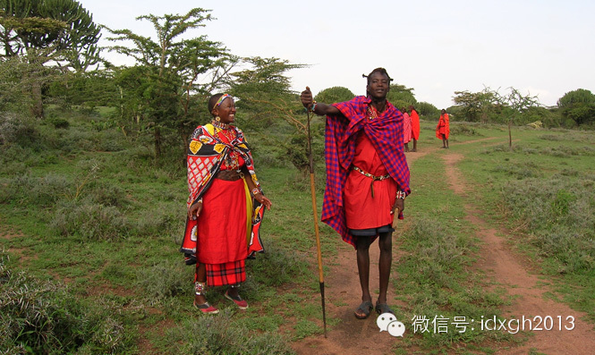
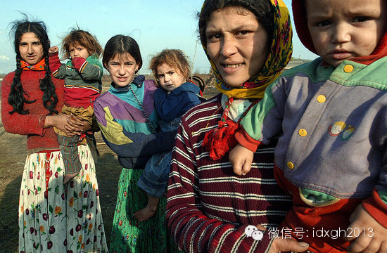

**儿子携带的来自父亲的遗传物质比女儿少，所以生女儿更合算？而进化**生物**学的一项假说认为：资源条件优厚的父母，将偏爱雄性后代。**

  

文/辉格

  

许多社会都存在父母对子女性别的歧视。汉民族成员对重男轻女的传统更不会陌生，这种歧视不仅表现在对待子女的态度和家庭养育资源的分配上，更会以遗弃甚至溺杀女婴的极
端方式发生，在胎儿性别鉴定技术和计划生育政策高压之下，则表现为大规模的选择性堕胎。  

  

在前现代社会，男孩死亡率比女孩高许多，所以自然的出生性别比通常在102到108之间，这样到达婚龄时男孩数量就和女孩相当或者略少，但选择性堕胎会大幅改变出生性
别比，根据第五次人口普查数据，中国90年代末的出生性别比是120，最高的江西省达到138，苏北一些县市更高达170多。

  

类似情况在较轻程度上也存在于印度；但同时，也有些社会的子女性别偏好是相反的，比如中国西南的许多藏族和彝族地区，出生性别比显著低于常规水平，类似情况在非洲和欧
洲某些地区也有发现，当然，这些不是选择性堕胎的结果，父母未必有故意的偏爱，甚至未必意识到，而是生理系统对环境条件所做出的无意识反应。

  

那么，究竟是哪些因素在影响着人们的子女性别偏好呢？仅仅是所谓文化差异（这个词如今已不幸成了被用来一股脑收纳各种“我不知该怎么解释的群体差异”的方便箩筐）？还
是先回到生物学起点，看看进化理论能对此说些什么。

  

【谁在偏爱女儿？】

  

容易想到的是，男性可能会偏爱女儿，因为男性传给女儿的是X染色体，传给儿子的是Y，而Y染色体比X短很多，儿子携带的来自父亲的遗传物质比女儿少4%（按碱基对算）
或3.2%（按基因数算），所以生女儿更合算；不过还没有经验证据说明这种偏向确实存在，假如真的存在，那一定是Y之外染色体上的基因实现的，而且Y染色体上可能会发
展出对抗它的机制。

  

进化生物学在子代性别偏好上提出的第一个理论，是特里弗斯－威拉德假说，它是在1973年由刚刚拿到博士学位的生物学家罗伯特•特里弗斯（RobertTrivers
）和正在读博士的计算机科学家丹•威拉德（Dan Willard）在既缺乏经验证据也不清楚微观机制的情况下，完全从特里弗斯的亲代投资理论推导出来的。

  

该假说认为，在父母能够帮助子女增进繁殖机会的条件下，那些资源条件优厚的父母，将偏爱雄性后代，理由在前面《男女关系》的系列文章里已介绍过：受雌性生育数量限制，
投资于女儿的边际繁殖收益会很快下降，而儿子因为可以同时利用许多雌性的生育能力，可以更充分的将资源优势转变为繁殖收益。

  

特里弗斯－威拉德假说对人类社会的适用性，已得到了多项经验研究的支持；人类学家威廉•艾恩斯（William
Irons）在研究了土库曼约穆特（Yomut）部的婚育资料后发现，土库曼各部流行一种基于部落等级的嫁娶模式，女性要么嫁给本部落男性，要么嫁往更高等级部落。

  

在所研究时段，约穆特部处于该体系顶端，只有外娶没有外嫁，部分富裕男性娶多妻，导致男性的总和生育数（10.6）比女性（7.74）多出2.86，结果该部的性别比
远远偏离正常水平，甚至在半个多世纪后，60岁以上老人的性别比仍高达137（考虑到男性死亡率高寿命短，这是非常惊人的，即便在中国该数字也低于100）。

  

类似情况在文化迥异的西方同样存在，伊莉莎•卡梅隆（Elissa Cameron）等人在2009年根据福布斯排行数据研究发现：美国亿万富翁的子女中儿子占60%
（相当于性别比150），其中财产系继承而来的男富翁，和嫁给男富翁的女人，该比例更高达65%（性别比186）。

  

人类学家李•克朗克（Lee Cronk）的研究则从另一个方向支持了上述假说；肯尼亚的穆科戈多（Mukogodo）族早先以狩猎采集为生，上世纪初逐渐转向畜牧，
并开始与相邻畜牧部落通婚，但作为缺乏资源和经验的迟来者，他们的畜产远少于后者，而按畜牧部落的习俗，娶妻彩礼都以畜产支付（穆科戈多的旧习俗是用蜂蜜），于是该部
落在婚姻市场上陷入了特别困窘的地位。

  

_穆科戈多族。_

  

结果，该部落父母逐渐对女儿产生强烈偏爱，精细的量化观察发现，三岁前孩子中女孩得到的照顾和哺喂都远多于男孩：平均照看距离短77%，搂抱时间长82%，喂奶时间长
56%，身高体重低于正常水平的幅度也小了一半多，偏心的后果是，男孩存活率远低于女孩，1986年时四岁以下的男孩比女孩少了1/3。

  

塔马斯•伯瑞斯科（Tamas Bereczkei）1997年对匈牙利吉普赛人的研究发现，这一在欧洲长期处于近乎贱民地位的族群，也严重偏爱女儿，性别比低至89
，前一胎是女孩时的堕胎率比前一胎是男孩时高一倍多，女孩哺乳时间比男孩长一半，上学时间长一年；从繁殖收益看，这一偏爱相当理性：每个女儿给父母带来的孙辈数是3.
53个，而每个儿子带来的只有2.75个。

  

支持特－威假说的另一项证据是，女性受孕和怀孕期间的营养水平对出生性别比有显著影响，因为母亲营养水平是预测家庭资源条件是否优越的一个有用信号（尽管未必可靠），
这一点最初在多种动物中得到证实，近年来多项针对贫困地区人类群体的研究也得出了类似结果；另外对饥荒期间流产现象的研究也发现，男婴的流产率明显高于女婴。

  

_匈牙利吉普赛人。_

  

【谁更偏爱儿子？】

  

其实，特－威假说还可以更精致化，高地位家庭中，夫妻双方偏爱儿子的程度会有所不同，理论上妻子的偏爱程度应高于丈夫（尽管尚没有经验证据支持这一推断），因为妻子自
身和女儿都直接受限于生育瓶颈，要获得大量孙辈，唯有指望通过儿子的多妻策略来充分利用优越的家庭资源，而丈夫却可以通过（在婚内或婚外）寻找更多配偶来达到同样目的
。

  

比如，家庭资源足以养活100个孙辈，一位妻子即便生下8个女儿，每个女儿又生下8个孙辈，也只有64个孙辈，但只要有一个儿子并多娶些媳妇，以同样生育率便可轻易达
到目标——不妨将儿子通过多妻而产生的这一作用称为“儿子乘数效应”。

  

除了偏爱程度更高，妻子还面临时间上的急迫性：由于丈夫也偏爱儿子（虽程度较低），需要儿子来继承自己的高地位，所以假如某位妻子迟迟没有儿子，丈夫就更可能寻求其他
机会。

  

假如将社会结构和继承制度上的差异也考虑进来，情况将变得更复杂；不难理解，家庭资源越庞大，寿命越长，父系继承越可靠，继承权越偏向男性，儿子乘数效应就越显著，妻
子对儿子的偏好也就越强烈和急切。

  

与长子继承制和单妻制相比，诸子分产制与多妻制结合时，儿子偏爱会更强烈，长子继承制实际上将儿子乘数效应集中在长子身上，所以随着已有儿子数的增加，夫妻对儿子的偏
爱就会不断降低，而在分产制下，即便丈夫已有多个儿子，还没有儿子或只有一个儿子（很可能夭折）的妻子仍会强烈偏爱儿子。

  

多代同堂的大家庭和共享族产的宗族制度，会进一步强化分产制的上述效应，因为在多代同堂家庭中，当辈份最高的父系家长仍然在世并控制着未分配家产时，每个男性子嗣都有
望分到其中一份，所以在分家开始之前，兄弟们甚至堂兄弟们，都在竞相通过多生儿子来扩大自己这一支的份额，而在长子继承制下，这样的竞争预先就被排除了。

  

而在共享族产的宗族中，在族产权益中所占份额（比如对族产用途的表决权、族产用益权或族产收益的分配权），将由各支系的规模决定，而在父系宗族中，支系规模就是成年男
性数量，各支系的香火旺盛程度，意味着祠堂里的牌位数、长老中的代表数，也就是宗族这个松散合伙企业中的股份比例。

  

_客家祠堂中的牌位。_

  

类似原理在家族之外的社区利益竞争中同样适用：在父系家族组织盛行的情况下，对社区事务的发言权、对公共资源的竞争、纠纷冲突中的优势，都高度依赖于家族中的男性数量
，特别是在法律保障薄弱、财产权缺乏制度性保护、侵夺强占频繁的社会，缺少男性的家族将处于极端不利地位，因而多生儿子的动机会变得十分强烈。

  

敏锐的读者或许已经发现，不经意间，本文已对汉族的重男轻女传统给出了一个解释，传统汉族社会同时具备了上面提到的强化儿子偏爱的全部制度元素：多妻制、诸子分产制、
偏向男性的继承权、父系大家庭、共享族产的宗族制度、缺乏法治和对财产权的制度保障、权利需要由家族凭自身实力来捍卫。

  

这种情况下，对男孩的偏好已不再只是为了获得儿子乘数效应所带来的遗传收益，而是为了增强父系家族组织的实力，以便在宗族和社区的竞争中取得优势，从而为家族和自身获
取最佳资源条件，当这一需要足够强烈时，即便资源优越或高地位这一前提消失，儿子偏爱仍会存在，这就解释了，为何在宗族制度盛行的地区，即便穷人也偏爱儿子。

  

宗族制度对子女性别歧视的影响，也得到了中国地区性别比差异的印证，按第五次普查数据，那些广东、广西、温州、福建、江西、湖南等近古以来宗族制度发达的地区，出生性
别比都大幅高于平均水平；苏南苏北的出生性别比形成鲜明对照，而据社会学家韩海浪的研究，宗族组织在苏北相当发达，而在苏南则近乎绝迹。

  

这样，最初由高地位男性组织起来用于谋取繁殖收益的父系家族，一旦发达并流行起来，便演变成了家族各支系间和不同家族间竞争资源的工具，这一竞争模式继而推动了更大规
模的宗族组织的发展，最终将不同地位的社会成员全部卷入其中（除了少数游离在此结构之外的边缘个体，或处于贱民地位的少数群体），并让置身其中的成员无论贫富都接受了
重男轻女观念。

  

相比之下，在中世纪西欧，参与社会竞争的组织，主要通过非血缘的领主附庸间封建契约关系而建立，财产和权利也得到了更多制度性保障，这一保障随着近代宪政与司法体系的
发展而变得日益可靠，同时，教会、行会和各种非血缘利益集团的存在，也让人们在谋取和保护利益时更少依赖父系血缘组织，因而不像宗族社会那样迫切需要男性家族成员提供
战斗力。

  

[大象公会所有文章均为原创，版权归大象公会所有。如希望转载，请事前联系我们：bd@idaxiang.org ]

———————————————  

**大象公会订阅号的自定义菜单上线了，左边是官网文章精选，右边是大象公会官方微社区，点击进入来吐槽发帖吧！**

  

[阅读原文](http://mp.weixin.qq.com/s?__biz=MjM5NzQwNjcyMQ==&mid=201501734&idx=1&sn
=622070db33f34182a002fb61bb26c28f&scene=1#rd)

