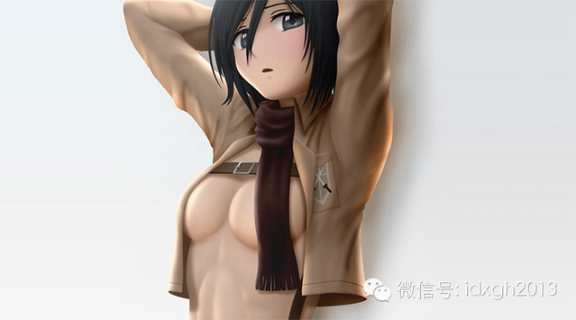
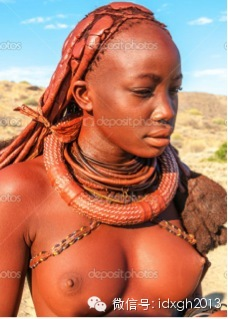
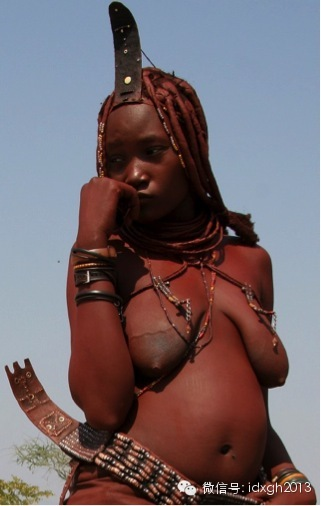
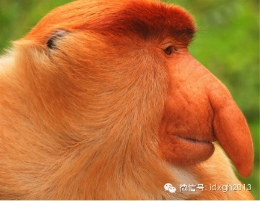
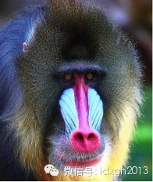
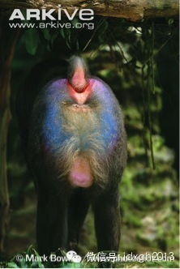
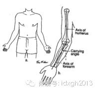
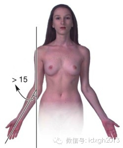
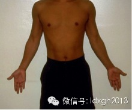

**为什么只有人类才会有永久隆起的乳房？为什么乳房的形状通常是并不适合哺乳的半球形而非更适合哺乳的袋形？**

  

文/辉格

  

  人类许多身体特征是独一无二的，德斯蒙德**莫里斯（Desmond Morris）在《裸猿》中指出了其中最显著的一个：人类是所有灵长类中是唯一失去了体毛而
将大部分皮肤裸露在外的物种；对此，一种解释是为了适应狩猎时的长途奔跑需要，裸露的皮肤加上发达的汗腺，可以在长跑时解决散热问题。

  

另一种解释是，裸露皮肤是为了增强性敏感，以配合人类异常频繁的性活动，如上一篇《女性性策略》一文所介绍的，人类在任何时候都可以被性唤起并实施性活动，这是女性为
将配偶长时间吸引在身边而发展出的罕见特性，而更强的性敏感有助于实现这一点，支持这一解释的证据是：人类体表确实广泛分布着大量敏感区。

  

两种解释并不冲突，实际情况或许是，最初裸露只是为解决散热问题，而一旦体毛开始丧失，该特征便成为性选择的对象从而得到强化（即，光洁无毛的皮肤成为一项择偶偏好）
，结果，并不从事狩猎因而不怎么需要长跑的女性，体毛丧失反而比男性更彻底，这一点只能用性选择解释。

  

前文已提到，男性阴茎的巨大尺寸，或许暗示了强奸曾经是他们获得生殖机会的一个重要途径，另外，男性还有许多与性有关的身体特征，比如喉结、突出的下巴、特定分布的胡
须等等，都是性选择所塑造的第二性征。

  

不过，男性拥有第二特征是件很平常的事情，许多配偶竞争激烈的动物，雄性都有鲜明的第二性征，比如孔雀的尾羽、狮子的鬃毛；由于雌性为每个后代所投入的资源远多于雄性
，所以配偶竞争主要发生在雄性之间，因而性选择通常也都指向雄性。

  

更值得谈论的，是女性的乳房，众所周知，乳房是用来哺乳的，可是假如乳房只是用来哺乳，那它为何在根本不需要哺乳的时候也总是鼓胀坚挺着呢？——几乎所有哺乳动物的乳
房，都只在需要哺乳时才隆起，只有人类女性的乳房才常年隆起，而且隆起的原因不是乳腺发达，而是充塞了与哺乳功能毫不相干的脂肪。

  

更奇怪的是，女人乳房的丰满半球形状，不仅对哺乳没有帮助，反而有妨碍，既不利于婴儿含吸，更容易导致哺乳窒息，从哺乳功能考虑，带有长乳头的Ｕ形乳房才是理想的形状
——人工设计的奶瓶奶嘴正是如此。

  

_人们喜欢的乳房形状_

  

_方便喂奶的乳房形状_

_  
_

对于人类女性永久性隆起的乳房，一种解释是，它是对臀部的自我拟态（automimicry），这种看似离奇的说法不无道理；在猿猴类中，雌性发情信号主要表现在臀部
的性肿胀，臀部的形状和颜色成为雌性向雄性发送性刺激信号的主要手段，因而雄性也发展出对这些信号的敏感性，实际上，人类男性仍保留了对丰满臀部和鲜明臀沟的敏感和兴
趣。

  

_乳沟与臀沟_

  

但猿猴类还有个特点：它们相互间的观察和交流主要以面对面的方式进行，它们的许多特性都与此有关：向前的双眼视觉，更丰富细腻的面部特征和表情，经常采用直身坐姿，直
立行走的人类更将这一点推向极致，所以，假如能通过拟态而将起信号交流作用的体征转移到身体前面来，是有好处的。

  

实际上，有些猿猴也正是这么做的，长鼻猴雄性那只没有实用功能的大鼻子，很可能是对雄性生殖器的拟态，而山魈（mandrill）那张形状奇特颜色鲜艳的脸，更是几乎
完美再现了由它的屁股和生殖器所组成的“后脸”。

  

_雄性长鼻猴的鼻子  
_

_雄性山魈的前脸  
_

_雄性山魈的后脸  
_

_  
_

_雄性山魈的侧面_

_  
_

研究过乳房问题的生物学家，无论是否采纳拟态假说，至少都相信乳房的永久性隆起是女性的一项第二性征，这一点从男性心理上也可以得到印证（性吸引特征和对该特征的敏感
总是成对出现的，否则便失去了其功能意义）：乳房是男人的一个主要性趣焦点，整容业和色情业人士对此有着良好领悟。

  

然而，真正重要的问题是，为何女性会有第二性征？要知道，绝大多数动物只有雄性才有第二性征，因为性选择通常都指向雄性，而这又是因为雄性在配子制造和生育过程中投入
很少，中途放弃并更换配偶的机会成本也很低，因而大可以抓住一切交配机会而无须挑剔对方的遗传品质，也就不会对异性的特征构成性选择压力。

  

可是人类女性却有许多鲜明的第二性征，除了乳房，还有光洁细腻的皮肤，修长的脖子，更细的腰和更低的腰臀比，堆积了更多脂肪的臀部，红润丰满外翻的嘴唇（其丰满和外翻
程度比男性显著，有人认为这是对阴唇的自我拟态），细而清晰因而更具表现力的眉毛（眉毛是重要的表情工具）。

  

肘关节外翻可能也是女性的第二性征，女性肘关节的提携角（即手臂在体侧伸展时，上下臂之间的夹角）比男性大5-8度，从实用功能看，这可能是为了方便女人提携重物，因
为女人的肩膀窄髋部宽，需要更大的提携角才能避免所提重物摩擦碰撞胯部从而妨碍行走，不过，实际的外翻程度可能是性选择强化的结果，它让女性手臂显得更加婀娜性感。

  

_提携角示意图  
_

_女性提携角  
_

_男性提携角_

_  
_

女性第二性征的重要性，从两性心理上也可看出，男性在选择伴侣（无论是长期还是短期的）时比女性更看重对方的外貌，常常将此列为头号条件，而女性在长期关系中只将外貌
列为次要条件，在短期关系中才更注重外貌，但也不如男性那么注重；同时，女性也比男性更在意自己的外貌，整容和美容业主要是为女性服务的；这与动物界的普遍情况恰好相
反。

  

这是什么原因？

  

一种观点认为，女性变得更漂亮性感，和隐藏排卵期一样，是为了将男性长时间吸引在身边，帮助她们共同保护和养育孩子，而美貌让女性在这方面做得更成功，因而构成一种选
择压力，推动了女性的美貌和男性对美貌的偏好协同发展。

  

这个解释有些道理，但并不充分，因为性竞争中，两性的得失差异有着天壤之别，竞争失败的雄性可能输个精光，完全得不到交配机会，一个后代也留不下，在性竞争激烈的象海
豹中，抢得王位的雄性独占几十上百头雌性，而绝大多数雄性却无后而终，非洲狮和大猩猩的情况没这么极端，但落得如此下场的雄性，比例也注定很高，可见选择压力之大。

  

相反，雌性无论如何都不会缺少交配机会，因为她们的生育资源太宝贵了，而雄性利用它的机会成本也很低，不可能被浪费；即便有些雄性资源条件优厚，也没有理由和资格挑剔
雌性，因为他们倾向于多拥有配偶，而更多的配偶将摊薄每个配偶可以分到的资源，在均衡水平，每个雌性得到的抚养条件相当，因而没有理由接受雄性挑选。

  

这一点对照长臂猿和鸟类就很清楚，长臂猿采用一夫一妻固定配偶制，雌性同样需要雄性合作抚养后代，但长臂猿两性身体差异很小，没有显著的第二性征；许多鸟类都结成固定
配偶合作抚养后代，也有发达的第二性征，但通常都限于雄性，雌性则相貌平平。

  

女性的第二性征，只能从人类独特的社会结构和等级差异才能得到理解，本系列前面的文章已经谈到，在人类两性合作关系中，男性被看重的，主要是他们的保护和抚养能力，同
时，由于语言赋予了我们合作与组织能力，男性个体间的竞争优势差异被团队合作成倍放大：少数男性通过紧密合作取得统治地位，支配其他男性，从而形成等级差异。

  

这种组织结构最初是出于狩猎需要，作为狩猎者，人类在身体构造和体能上没多少优势，优势主要来自工具和组织，而等级化组织一旦建立，其力量也自然被用于性竞争；这一发
展带来了两个后果：一方面，那些高等级男性所能支配的保护和抚养资源，让他们有能力抚养许多妻子和她们所生的孩子，实际上，他们也确实比其他男性拥有更多配偶和性伙伴
。

  

但另一方面，他们又不能占有其资源条件所允许的那么多配偶，这是因为，男性的竞争优势并不像大猩猩和象海豹那样来自个人能力，而更多来自团队合作，而为了取得团队中地
位较低成员的支持配合（或至少不反抗），必须给他们也留出足够的性资源，否则会造成太多反抗和背叛，合作关系和统治地位皆难以维持。

  

实际上，类似局面在我们的近亲黑猩猩中已能看出苗头，灵长类学家弗朗斯**德瓦尔（Frans de Waal）在《黑猩猩的政治》里，介绍了雄性黑猩猩之间如何勾心
斗角合纵连横谋取支配地位，那只暂时成为头领的雄性，占有大约一半的交配机会，他的合作与支持者也会分得不少机会，而地位最低的雄性几乎没机会。

  

另一个因素也阻止了高地位男性占有过多配偶，如前文所提到，人类配偶关系并非忠贞不贰，女性常采用模糊暧昧的混合策略，控制配偶出轨是个困难的任务，在缺乏有效闺禁手
段的条件下，闺禁成本和绿帽风险将随配偶数增加而急剧上升。

  

正是高地位男性抚养能力与最优配偶数的不一致，对女性构成了选择压力，因为合作需要和闺禁困难迫使这些男性采用以质量换数量的策略，换句话说，因为他们的资源条件不会
被配偶数量摊薄至平均水平，所以他们有资格对配偶质量进行挑剔。

  

但这还不是故事的全部，如果嫁给高地位男性的好处仅仅是高出平均水平的抚养条件，恐怕还不足以为我们所见到的第二性征提供足够大的选择压力，更强大的选择压力，来自高
地位的父系可继承性。

  

因为无论资源条件多么优厚，女性生育胎数都十分有限，嫁入豪门的好处，主要不是体现在她自己所生育的子代数量，而是她儿子可能为她生下的孙代数量，前提是：她确实生下
儿子并且儿子继承了她丈夫的高地位。

  

当然，在人类早期社会，大概不会有制度化的继承权，但这并不意味着权力和社会地位就没有可继承性；首先，让男性在权力竞争中取胜的那些禀赋，很大程度上是可遗传的；其
次也更重要的是，在亲子关系可辨认并且寿命足够长的条件下，既已获得高地位的男性，可以利用手中权力帮助儿子们谋取权力和高地位。

  

父系可继承性不仅成倍放大了女性嫁入豪门的好处，也大大强化了男性对貌美女性的偏爱，因为美貌妻子更可能为他生下美貌女儿，而美貌女儿更可能嫁入豪门，从而为她带来更
多曾孙子女；如此便构成一个正反馈：嫁入豪门的好处越多，美貌带给女性的优势就越大，继而男性对美貌的偏好越强烈，于是嫁入豪门的好处更多，如此反复。

  

结果，人类发展出了动物界独一无二的双向性选择：首先是女性对男性的选择，导致了男性的诸多第二性征，以及（更重要的）地位与财富的分化（不妨称之为第三性征），而男
性的地位分化（加上父系继承）进而对女性的美貌构成选择压力，而两种选择交互作用，相互强化。

  

上述洞见，对我们探索和理解人类社会的历史有着重大意义，它提示我们，固定配偶关系、社会等级分化、父系家族组织和父系继承关系等等曾被认为很晚才出现的文化元素，很
可能在智人离开非洲之前很久便已存在，除非永久性乳房是离开非洲后各种群独立发展出的，但这看上去太不可能了。

  

不仅如此，由于双向性选择机制给权力竞争的成功者所带来的巨大优势，它持续推动着最初导致它出现的那些元素向更成熟更制度化的方向发展：将固定配偶关系变成由一整套法
律和道德规范所支撑的婚姻制度，将最初限于狩猎团队内的等级组织变成大型社会的多层次等级结构，将父系合作关系发展成大型父系宗族，从父系继承关系中发展出了财产、权
力和等级身份的法定继承权。

  

这些发展，又反过来增强了两性所面临的性选择压力，促使男性的第三性征（种种对地位和财富的标示和炫耀）和女性的第二性征变得越来越发达；不过，随着制度发展方向的分
化，不同社会的性选择强度、起作用的方式和它所产生的效果，都有所不同，这或许也导致了性别特征显著性上的种族间差异。

  

[大象公会所有文章均为原创，版权归大象公会所有。如希望转载，请事前联系我们：bd@idaxiang.org ]

  

——————————————————

**大象公会微社区上线了，入口就在左下角“阅读原文”中，点击进入来吐槽发帖！**

[阅读原文](http://mp.weixin.qq.com/s?__biz=MjM5NzQwNjcyMQ==&mid=201177823&idx=1&sn
=957a775969b0e647eb0586e7ea794ae2&scene=1#rd)

