**同样的食物，以不同方式摆放在同样的盘子里，获得的评价大相径庭。而同样的食物，以同种方式放在不同的形状和颜色的盘子里，获得的评价也相去甚远。摆盘艺术是门大学问，如何做会让人们对食物给予更高的评价？**

  

文/杜冰梁

  

为了在朋友圈炫耀“幸福生活”，食客们在掏出手机拍照时总想将路边摊也拍出米其林餐厅的效果。针对这样的需求，有公司甚至推出美食专用相机，选择什么滤镜由具体的菜式
决定：用“美食鲜艳”来拍川菜，用“乡村”来拍农家乐……

  

人们依靠经验和直觉，就能体验到视觉与美食之间的关系。不过，在各国的饮食史中，注重摆盘美感都是晚近的现象。研究机构对“摆盘心理学”的研究成果虽然数量有限，却都
相当有趣。

  

2014年6月，英国牛津大学实验心理学系发表了新论文：实验中，研究者选取完全相同的食材，用三种不同的摆盘方式测试食客们的感受。结果发现，被摆成艺术家康定斯基
（Kandinsky）画风的沙拉最受欢迎——不仅被评为最好吃，人们还愿意为之支付更多的钱。研究者由此认为：当食物在装盘过程中加入艺术设计元素，即使表现得非常
含蓄，也可以提升进餐时的愉悦感。

  

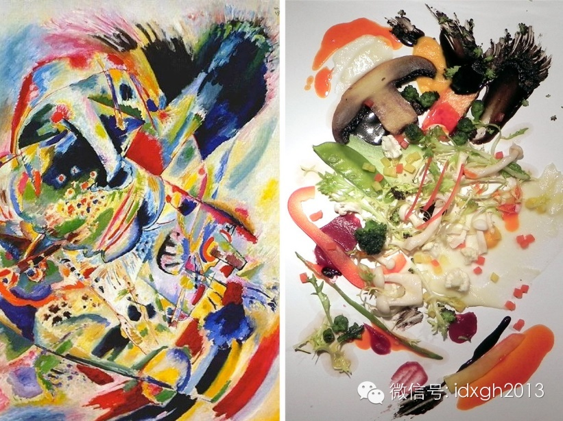

最受欢迎的康定斯基画风沙拉。此项研究由英国牛津大学实验心理学系交叉研究实验室心理学家查尔斯**米歇尔（Charles
Michel）等人发布。实验邀请18~57岁的男性与女性各30位。  

  

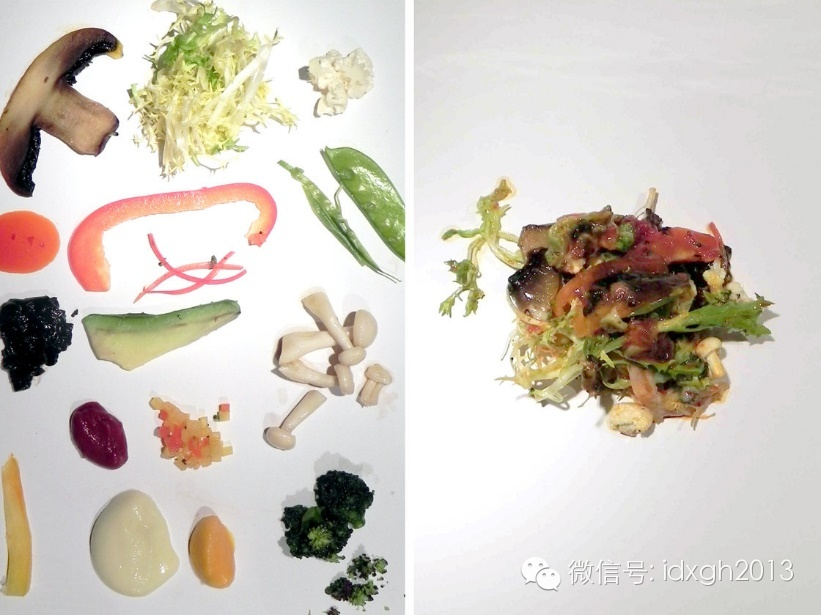

上述实验中另外两种摆盘方式

  

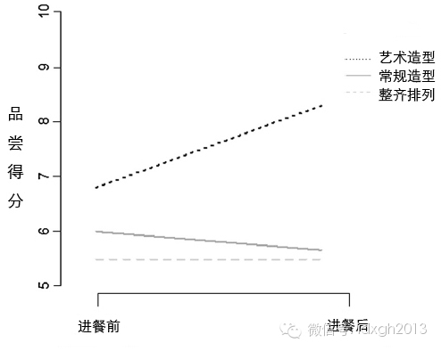

上述实验中，请食客在进餐前后对三种不同摆放分别打分的统计结果

  

通过多项研究，心理学们或许可以告诉你：什么形状和颜色的盘子会让食物变得更受欢迎，又或者，盘子里食材怎样组合会让儿童与成人更有食欲？

  

**【法国人统治“摆盘界”】**

  

在秦代以前，人们就已经感受到饮食中的审美需要，从刀工、容器与陈设多个角度对形美与味美提出了要求。但是，中餐至今在装盘时更多使用“堆放”的方式。这与中餐的食材
、烹饪技法、合餐制乃至餐饮商业发展程度等息息相关。

  

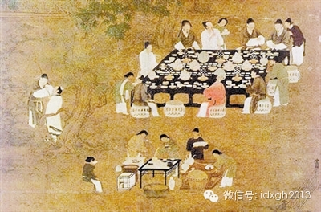

唐朝时的堆放式装盘

  

20世纪80年代，中国餐饮业尚不兴盛，较注重菜肴口感，而不注重摆盘的样式。90年代之后，菜肴的“卖相”逐渐受到重视。此时，一些培养厨师的专业学校设置了食品雕
刻、面塑、糖艺课程，很多酒店也出现了专门的食品雕刻师。

  

由于中餐使用筷子进食，原料会被加工得较为细碎，往往切成丁状或丝状，这对装盘的工艺和效果十分不利——而西餐桌上刀叉并用，原料相对块头较大，在装盘时更利于立体造
型。

  

同时，中餐热菜以带汤汁汤芡为多，即便是厨师们收芡的功夫炉火纯青，如果将两个以上的菜品搭配装盘，也很难保证食物不会相互影响。

  

因此，中餐经常采用其他与菜肴无关的原料进行围边和装饰。比如，用汆水的油菜心、汆水的西兰花将菜肴围在中间，或把胡萝卜片做成各种花形作为菜肴的装饰和点缀。

  

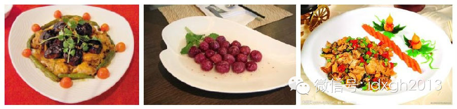

中餐常见的摆盘与装饰

  

此外，中国人多数喜欢“围食”，将整个菜品放在中间大家分而食之，这种“合餐制”也直接影响了摆盘的形式——多人同食、单盘量大，而更多见“堆放式”。

  

由于缺乏精确、立体的造型，食客即便使用美食专用相机，也较难拍好“堆放式”，不少拍摄者选用背景虚化功能来强调局部主体。

  

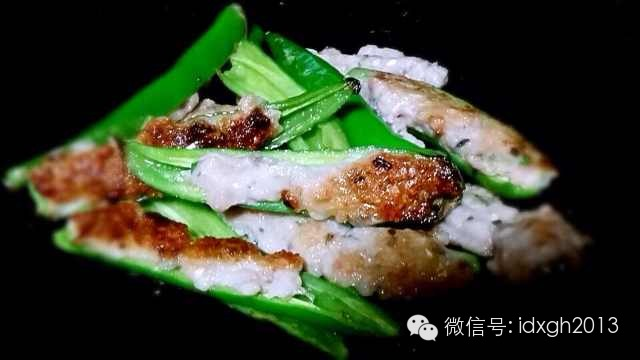

背景虚化后的中餐食物更显立体感

  

在很多现代人的印象中，西餐的摆盘精美雅致，但实际上，西餐对视觉的注重并非与生俱来，也产生于餐饮与社会发展的渐变之中。

  

中文里，西餐是个含义较宽的词，一般只要用刀叉作餐具，分餐就食都被纳入其中，包括了法餐、意大利餐，乃至东欧、美洲、大洋洲的部分菜品。

  

但是，在笼统的西餐概念内部，法餐占据了统治地位，这也体现在菜品摆盘的艺术上——几乎所有装盘形式都出自法餐，其他国家的贡献微乎其微。尤其是20世纪中叶后，改良
版的Haute cuisine（高级料理），奠定了今日人们对西餐的印象。

  

中世纪之前，因为独立的餐盘还没出现，也就没有装盘这一专业技艺。人们都用手从公共盘中抓食，喝汤、喝酒也没有公私之分，一个酒杯在宾客中被传递饮用，两三个人常共用
同一汤碗。

  

当时的食材比较粗糙。中世纪的法国贵族非常喜爱禽肉和猎物，尤其是便于储存和蒸煮的牛肉。菜品的着色更注重视觉刺激。为了炫耀和张扬，大块而艳丽的食物往往堆放在餐桌
，豪放式的装盘是这一时期的主流。

  

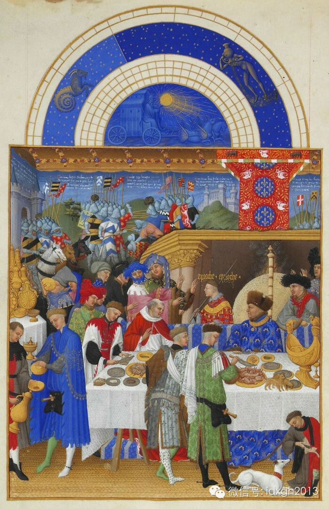

十四世纪的宴会，“堆放式”摆盘。图片出自《贝里公爵的豪华时祷书》，创作于1412年至1416年。

  

1533年，一次关键的政治婚姻开启了摆盘进化的序幕：佛罗伦萨公主凯瑟琳**德**美第奇（Catherine de'
Medici）嫁到法国，随行意大利厨师的技艺令法国贵族震惊，嫁妆中银质刀叉的精细程度也让人称奇。  

  

就在这一时期，法国贵族们炫耀式餐饮也受到挑战——普通民众逐渐增加了肉食比重。

  

为了回应挑战，产生了初级的烹调原理，考究的刀法受到推崇。东方传来的辛辣调料也遭到排斥，平民喜爱用调料遮掩味道的下水、脚、耳朵等也被贵族排斥在采购之外。165
9年，王室、高级贵族与供应商的合同中减少了猪耳朵，一年后去掉了排骨，7年后抹去了内脏、猪油，1670年，脚、鼻子、背、小肠等也消失了。

  

这些转变推动了装盘艺术。精致的整块食材，本身适合整体造型，立体效果明显。而主菜的搭配，形成了三段式标准：蛋白质含量较高的肉食或海鲜，色彩鲜艳的蔬菜，淀粉类原
料，在讲求卫生的单个餐盘中增加了塑形的重要性。

  

17世纪后，卫生观念的加深，让分餐制的执行更为严格，同时，对食材的注重催生了各种专用菜盘，开胃品、主餐、沙拉都有单独的盘式。摆放时更注重色彩和形状的平衡。

  

同时出现了一些创新的摆法。蛋黄酱的发明者Marie-Antoine
Careeme，创造了诸多甜点，尤为著名的是泡芙塔。法国大革命后，贵族们的厨师流落民间，以开餐馆为生，新兴的资产阶级成为新的主顾。

  

**【白色圆形盘影响对食物的评价？】**

  

不过，摆盘技艺的空前繁荣，还是在20世纪中叶后。

  

1966年五月风暴后，许多厨师强调摆脱束缚，张扬自我，为此他们主动学习非西方厨艺，也将法式摆盘带至各国。日本和西班牙等地推出了有强烈地域色彩的西餐装盘，打破
了传统的三段式搭配，从集中转移向分散，一点式过渡到两点或多点式。如今人们所称的西餐Haute
cuisine（高级料理）的摆盘，都是指这一时期之后的新内容与形式。

  

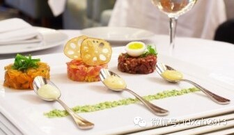

20世纪60年代后，从日本料理获得灵感，产生了一批新造型法餐的摆盘风格

  

1970年后，营养学的发展让精致的小份菜肴流行，餐盘越来越被视为厨师展现个人艺术审美的作品，新的花式层出不穷。如“红玫瑰”装饰，就是由剥开的西红柿皮搭配而成
。盘沿也开始被注意，喷洒酱汁的装饰手段变为标配。

  

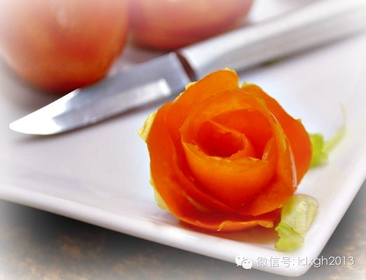

土豆制作的red roses

  

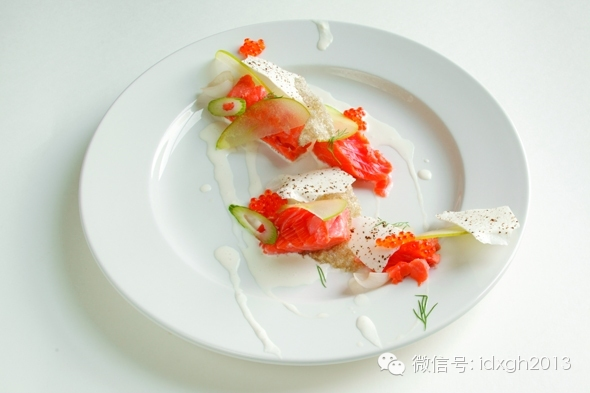

鲑鱼，酱汁也是餐盘装饰组成之一

  

1990年后，新料理（NouvelleCuisine）更进一步，肉、淀粉、蔬菜堆砌的高菜品流行，厨师们的装盘设计突破平面，走向立体。

  

如今，各国对Haute cuisine摆盘的创新已不亚于法国，诸多新鲜元素被应用。但基本原则仍然与16世纪相通：注意色彩和形态的搭配，保持食材本来的风味。

  

现在，厨师们在摆盘时通过艺术审美来增进食客们整体愉悦感的普遍行为，也激发了心理学研究者的好奇心。他们设计了系列实验，试图探讨视觉与食物评价背后的规律性。

  

2011年，国际著名专业杂志《儿科学论文期刊》一篇论文认为，儿童喜欢更多的食物种类和最多的食物颜色——他们倾向于将七种不同的食物和六种不同的颜色放入自己的餐
盘，而成人则更偏好3种不同的食物和3种不同的颜色。

  

有趣的是，研究者还发现，儿童喜欢将食物放在圆形盘子的右下方，以及椭圆形盘子的左侧，且摆出有意设计的图形。相反，成人不管选择什么盘子摆放食物，都倾向于将食物放
在盘子的中心位置，且食物形状较为随意。

  

为什么儿童和成人间会有这样的差异？研究者们谨慎推测：可能与儿童对更多样营养的需求相关。

  

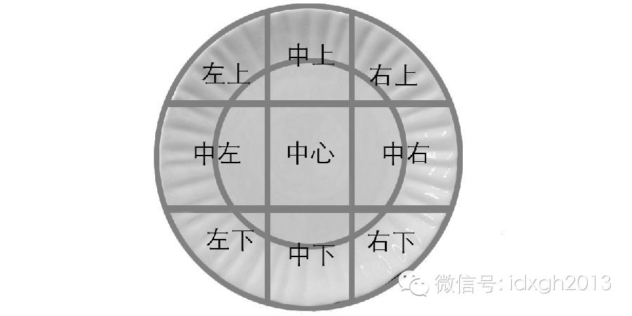

盘内位置示意。此报告题目为《Kids prefer variety of foods and colors on their
plates》，被测试者是23位小于10岁的儿童和46位成人。

  

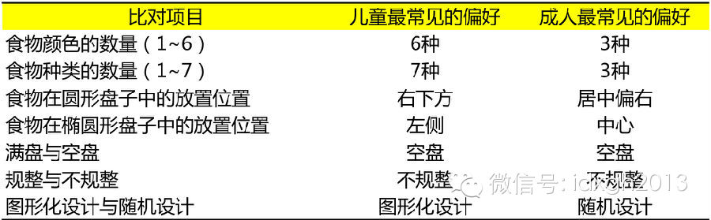

上述研究中各项测试的统计结果

  

研究者们对视觉与食物评价之间关系的好奇心并没有就此停止。2013年，加拿大纽芬兰大学心理学家彼得**C**斯图尔特等人发表论文，发布了另一项相关研究的结论：
当使用不同形状和颜色的盘子装摆同样的奶酪蛋糕时，参与者对口感和品质等4个方面的评分有显著差异。

  

其中，白色圆盘和黑色方盘中的蛋糕综合得分较高，而白色方盘和黑色圆盘则得分则偏低。黑色方形盘为何与白色圆形盘并驾齐驱？研究者猜测这可能与特殊的学习背景存在关联
，或者与某种形式的熟悉度/新奇度影响有关。

  

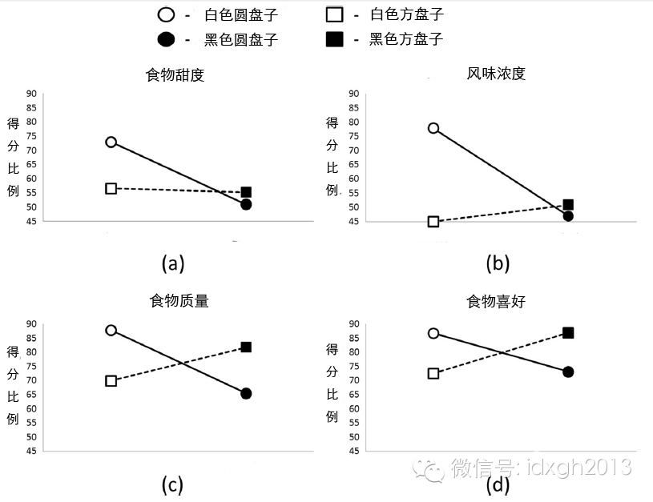

实验中各项测试的统计结果

  

对于大多数人而言，并不会在摆盘时花与厨师一样的心思，也没有条件设计自己的心理学实验，但对视觉与食物的关系并不陌生——“视觉盛宴”、“秀色可餐”等同时包含两者
的词汇早已进入大众的语言之中。

  

不过，从摆盘历史中获得的启发还不止如此：当每一件产品甚至个人的审美风格与表现不同时，他或许会相应获得不同的评价。

  

> 版权声明：  

> 大象公会所有文章均为原创，版权归大象公会所有。如希望转载，请事前联系我们： bd@idaxiang.org

大象公会：知识、见识、见闻

微信：idxgh2013

微博：@大象公会

投稿：letters@idaxiang.org

商务合作：bd@idaxiang.org

举报

[阅读原文](http://mp.weixin.qq.com/s?__biz=MjM5NzQwNjcyMQ==&mid=204721618&idx=1&sn
=bf7136095d2da79e3d5dce2636883980&scene=0#rd)

