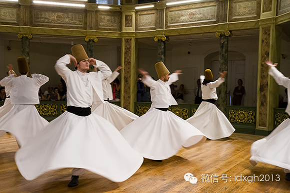
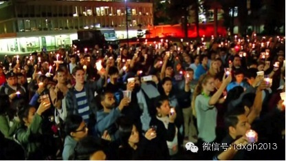
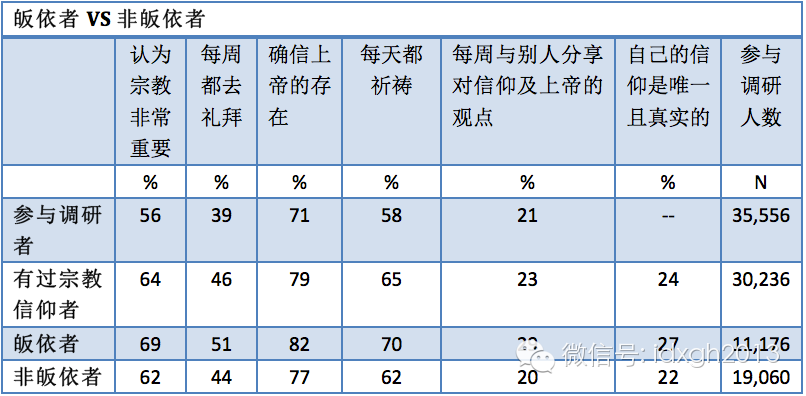
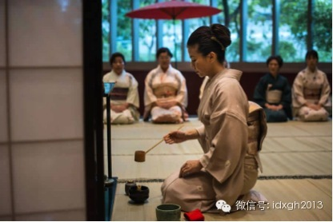
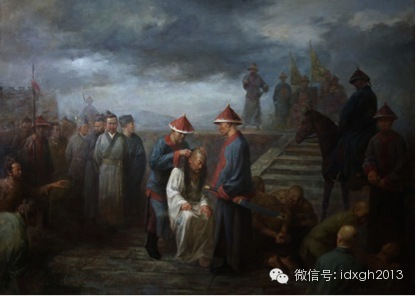

‍‍‍‍‍‍‍‍‍‍‍‍

**‍**‍**为什么带有华裔血统的美国枪击案凶手罗杰会如此仇恨亚洲人？为什么韩国人甚至会跑到阿富汗、伊拉克去传教？为什么有些人改变了观点或身份后，会显得特别狂热偏执？  
**

‍‍**  
**

文/郑子宁

  

当地时间5月23日晚，22岁的美国加州大学学生艾略特**罗杰在宿舍用刀刺杀三名华裔同学，又上街肆意开枪，造成三人死亡，最后在与警察对峙时饮弹自杀。

  

凶手罗杰是个白人与华裔混血儿，但却对非白人有着病态的歧视与仇恨。罗杰自称青少年时期曾遭遇种族歧视，不过这并未让他由此对被歧视者有同理心，反而让他不断强调自己
“白人”的一面，比绝大多数白人有更强烈的种族思想。

  

罗杰的悲剧有多方面原因，但身为一名混血儿，为何他却表现得比一般白人更偏激极端？

  

_‍_‍_图：加州大学学生纪念死难者_

‍‍**  
**

**【狂热的传教者】**

**  
**

其实，新人或出身不那么根红苗正的人，对其自我认同的体系比正统成员更狂热、极端，是种常见现象。

  

表现得最明显地莫过于宗教信徒，英语中就有“皈依者的狂热（Zeal of the
converts）”的说法。孙中山在少年时代皈依基督教后，一度热衷于破坏家乡的各种神庙，认为这些神庙是“偶像崇拜”的祸源，其狂热程度超越了很多西方传教士。

  

无独有偶，在塔利班炸毁巴米杨大佛后，不少伊斯兰国家都声言谴责，但中国却有一位皈依伊斯兰的汉族史姓学人大加赞赏塔利班的毁佛行动，认为这种“偶像崇拜”的落后垃圾
就该清除。

  

论及皈依者狂热，近年被提到最多的例子当属韩国的基督教狂热。基督教进入朝鲜半岛不过只有五百年左右时间，二战结束前仍是少数人信仰的边缘宗教，真正被主流社会接纳也
就半个世纪多时间。其基督教根基和传统远逊于西欧和北美，是不折不扣的新皈依者，但韩国教徒的狂热程度为传统基督教国家望尘莫及。

  

佛教原为韩国传统宗教，但基督教兴盛后，韩国居然发生了多起基督徒攻击佛教寺院事件，其情形犹如塔利班炸毁巴米扬大佛。韩国基督教化后，变成了世界上最热衷于对外传教
的国家，各教派向国外派出了两万多名传教士，其人数仅次于美国。

  

与欧美传教士倾向于向“未开化”之地传教不同的是，韩国传教团的足迹不但遍及全球各地，甚至渗透到了阿富汗、伊拉克、也门、约旦这种全民伊斯兰教国家。近年发生了多起
韩国传教士在阿富汗或伊拉克被武装分子绑架案，依然挡不住韩国传教士的脚步。

  

历史上，各种教派的发展都可见到这种皈依者的狂热。基督教有著名的西班牙，它被从阿拉伯/伊斯兰世界光复后，立即变成最狂热的对外传教国，在迫害异端、打击新教徒上来
得比其他国家更为积极。在伊斯兰教，则有阿拉伯帝国的武力扩张结束后，以新皈依的突厥人、波斯人为主的苏菲派传教士，以苦修者形象深入草原戈壁传教，其热情远非早期的
阿拉伯人可比。

  

美国皮尤研究中心下属的宗教信仰与公共生活论坛曾经进行过一次宗教虔诚度的调查。研究结果显示，在所有指标上，后来皈依的教众都比生于信教家庭的教众更加虔诚。这项研
究调查了各基督教派的信徒，结果显示，皈依者虔诚度比原有教众更高的现象在几乎所有教派都有程度不等的反映（以循道宗为最），说明皈依者的狂热乃是普遍现象。

  

_皮尤研究中心资料_

_  
_

唯一的例外是摩门教，摩门教中原有教徒在两项指标上（“是否至少每周参加一次礼拜仪式”和“是否认为自己的信仰是唯一真正的信仰”）比皈依者更加虔诚。这种现象可能和
美国摩门教社区比较保守，原有信众虔诚度就很高，新皈依者虔诚度超过原信众的难度更大有关。

  

5月28日山东招远某麦当劳餐厅发生邪教教徒传教被拒，将一名妇女残忍殴打杀害的恶性事件。虽然这类邪教不宜与正常宗教相比，但它亦从侧面展现了新皈依宗教者的狂热可
怕。

  

**【文化的信徒】**

**  
**

对皈依者来说，文化征服与宗教征服的效果相同。

  

英国的餐桌礼仪来自法国，但英国人对餐桌礼仪的固执狂热程度远远胜过法国人。譬如英国女王宴请摆放餐具时要用游标卡尺精确测量位置。在法国人看来，英国人不去钻研怎样
提升自己的烹饪水平，却把精力耗费在琢磨餐具摆放位置无疑是舍本逐末的可笑行为。

  

中国的茶道、禅宗，到了日本后，在形式感和仪式性上被不断推往极限，而在中国本土，则是以一种更随意和不刻意求工的态度自然演进。欧风东渐之后，日本追慕西洋文明的态
度亦是如此。

  

_图：日本茶道表演_

_  
_

同样，朝鲜在近代之前对儒家教条（至少是他们理解的版本）的拘泥达到了令人咋舌的程度，特别在中国元清两次被北方少数民族统治后，朝鲜更是自我感觉良好，自诩东国正统
。

  

而满清入关后，很快以儒家正统自居，对待外来的基督教、伊斯兰教，较之汉族建立的明王朝，态度就严厉得多。而且是愈到后来，其态度就越为严厉。

  

今天，外来不同时期的各种思潮一起涌入中国，这些理论的中国追慕信奉者，在公共言论空间中，其狂热和固执程度，远远超过这些观念的国外发明或倡导者。无论是国奥（奥地
利经济学派爱好者）、黄纳（纳粹崇拜者）、黄俄（苏联崇拜者）还是鹰派科普，他们的亢奋多少带有某种类似信徒的特征。

  

当然，他们当中最令人惊异的是一批苏联缅怀者——今天在俄罗斯还怀念苏联的只是一些生活不如意的退休老人，而一批中国的年轻人，却建立了一个苏联主义网，他们从组织架
构到语言、行为模式，都让人感觉苏联并没有灭亡，只是迁到了中国的网上。

  

虽然今天不少中国人是苏联和俄国的追慕者，但俄国当年曾深受法国文化影响，上层社会不但说法语，追逐法国文化，甚至在与西方人谈及俄国社会的落后一面时，会自然而不屑
地用“这些野蛮的俄国人”，轻巧地把自己从俄国人中划了出来。

  

**【焦虑与自觉】**

**  
**

各种类型的皈依者狂热，多少带有急于抹去过去文化印记的动机。由于不是那么根红苗正，迫切需要证明自己对新身份的忠诚，而通过伤害旧身份来显示已经和其脱离关系正是一
种常用的策略。

  

美国枪击案凶手罗杰的仇恨亚洲人，就是这种心态的极端体现。而满清剃发令的例子亦可与之相比。清朝入关之初并未强迫全体汉人剃发，但汉人孙之獬上疏：“陛下平定中国，
万里鼎新，而衣冠束发之制，独存汉旧，此乃陛下从中国，非中国从陛下也。”清廷遂采取“留发不留头，留头不留发”的极端政策，满足了孙之獬的夙愿。

  

_图：满清强制剃发_

_  
_

犹太人的情形与之类似。欧洲的反犹浪潮中，许多积极反犹者本身就是一两代人之前改宗的犹太人，急于抹去自己的犹太特性，表现得比非犹太人更反犹。而西方学术思想界，整
体表现得最为反资本主义的，恰恰也是犹太人知识分子——而公众印象中，犹太人总是被当成贪婪资本的化身。

  

类似的还有斯大林，斯大林是格鲁吉亚人，是苏联历届领导人中斯拉夫血统最少的一个，但他却是苏联历史上大俄罗斯主义倾向最强烈的一个。而意大利独裁者墨索里尼原本是一
个民主社会主义者，在接受法西斯主义后，坚定不移地反对社会主义，并非常热衷迫害自己的前同志们。

  

近年西方有不少政治家从左派转成右派，这些曾经是左派的政治家们一旦在观念上转为右派，往往也会演变成为极右派。

  

类似的例子简直不胜枚举。离我们最近的历史记忆，是文革时代越是出身不好的人，往往越会在“自我改造”中表现得狂热偏执，甚至不惜与父母反目成仇。以决绝姿态告别过去
以获得新身份，某种程度上是一种“文化投名状”。

  

但是，皈依者的狂热并不完全能从有意识的实用主义来解释。皮尤研究中心的研究采取匿名制，皈依者并不需要为了表现而伪装。其实，无论是韩国传教士还是某种价值的追随者
，其行为未必是下意识的产物。他们表现出的狂热和虔诚，某种程度上是在皈依过程中，与环境挣扎时无意中习得的。

  

对文化性的信徒来说，教徒身份是与生俱来的，这种未经思考和选择而获得的身份认同，自然不会在日常行为中体现出特殊性。而经过思考和选择的皈依者，在皈依过程中，必然
会经历一番习俗、观念甚至理性的自我冲突——这个不断自我暗示的努力和挣扎，会使得他和具有与生俱来身份的人相比，有着更为坚韧和狂热的信念。

  

> 版权声明：  
大象公会所有文章均为原创，版权归大象公会所有。如希望转载，请事前联系我们： bd@idaxiang.org

大象公会：知识、见识、见闻

微信：idxgh2013

微博：@大象公会

投稿：letters@idaxiang.org

商务合作：bd@idaxiang.org

‍‍‍‍‍‍‍‍‍‍‍‍

[阅读原文](http://mp.weixin.qq.com/s?__biz=MjM5NzQwNjcyMQ==&mid=202586952&idx=1&sn
=62c49cb438c2440d482fc6abe7cd89bc&scene=0#rd)

