**长白山，奥林帕斯山，昆仑山，须弥山，阿索斯山……..尽管它们虚虚实实，却都曾被不同的民族尊为神山。到了当代，出现了一些更加特殊的神山，提醒我们人类精神生活的变化。**

  

文/刘大可

  

北京东城的雍和宫，原本是雍正皇帝登基之前的“禛贝勒府”，乾隆九年（1744年）改为藏传佛教寺庙，历经几百年风雨，如今是汉族地区的全国重点寺院，香火旺盛。

  

雍和宫正殿月台上，有一座层层叠叠的沙漏形青铜山，顶部塑有一间宫殿，这就是“铜须弥山”。

  

_雍和宫天王殿后院月台上的铜须弥山_

  

“铜须弥山”是佛教世界观的浓缩：

  

世界中央是一座七重金山和七重香水海叠起的高山，其上有四大天王的宫殿；再向上，是忉利三十三重天，天顶上住着佛教的帝释天，乃是众天神之王。山脚下，是一片汪洋大海
，海上飘着四大部洲；再向下是风、水、金、地四重轮的支撑。

而这还只能被称为一个小世界，一千个小世界是一个小千世界，一千个小千世界是一个中千世界。集一千个中千世界，上覆盖四禅九天，被称为一个大千世界，三千个大千世界才
被称为一个佛国——一个佛要渡化的世界，而佛有无数无量个。

  

这样的世界观实在是宏大精致，然而它并非佛教的独创，须弥山和四大部洲的宇宙模型源自古印度神话。其中蕴含的，正是一个民族成长的故事，乃至所有文明中共同的印记——
神山崇拜。

  

【祖先之山】

  

山峰是大地上最显著的地貌景观，它们崇高巍峨、永恒坚固的样子，仿佛更接近天空中的星辰，毫不畏惧流失的时间——在心中充满迷雾与好奇的先民眼中，它们与同样崇高且永
恒的神灵有着千丝万缕的联系。

  

对于部落时代的人类社群来说，能否让所有成员凝聚在一个精神核心之下，关系着社群的存亡。而形成牢固的社群认同，既包括血缘，也包括对祖祖辈辈生长的土地的热爱与信仰
。这两种需求结合起来，凝结成“祖先之山”的信仰：那座山是祖先的化身，血脉的源头。

  

这样的例子尤其在社会群体较小，结构较简单的民族中更加多见，著名的比如长白山在东北神话中的地位。

  

_
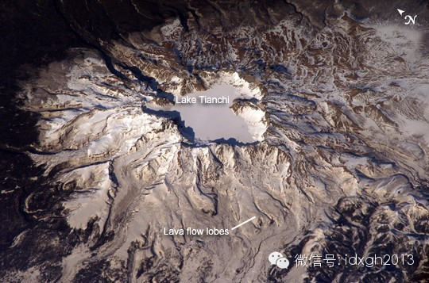__冬季长白山主峰鸟瞰图，中央白雪覆盖的凹陷就是长白山天池，中国最深的湖泊。_

  

长白山的主峰是中国东北的最高峰，也是一座休眠的火山，历史上曾多次喷发。对于商周时期就已经活跃于东北的肃慎、濊貊、东胡三个古老的游猎民族来说，它象征着可怕的自
然力量而受到崇拜。经过上千年，这些部落信仰一直延续到它们的后人女真人崛起。完颜阿骨打统一女真各部建立金国后，此山便被定名为“长白山”，并视其为大金“兴亡之地
”。

  

尽管萨满教、汉人的儒家学说、佛教、道教等，都对金代的社会经济、政治、文化和习俗产生过重要影响，但太白山却始终保持了极高的神圣地位。

  

1234年，金国亡于蔡州，女真各部开始接受蒙古统治。直到1616年，爱新觉罗氏努尔哈赤在赫图阿拉称汗建立后金，也就是随后的满清。

  

满族人作为女真人之后，也继承了祖先们对长白山的崇拜，将之称为白山。1677年，康熙命人考察之后，着礼部拟制，赍敕长白山神，从此像祭祀五岳一样祭祀长白山。

  

与之类似，在朝鲜创始神话中，祖先檀君在“太白山”降世，13世纪的高丽僧人一然（1206—1289）在《三国遗事》自注中明确指出“太白，今妙香山。”位置相当于
长白山在朝鲜半岛尾迹的最南端，比平壤靠北一些。

  

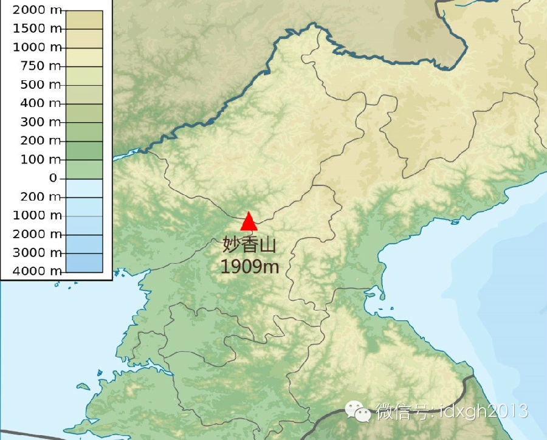

_朝鲜妙香山的位置___

  

在与中国的接触中，佛教和儒学对朝鲜的影响都比女真人来得更甚，后因李氏王朝将儒家学说定位立国之本，其它一切信仰都不许在城市流行，于是太白山信仰也就停留在了神话
的祖先之山上。

  

到了18世纪末，朝鲜的一些学者却开始将朝鲜的“太白山”与“白头山”——朝鲜对长白山主峰的称呼——混为一谈，由此将中国东北的历史也圈进朝鲜历史中去，并进一步将
中国东北视作了古代朝鲜的疆域。

  

【世界之轴】

  

将高山视为祖先的化身和源头，只是神山崇拜的开始。虽然女真和朝鲜的神山崇拜被外来信仰取代，但并非每个文明都毗邻一个成熟的大帝国。

  

随着对祖先的祭祀变成对众神的崇拜，高不可攀的神山也成了众神的居所——位于世界中央、连接着人世与神界的阶梯。这样的神山，被称为“世界之轴”（Axis
mundi），最著名的比如古希腊文明中的奥林帕斯山。

  

_ 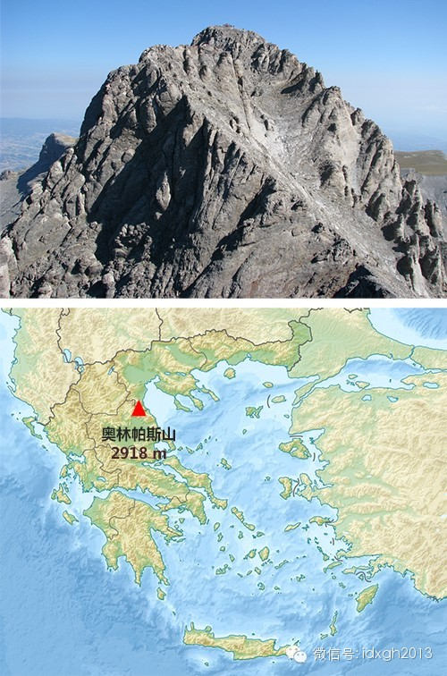_

_奥林帕斯山主峰及其位置_

  

在希腊神话中，除了英雄史诗以外最重要的就是奥林帕斯十二主神。他们居住在爱琴海沿岸的最高峰奥林帕斯山上，有着与希腊人一致的外表，往往因为情色之事而与城邦的统治
者们带有血缘关系——这些都是祖先之山的情形。而众神又有各自神力，从火山雷电到爱欲繁衍，都是众神的旨意。于是，神山的崇拜又和超自然的神力联系在了一起，这座山也
就成为了一座天堂，众神之殿。

  

在奥林帕斯山崇拜中，除了神祗本身还有一项重要的内容——就是众神的家谱。神祗间同样有恩怨情仇与权力斗争，其中最重要的几项包括宙斯和父亲、祖父三代神王的权利更迭
、宙斯率领十二主神在奥林帕斯山上与叔伯泰坦和巨人们的权力斗争、以及奥林帕斯众神内部的权力对抗。

  

希腊人与印度人或者日耳曼人一样，都源自5000年前黑海以西、里海以东、高加索山以北，面对乌拉尔山的广袤平原，是雅利安人种中较早迁徙的一支。他们沿着黑海北岸向
东南方向的爱琴海沿岸移动，分批进入了巴尔干半岛的最南端。

  

后抵达者与先行者之间冲突不断，直至最后到来的多立安人——如果不是另外一批移民的话——与所有的先行者爆发了更大的冲突，以至于结束了古希腊辉煌的青铜时代，进入一
段长达4个世纪的动荡融合过程，这就是古希腊的黑暗时期。

  

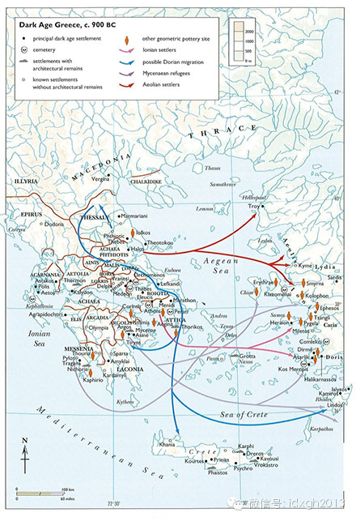

_公元前__900__年迈锡尼时代末期，希腊族群的斗争迁徙，浅紫色是迈锡尼人，红色是爱奥尼亚人，粉色是伊奥尼亚人，蓝色是多立安人。_

  

当希腊文明从黑暗中苏醒，这段民族往事也就成了神话传说，被编成史诗流传开来。三代神王的权力更替是父子权力冲突的典型主题，暗示着每一代抵达者推翻前代居民，并且以
自己的主神取而代之的历史原型。

  

泰坦神和十二主神在奥林帕斯山上的斗争，则更加明显的体现了这样的历史变革——在越早的考古文本记录中，泰坦神们得到的崇拜越多，这意味着他们是更古老居住者崇拜的神
祗。而随着后继者迁入并获得新的统治，长辈神祗暴动并被晚辈神祗镇压的神话也就成为了新统治镇压反抗的写照。

  

_ 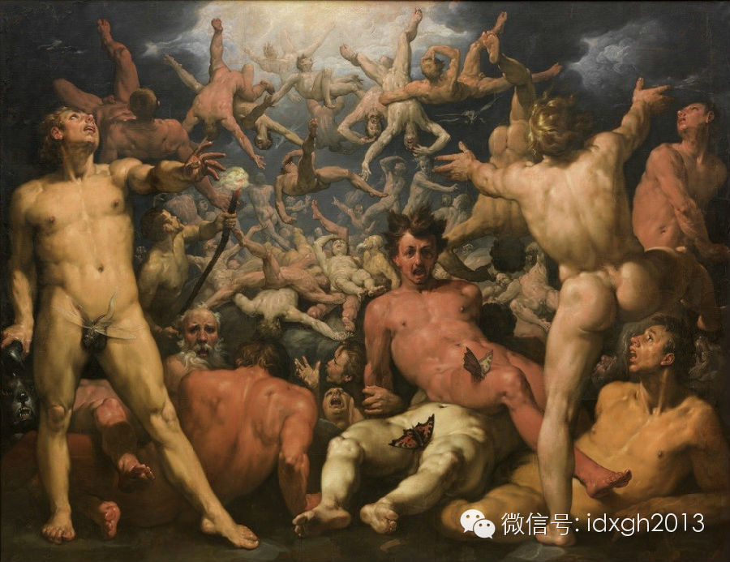_

_Cornelis van Haarlem 1588__年所绘《泰坦陷落》_

  

至于最晚发生的奥林帕斯众神之间的对抗，那就更加接近历史：特洛伊战争正是迈锡尼人和爱奥尼亚人的斗争的历史，由于古希腊每个城邦都有不同的守护神，这场战争也就自然
而然地被解释为主神谋划下的权力斗争。

  

【宇宙模型】

  

像奥林帕斯山这样，随着社会结构日趋复杂，宗教神学变得日渐精致，而令祖先之山演变为世界之轴的例子并不少见，本文开头提到佛教的须弥山也是如此，它同样是一个民族历
史的佛洛依德式幻影。

  

须弥山的现实原型有多种说法，但更多的被认为是整个印度文明里最重要的神山，冈仁波齐峰。

  

冈仁波齐峰位于今天的西藏西北，是冈底斯山脉的第二高峰，这座金字塔形的雪山形态端庄，而且常年云雾笼罩，难窥真容。它又是印度河的上游源头，在印度各大宗教里都有突
出的地位。

  

其中，在以公元前15世纪后成书的《吠陀经》为经典的印度教中，冈仁波齐峰的四面被描述成为黄金、水晶、红宝石和青金石分别砌成，正与佛教认为的须弥山由金、银、琉璃
、水晶构成吻合。再结合其他诸多线索，则不难推断出须弥山极有可能就是冈仁波齐峰的神学抽象化，至少也是以其为蓝本的再生，而它终归是一个世界之轴。

  

_ 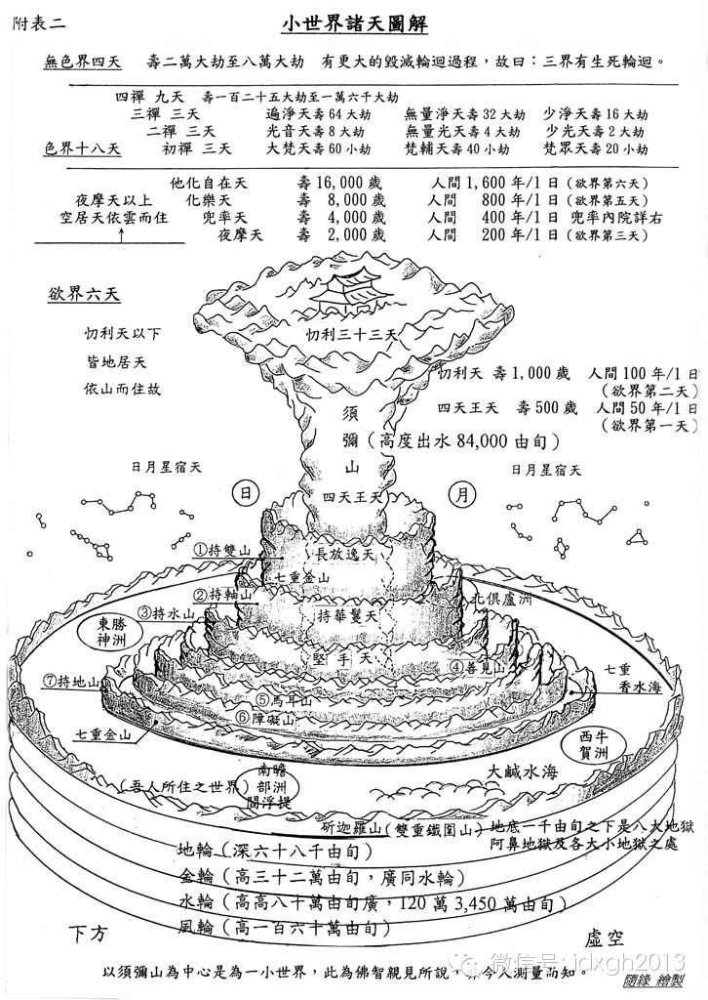_

_汉传佛教通用的小世界诸天图，也就是须弥山的宏观结构，注意山下海中的圆圈代表漂浮的四大部洲。_

  

须弥山的宇宙模型与印度早期的民族史有着紧密的联系：

  

印度河流域最早的文明哈拉帕文化在公元前34世纪就已经建立。公元前14世纪，雅利安部落的一支经过漫长的跋涉，抵达印度河流域。他们很快征服了印度的有色人种而成为
殖民者，并将自己的印欧神话发展成了一套玄妙的吠陀宗教，或者称为婆罗门教。

  

_ 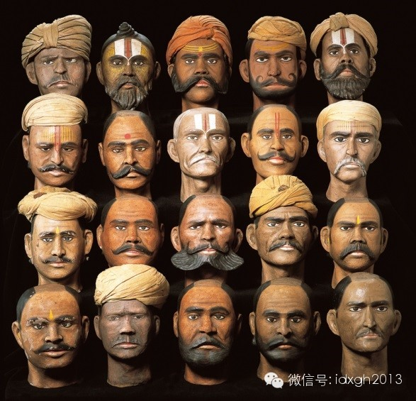_

_伦敦霍尼曼博物馆藏__19__世纪体质人类学研究的印度人头像，可见肤色和容貌的丰富多样。_

  

而佛教创立于公元前6世纪末，正是吠陀时代的后期，佛陀释迦牟尼所属的释迦族是一个高贵的刹帝利种姓。

  

佛教的标志法轮也正源自刹帝利种姓崇拜的太阳神战车车轮——它在雅利安文化中广泛存在，比如希腊的阿波罗，而辐条车轮正常常被认为是雅利安人的重大发明。须弥山顶的因
陀罗或称帝释天作为主宰天空雷电的战神，也同样是印欧神话里通行的最高神——比如希腊神话里的宙斯、日耳曼神话里的索尔。

  

_ 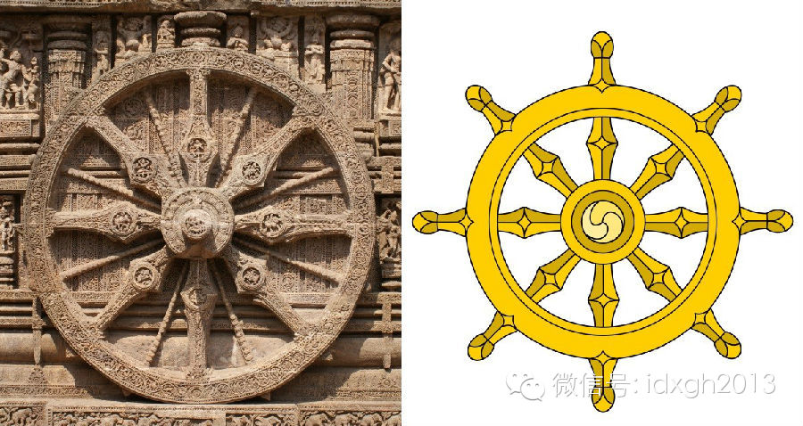_

_左边是印度刹帝利种姓的科纳尔克太阳神庙中的太阳神战车轮；右边是佛教的法轮。_

  

而四大部洲的世界结构也串成了一个完整的故事：婆罗门来自遥远的北方高地（一片没有痛苦的极乐世界，其原型正是雅利安人迁入南亚前的故乡伊朗高原，它的美好是故乡的美
好），东边有毗提诃部落，西边有用牛驮货的部落，各自都很美好，而现在生活着的南赡部洲（古印度南方七国，后来渐渐指代整个印度，乃至整个世界），虽然人口拥挤、尔虞
我诈，却是唯一有佛的地方。

  

于是，我们便看到一座祖先之山是如何在社群定居中发展成为世界之轴，又在深奥的形而上学中发展成了宇宙模型。而这样的例子同样不是绝无仅有，其中之一是中国的昆仑山。

  

在先秦时期的《山海经**海内西经》中，昆仑山就已经被描述为“昆仑之虚，百神所在”，成为了“准世界之轴”——因为并没有声称它位于世界中央。这或许是一处实有所指
的真实山峰，但后世对其所在却众说纷纭，并无定论。

  

_ 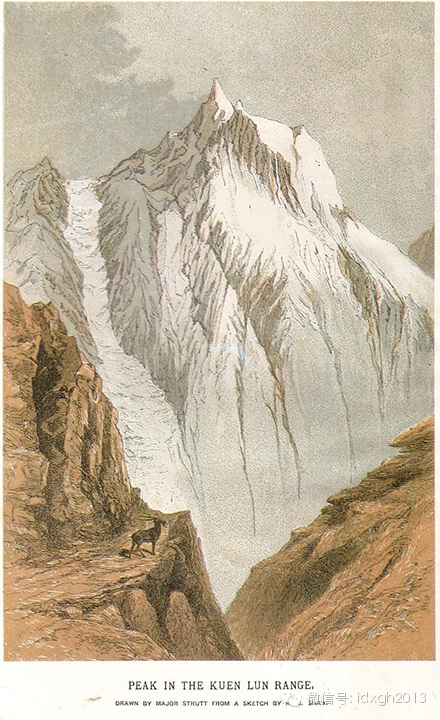_

_1871__年，欧洲版画中的昆仑山主峰_

  

1世纪的东汉，佛教开始传入中国，很快兴盛。本土道教在这种威胁下回应似的开始丰富自己的宇宙观和神学体系，强化昆仑山就是其中重要一步：昆仑山被道教解释成须弥山的
同等物，是世界中央之轴，世界四极之水发源于此；山上更有三十六重天，比佛教还多了三层，用来安置道德天尊、灵宝天尊和原始天尊；并且为了策应佛教里三千大千世界那样
的宏大宇宙观，道教还创造出了“鸿钧老祖”以便同佛祖匹敌。

  

这个过程相当漫长，直到明代才形成规模，那本家喻户晓的《封神演义》就是这段历史的生动浓缩。

  

_ 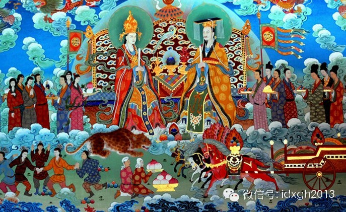_

_一副中国唐卡，描述了昆仑山上的玉帝和王母_

  

与昆仑作为中国西部大荒中的仙山类似，蓬莱作为东边海洋中的仙山也在漫长的佛道争斗中变得日渐神秘，甚至有说它是一座通体纯白，遍地神兽，龙凤飞舞，仙人往来的海上琼
岛——尽管在它最初出场的《山海经》里只有一句话：“蓬莱山在海中。”

  

_ 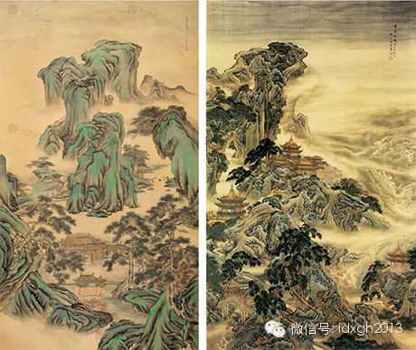_

_清袁耀绘两幅《蓬莱仙境图》_

  

不仅如此，佛教还在中国催生出了许多本土化的道场仙山，四大菩萨都找到了自己的位置，如浙江普陀山的观音道场，山西五台山的文殊道场等。而汉传佛教抵达朝鲜、日本之后
，又各自掀起了群山的造神运动，佛教名山星罗棋布地出现在了整个汉字文化圈内，不胜枚举。

  

【次生的神山】

  

像佛教名山一样，在成熟宗教催生下而出现的神山圣地，实际上是当今世界最多见的一类神山。特别是在印度以西的欧亚大陆上，信仰唯一上帝的亚伯拉罕宗教不允许教徒祭拜祖
先和外神，这使得欧洲、西亚、北非原生的神山消失殆尽，就连奥林帕斯山崇拜如今也只剩下了奥林匹克运动的上的点火仪式。

  

圣徒殉道或者生灵显现后来成了神山新的存在方式。其中最著名的，就是希腊的阿索斯山，位于希腊马其顿地区的一处半岛山。

  

在希腊神话中，这座山是奥林帕斯十二主神与泰坦搏斗时，泰坦阿索斯丢出的一枚巨石。后来根据基督教的传说，圣母玛利亚将此地定为圣地，宣告女性和小孩永远不得踏足，“
圣山”之名也由此而来。

  

随着基督教兴起，到了3世纪，罗马帝国内的基督徒就开始前往这里建立修道院，这一建就是一千多年，其间立经历了罗马帝国的迫害、拜占庭皇帝的保护、土耳其帝国的压榨、
一战盟军的夺取，经久不衰。目前，这座面积300多平方公里的岛山上挤着20座东正教修道院和12个隐修团。

  

_ 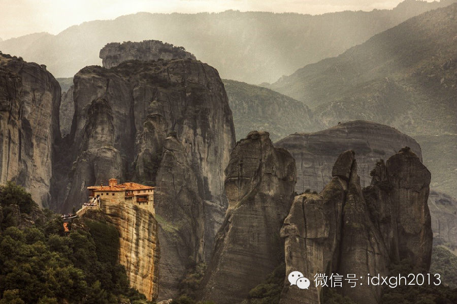_

_阿索斯山一景，悬崖上修建的隐士小屋_

  

到了当代，又出现了一些更加特殊的神山，提醒我们人类精神生活的变化。

  

其一是上世纪30年代作为旅游项目建设的美国总统山。从1925年到1941年，人们在拉什莫尔山上凿出了华盛顿、杰斐逊、老罗斯福和林肯四个美国著名总统的头像，用
来代表美国的百年历史，如今已经成为美国的一大形象象征。

  

这座山之所以值得专门列举，乃是因为它本来是拉科塔印第安人的圣山，被他们称为黑山（Black Hill）——作为美国中部的最高峰，它是当地印第安人社群认同的核
心。1876年，美国政府为了金矿发动了一场突袭，将其从拉科塔人的手中夺走，并用金矿买主、律师拉什莫尔的名字给它重新命名。

  

有些讽刺的是，1876年正是拉科塔人从夏延部落手中夺走这座神山的100周年纪念。

  

_ 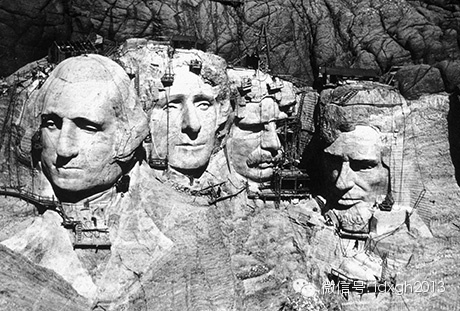_

_上世纪__30__年代修建中的总统山，耗时__14__年。_

  

另一处就与我们更加接近：去年8月，朝鲜时隔39年首次修改了《树立党的唯一思想体系十大原则》。修改后的《十大原则》中有这样的规定，“应将劳动党和革命的血脉——
白头山血统永远延续下去”。

  

这里说的白头山，就是前文说的中朝边境长白山，它终究成为了朝鲜民族心目中的祖先源头——朝鲜民族形成中极多地融入了濊陌、扶余等长白山古代民族的血统，其中历代高丽
王朝更是完全的扶余人。

  

朝鲜官方资料宣称：“2月16日的凌晨，天空晴朗。抗日游击队密营地的木房以及茂密的森林全都覆盖着银白色的雪。霎时出现的两道绚丽斑斓的彩虹和一颗圣星（光明星）宣
告着他的到来，忽又飞来一只喜鹊——一个将来要拯救全人类的领袖——金正日诞生了！”

  

于是，金家王朝也就被称作了白头山血统——尽管据苏联文献记载，1945年之前的金正日的父亲金日成及其领导的游击队均在苏联境内。

  

而将“白头山血统永远延续下去”，实际上是明文规定将金家政权变成了世袭王朝。朝鲜此举不失为一次将祖先之山变成“世界之轴”——世界革命的输出中心兼以宇宙真理——
的大胆举动，只是其它文明中的类似举动大都发生在公元元年以前罢了。

  

[大象公会所有文章均为原创，版权归大象公会所有。如希望转载，请事前联系我们：bd@idaxiang.org ]

———————————————  

**大象公会订阅号的自定义菜单上线了，左边是官网文章精选，右边是大象公会官方微社区，点击进入来吐槽发帖吧！**

  

[阅读原文](http://mp.weixin.qq.com/s?__biz=MjM5NzQwNjcyMQ==&mid=201404382&idx=1&sn
=a9f9ac26edef40350a4f88dcc5ec9e60&scene=1#rd)

